# Trabajo Práctico 2: Stack Frame

## Introducción

En el ámbito de la informática, la interacción entre hardware y software es fundamental para el desarrollo de sistemas complejos. Los sistemas compuestos por capas de hardware y software utilizan diferentes niveles de abstracción para facilitar la programación y la interacción con el hardware subyacente. En este contexto, es crucial comprender la importancia de los lenguajes de bajo y alto nivel, así como las convenciones de llamadas que rigen su interacción.
	
El presente informe tiene como objetivo principal explorar la importancia de las arquitecturas de capas en los sistemas hardware y software, centrándose en la interacción entre lenguajes de alto y bajo nivel. Se busca comprender cómo los lenguajes de bajo nivel actúan como puente entre el hardware y los lenguajes de alto nivel, facilitando la programación y el control de sistemas críticos.


## Propuesta

El Trabajo Práctico #2 tiene como objetivo diseñar e implementar una interfaz que muestre el índice GINI, utilizando datos del Banco Mundial. La capa superior obtendrá la información a través de una API REST y Python, para luego enviar los datos a un programa en C (capa intermedia). Este programa en C convocará rutinas en ensamblador para realizar cálculos específicos y devolver el índice de un país, como Argentina, incrementado en uno. Posteriormente, el programa en C o Python mostrará los datos obtenidos.

## Marco teórico

### Arquitectura de capas en software embebido

Cuando un producto tiene bastantes funcionalidades y crece la lógica a implementar, el software crece rápidamente. La arquitectura de capas es la arquitectura de software más extendida y tradicional. Sigue la estructura organizativa y comunicativa tradicional de las empresas de IT y es la más empleada en software embebido.

Consiste en capas independientes que se comunican entre sí mediante interfaces concretas. Si las interfaces están bien diseñadas y se mantienen, las capas pueden ser intercambiables. Por ejemplo, una aplicación de un ARM Cortex-M0 podría ser usada por un microcontrolador AVR. Generalmente esta arquitectura consta de 4 capas:

- Drivers
- Capa de abstracción del hardware
- Middlewares o servicios
- Capa de aplicación

#### Drivers

Esta capa controla directamente el silicio del microcontrolador. Este control se realiza principalmente controlando registros del microcontrolador. Los provee el fabricante del silicio o bien se implementan siguiendo especificaciones de la hoja de datos de fabricación.

#### Capa de abstracción del hardware

Es un elemento del sistema operativo que funciona como una interfaz entre el software y el hardware del sistema, proveyendo una plataforma de hardware consistente sobre la cual correr las aplicaciones. Cuando se emplea la HAL, las aplicaciones no acceden directamente al hardware, sino que lo hacen a la capa abstracta provista por la HAL.

Del mismo modo que las API, las HAL permiten que las aplicaciones sean independientes del hardware porque abstraen información acerca de tales sistemas, como lo son las cachés, los buses de E/S y las interrupciones, y usan estos datos para darle al software una forma de interactuar con los requerimientos específicos del hardware sobre el que deba correr.

#### Capa de servicios o middlewares

Acá aparecen las librerías, servicios, protocolos y todo lo que es software que emplea la aplicación que está a medio camino entre la aplicación y la HAL/Drivers. Es la base software de la aplicación.

#### Capa de aplicación

Incluye la lógica el producto. Si por ejemplo se trata de un controlador de temperatura para una cama caliente de una impresora 3D, se implementa acá la lógica de cuándo se corta la corriente, cuándo se mide la temperatura, con qué cadencia, etc.

### Lenguajes de programación

#### Definición

Se tratan de lenguajes formales diseñados para realizar procesos que pueden ser llevados a cabo por máquinas como las computadoras. Pueden usarse para crear programas que controlen el comportamiento físico y lógico de una máquina, para expresar algoritmos con precisión, o como modo de comunicación humana.

Proporcionan los elementos de lenguaje necesarios para traducir los pasos de un pseudocódigo en formato comprensible de la máquina. Las dos clasificaciones principales de lenguajes de programación son: alto nivel y bajo nivel.

#### Tipos 

- Lenguaje de máquina (bajo nivel)
- Lenguaje ensamblador (bajo nivel)
- Lenguaje de alto nivel

##### Lenguaje de máquina

- El lenguaje de máquina es una colección de bits que la computadora lee e interpreta.
- Es el único idioma que la computadora interpreta.
Aunque las computadoras lo entienden fácilmente, los lenguajes de máquina son casi imposibles de usar por los humanos, ya que consisten completamente de números.
- Los idiomas de bajo nivel están más cerca del idioma utilizado por una computadora, mientras que los de alto nivel están más cerca de los idiomas humanos.


##### Lenguaje ensamblador

- La computadora no comprende directamente el lenguaje ensamblador, por lo que se necesita convertirlo a código binario para poder ejecutar el código.
- Los programas de lenguaje ensamblador se traducen al lenguaje de máquina mediante un programa llamado ensamblador.

##### Lenguaje de alto nivel

- Los lenguajes de alto nivel permiten escribir códigos de computadora usando instrucciones que se asemejan al lenguaje humano.
- Deben ser traducidos al lenguaje de máquina antes de que puedan ser ejecutados.
- Algunos usan compiladores y otros usan intérpretes.

### Convenciones de llamada a función

#### Definición

La convención de llamadas a funciones en ciencias de la computación se refiere a cómo se manejan los parámetros y los resultados devueltos por las subrutinas. Esto incluye dónde se colocan los parámetros, valores de retorno y direcciones de retorno, así como la distribución de procesos entre la subrutina que llama y la subrutina llamada, y la restauración del entorno después de la ejecución.

Aunque la convención de llamadas a funciones está relacionada con la estrategia de evaluación de un lenguaje de programación, generalmente se considera como una implementación de bajo nivel en lugar de parte de la estrategia de evaluación. Esta última suele definirse en un nivel de abstracción superior y se ve como parte integral del lenguaje de programación en sí, no como una implementación específica de un compilador.

#### Variaciones

Las convenciones de llamadas pueden diferir en:

- El lugar en el que los parámetros, los valores de retorno y las direcciones de retorno son colocados (registros, pila, mezcla de ambos, o en otras estructuras de memoria).
- El orden en que se pasan los argumentos a los parámetros formales.
- La forma en la que un valor de retorno es devuelto desde la función llamante a la llamada.
- La forma en la que se distribuyen las tareas de preparación y limpieza, antes y después de una llamada a función, entre el llamador y el llamado.
- La forma en la que se distribuyen las variables locales también puede formar parte de la convención de llamadas.
- Las convenciones en las cuales los registros pueden ser directamente utilizados por el llamador, sin ser preservados.
- Los registros considerados como volátiles y, si lo son, cuales no necesitan ser restaurados por el llamador.

### Stack Frame

Stack Frame, o pila de llamadas es una pila LIFO que almacena información sobre las subrutinas activas de un programa de computadora. Esta estructura tiene una topología predeterminada, sobretodo al aplicarla a procesadores de la serie x86, en donde a partir de ciertos registros es posible acceder a variables locales, dirección de retorno, y parámetros de llamada de la función. Se cuenta con la siguiente estructura.


- El registro EBP se utiliza para delimitar la llamada a la subrutina, es por eso que se guarda su dato en la pila, con una instrucción PUSH.
- Lo mostrado como xx, yy, zz y sum son variables locales, que son colocadas en la pila luego de haber guardado el contexto.
- Lo mostrado como a, b y c son variables locales.
- El valor de EBP es utilizado como referencia, para, por medio de punteros a dirección encontrar variables locales o parámetros, es por eso que se tiene la referencia a la izquierda del gráfico de las diferentes direcciones de memoria relativas a la de EBP.
- Para colocar un dato en la pila, se ejecuta la instrucción PUSH, y para quitarlo la instrucción POP.

### Índice GINI (coeficiente)

El coeficiente de Gini, concebido por el estadístico italiano Corrado Gini, es una medida de la desigualdad que se emplea típicamente para evaluar la disparidad de ingresos dentro de un país, aunque también puede aplicarse a cualquier tipo de distribución desigual. Este coeficiente varía entre 0 y 1, donde 0 representa la igualdad perfecta (todos tienen los mismos ingresos) y 1 denota la desigualdad total (una persona acapara todos los ingresos y los demás no tienen ninguno). Para mayor claridad, el índice de Gini es una adaptación del coeficiente de Gini que se expresa en una escala de hasta 100 en lugar de 1, siendo igual al coeficiente multiplicado por 100. Un cambio de dos centésimas en el coeficiente de Gini (o dos unidades en el índice) corresponde a una redistribución del 7% de la riqueza, desde el sector más pobre de la población (por debajo de la mediana) hasta el más rico (por encima de la mediana).

### API REST

#### Definición

Una API REST, también conocida como API RESTful, es una interfaz de programación de aplicaciones que se ajusta a los principios de la arquitectura REST y facilita la interacción con servicios web RESTful. Esta técnica fue desarrollada por el informático Roy Fielding, quien creó la transferencia de estado representacional (REST).

En el ámbito informático, las APIs son conjuntos de definiciones y protocolos utilizados para diseñar e integrar el software de las aplicaciones. Se consideran como un contrato entre el proveedor de información y el usuario, especificando el contenido requerido tanto para la solicitud como para la respuesta. Por ejemplo, el diseño de una API de servicio meteorológico podría requerir que el usuario ingrese un código postal, mientras que el productor devolvería la temperatura máxima y mínima.

En esencia, las APIs actúan como intermediarios entre los usuarios o clientes y los recursos o servicios web deseados. Permiten la interacción con sistemas informáticos para obtener datos o ejecutar funciones, asegurando que el sistema comprenda y cumpla con la solicitud.

Una de las ventajas principales de las APIs es que los usuarios no necesitan conocer los detalles internos de cómo se obtiene o procesa un recurso. Además, facilitan la compartición segura de recursos e información entre empresas, permitiendo un control preciso sobre qué contenido puede acceder cada usuario.


#### ¿Qué es REST?

REST no se clasifica como un protocolo ni un estándar, sino más bien como un conjunto de restricciones arquitectónicas. Los desarrolladores de APIs pueden adoptarlo en diversas formas.

Al utilizar una API RESTful, cuando el cliente envía una solicitud, esta transfiere una representación del estado del recurso solicitado al destinatario. Esta información se entrega mediante HTTP en formatos como JSON, HTML, XLT, Python, PHP o texto sin formato. Aunque JSON es el formato más popular, es comprensible tanto para máquinas como para personas y no está ligado a un lenguaje específico, a pesar de su nombre.

Además, aspectos como los encabezados y los parámetros son cruciales en los métodos HTTP de una solicitud HTTP de una API RESTful, ya que contienen información identificativa clave sobre metadatos, autorización, URI, almacenamiento en caché, cookies y otros elementos. Existen encabezados de solicitud y de respuesta, cada uno con sus propios códigos de estado e información de conexión HTTP.

Para ser considerada RESTful, una API debe cumplir con ciertos criterios:

- Arquitectura cliente-servidor, que implica la gestión de solicitudes a través de HTTP.
- Comunicación sin estado entre el cliente y el servidor, lo que significa que no se almacena información del cliente entre las solicitudes GET, y cada solicitud es independiente y aislada.
- Capacidad de almacenamiento en caché para optimizar las interacciones entre cliente y servidor.
- Una interfaz uniforme entre los elementos para la transferencia estandarizada de información, lo que incluye la identificabilidad de recursos, la manipulación de recursos a través de su representación, mensajes autodescriptivos y la presencia de hipertexto o hipermedios.

Además, una API RESTful debe tener un sistema en capas que organice los servidores participantes de manera jerárquica, y debe ofrecer código disponible según sea necesario. Aunque una API REST debe cumplir con todos estos parámetros, es más flexible y fácil de usar en comparación con protocolos definidos previamente como SOAP, lo que la convierte en una opción más ligera y rápida. Esto la hace ideal para aplicaciones en el Internet de las cosas (IoT) y para el desarrollo de aplicaciones móviles.

## Desarrollo

### Solución planteada (primera iteración)

Para poder implementar la solución al problema de diseño mencionada en la propuesta, se trabaja principalmente con dos lenguajes de programación: C y Python. El funcionamiento del programa sigue la serie de pasos expuesta a continuación:

1. Se le indican al usuario los países a los cuales se les puede consultar el índice GINI, junto con su código de ISO3.
2. Se solicita que se ingresen los textos de los códigos ISO3, hasta que se ingrese el string '-'. En ese momento, el programa termina.
3. A medida que se solicitan los índices se extraen los datos de los índices GINI de la API utilizada como referencia.
4. Los datos extraídos incluyen años y valores del índice. Estos últimos son pasados como argumentos a un programa en C, que se encarga de pasar de números flotantes a enteros, y sumarles 1. El resultado este se devuelve al programa en Python.
5. Una vez que se tienen los datos procesados, se crea un gráfico de líneas en Python, con la librería Matplotlib, en donde pueden verse las gráficas de valores extraídos de la API, junto con los procesador por la librería dinámica de C.

El programa en C es el siguiente:

```c
#include <stdio.h>
#include <stdlib.h>

int process_data(float data) {
    return (int) (data+1);
}

int main() {
    return 0;
}
```

Este es un programa muy simple en C. Primero, incluye las bibliotecas estándar stdio.h y stdlib.h, que proporcionan funciones para entrada/salida y funciones generales de la biblioteca de C, respectivamente. Luego, define una función process_data que toma un número flotante como entrada, le suma 1 y luego lo convierte a un entero. Esta función se puede utilizar para procesar datos en el programa. Finalmente, tiene una función main que es el punto de entrada del programa. En este momento, la función main no hace nada y simplemente devuelve 0, lo que indica que el programa se ha ejecutado correctamente. Para compilar el programa se utiliza la siguiente línea en consola: 

```
$ gcc -W -shared -o TP2.so TP2.c
```

En donde:
- `gcc`: este es el compilador de C que se utiliza para compilar el código fuente de C en un ejecutable o, en este caso, en una biblioteca compartida.
- `-shared`: esta es una opción que le dice a gcc que compile el código en una biblioteca compartida en lugar de un ejecutable. Las bibliotecas compartidas son archivos que contienen código que puede ser utilizado por varios programas diferentes al mismo tiempo.
- `-o TP2.so`: la opción -o se utiliza para especificar el nombre del archivo de salida. En este caso, el archivo de salida será TP2.so.
- `TP2.c`: este es el archivo de código fuente de C que se va a compilar.

Luego, el programa implementado en Python es el siguiente:

```python
import requests
import json
from ctypes import CDLL, c_float, c_int
import numpy as np
import matplotlib.pyplot as plt
import pandas as pd

# Cargamos la libreria 
#lib = CDLL('./TP2_mac_arm.so') #para ejecutar en arm64
lib = CDLL('./TP2.so') #

# Definimos los tipos de los argumentos y el tipo de retorno de la funcion
lib.process_data.argtypes = [c_float]
lib.process_data.restype = c_int

# Definimos la funcion que se encargara de obtener los datos para un determinado countryiso3code
def get_gini_index(country):
    url = f"https://api.worldbank.org/v2/en/country/{country}/indicator/SI.POV.GINI?format=json&date=2011:2020&per_page=32500&page=1"
    response = requests.get(url)
    data = response.json()
    return data[1]

# Definimos la funcion que se encargara de imprimir los paises y sus codigos iso3
def print_countries():
    url = 'https://api.worldbank.org/v2/en/country/all/indicator/SI.POV.GINI?format=json&date=2011:2020&per_page=32500&page=1&country=%22Argentina%22'
    response = requests.get(url)
    data = response.json()
    country_list = []
    # Verificamos que los datos esten en el formato esperado
    if isinstance(data, list) and isinstance(data[0], dict):
        for item in data[1]:
            if 'country' in item and 'value' in item['country'] and 'countryiso3code' in item:
                country_and_code = f"{item['country']['value']}, {item['countryiso3code']}"
                if country_and_code not in country_list:
                    country_list.append(country_and_code)
    else:
        print('Data is not in the expected format')
    # Imprimimos los paises y sus codigos iso3
    for i in range(len(country_list)):
        print(country_list[i])

# Funcion principal
if __name__ == "__main__":
    print('A continuacion se listan los paises y sus codigos iso3:')
    print_countries()
    print('Ingrese el codigo iso3 del pais que desea consultar (\'-\' para terminar):')
    # Iteramos hasta que el usuario ingrese '-'
    while(True):
        country = str(input())
        if country != '-':
            if len(country) <= 3:
                # Obtenemos los datos del pais y graficamos el Gini Index
                json_data = get_gini_index(country)
                values = [json_data[i]['value'] for i in range(len(json_data)) if json_data[i]['value'] is not None]
                years = [json_data[i]['date'] for i in range(len(json_data)) if json_data[i]['value'] is not None]
                processed_values = []
                for i in range(len(values)):
                    aux_value = lib.process_data(values[i])
                    processed_values.append(aux_value)
                df = pd.DataFrame({'year': years, 'values': values, 'processed_values': processed_values})
                plt.plot(df['year'], df['values'], label='Gini Index')
                plt.plot(df['year'], df['processed_values'], label='Processed Gini Index')
                plt.xlabel('Year')
                plt.ylabel('Gini Index')
                plt.title(f'Gini Index for {country}')
                plt.legend()
                # Guardamos la imagen
                plt.savefig(f'Gini_Index_{country}.png')
                #plt.show()
            else:
                print('El codigo ingresado no es valido, por favor ingrese un codigo iso3 valido:')
        else:
            break
```

Este programa en Python se utiliza para obtener y procesar datos del índice de Gini de diferentes países. 

1. Importa las bibliotecas necesarias, incluyendo `requests` para hacer solicitudes HTTP, `json` para manejar datos JSON, `ctypes` para cargar una biblioteca C, `numpy` para cálculos numéricos, `matplotlib.pyplot` para graficar y `pandas` para manejo de datos.
2. Carga una biblioteca C llamada `TP2.so` y define los tipos de argumentos y el tipo de retorno de la función `process_data` en esa biblioteca.
3. Define la función `get_gini_index` que toma un código de país y hace una solicitud a la API del Banco Mundial para obtener datos del índice de Gini para ese país.
4. Define la función `print_countries` que hace una solicitud a la API del Banco Mundial para obtener una lista de todos los países y sus códigos ISO3, y luego imprime esta lista.
5. En la función principal, primero imprime la lista de países y sus códigos ISO3, luego solicita al usuario que ingrese un código ISO3. Si el código es válido, obtiene los datos del índice de Gini para ese país, procesa los datos con la función `process_data` de la biblioteca C, y luego grafica tanto el índice de Gini original como el procesado. Guarda la gráfica en un archivo PNG. Si el código no es válido, solicita al usuario que ingrese un código válido. Esto continúa hasta que el usuario ingrese `'-'` para terminar.

#### Ejemplo de ejecución

Primero que nada, al ejecutar el programa, se obtiene la siguiente salida por consola:

```
A continuacion se listan los paises y sus codigos iso3:
Africa Eastern and Southern, AFE
Africa Western and Central, AFW
Arab World, ARB
Caribbean small states, CSS
Central Europe and the Baltics, CEB
Early-demographic dividend, EAR
East Asia & Pacific, EAS
East Asia & Pacific (excluding high income), EAP
East Asia & Pacific (IDA & IBRD countries), TEA
Euro area, EMU
Europe & Central Asia, ECS
Europe & Central Asia (excluding high income), ECA
Europe & Central Asia (IDA & IBRD countries), TEC
European Union, EUU
Fragile and conflict affected situations, FCS
Heavily indebted poor countries (HIPC), HPC
High income, 
IBRD only, IBD
IDA & IBRD total, IBT
IDA blend, IDB
IDA only, IDX
IDA total, IDA
Late-demographic dividend, LTE
Latin America & Caribbean, LCN
Latin America & Caribbean (excluding high income), LAC
Latin America & the Caribbean (IDA & IBRD countries), TLA
Least developed countries: UN classification, LDC
Low & middle income, LMY
Low income, 
Lower middle income, 
Middle East & North Africa, MEA
Middle East & North Africa (excluding high income), MNA
Middle East & North Africa (IDA & IBRD countries), TMN
Middle income, MIC
North America, NAC
Not classified, 
OECD members, OED
Other small states, OSS
Pacific island small states, PSS
Post-demographic dividend, PST
Pre-demographic dividend, PRE
Small states, SST
South Asia, SAS
South Asia (IDA & IBRD), TSA
Sub-Saharan Africa, SSF
Sub-Saharan Africa (excluding high income), SSA
Sub-Saharan Africa (IDA & IBRD countries), TSS
Upper middle income, 
World, WLD
Afghanistan, AFG
Albania, ALB
Algeria, DZA
American Samoa, ASM
Andorra, AND
Angola, AGO
Antigua and Barbuda, ATG
Argentina, ARG
Armenia, ARM
Aruba, ABW
Australia, AUS
Austria, AUT
Azerbaijan, AZE
Bahamas, The, BHS
Bahrain, BHR
Bangladesh, BGD
Barbados, BRB
Belarus, BLR
Belgium, BEL
Belize, BLZ
Benin, BEN
Bermuda, BMU
Bhutan, BTN
Bolivia, BOL
Bosnia and Herzegovina, BIH
Botswana, BWA
Brazil, BRA
British Virgin Islands, VGB
Brunei Darussalam, BRN
Bulgaria, BGR
Burkina Faso, BFA
Burundi, BDI
Cabo Verde, CPV
Cambodia, KHM
Cameroon, CMR
Canada, CAN
Cayman Islands, CYM
Central African Republic, CAF
Chad, TCD
Channel Islands, CHI
Chile, CHL
China, CHN
Colombia, COL
Comoros, COM
Congo, Dem. Rep., COD
Congo, Rep., COG
Costa Rica, CRI
Cote d'Ivoire, CIV
Croatia, HRV
Cuba, CUB
Curacao, CUW
Cyprus, CYP
Czechia, CZE
Denmark, DNK
Djibouti, DJI
Dominica, DMA
Dominican Republic, DOM
Ecuador, ECU
Egypt, Arab Rep., EGY
El Salvador, SLV
Equatorial Guinea, GNQ
Eritrea, ERI
Estonia, EST
Eswatini, SWZ
Ethiopia, ETH
Faroe Islands, FRO
Fiji, FJI
Finland, FIN
France, FRA
French Polynesia, PYF
Gabon, GAB
Gambia, The, GMB
Georgia, GEO
Germany, DEU
Ghana, GHA
Gibraltar, GIB
Greece, GRC
Greenland, GRL
Grenada, GRD
Guam, GUM
Guatemala, GTM
Guinea, GIN
Guinea-Bissau, GNB
Guyana, GUY
Haiti, HTI
Honduras, HND
Hong Kong SAR, China, HKG
Hungary, HUN
Iceland, ISL
India, IND
Indonesia, IDN
Iran, Islamic Rep., IRN
Iraq, IRQ
Ireland, IRL
Isle of Man, IMN
Israel, ISR
Italy, ITA
Jamaica, JAM
Japan, JPN
Jordan, JOR
Kazakhstan, KAZ
Kenya, KEN
Kiribati, KIR
Korea, Dem. People's Rep., PRK
Korea, Rep., KOR
Kosovo, XKX
Kuwait, KWT
Kyrgyz Republic, KGZ
Lao PDR, LAO
Latvia, LVA
Lebanon, LBN
Lesotho, LSO
Liberia, LBR
Libya, LBY
Liechtenstein, LIE
Lithuania, LTU
Luxembourg, LUX
Macao SAR, China, MAC
Madagascar, MDG
Malawi, MWI
Malaysia, MYS
Maldives, MDV
Mali, MLI
Malta, MLT
Marshall Islands, MHL
Mauritania, MRT
Mauritius, MUS
Mexico, MEX
Micronesia, Fed. Sts., FSM
Moldova, MDA
Monaco, MCO
Mongolia, MNG
Montenegro, MNE
Morocco, MAR
Mozambique, MOZ
Myanmar, MMR
Namibia, NAM
Nauru, NRU
Nepal, NPL
Netherlands, NLD
New Caledonia, NCL
New Zealand, NZL
Nicaragua, NIC
Niger, NER
Nigeria, NGA
North Macedonia, MKD
Northern Mariana Islands, MNP
Norway, NOR
Oman, OMN
Pakistan, PAK
Palau, PLW
Panama, PAN
Papua New Guinea, PNG
Paraguay, PRY
Peru, PER
Philippines, PHL
Poland, POL
Portugal, PRT
Puerto Rico, PRI
Qatar, QAT
Romania, ROU
Russian Federation, RUS
Rwanda, RWA
Samoa, WSM
San Marino, SMR
Sao Tome and Principe, STP
Saudi Arabia, SAU
Senegal, SEN
Serbia, SRB
Seychelles, SYC
Sierra Leone, SLE
Singapore, SGP
Sint Maarten (Dutch part), SXM
Slovak Republic, SVK
Slovenia, SVN
Solomon Islands, SLB
Somalia, SOM
South Africa, ZAF
South Sudan, SSD
Spain, ESP
Sri Lanka, LKA
St. Kitts and Nevis, KNA
St. Lucia, LCA
St. Martin (French part), MAF
St. Vincent and the Grenadines, VCT
Sudan, SDN
Suriname, SUR
Sweden, SWE
Switzerland, CHE
Syrian Arab Republic, SYR
Tajikistan, TJK
Tanzania, TZA
Thailand, THA
Timor-Leste, TLS
Togo, TGO
Tonga, TON
Trinidad and Tobago, TTO
Tunisia, TUN
Turkiye, TUR
Turkmenistan, TKM
Turks and Caicos Islands, TCA
Tuvalu, TUV
Uganda, UGA
Ukraine, UKR
United Arab Emirates, ARE
United Kingdom, GBR
United States, USA
Uruguay, URY
Uzbekistan, UZB
Vanuatu, VUT
Venezuela, RB, VEN
Viet Nam, VNM
Virgin Islands (U.S.), VIR
West Bank and Gaza, PSE
Yemen, Rep., YEM
Zambia, ZMB
Zimbabwe, ZWE
Ingrese el codigo iso3 del pais que desea consultar ('-' para terminar):
```

Si se ingresan por ejemplo los siguientes 3 códigos ISO:

- `AR`
- `BR`
- `USA`

Las imágenes exportadas son las siguientes:

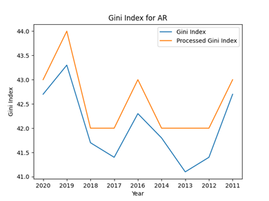

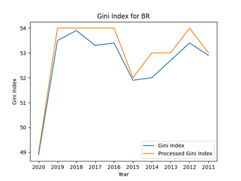


Puede apreciarse que se obtiene lo planteado como solución al problema. En las gráficas, las curvas de color naranja terminan siendo los resultados del procesado de los valores de los índices GINI hechos en C, es por eso que se aprecia que siempre se encuentran por encima de los valores extraídos de la API (azules). Esta última observación permite comprobar que la solución es correcta, ya que básicamente lo que hace el programa es redondear para arriba los valores.

### Solución planteada (segunda iteración)

Para la segunda iteración del programa, se reformuló el código de Python, de forma de poder obtener mayor flexibilidad a la hora de realizar tests. El código final implementado es el siguiente: 

```python
import requests
from ctypes import CDLL, c_float, c_int
import matplotlib.pyplot as plt
import pandas as pd
plt.style.use('seaborn-v0_8-dark')

# Cargamos la libreria
# lib = CDLL('./TP2_mac_arm.so') # para ejecutar en arm64
lib = CDLL('./TP2.so') # para linux
# lib = CDLL("./TP2_windows.so")  # para windows

lib.process_data.argtypes = [c_float]
lib.process_data.restype = c_int

def get_data_from_url(url):
    response = requests.get(url)
    data = response.json()
    return data[1]

def process_values(values):
    processed_values = []
    for i in range(len(values)):
        aux_value = lib.process_data(values[i])
        processed_values.append(aux_value)
    return processed_values

def plot_data(years, values, processed_values, country):
    df = pd.DataFrame(
        {"year": years, "values": values, "processed_values": processed_values}
    )
    fig, ax = plt.subplots()
    ax.plot(df["year"], df["values"], label="Gini Index")
    ax.plot(df["year"], df["processed_values"], label="Processed Gini Index")
    ax.set_xlabel("Year")
    ax.set_ylabel("Gini Index")
    ax.set_title(f"Gini Index for {country}")
    ax.legend()
    plt.savefig(f"Gini_Index_{country}.png")
    return (years, values, processed_values), fig, ax

def get_gini_index(country):
    try:
        url = f"https://api.worldbank.org/v2/en/country/{country}/indicator/SI.POV.GINI?format=json&date=2011:2020&per_page=32500&page=1"
        data = get_data_from_url(url)
        years = [item["date"] for item in data if item["value"] is not None]
        years.reverse()
        values = [item["value"] for item in data if item["value"] is not None]
        values.reverse()
        processed_values = process_values(values)
        plot_data(years, values, processed_values, country)
    except:
        raise Exception('El pais no existe o no se pudo obtener el Gini Index, intente nuevamente')

def print_countries():
    url = "https://api.worldbank.org/v2/en/country/all/indicator/SI.POV.GINI?format=json&date=2011:2020&per_page=32500&page=1&country=%22Argentina%22"
    data = get_data_from_url(url)
    country_list = []
    if isinstance(data, list) and isinstance(data[0], dict):
        for item in data:
            if (
                "country" in item
                and "value" in item["country"]
                and "countryiso3code" in item
            ):
                country_and_code = (
                    f"{item['country']['value']}, {item['countryiso3code']}"
                )
                if country_and_code not in country_list:
                    country_list.append(country_and_code)
    else:
        print("Data is not in the expected format")
    # Imprimimos los paises y sus codigos iso3
    for i in range(len(country_list)):
        print(country_list[i])

if __name__ == "__main__":
    print("Se listan los paises y sus codigos iso3:")
    print_countries()
    print("Ingrese el codigo iso3 del pais que desea consultar ('-' para terminar):")
    while True:
        country = str(input())
        if country != "-":
            try:
                if len(country) <= 3 and len(country) > 1:
                    get_gini_index(country)
                else:
                    print("Codigo iso3 invalido")
            except:
                print('El pais no existe o no se pudo obtener el Gini Index, intente nuevamente')
        else:
            break
    print("Fin del programa")
```

Este código produce la misma salida que el planteado en la iteración anterior, pero ahora se tiene una versión más modularizada, que permite correr tests de integración, validación de usuario y de sistema. El código de tests utilizado es el siguiente:

```python
# test_TP2.py
import unittest
from unittest.mock import patch, MagicMock
from TP2_CLI import *
import matplotlib
matplotlib.use('Agg')

'''
Pruebas del sistema:
Individualmente se prueban las funciones del codigo TP2_CLI.py
- Se prueba la función get_data_from_url con un mock de requests.get para verificar que se obtengan los datos esperados.
- Se prueba la función process_values con un conjunto de valores para verificar que se procesen correctamente.
- Se prueba la función plot_data con un conjunto de años, valores y valores procesados para verificar que se grafiquen correctamente.
'''
class TestSystem(unittest.TestCase):
    @patch("requests.get")
    def test_get_data_from_url(self, mock_get):
        data = [
            {
                "indicator": {"id": "SI.POV.GINI", "value": "Gini index"},
                "country": {"id": "AR", "value": "Argentina"},
                "countryiso3code": "ARG",
                "date": "2020",
                "value": 42.7,
                "unit": "",
                "obs_status": "",
                "decimal": 1,
            },
            {
                "indicator": {"id": "SI.POV.GINI", "value": "Gini index"},
                "country": {"id": "AR", "value": "Argentina"},
                "countryiso3code": "ARG",
                "date": "2019",
                "value": 43.3,
                "unit": "",
                "obs_status": "",
                "decimal": 1,
            },
            {
                "indicator": {"id": "SI.POV.GINI", "value": "Gini index"},
                "country": {"id": "AR", "value": "Argentina"},
                "countryiso3code": "ARG",
                "date": "2018",
                "value": 41.7,
                "unit": "",
                "obs_status": "",
                "decimal": 1,
            },
            {
                "indicator": {"id": "SI.POV.GINI", "value": "Gini index"},
                "country": {"id": "AR", "value": "Argentina"},
                "countryiso3code": "ARG",
                "date": "2017",
                "value": 41.4,
                "unit": "",
                "obs_status": "",
                "decimal": 1,
            },
            {
                "indicator": {"id": "SI.POV.GINI", "value": "Gini index"},
                "country": {"id": "AR", "value": "Argentina"},
                "countryiso3code": "ARG",
                "date": "2016",
                "value": 42.3,
                "unit": "",
                "obs_status": "",
                "decimal": 1,
            },
            {
                "indicator": {"id": "SI.POV.GINI", "value": "Gini index"},
                "country": {"id": "AR", "value": "Argentina"},
                "countryiso3code": "ARG",
                "date": "2015",
                "value": None,
                "unit": "",
                "obs_status": "",
                "decimal": 1,
            },
            {
                "indicator": {"id": "SI.POV.GINI", "value": "Gini index"},
                "country": {"id": "AR", "value": "Argentina"},
                "countryiso3code": "ARG",
                "date": "2014",
                "value": 41.8,
                "unit": "",
                "obs_status": "",
                "decimal": 1,
            },
            {
                "indicator": {"id": "SI.POV.GINI", "value": "Gini index"},
                "country": {"id": "AR", "value": "Argentina"},
                "countryiso3code": "ARG",
                "date": "2013",
                "value": 41.1,
                "unit": "",
                "obs_status": "",
                "decimal": 1,
            },
            {
                "indicator": {"id": "SI.POV.GINI", "value": "Gini index"},
                "country": {"id": "AR", "value": "Argentina"},
                "countryiso3code": "ARG",
                "date": "2012",
                "value": 41.4,
                "unit": "",
                "obs_status": "",
                "decimal": 1,
            },
            {
                "indicator": {"id": "SI.POV.GINI", "value": "Gini index"},
                "country": {"id": "AR", "value": "Argentina"},
                "countryiso3code": "ARG",
                "date": "2011",
                "value": 42.7,
                "unit": "",
                "obs_status": "",
                "decimal": 1,
            },
        ]
        expected_value = {
            entry["date"]: {
                "indicator": entry["indicator"],
                "country": entry["country"],
                "countryiso3code": entry["countryiso3code"],
                "value": entry["value"],
                "unit": entry["unit"],
                "obs_status": entry["obs_status"],
                "decimal": entry["decimal"],
            }
            for entry in data
        }
        mock_get.return_value.json.return_value = [None, expected_value]
        result = get_data_from_url(
            "https://api.worldbank.org/v2/en/country/ARG/indicator/SI.POV.GINI?format=json&date=2011:2020&per_page=32500&page=1"
        )
        self.assertEqual(result, expected_value)

    def test_process_values(self):
        test_values = [123.2, 22.6, 5.8]
        expected_result = [124, 23, 6]
        result = process_values(test_values)
        self.assertEqual(result, expected_result)

    def test_plot_data(self):
        test_years = [
            "2011",
            "2012",
            "2013",
            "2014",
            "2016",
            "2017",
            "2018",
            "2019",
            "2020",
        ]
        test_values = [42.7, 41.4, 41.1, 41.8, 42.3, 41.4, 41.7, 43.3, 42.7]
        test_processed_values = [43, 42, 42, 42, 43, 42, 42, 44, 43]
        test_country = "ARG"
        expected_result = (test_years, test_values, test_processed_values)
        result, fig, ax = plot_data(
            test_years, test_values, test_processed_values, test_country
        )
        self.assertEqual(result, expected_result)
        self.assertEqual(ax.get_title(), f"Gini Index for {test_country}")
        self.assertEqual(ax.get_xlabel(), "Year")
        self.assertEqual(ax.get_ylabel(), "Gini Index")
        lines = ax.get_lines()
        self.assertEqual(lines[0].get_ydata().tolist(), test_values)
        self.assertEqual(lines[1].get_ydata().tolist(), test_processed_values)

'''Pruebas de integracion:
Se busca probar que el sistema funcione correctamente en su totalidad, es decir, que las funciones se comuniquen correctamente entre si y que el sistema en forma global funcione correctamente.
- Se prueba la función get_gini_index con un mock de requests.get para verificar que se obtengan los datos esperados y que se procesen correctamente.
- Se prueba la función print_countries con un mock de get_data_from_url para verificar que se obtengan los datos esperados.
- Se prueba la función get_gini_index con un mock de get_data_from_url para verificar que se obtengan los datos esperados y que se procesen correctamente.
'''
class TestIntegration(unittest.TestCase):
    @patch("TP2_CLI.requests.get")
    @patch("TP2_CLI.lib.process_data")
    @patch("TP2_CLI.plt.subplots")
    @patch('matplotlib.pyplot.subplots')
    def test_get_gini_index(self, mock_matplotlib_subplots, mock_subplots, mock_process_data, mock_get):
        mock_fig = MagicMock()
        mock_ax = MagicMock()
        mock_subplots.return_value = (mock_fig, mock_ax)
        data = [
            {
                "indicator": {"id": "SI.POV.GINI", "value": "Gini index"},
                "country": {"id": "AR", "value": "Argentina"},
                "countryiso3code": "ARG",
                "date": "2020",
                "value": 42.7,
                "unit": "",
                "obs_status": "",
                "decimal": 1,
            },
            {
                "indicator": {"id": "SI.POV.GINI", "value": "Gini index"},
                "country": {"id": "AR", "value": "Argentina"},
                "countryiso3code": "ARG",
                "date": "2019",
                "value": 43.3,
                "unit": "",
                "obs_status": "",
                "decimal": 1,
            },
            {
                "indicator": {"id": "SI.POV.GINI", "value": "Gini index"},
                "country": {"id": "AR", "value": "Argentina"},
                "countryiso3code": "ARG",
                "date": "2018",
                "value": 41.7,
                "unit": "",
                "obs_status": "",
                "decimal": 1,
            },
            {
                "indicator": {"id": "SI.POV.GINI", "value": "Gini index"},
                "country": {"id": "AR", "value": "Argentina"},
                "countryiso3code": "ARG",
                "date": "2017",
                "value": 41.4,
                "unit": "",
                "obs_status": "",
                "decimal": 1,
            },
            {
                "indicator": {"id": "SI.POV.GINI", "value": "Gini index"},
                "country": {"id": "AR", "value": "Argentina"},
                "countryiso3code": "ARG",
                "date": "2016",
                "value": 42.3,
                "unit": "",
                "obs_status": "",
                "decimal": 1,
            },
            {
                "indicator": {"id": "SI.POV.GINI", "value": "Gini index"},
                "country": {"id": "AR", "value": "Argentina"},
                "countryiso3code": "ARG",
                "date": "2015",
                "value": None,
                "unit": "",
                "obs_status": "",
                "decimal": 1,
            },
            {
                "indicator": {"id": "SI.POV.GINI", "value": "Gini index"},
                "country": {"id": "AR", "value": "Argentina"},
                "countryiso3code": "ARG",
                "date": "2014",
                "value": 41.8,
                "unit": "",
                "obs_status": "",
                "decimal": 1,
            },
            {
                "indicator": {"id": "SI.POV.GINI", "value": "Gini index"},
                "country": {"id": "AR", "value": "Argentina"},
                "countryiso3code": "ARG",
                "date": "2013",
                "value": 41.1,
                "unit": "",
                "obs_status": "",
                "decimal": 1,
            },
            {
                "indicator": {"id": "SI.POV.GINI", "value": "Gini index"},
                "country": {"id": "AR", "value": "Argentina"},
                "countryiso3code": "ARG",
                "date": "2012",
                "value": 41.4,
                "unit": "",
                "obs_status": "",
                "decimal": 1,
            },
            {
                "indicator": {"id": "SI.POV.GINI", "value": "Gini index"},
                "country": {"id": "AR", "value": "Argentina"},
                "countryiso3code": "ARG",
                "date": "2011",
                "value": 42.7,
                "unit": "",
                "obs_status": "",
                "decimal": 1,
            },
        ]
        expected_data = [{"date": entry["date"], "value": entry["value"]} for entry in data]
        mock_response = MagicMock()
        mock_response.json.return_value = [None, expected_data]
        mock_get.return_value = mock_response
        mock_process_data.return_value = [43, 42, 42, 42, 43, 42, 42, 44, 43]
        get_gini_index("AR")
        mock_get.assert_called_once()
        mock_process_data.assert_called()
        mock_subplots.assert_called_once()

'''Pruebas de validacion de Usuario:
Se pretende probar como el usuario ingresa un codigo iso3 valido y uno invalido.
- Se prueba la función get_gini_index con un codigo iso3 invalido para verificar que se obtenga una excepcion.
- Se prueba la función get_gini_index con un codigo iso3 valido para verificar que no se obtenga una excepcion.
'''
class TestUserValidation(unittest.TestCase):
    @patch("TP2_CLI.get_data_from_url")
    def test_get_gini_index(self, mock_get_data_from_url):
        def side_effect(url):
            if "invalid_country_code" in url:
                raise Exception("API error")
            else:
                return [{"date": "2020", "value": 42.0}]
        mock_get_data_from_url.side_effect = side_effect
        with self.assertRaises(Exception) as context:
            get_gini_index("invalid_country_code")
        self.assertTrue('El pais no existe o no se pudo obtener el Gini Index, intente nuevamente' in str(context.exception))

        try:
            get_gini_index("ARG")
        except Exception:
            self.fail("get_gini_index() raised Exception unexpectedly!")

if __name__ == "__main__":
    unittest.main()
```

Para poder realizar los tests, se realizan pruebas unitarias, utilizando el módulo `unittest` de Python. Este módulo permite plantear diferentes MockUps, de modo de testear diferentes funcionalidades del sistema implementado. En los comentarios del código se encuentra explicado qué testea cada una de las clases. Una vez declaradas las clases, se procede a llamar al método `main` de la clase unittest, para de esa forma correr las diferentes pruebas, para el caso de ejemplo, la salida muestra que se pasan todos los tests, es decir, que el programa funciona de acuerdo con lo esperado.

Para poder trabajar con un manejo más cómodo de los datos, se creó una interfaz de usuario, haciendo uso de la librería `PyQT5`. El funcionamiento de la GUI se resume en lo siguiente:

- Mostrar checkbox de los países de los cuales se tienen datos del índice GINI.
- Al marcar los países que se quieren visualizar, se crea un archivo comprimido con las curvas de la evolución de los índices GINI a lo largo de los años.
- Se muestra en la misma ventana en donde se seleccionan los países la última curva calculada.

El código utilizado es el siguiente:

```python
import sys
from PyQt5.QtWidgets import QApplication, QMainWindow, QCheckBox, QListWidget, QVBoxLayout, QPushButton, QWidget, QLabel, QVBoxLayout, QSizePolicy, QGridLayout
from PyQt5.QtCore import Qt
import requests
import json
import matplotlib.pyplot as plt
from matplotlib.backends.backend_qt5agg import FigureCanvasQTAgg as FigureCanvas
from ctypes import CDLL, c_float, c_int
import zipfile
import os
from PyQt5.QtWidgets import QListWidgetItem
import time
import pandas as pd

# Se crea una ventana principal
class MainWindow(QMainWindow):
    def __init__(self):
        super().__init__()
        self.setWindowTitle("GINI Index Calculator")
        self.setGeometry(100, 100, 800, 600)

        self.list_widget = QListWidget()
        self.start_button = QPushButton("Get GINI Index")
        self.save_button = QPushButton("Save Images")
        self.info_label = QLabel("Select countries to calculate GINI index and click 'Get GINI Index' to generate plots.")
        self.plot_canvas = PlotCanvas(self, width=5, height=4)

        # Se crea un layout de cuadrícula
        layout = QGridLayout()
        layout.addWidget(self.info_label, 0, 0, 1, 2)  # fila, columna, rowspan, columnspan
        layout.addWidget(self.list_widget, 1, 0)
        layout.addWidget(self.start_button, 2, 0)
        layout.addWidget(self.save_button, 3, 0)
        layout.addWidget(self.plot_canvas, 1, 1, 3, 1)

        container = QWidget()
        container.setLayout(layout)
        self.setCentralWidget(container)

        self.start_button.clicked.connect(self.start)
        self.save_button.clicked.connect(self.save_images)

        self.load_countries()

    # Se obtienen los índices y los respectivos años de un país
    def get_gini_index(self, country):
        url = f"https://api.worldbank.org/v2/en/country/{country}/indicator/SI.POV.GINI?format=json&date=2011:2020&per_page=32500&page=1"
        response = requests.get(url)
        data = response.json()
        return data[1]

    # Se cargan los países en la lista para mostrar en forma de checkbox
    def load_countries(self):
        url = 'https://api.worldbank.org/v2/en/country/all/indicator/SI.POV.GINI?format=json&date=2011:2020&per_page=32500&page=1&country=%22Argentina%22'
        response = requests.get(url)
        data = response.json()
        country_list = []
        if isinstance(data, list) and isinstance(data[0], dict):
            for item in data[1]:
                if 'country' in item and 'value' in item['country'] and 'countryiso3code' in item:
                    country_and_code = f"{item['country']['value']}, {item['countryiso3code']}"
                    if country_and_code not in country_list:
                        country_list.append(country_and_code)
                        item = QListWidgetItem(country_and_code)
                        item.setFlags(item.flags() | Qt.ItemIsUserCheckable)
                        item.setCheckState(Qt.Unchecked)
                        self.list_widget.addItem(item)

    # Se inicia el proceso de obtención de los índices y se grafican
    def start(self):
        # lib = CDLL('./TP2_mac_arm.so')
        lib = CDLL("./TP2_windows.so")
        lib.process_data.argtypes = [c_float]
        lib.process_data.restype = c_int
        for index in range(self.list_widget.count()):
            item = self.list_widget.item(index)
            if item.checkState() == Qt.Checked:
                country = item.text().split(", ")[1]
                json_data = self.get_gini_index(country)
                values = [json_data[i]['value'] for i in range(len(json_data)) if json_data[i]['value'] is not None]
                years = [json_data[i]['date'] for i in range(len(json_data)) if json_data[i]['value'] is not None]
                processed_values = []
                for i in range(len(values)):
                    aux_value = lib.process_data(values[i])
                    processed_values.append(aux_value)
                df = pd.DataFrame({'year': years, 'values': values, 'processed_values': processed_values})
                self.plot_canvas.plot(df['year'], df['values'], df['processed_values'], country)

    # Se guardan las imágenes en un archivo zip
    def save_images(self):
        with zipfile.ZipFile('Gini_Index_Images.zip', 'w') as zipf:
            for file in os.listdir():
                if file.endswith('.png'):
                    zipf.write(file)
                    time.sleep(0.1)
                    os.remove(file)

# Clase para el lienzo del plot
class PlotCanvas(FigureCanvas):
    def __init__(self, parent=None, width=5, height=4, dpi=100):
        fig, self.ax = plt.subplots(figsize=(width, height), dpi=dpi)
        super().__init__(fig)
        self.setParent(parent)
    def plot(self, years, values, processed_values, country):
        self.ax.clear()
        self.ax.plot(years, values, label='Gini Index')
        self.ax.plot(years, processed_values, label='Processed Gini Index')
        self.ax.set_xlabel('Year')
        self.ax.set_ylabel('Gini Index')
        self.ax.set_title(f'Gini Index for {country}')
        self.ax.legend()
        self.draw()

# Función principal
if __name__ == '__main__':
    app = QApplication(sys.argv)
    window = MainWindow()
    window.show()
    sys.exit(app.exec())
```

La ventana que el usuario puede ver al momento de ejecutar es la que se adjunta en la figura siguiente. Allí pueden distinguirse ciertos objetos:

- Ventana principal: con el título “GINI Index Calculator”
- Texto en donde se explica qué se debe hacer para poder obtener la información requerida.
- Lista de checkboxs en donde se pueden ver los países disponibles para obtener la evolución del índice GINI.
- Botón de “Get GINI Index”, que calcula los índices GINI y crea las figuras de matplotlib.
- Ventana gráfica, en donde se puede ver la evolución del índice GINI para el último país seleccionado.
- Botón de “Save Images”, que guarda en un archivo zip las gráficas generadas al momento de presionar el botón “Get GINI Index”.

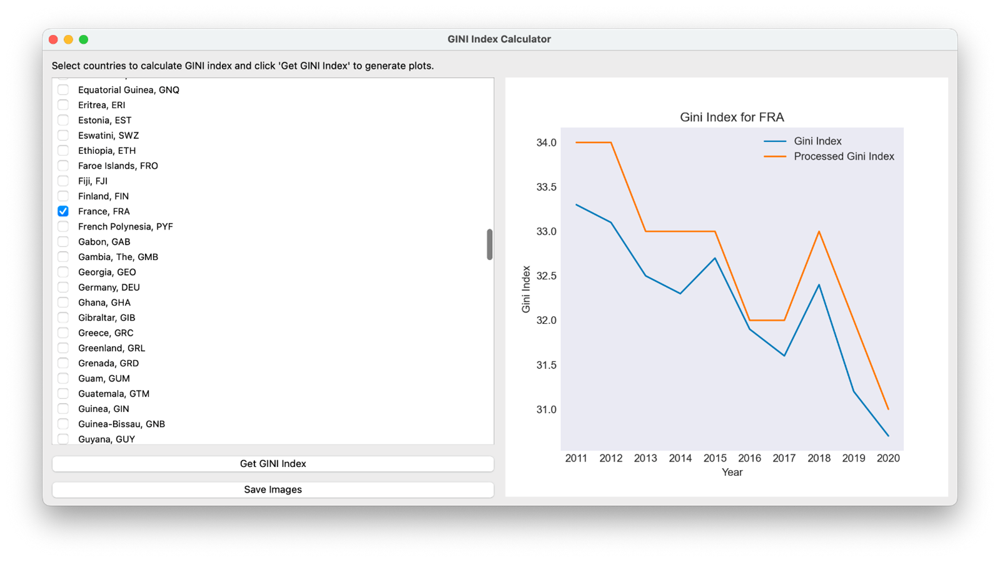

Para poder trabajar con el stack frame del procesador x86, se escribió un pequeño código en assembler, que manipula los datos pasados como parámetros, tiene variables locales, y así se puede realizar la conversión a número entero, a partir de un flotante, y luego sumarle 1. Este código es el siguiente:

```assembly
section .data
    num dd 0

global _float_2_int
section .text

_float_2_int:
    push ebp
    mov ebp, esp
    fld dword [ebp + 8]
    fistp dword [num]
    mov eax, [num]
    add eax, 1
    mov [num], eax
    mov esp, ebp
    pop ebp
    ret
```

En el código se realiza lo siguiente:
1. `section .data`: Define una sección de datos donde se pueden almacenar variables globales.
2. `num dd 0`: Declara una variable global llamada `num` y la inicializa en 0.
3. `global _float_2_int`: Declara una función global llamada _float_2_int que puede ser llamada desde otros archivos.
4. `section .text`: Define una sección de texto donde se almacena el código del programa.
5. `_float_2_int`: Es la etiqueta de inicio de la función `_float_2_int`.
6. `push ebp`: Guarda el valor actual del puntero de base (ebp) en la pila.
7. `mov ebp, esp`: Copia el valor del puntero de pila (esp) al puntero de base (ebp).
8. `fld dword [ebp + 8]`: Carga el número flotante que se pasa como argumento a la función en el registro de la pila de flotantes.
9. `fistp dword [num]`: Convierte el número flotante en la cima de la pila de flotantes a un número entero y lo almacena en la variable `num`.
10. `mov eax, [num]`: Copia el valor de num al registro `eax`.
11. `add eax, 1`: Incrementa el valor en el registro eax en `1`.
12. `mov [num]`, eax: Almacena el valor incrementado de nuevo en num.
13. `mov esp, ebp`: Restaura el valor original del puntero de pila (esp).
14.	`pop ebp`: Restaura el valor original del puntero de base (ebp) desde la pila.
15. `ret`: Retorna de la función.

Puede verse que este código respeta las convenciones de llamada a función.

El código de C que se encarga de llamar a esta función es el siguiente:

```c
#include <stdio.h>

extern int _float_2_int(float data);

int process_data(float data) {
    // return (int) (data+1);
    return _float_2_int(data);
}

int main() {
    return 0;
}
```

En este código de C, se devuelve el valor al llamar a la función `process_data`, de modo de no tener que cambiar nombres en los códigos de Python. Se declara un procedimiento externo con `extern int`, y luego es utilizado en la función anteriormente descripta. 

#### Consideraciones

Para poder ejecutar el código planteado como solución al problema desde Python, es necesario tener en cuenta que este lenguaje de programación tiene problema con librerías de 32 bits. Es por eso, que en un inicio se intentó utilizar el paquete `msl.loadlib`, sin embargo, no fue posible hacer que funcione. Luego de esto, se planteó la utilización de un venv con MiniConda, en donde se utilizó Python de 32 bits, para de esa forma poder correr los programas correctamente. Este uso de Python de 32 bits trajo problemas con la instalación de las librerías, por lo que para instalar cada una fue necesario utilizar la palabra sudo, y también fue necesario ejecutar con el mismo nivel de superusuario. 

Ahora, yendo a un nivel más bajo, para poder compilar la librería escrita en assembler, se necesitó escribir en consola `nasm -f elf32 -o TP2.o TP2.asm`. Luego, para compilar el archivo de C, se utilizó `gcc -shared -W -m32 -o TP2 TP2.c TP2.o`. Luego de esto, se importa la librería desde Python con normalidad y funciona correctamente. 

#### Debugging con gdb

Para poder probar la llamada a función desde un código de C, se crea un pequeño código que hace una conversión y la imprime por pantalla:

```c
#include "stdio.h"

extern int _float_2_int (float num);

int main() {

    float num = 43.12;
    int int_num = _float_2_int(num);
    printf("%d\n",int_num);
    return 0;
}
```

Se lo compila con:

```gcc -m32 -o convert test.c TP2.o```

Luego, se hace un debug: 

```gdb ./convert```

Y se tiene la siguiente salida:


En donde pueden apreciarse claramente las instrucciones de la llamada a la función desde el assembly del programa `test.c`. Se alcanzan a ver:

- `call 0x1200 <_float_2_int>`
- `add $0x10, %esp`
- `mov $eax, -0xc(%ebp)`
- `sub $0x8, $esp`
- `push -0xc(%ebp)`
- `lea -0x1fd0($ebx),eax`
- `push %eax`
- `call 0x1050 <printf@plt>`

Las primeras instrucciones representan la llamada a la función, y también es interesante encontrar cómo se devuelve el resultado de la ejecución a través de `eax`. La última llamada mostrada en esa lista de instrucciones muestra lo que sería la impresión por pantalla, se puede ver abajo también cómo también se realiza un procedimiento similar, arrancando por hacer espacio para la dirección de retorno con `add $0x10, %esp` y así sucesivamente.

Ahora, antes de entrar a la llamada a funcion, puede verse la siguiente secuencia de llamadas, en donde se tiene la direccion de marco de pila en `0xffffcf20`.

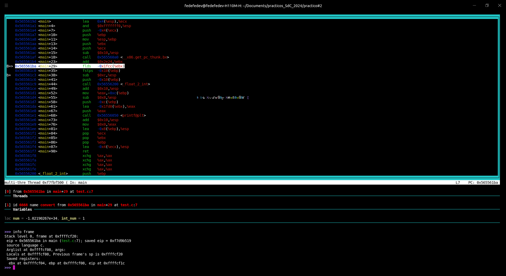


Luego, al entrar en la llamada, el marco de la pila se corre, esta ahora en `0xffffcee0` y las variables locales en `0xffffced8`. Puede verse tambien la evolucion del `eip`, en donde se apunta a diferentes instrucciones, y, algo importante que se puede ver tambien, es que la direccion de memoria del `ebp` se mantiene constante en `0xffffced8`. Al referirse al marco de pila, se habla implicitamente del valor del registro `esp`, simplemente se usa esa notacion para seguir a la informacion que brinda el debugger al ejecutar la instruccion `info frame`.


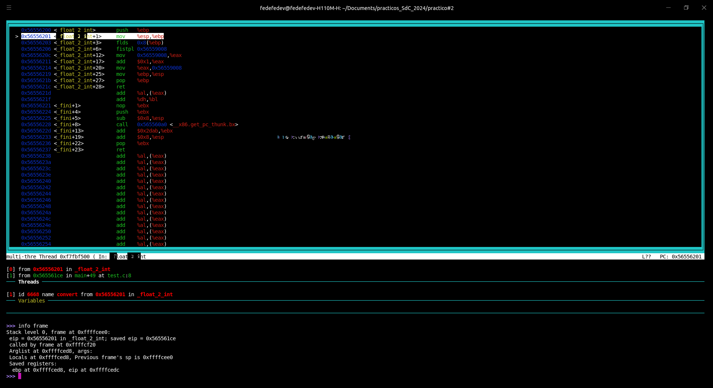

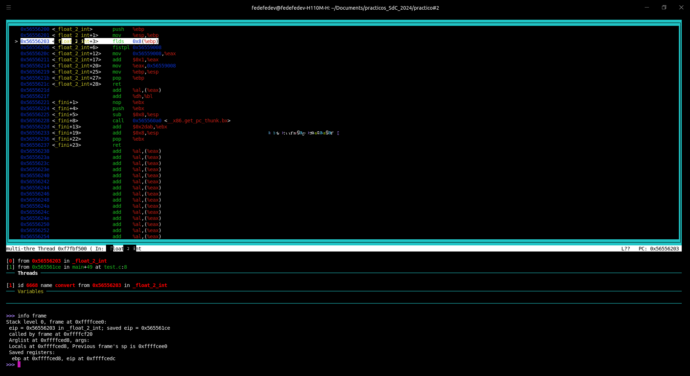


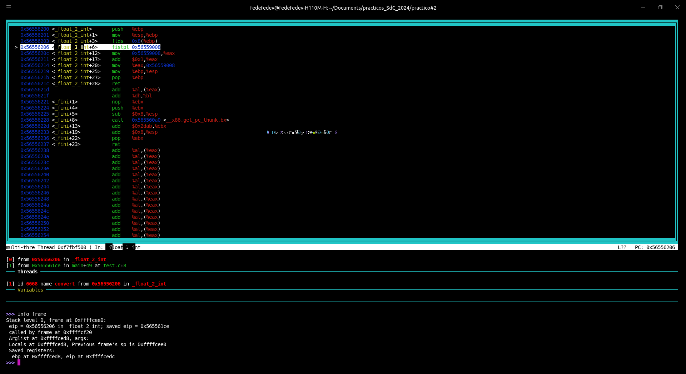

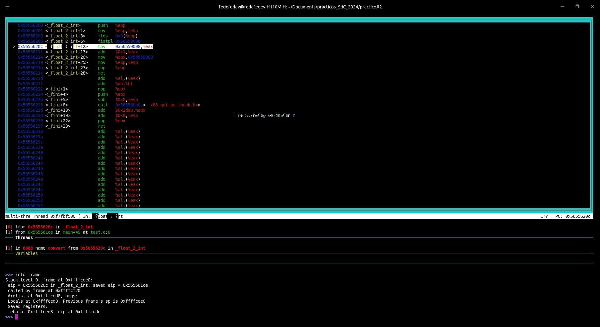


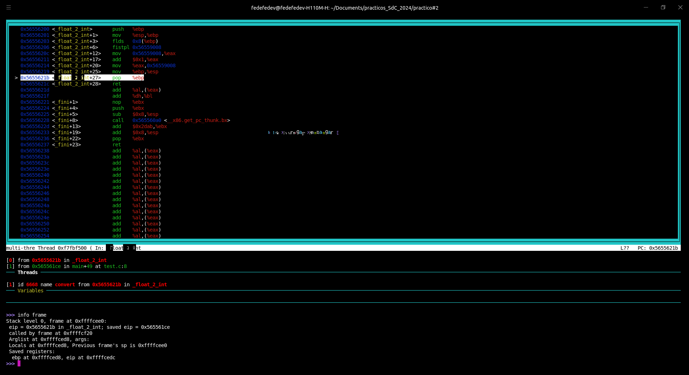


Ahora, se vuelve a la ejecucion del `main`, y se tiene:

- Direccion de `esp`: `0xffffcf20`
- Direccion de `ebp`: `0xffffcf08`

Se alcanza a apreciar tambien que luego de la instruccion `mov %eax, -0xc(%ebp)`, que mueve el valor del registro `eax` a una ubicacion especifica referenciada con el registro `ebp`, se retorna el valor para la variable `int_num`, que almacena el resultado entero de la conversion realizada. Luego, se libera el stack frame haciendo uso de `push -0xc(%ebp)` (notese que es la misma direccion del `mov` anterior), `lea -0x1fd0(%ebx),(%eax)` y `push eax`.


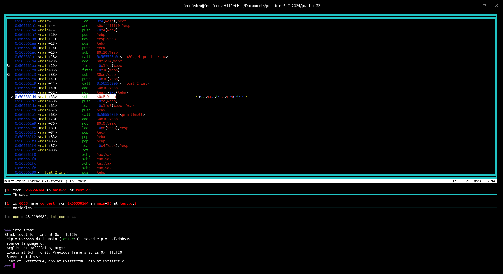

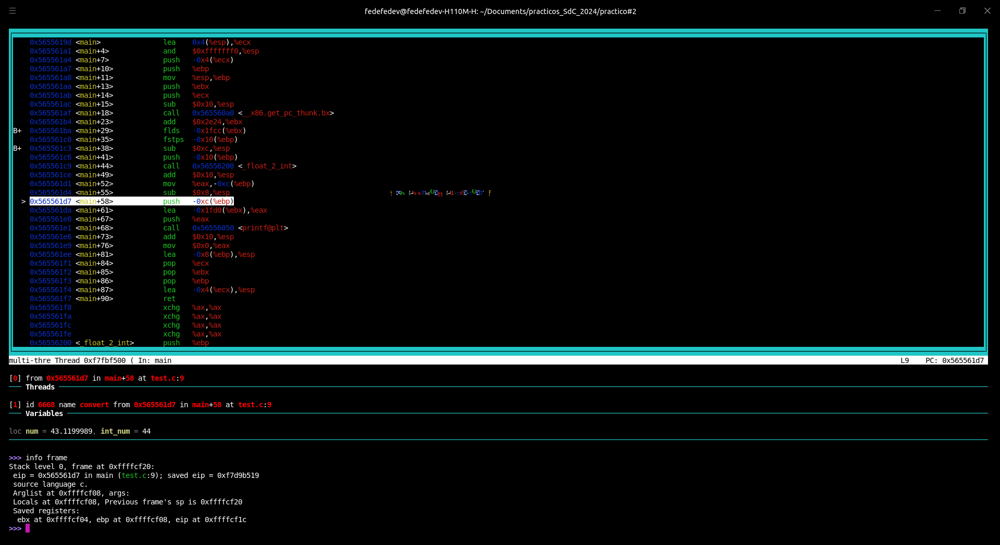

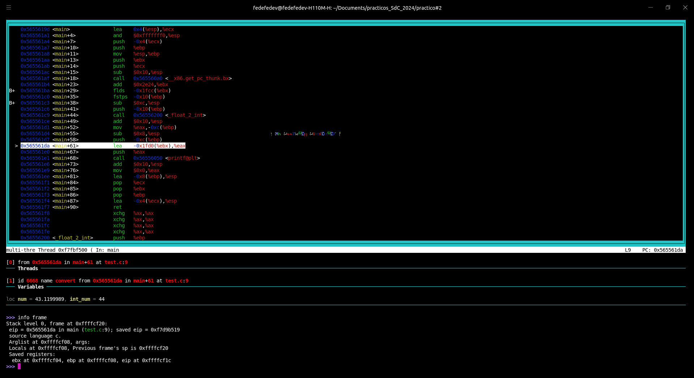

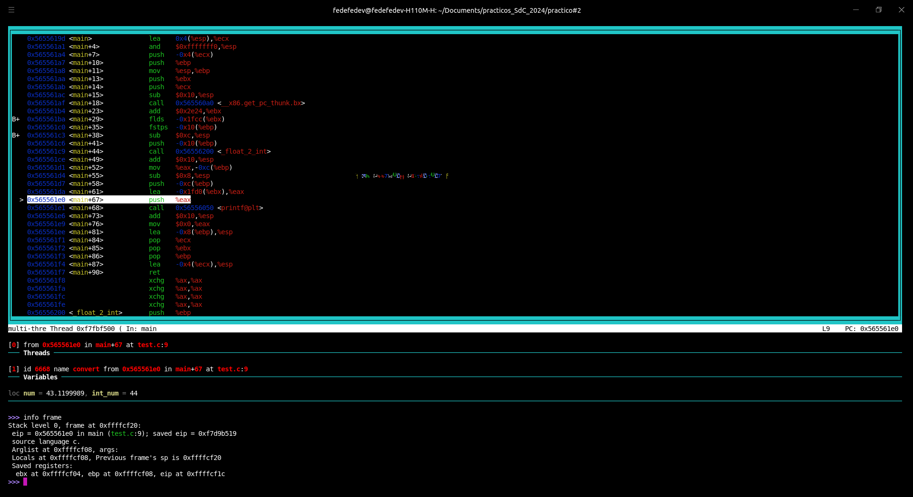


De esta forma se concluye el analisis solicitado, en donde pueden apreciarse todos los valores de registros referentes a la pila antes, durante y luego de la llamada a la funcion `_float_2_int`. 

A modo ilustrativo simplemente, se le hizo un `objdump` al ejecutable, de forma de tener a mano el codigo `asm` utilizado, la salida es:

```assembly

convert:     file format elf32-i386


Disassembly of section .init:

00001000 <_init>:
    1000:	f3 0f 1e fb          	endbr32 
    1004:	53                   	push   %ebx
    1005:	83 ec 08             	sub    $0x8,%esp
    1008:	e8 93 00 00 00       	call   10a0 <__x86.get_pc_thunk.bx>
    100d:	81 c3 cb 2f 00 00    	add    $0x2fcb,%ebx
    1013:	8b 83 1c 00 00 00    	mov    0x1c(%ebx),%eax
    1019:	85 c0                	test   %eax,%eax
    101b:	74 02                	je     101f <_init+0x1f>
    101d:	ff d0                	call   *%eax
    101f:	83 c4 08             	add    $0x8,%esp
    1022:	5b                   	pop    %ebx
    1023:	c3                   	ret    

Disassembly of section .plt:

00001030 <__libc_start_main@plt-0x10>:
    1030:	ff b3 04 00 00 00    	push   0x4(%ebx)
    1036:	ff a3 08 00 00 00    	jmp    *0x8(%ebx)
    103c:	00 00                	add    %al,(%eax)
	...

00001040 <__libc_start_main@plt>:
    1040:	ff a3 0c 00 00 00    	jmp    *0xc(%ebx)
    1046:	68 00 00 00 00       	push   $0x0
    104b:	e9 e0 ff ff ff       	jmp    1030 <_init+0x30>

00001050 <printf@plt>:
    1050:	ff a3 10 00 00 00    	jmp    *0x10(%ebx)
    1056:	68 08 00 00 00       	push   $0x8
    105b:	e9 d0 ff ff ff       	jmp    1030 <_init+0x30>

Disassembly of section .plt.got:

00001060 <__cxa_finalize@plt>:
    1060:	ff a3 18 00 00 00    	jmp    *0x18(%ebx)
    1066:	66 90                	xchg   %ax,%ax

Disassembly of section .text:

00001070 <_start>:
    1070:	f3 0f 1e fb          	endbr32 
    1074:	31 ed                	xor    %ebp,%ebp
    1076:	5e                   	pop    %esi
    1077:	89 e1                	mov    %esp,%ecx
    1079:	83 e4 f0             	and    $0xfffffff0,%esp
    107c:	50                   	push   %eax
    107d:	54                   	push   %esp
    107e:	52                   	push   %edx
    107f:	e8 18 00 00 00       	call   109c <_start+0x2c>
    1084:	81 c3 54 2f 00 00    	add    $0x2f54,%ebx
    108a:	6a 00                	push   $0x0
    108c:	6a 00                	push   $0x0
    108e:	51                   	push   %ecx
    108f:	56                   	push   %esi
    1090:	ff b3 20 00 00 00    	push   0x20(%ebx)
    1096:	e8 a5 ff ff ff       	call   1040 <__libc_start_main@plt>
    109b:	f4                   	hlt    
    109c:	8b 1c 24             	mov    (%esp),%ebx
    109f:	c3                   	ret    

000010a0 <__x86.get_pc_thunk.bx>:
    10a0:	8b 1c 24             	mov    (%esp),%ebx
    10a3:	c3                   	ret    
    10a4:	66 90                	xchg   %ax,%ax
    10a6:	66 90                	xchg   %ax,%ax
    10a8:	66 90                	xchg   %ax,%ax
    10aa:	66 90                	xchg   %ax,%ax
    10ac:	66 90                	xchg   %ax,%ax
    10ae:	66 90                	xchg   %ax,%ax

000010b0 <deregister_tm_clones>:
    10b0:	e8 e4 00 00 00       	call   1199 <__x86.get_pc_thunk.dx>
    10b5:	81 c2 23 2f 00 00    	add    $0x2f23,%edx
    10bb:	8d 8a 34 00 00 00    	lea    0x34(%edx),%ecx
    10c1:	8d 82 34 00 00 00    	lea    0x34(%edx),%eax
    10c7:	39 c8                	cmp    %ecx,%eax
    10c9:	74 1d                	je     10e8 <deregister_tm_clones+0x38>
    10cb:	8b 82 14 00 00 00    	mov    0x14(%edx),%eax
    10d1:	85 c0                	test   %eax,%eax
    10d3:	74 13                	je     10e8 <deregister_tm_clones+0x38>
    10d5:	55                   	push   %ebp
    10d6:	89 e5                	mov    %esp,%ebp
    10d8:	83 ec 14             	sub    $0x14,%esp
    10db:	51                   	push   %ecx
    10dc:	ff d0                	call   *%eax
    10de:	83 c4 10             	add    $0x10,%esp
    10e1:	c9                   	leave  
    10e2:	c3                   	ret    
    10e3:	8d 74 26 00          	lea    0x0(%esi,%eiz,1),%esi
    10e7:	90                   	nop
    10e8:	c3                   	ret    
    10e9:	8d b4 26 00 00 00 00 	lea    0x0(%esi,%eiz,1),%esi

000010f0 <register_tm_clones>:
    10f0:	e8 a4 00 00 00       	call   1199 <__x86.get_pc_thunk.dx>
    10f5:	81 c2 e3 2e 00 00    	add    $0x2ee3,%edx
    10fb:	55                   	push   %ebp
    10fc:	89 e5                	mov    %esp,%ebp
    10fe:	53                   	push   %ebx
    10ff:	8d 8a 34 00 00 00    	lea    0x34(%edx),%ecx
    1105:	8d 82 34 00 00 00    	lea    0x34(%edx),%eax
    110b:	83 ec 04             	sub    $0x4,%esp
    110e:	29 c8                	sub    %ecx,%eax
    1110:	89 c3                	mov    %eax,%ebx
    1112:	c1 e8 1f             	shr    $0x1f,%eax
    1115:	c1 fb 02             	sar    $0x2,%ebx
    1118:	01 d8                	add    %ebx,%eax
    111a:	d1 f8                	sar    %eax
    111c:	74 14                	je     1132 <register_tm_clones+0x42>
    111e:	8b 92 24 00 00 00    	mov    0x24(%edx),%edx
    1124:	85 d2                	test   %edx,%edx
    1126:	74 0a                	je     1132 <register_tm_clones+0x42>
    1128:	83 ec 08             	sub    $0x8,%esp
    112b:	50                   	push   %eax
    112c:	51                   	push   %ecx
    112d:	ff d2                	call   *%edx
    112f:	83 c4 10             	add    $0x10,%esp
    1132:	8b 5d fc             	mov    -0x4(%ebp),%ebx
    1135:	c9                   	leave  
    1136:	c3                   	ret    
    1137:	8d b4 26 00 00 00 00 	lea    0x0(%esi,%eiz,1),%esi
    113e:	66 90                	xchg   %ax,%ax

00001140 <__do_global_dtors_aux>:
    1140:	f3 0f 1e fb          	endbr32 
    1144:	55                   	push   %ebp
    1145:	89 e5                	mov    %esp,%ebp
    1147:	53                   	push   %ebx
    1148:	e8 53 ff ff ff       	call   10a0 <__x86.get_pc_thunk.bx>
    114d:	81 c3 8b 2e 00 00    	add    $0x2e8b,%ebx
    1153:	83 ec 04             	sub    $0x4,%esp
    1156:	80 bb 34 00 00 00 00 	cmpb   $0x0,0x34(%ebx)
    115d:	75 27                	jne    1186 <__do_global_dtors_aux+0x46>
    115f:	8b 83 18 00 00 00    	mov    0x18(%ebx),%eax
    1165:	85 c0                	test   %eax,%eax
    1167:	74 11                	je     117a <__do_global_dtors_aux+0x3a>
    1169:	83 ec 0c             	sub    $0xc,%esp
    116c:	ff b3 2c 00 00 00    	push   0x2c(%ebx)
    1172:	e8 e9 fe ff ff       	call   1060 <__cxa_finalize@plt>
    1177:	83 c4 10             	add    $0x10,%esp
    117a:	e8 31 ff ff ff       	call   10b0 <deregister_tm_clones>
    117f:	c6 83 34 00 00 00 01 	movb   $0x1,0x34(%ebx)
    1186:	8b 5d fc             	mov    -0x4(%ebp),%ebx
    1189:	c9                   	leave  
    118a:	c3                   	ret    
    118b:	8d 74 26 00          	lea    0x0(%esi,%eiz,1),%esi
    118f:	90                   	nop

00001190 <frame_dummy>:
    1190:	f3 0f 1e fb          	endbr32 
    1194:	e9 57 ff ff ff       	jmp    10f0 <register_tm_clones>

00001199 <__x86.get_pc_thunk.dx>:
    1199:	8b 14 24             	mov    (%esp),%edx
    119c:	c3                   	ret    

0000119d <main>:
    119d:	8d 4c 24 04          	lea    0x4(%esp),%ecx
    11a1:	83 e4 f0             	and    $0xfffffff0,%esp
    11a4:	ff 71 fc             	push   -0x4(%ecx)
    11a7:	55                   	push   %ebp
    11a8:	89 e5                	mov    %esp,%ebp
    11aa:	53                   	push   %ebx
    11ab:	51                   	push   %ecx
    11ac:	83 ec 10             	sub    $0x10,%esp
    11af:	e8 ec fe ff ff       	call   10a0 <__x86.get_pc_thunk.bx>
    11b4:	81 c3 24 2e 00 00    	add    $0x2e24,%ebx
    11ba:	d9 83 34 e0 ff ff    	flds   -0x1fcc(%ebx)
    11c0:	d9 5d f0             	fstps  -0x10(%ebp)
    11c3:	83 ec 0c             	sub    $0xc,%esp
    11c6:	ff 75 f0             	push   -0x10(%ebp)
    11c9:	e8 32 00 00 00       	call   1200 <_float_2_int>
    11ce:	83 c4 10             	add    $0x10,%esp
    11d1:	89 45 f4             	mov    %eax,-0xc(%ebp)
    11d4:	83 ec 08             	sub    $0x8,%esp
    11d7:	ff 75 f4             	push   -0xc(%ebp)
    11da:	8d 83 30 e0 ff ff    	lea    -0x1fd0(%ebx),%eax
    11e0:	50                   	push   %eax
    11e1:	e8 6a fe ff ff       	call   1050 <printf@plt>
    11e6:	83 c4 10             	add    $0x10,%esp
    11e9:	b8 00 00 00 00       	mov    $0x0,%eax
    11ee:	8d 65 f8             	lea    -0x8(%ebp),%esp
    11f1:	59                   	pop    %ecx
    11f2:	5b                   	pop    %ebx
    11f3:	5d                   	pop    %ebp
    11f4:	8d 61 fc             	lea    -0x4(%ecx),%esp
    11f7:	c3                   	ret    
    11f8:	66 90                	xchg   %ax,%ax
    11fa:	66 90                	xchg   %ax,%ax
    11fc:	66 90                	xchg   %ax,%ax
    11fe:	66 90                	xchg   %ax,%ax

00001200 <_float_2_int>:
    1200:	55                   	push   %ebp
    1201:	89 e5                	mov    %esp,%ebp
    1203:	d9 45 08             	flds   0x8(%ebp)
    1206:	db 1d 08 40 00 00    	fistpl 0x4008
    120c:	a1 08 40 00 00       	mov    0x4008,%eax
    1211:	83 c0 01             	add    $0x1,%eax
    1214:	a3 08 40 00 00       	mov    %eax,0x4008
    1219:	89 ec                	mov    %ebp,%esp
    121b:	5d                   	pop    %ebp
    121c:	c3                   	ret    

Disassembly of section .fini:

00001220 <_fini>:
    1220:	f3 0f 1e fb          	endbr32 
    1224:	53                   	push   %ebx
    1225:	83 ec 08             	sub    $0x8,%esp
    1228:	e8 73 fe ff ff       	call   10a0 <__x86.get_pc_thunk.bx>
    122d:	81 c3 ab 2d 00 00    	add    $0x2dab,%ebx
    1233:	83 c4 08             	add    $0x8,%esp
    1236:	5b                   	pop    %ebx
    1237:	c3                   	ret    
```


