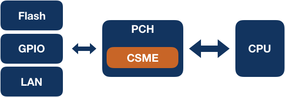
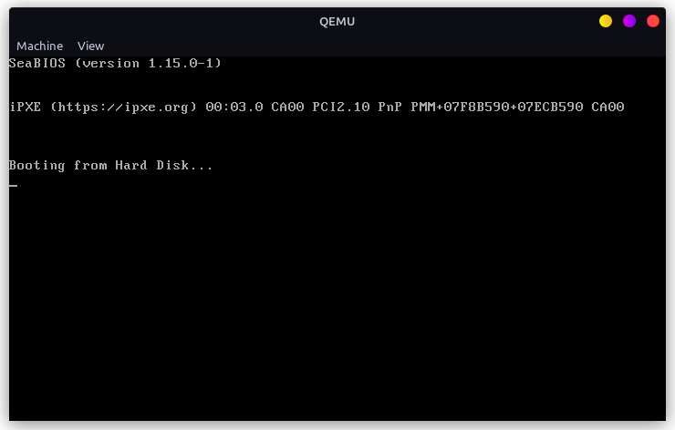

# Trabajo Práctico 3: Modo Protegido

Este trabajo fue realizado por los alumnos:

- Dalla Fontana, Facundo
- Gallardo, Nicolas
- Villar, Federico Ignacio

## Teorico

### UEFI

UEFI (Interfaz de Firmware Extensible Unificada) es una especificación de firmware de computadora que reemplaza al tradicional BIOS (Sistema Básico de Entrada/Salida) en las computadoras actuales. Proporciona una interfaz entre el sistema operativo y el firmware de la computadora, permitiendo un arranque más rápido, una mayor seguridad y una mejor gestión de los dispositivos de hardware.

Para utilizar UEFI, generalmente se necesita acceder a la configuración del firmware de la computadora durante el arranque. Esto se hace típicamente presionando una tecla específica (como F2, F10, Esc o Del) justo después de encender o reiniciar la misma. Desde la interfaz de configuración de UEFI, puedes realizar varias acciones, como configurar la secuencia de arranque, ajustar la configuración del hardware y habilitar o deshabilitar características como Secure Boot.

Una función a la que se podría llamar usando la dinámica de UEFI es la de configurar el Secure Boot. Esta función permite al usuario habilitar o deshabilitar Secure Boot, así como gestionar las claves de arranque seguro que se utilizan para verificar la autenticidad de los componentes del sistema operativo durante el proceso de arranque.

### Bug en UEFI: vulnerabilidades en el firmware UEFI de Lenovo

#### Resumen

Lenovo ha emitido un aviso de seguridad sobre tres vulnerabilidades críticas que afectan el firmware UEFI de más de 100 modelos de sus portátiles. Estas vulnerabilidades permiten a los atacantes desactivar la protección de la memoria flash SPI y desactivar la función Secure Boot, además de ejecutar código arbitrario con privilegios elevados. Los investigadores de ESET descubrieron estos fallos y los reportaron a Lenovo en octubre del año pasado. Las vulnerabilidades afectan a modelos como IdeaPad 3, Legion 5 Pro-16ACH6 H y Yoga Slim 9-14ITL05, poniendo en riesgo potencialmente a millones de usuarios.

#### Descripcion de las vulnerabilidades

- **CVE-2021-3971**: un controlador usado en procesos de fabricación antiguos se incluyó erróneamente en la imagen del BIOS. Permite a un atacante con privilegios elevados modificar la región de protección del firmware mediante la modificación de una variable NVRAM.
- **CVE-2021-3972**: un controlador utilizado en el proceso de fabricación no fue desactivado correctamente. Esto permite a un atacante con privilegios elevados modificar la configuración de Secure Boot mediante la modificación de una variable NVRAM.
- **CVE-2021-3970**: permite a un atacante local ejecutar código arbitrario con privilegios elevados.

#### Impacto y riesgos

Las dos primeras vulnerabilidades relacionadas con UEFI (CVE-2021-3971 y CVE-2021-3972) permiten a los atacantes desplegar implantes en la memoria flash SPI o en la ESP, lo que los hace extremadamente peligrosos y difíciles de detectar. Estos implantes pueden ejecutarse tempranamente en el proceso de arranque, antes de que el sistema operativo tome control, evadiendo así la mayoría de las soluciones de seguridad.

#### Historia de amenazas en UEFI

ESET (empresa de seguridad informatica, desarrolladora de soluciones de software de seguridad) identifico dos implantes UEFI en el pasado:

- **Lojax**: descubierto en 2018, usado por actores respaldados por el gobierno ruso.
- **ESPecter**: identificado en 2021, activo desde 2012 como bootkit para sistemas basados en BIOS.

Otros actores de seguridad sencontraron amenazas similares, como:

- **MosaicRegressor** (Kaspersky, 2020)
- **FinSpy** (Kaspersky, 2021)
- **MoonBounce** (Kaspersky, 2022)

#### Medidas de mitigacion

Lenovo recomienda actualizar el firmware del sistema a la versión más reciente para protegerse contra estas vulnerabilidades. Las actualizaciones pueden realizarse manualmente desde la página de soporte del dispositivo o mediante utilidades proporcionadas por la compañía para la actualización de controladores del sistema.

### Intel Converged Security and Management Engine (Intel CSME)


Intel® CSME es un subsistema embebido y dispositivo PCIe que actúa como controlador de seguridad y gestión dentro del PCH. Está diseñado para operar en un entorno aislado del software principal del sistema, como el BIOS, el sistema operativo y las aplicaciones. Accede a interfaces limitadas como GPIO y LAN/WLAN para sus funciones, y su firmware y configuración se almacenan en memoria NVRAM, típicamente en memoria flash en el bus SPI.

ntel® CSME está presente en la mayoría de las plataformas de Intel, incluyendo sistemas de consumo y comerciales para clientes, estaciones de trabajo, servidores y productos de IoT (Internet de las Cosas). Para la seguridad basada en hardware, usuarios como proveedores de contenido u organizaciones de TI (Tecnología de la Información) pueden gestionar, por ejemplo, la gestión de derechos digitales (DRM) y la Tecnología de Gestión Activa de Intel® (Intel® AMT), la cual requiere que la seguridad a nivel de hardware esté disponible cuando el sistema anfitrión no responde o está apagado.

La siguiente imagen ilustra la ubicacion de CSME en el sistema.



#### Funciones principales

- **Inicialización del Silicio**: se encarga de la inicialización básica del PCH, autenticación y carga de firmware en componentes de hardware integrados, y depuración segura del PCH.
- **Gestionabilidad**: mejora la gestión remota de plataformas a través de Intel® AMT, permitiendo características como redirección de consola, redirección de almacenamiento USB, control remoto de teclado, video y ratón, control remoto de energía, gestión de eventos, y diagnóstico independiente del sistema operativo.
- **Seguridad**: incluye tecnologías como Intel® PTT para soporte de TPM, Intel® Boot Guard para integridad del arranque, soporte de DRM de hardware, y capacidades de carga y ejecución segura de firmware y applets, proporcionando un alto nivel de seguridad a nivel de hardware.

### Intel Management Engine BIOS Extension (Intel MEBx)


El Intel® Management Engine (Intel® ME) es un recurso de computación protegido y separado que ofrece características de gestión de TI, como Intel® Active Management Technology (Intel® AMT 7.0), independientemente del sistema operativo instalado. La configuración de Intel ME se integra en el BIOS mediante la Extensión del BIOS de Intel® Management Engine (Intel® MEBX), que permite modificar y recopilar la configuración de hardware del sistema, transmitiéndola al firmware de gestión y proporcionando una interfaz de usuario para configurar Intel ME.

### coreboot

coreboot es un proyecto open source que reemplaza el firmware propietario en las computadoras. Inicializa el hardware y luego transfiere el control a un payload que, generalmente, arranca el sistema operativo. Su diseño flexible permite su uso en aplicaciones especializadas, ejecución de sistemas operativos desde flash, carga de cargadores de arranque personalizados y la implementación de estándares de firmware. Esto reduce la cantidad de código y el espacio en flash necesario, incluyendo solo las funciones esenciales para la aplicación específica.

#### Arquitectura


#### Productos que lo incorporan

- Chromebooks: muchos Chromebooks, especialmente aquellos fabricados por Google, utilizan Coreboot como su firmware base.
- Servidores: algunos fabricantes de servidores, como Facebook, han adoptado Coreboot en sus centros de datos para una inicialización rápida y eficiente del sistema.
- Dispositivos embebidos: coreboot se utiliza en una variedad de dispositivos embebidos y sistemas integrados donde se necesita un firmware ligero y flexible.

#### Ventajas

- **Open source**: coreboot se basa en los principios del Software de Código Abierto. Muchos de los ingenieros que trabajan en coreboot también han trabajado en el núcleo de Linux. En lugar de mantener las mejoras de un sistema en secreto para todos los demás proveedores, en coreboot, estas mejoras se comparten en todos los ámbitos, proporcionando a los usuarios finales un firmware mucho mejor y mucho más estable.
- **Flexibilidad**: la principal flexibilidad que ofrece coreboot es a través del uso de diferentes payloads. Soportamos el arranque de sistemas operativos heredados a través de SeaBIOS, el arranque de red con una ROM iPXE integrada o el último payload UEFI. Se pueden crear payloads personalizados utilizando la herramienta libpayload con licencia BSD.
- **Seguridad**: coreboot viene con una Base de Confianza Mínima que reduce la superficie general de ataque. También soporta un proceso de arranque seguro llamado VBOOT2. Está escrito en el estándar MISRA-C y proporciona otros lenguajes como Ada para la verificación formal de propiedades especiales. Además, el uso de características de plataforma como IOMMU, protecciones de flash y el modo SMM desactivado aumentan la seguridad también.
- **Rendimiento**: los ingenieros de coreboot han trabajado en muchos proyectos de software críticos para la seguridad. La arquitectura de coreboot está diseñada para tener un proceso de actualización inalterable. Actualizar el firmware no debería ser más peligroso que instalar tu aplicación favorita en tu teléfono móvil.
- **Rendimiento**: coreboot está diseñado para arrancar rápidamente. Para equipos de escritorio y portátiles, puede arrancar frecuentemente al inicio del sistema operativo en menos de un segundo. Para servidores, puede reducir minutos del tiempo de arranque. Algunos proveedores han demostrado una disminución en el tiempo de arranque de más del 70% en comparación con el BIOS OEM.

## Practico

### Imagen booteable

Para crear una imagen booteable para arquitectura x86, lo mas sencillo es crear un sector de arranque MBR y colocarlo en un disco. Para ello, se ejecuta una unica linea de codigo:

```
printf '\364%509s\125\252' > main.img
```
En donde:

- `\364` en octal es `0xf4` en hexadecimal: instruccion `hlt`
- Para obtener la codificacion de una instruccion en particular:
    - `echo hlt > a.S`
    - `as -o a.o a.S`
    - `objdump -S a.o`
- `%509s` produce 509 espacios necesarios para completar la imagen hasta el byte 510.
- `\125\252` en octal es `0x55 0xAA` en hexadecimal, requisito para que sea interpretada como una `mbr`.
- `hd main.img`


Para correr la imagen, se instala `qemu` y se lo corre con la instruccion: `qemu-system-x86_64 --drive file=main.img,format=raw,index=0,media=disk`. Se obtiene algo como lo siguiente:



Para probar correr la imagen en hardware, se graba un pendrive con la imagen anteriormente utilizada. Para ello, primero fue necesario encontrar el path del pendrive, y con eso se ejecuta la instruccion `sudo dd if=main.img of=/dev/sdc`.


