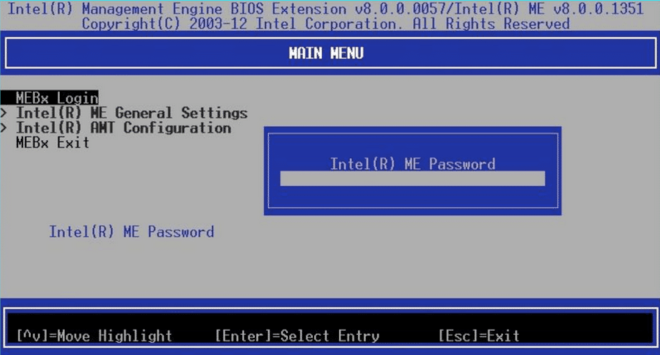
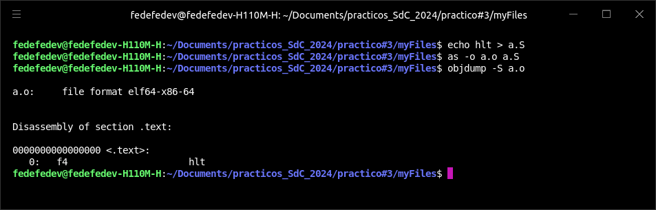
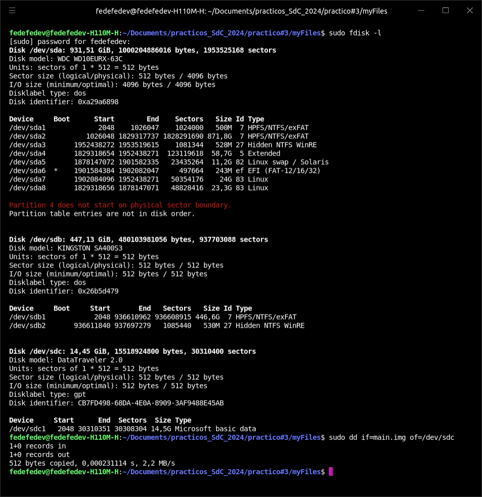
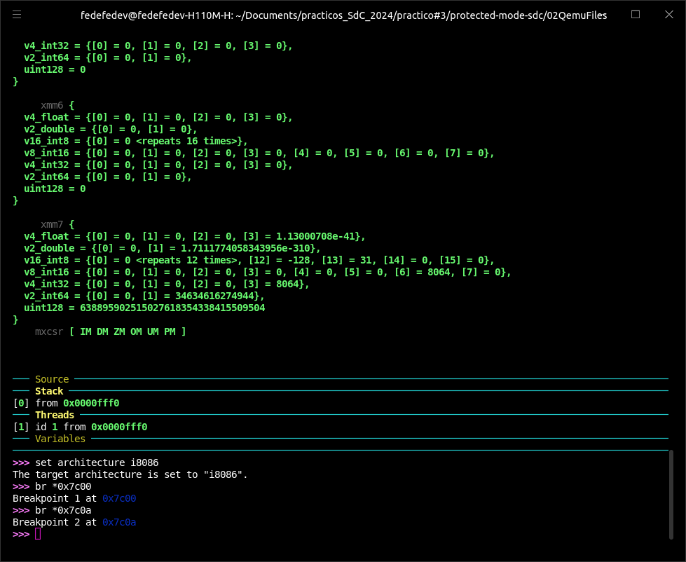
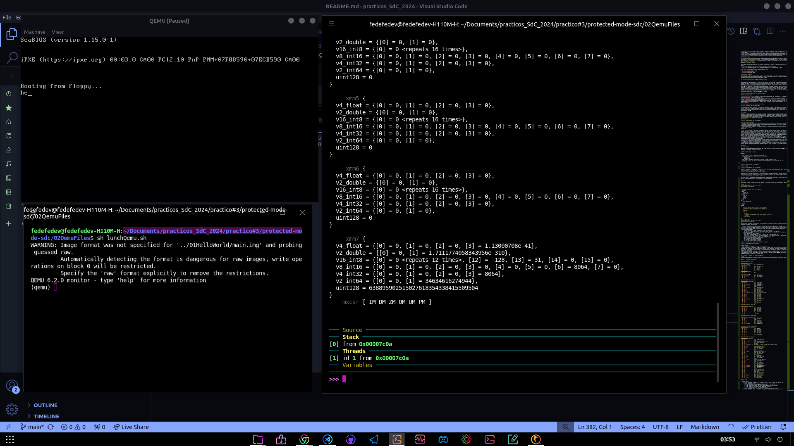
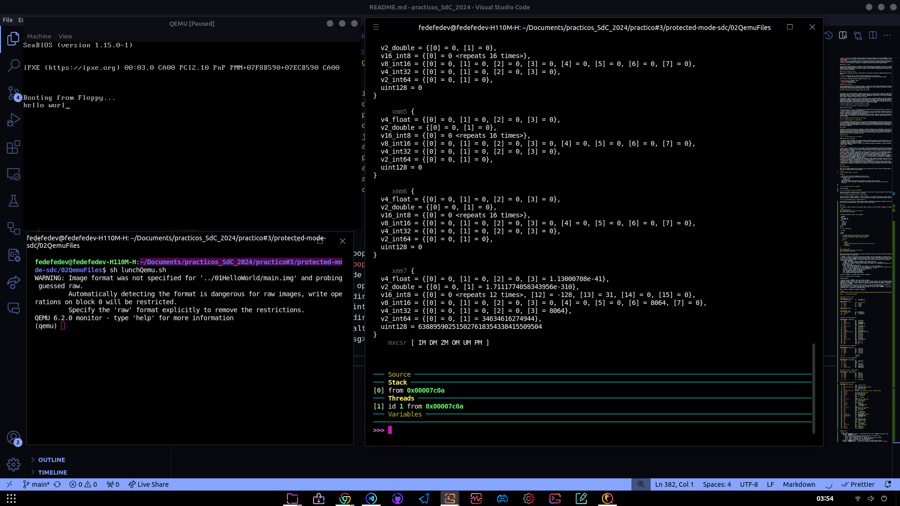
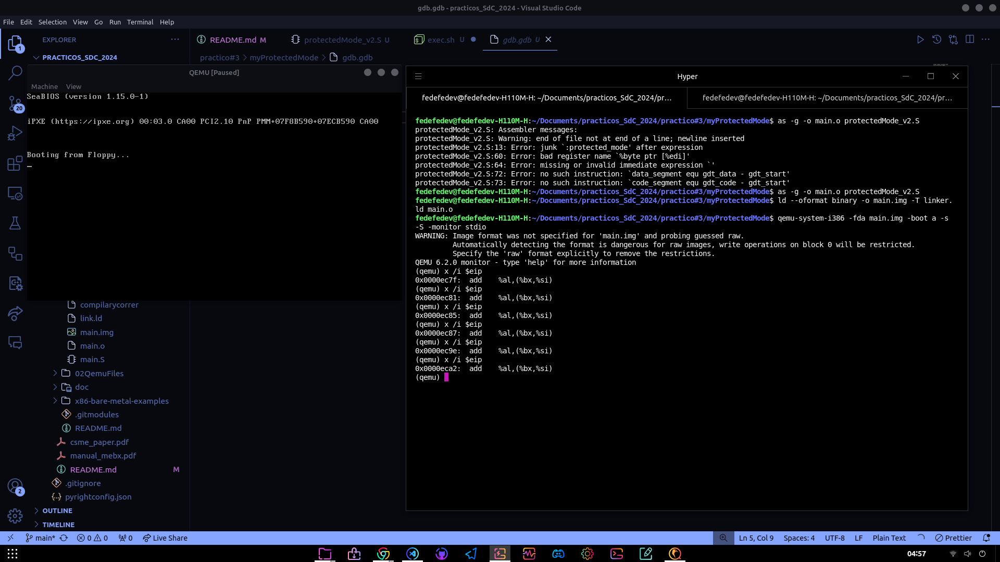

# Trabajo Práctico 3: Modo Protegido

Este trabajo fue realizado por los alumnos:

- Dalla Fontana, Facundo
- Gallardo, Nicolas
- Villar, Federico Ignacio

## Teórico

### UEFI

UEFI (Interfaz de Firmware Extensible Unificada) es una especificación de firmware de computadora que reemplaza al tradicional BIOS (Sistema Básico de Entrada/Salida) en las computadoras actuales. Proporciona una interfaz entre el sistema operativo y el firmware de la computadora, permitiendo un arranque más rápido, una mayor seguridad y una mejor gestión de los dispositivos de hardware.

Para utilizar UEFI, generalmente se necesita acceder a la configuración del firmware de la computadora durante el arranque. Esto se hace típicamente presionando una tecla específica (como F2, F10, Esc o Del) justo después de encender o reiniciar la misma. Desde la interfaz de configuración de UEFI, puedes realizar varias acciones, como configurar la secuencia de arranque, ajustar la configuración del hardware y habilitar o deshabilitar características como Secure Boot.

Una función a la que se podría llamar usando la dinámica de UEFI es la de configurar el Secure Boot. Esta función permite al usuario habilitar o deshabilitar Secure Boot, así como gestionar las claves de arranque seguro que se utilizan para verificar la autenticidad de los componentes del sistema operativo durante el proceso de arranque.

### Bug en UEFI: vulnerabilidades en el firmware UEFI de Lenovo

#### Resumen

Lenovo ha emitido un aviso de seguridad sobre tres vulnerabilidades críticas que afectan el firmware UEFI de más de 100 modelos de sus portátiles. Estas vulnerabilidades permiten a los atacantes desactivar la protección de la memoria flash SPI y desactivar la función Secure Boot, además de ejecutar código arbitrario con privilegios elevados. Los investigadores de ESET descubrieron estos fallos y los reportaron a Lenovo en octubre del año pasado. Las vulnerabilidades afectan a modelos como IdeaPad 3, Legion 5 Pro-16ACH6 H y Yoga Slim 9-14ITL05, poniendo en riesgo potencialmente a millones de usuarios.

#### Descripcion de las vulnerabilidades

- **CVE-2021-3971**: un controlador usado en procesos de fabricación antiguos se incluyó erróneamente en la imagen del BIOS. Permite a un atacante con privilegios elevados modificar la región de protección del firmware mediante la modificación de una variable NVRAM.
- **CVE-2021-3972**: un controlador utilizado en el proceso de fabricación no fue desactivado correctamente. Esto permite a un atacante con privilegios elevados modificar la configuración de Secure Boot mediante la modificación de una variable NVRAM.
- **CVE-2021-3970**: permite a un atacante local ejecutar código arbitrario con privilegios elevados.

#### Impacto y riesgos

Las dos primeras vulnerabilidades relacionadas con UEFI (CVE-2021-3971 y CVE-2021-3972) permiten a los atacantes desplegar implantes en la memoria flash SPI o en la ESP, lo que los hace extremadamente peligrosos y difíciles de detectar. Estos implantes pueden ejecutarse tempranamente en el proceso de arranque, antes de que el sistema operativo tome control, evadiendo así la mayoría de las soluciones de seguridad.

#### Historia de amenazas en UEFI

ESET (empresa de seguridad informatica, desarrolladora de soluciones de software de seguridad) identifico dos implantes UEFI en el pasado:

- **Lojax**: descubierto en 2018, usado por actores respaldados por el gobierno ruso.
- **ESPecter**: identificado en 2021, activo desde 2012 como bootkit para sistemas basados en BIOS.

Otros actores de seguridad sencontraron amenazas similares, como:

- **MosaicRegressor** (Kaspersky, 2020)
- **FinSpy** (Kaspersky, 2021)
- **MoonBounce** (Kaspersky, 2022)

#### Medidas de mitigacion

Lenovo recomienda actualizar el firmware del sistema a la versión más reciente para protegerse contra estas vulnerabilidades. Las actualizaciones pueden realizarse manualmente desde la página de soporte del dispositivo o mediante utilidades proporcionadas por la compañía para la actualización de controladores del sistema.

### Intel Converged Security and Management Engine (Intel CSME)


Intel® CSME es un subsistema embebido y dispositivo PCIe que actúa como controlador de seguridad y gestión dentro del PCH. Está diseñado para operar en un entorno aislado del software principal del sistema, como el BIOS, el sistema operativo y las aplicaciones. Accede a interfaces limitadas como GPIO y LAN/WLAN para sus funciones, y su firmware y configuración se almacenan en memoria NVRAM, típicamente en memoria flash en el bus SPI.

ntel® CSME está presente en la mayoría de las plataformas de Intel, incluyendo sistemas de consumo y comerciales para clientes, estaciones de trabajo, servidores y productos de IoT (Internet de las Cosas). Para la seguridad basada en hardware, usuarios como proveedores de contenido u organizaciones de TI (Tecnología de la Información) pueden gestionar, por ejemplo, la gestión de derechos digitales (DRM) y la Tecnología de Gestión Activa de Intel® (Intel® AMT), la cual requiere que la seguridad a nivel de hardware esté disponible cuando el sistema anfitrión no responde o está apagado.

La siguiente imagen ilustra la ubicacion de CSME en el sistema.


#### Funciones principales

- **Inicialización del Silicio**: se encarga de la inicialización básica del PCH, autenticación y carga de firmware en componentes de hardware integrados, y depuración segura del PCH.
- **Gestionabilidad**: mejora la gestión remota de plataformas a través de Intel® AMT, permitiendo características como redirección de consola, redirección de almacenamiento USB, control remoto de teclado, video y ratón, control remoto de energía, gestión de eventos, y diagnóstico independiente del sistema operativo.
- **Seguridad**: incluye tecnologías como Intel® PTT para soporte de TPM, Intel® Boot Guard para integridad del arranque, soporte de DRM de hardware, y capacidades de carga y ejecución segura de firmware y applets, proporcionando un alto nivel de seguridad a nivel de hardware.

### Intel Management Engine BIOS Extension (Intel MEBx)



El Intel® Management Engine (Intel® ME) es un recurso de computación protegido y separado que ofrece características de gestión de TI, como Intel® Active Management Technology (Intel® AMT 7.0), independientemente del sistema operativo instalado. La configuración de Intel ME se integra en el BIOS mediante la Extensión del BIOS de Intel® Management Engine (Intel® MEBX), que permite modificar y recopilar la configuración de hardware del sistema, transmitiéndola al firmware de gestión y proporcionando una interfaz de usuario para configurar Intel ME.

### coreboot

coreboot es un proyecto open source que reemplaza el firmware propietario en las computadoras. Inicializa el hardware y luego transfiere el control a un payload que, generalmente, arranca el sistema operativo. Su diseño flexible permite su uso en aplicaciones especializadas, ejecución de sistemas operativos desde flash, carga de cargadores de arranque personalizados y la implementación de estándares de firmware. Esto reduce la cantidad de código y el espacio en flash necesario, incluyendo solo las funciones esenciales para la aplicación específica.

#### Arquitectura


#### Productos que lo incorporan

- Chromebooks: muchos Chromebooks, especialmente aquellos fabricados por Google, utilizan Coreboot como su firmware base.
- Servidores: algunos fabricantes de servidores, como Facebook, han adoptado Coreboot en sus centros de datos para una inicialización rápida y eficiente del sistema.
- Dispositivos embebidos: coreboot se utiliza en una variedad de dispositivos embebidos y sistemas integrados donde se necesita un firmware ligero y flexible.

#### Ventajas

- **Open source**: coreboot se basa en los principios del Software de Código Abierto. Muchos de los ingenieros que trabajan en coreboot también han trabajado en el núcleo de Linux. En lugar de mantener las mejoras de un sistema en secreto para todos los demás proveedores, en coreboot, estas mejoras se comparten en todos los ámbitos, proporcionando a los usuarios finales un firmware mucho mejor y mucho más estable.
- **Flexibilidad**: la principal flexibilidad que ofrece coreboot es a través del uso de diferentes payloads. Soportamos el arranque de sistemas operativos heredados a través de SeaBIOS, el arranque de red con una ROM iPXE integrada o el último payload UEFI. Se pueden crear payloads personalizados utilizando la herramienta libpayload con licencia BSD.
- **Seguridad**: coreboot viene con una Base de Confianza Mínima que reduce la superficie general de ataque. También soporta un proceso de arranque seguro llamado VBOOT2. Está escrito en el estándar MISRA-C y proporciona otros lenguajes como Ada para la verificación formal de propiedades especiales. Además, el uso de características de plataforma como IOMMU, protecciones de flash y el modo SMM desactivado aumentan la seguridad también.
- **Rendimiento**: los ingenieros de coreboot han trabajado en muchos proyectos de software críticos para la seguridad. La arquitectura de coreboot está diseñada para tener un proceso de actualización inalterable. Actualizar el firmware no debería ser más peligroso que instalar tu aplicación favorita en tu teléfono móvil.
- **Rendimiento**: coreboot está diseñado para arrancar rápidamente. Para equipos de escritorio y portátiles, puede arrancar frecuentemente al inicio del sistema operativo en menos de un segundo. Para servidores, puede reducir minutos del tiempo de arranque. Algunos proveedores han demostrado una disminución en el tiempo de arranque de más del 70% en comparación con el BIOS OEM.

## Práctico

### Imagen booteable

Para crear una imagen booteable para arquitectura x86, lo mas sencillo es crear un sector de arranque MBR y colocarlo en un disco. Para ello, se ejecuta una unica linea de codigo:

```bash
printf '\364%509s\125\252' > main.img
```
En donde:

- `\364` en octal es `0xf4` en hexadecimal: instruccion `hlt`
- Para obtener la codificacion de una instruccion en particular:
    - `echo hlt > a.S`
    - `as -o a.o a.S`
    - `objdump -S a.o`
- `%509s` produce 509 espacios necesarios para completar la imagen hasta el byte 510.
- `\125\252` en octal es `0x55 0xAA` en hexadecimal, requisito para que sea interpretada como una `mbr`.
- `hd main.img`




Se tiene tambien:


Para correr la imagen, se instala `qemu` y se lo corre con la instruccion: `qemu-system-x86_64 --drive file=main.img,format=raw,index=0,media=disk`. Se obtiene algo como lo siguiente:


Para probar correr la imagen en hardware, se graba un pendrive con la imagen anteriormente utilizada. Para ello, primero fue necesario encontrar el path del pendrive, y con eso se ejecuta la instruccion `sudo dd if=main.img of=/dev/sdc`.



Por alguna razon, no se termina de ejecutar ningun arranque, simplemente al seleccionar el pendrive como sistema a bootear, la pantalla queda completamente negra, incluso despues de unos cuantos minutos.


### Linker


#### ¿Qué es? ¿Qué hace?


Un linker (o enlazador) es una herramienta del proceso de compilación de programas que combina uno o más archivos objeto (resultantes de la compilación de archivos fuente) y bibliotecas en un solo archivo ejecutable, biblioteca compartida u otro formato de archivo de salida. El linker realiza varias funciones esenciales, entre las cuales se incluyen:

- **Resolución de símbolos**: encuentra las definiciones de todas las referencias simbólicas en los archivos objeto, asegurándose de que todas las llamadas a funciones y referencias a variables estén correctamente resueltas.
- **Reubicación**: ajusta las direcciones de los programas y datos en los archivos objeto para reflejar su ubicación final en el archivo ejecutable.
- **Combina segmentos**: junta las distintas secciones de código y datos (como las secciones .text para el código y .data para los datos) en un formato coherente y continuo.

#### Práctico

Para compilar, linkear y ejecutar lo solicitado en qemu, se ejecuta un script de shell, brindado en el repositorio de referencia:

```bash
as -g -o main.o main.S
ld --oformat binary -o main.img -T link.ld main.o
qemu-system-x86_64 -hda main.img
```

El codigo de assembly de `main.S` es el siguiente.

```assembly
.code16
    mov $msg, %si
    mov $0x0e, %ah
loop:
    lodsb
    or %al, %al
    jz halt
    int $0x10
    jmp loop
halt:
    hlt
msg:
    .asciz "hello world"
```
Y el linker:

```bash
SECTIONS
{
    /* The BIOS loads the code from the disk to this location.
     * We must tell that to the linker so that it can properly
     * calculate the addresses of symbols we might jump to.
     */
    . = 0x7c00;
    .text :
    {
        __start = .;
        *(.text)
        /* Place the magic boot bytes at the end of the first 512 sector. */
        . = 0x1FE;
        SHORT(0xAA55)
    }
}
/*
as -g -o main.o main.S
ld --oformat binary -o main.img -T link.ld main.o
qemu-system-x86_64 -hda main.img
*/
```
Esta seccion de Hello World, ejecutada en el directorio homonimo, consta de los archivos mostrados en parrafos anteriores. Es importante dar algunas consideraciones:

- `SECTIONS`: se definen las secciones de memoria del programa y como estan organizadas en la imagen final. En este caso se define que el punto de inicio del programa esta en la direccion `0x7C00`, que es donde la BIOS carga el sector de arranque del disco. Es necesaria justamente por la razón recién mencionada.
- `.text`: es la seccion de codigo del programa. Se define que el simbolo `__start` marca el inicio del codigo. Luego, se coloca la firma especial de arranque `0xAA55` en la direccion `0x1FE`, que es el ultimo byte del sector de arranque.
- Para el codigo ensamblador:
    - `.code16`: Indica que el código se ensamblará en modo real de 16 bits.
    - `mov $msg, %si`: Mueve la dirección de memoria de la cadena "hello world" al registro `SI`.
    - `mov $0x0e, %ah`: Carga el número de función `0x0e` en el registro `AH`, indicando que se realizará una impresión de caracteres con el BIOS.
    - `loop`: Etiqueta para iniciar un bucle.
    - `lodsb`: Carga el byte apuntado por `SI` en el registro `AL` y luego incrementa `SI`.
    - `or %al, %al`: Realiza una operación OR lógica consigo mismo en `AL` para verificar si es igual a cero (fin de cadena).
    - `jz halt`: Salta a la etiqueta `halt` si el byte cargado en `AL` es cero.
    - `int $0x10`: Llama a la BIOS para imprimir el carácter en `AL`.
    - `jmp loop`: Salta de vuelta al inicio del bucle.
    - `halt`: Etiqueta para detener la ejecución.
    - `hlt`: Detiene la ejecución del procesador.
    - `msg`: Definición de la cadena "hello world".

Al hacer un `hexdump` en la imagen creada, se tiene lo siguiente:


Se puede apreciar:

- Direccion de inicio `00000000`: inicio del archivo de imagen.
- Codigo de arranque: `be 0f 7c b4 0e ac 08 c0 74 04 cd 10 eb f7 f4 68`, estas son las instrucciones de código de arranque ensambladas. En ensamblador x86, estas instrucciones realizan varias operaciones, como cargar la dirección de memoria de la cadena "hello world" en un registro, realizar llamadas a la BIOS para imprimir caracteres en pantalla, y establecer un bucle para imprimir cada carácter de la cadena.
- Cadena "hello world": `65 6c 6c 6f 20 77 6f 72 6c 64 00`  son los valores hexadecimales correspondientes a los caracteres ASCII de la cadena "hello world", seguidos de un byte nulo (00) para indicar el final de la cadena.
- Magic Boot Bytes: `55 aa` son los "Magic Boot Bytes" ubicados al final del archivo `000001f0`. Es una firma especial que indica a la BIOS que este es un dispositivo de arranque valido.
- La primera instrucción del programa es `be 00 00 b4 0e`, que corresponde a `mov $0xeb40000`, `%esi`. Esto es de interés al analizar la salida del `objump`.

Ahora, al hacer un `objdump`, se obtiene lo siguiente:

```bash
fedefedev@fedefedev-H110M-H:~/Documents/practicos_SdC_2024/practico#3/protected-mode-sdc/01HelloWorld$ objdump -D main.o

main.o:     file format elf64-x86-64


Disassembly of section .text:

0000000000000000 <loop-0x5>:
   0:   be 00 00 b4 0e          mov    $0xeb40000,%esi

0000000000000005 <loop>:
   5:   ac                      lods   %ds:(%rsi),%al
   6:   08 c0                   or     %al,%al
   8:   74 04                   je     e <halt>
   a:   cd 10                   int    $0x10
   c:   eb f7                   jmp    5 <loop>

000000000000000e <halt>:
   e:   f4                      hlt    

000000000000000f <msg>:
   f:   68 65 6c 6c 6f          push   $0x6f6c6c65
  14:   20 77 6f                and    %dh,0x6f(%rdi)
  17:   72 6c                   jb     85 <msg+0x76>
  19:   64                      fs
        ...

Disassembly of section .debug_line:

0000000000000000 <.debug_line>:
   0:   3b 00                   cmp    (%rax),%eax
   2:   00 00                   add    %al,(%rax)
   4:   03 00                   add    (%rax),%eax
   6:   1d 00 00 00 01          sbb    $0x1000000,%eax
   b:   01 fb                   add    %edi,%ebx
   d:   0e                      (bad)  
   e:   0d 00 01 01 01          or     $0x1010100,%eax
  13:   01 00                   add    %eax,(%rax)
  15:   00 00                   add    %al,(%rax)
  17:   01 00                   add    %eax,(%rax)
  19:   00 01                   add    %al,(%rcx)
  1b:   00 6d 61                add    %ch,0x61(%rbp)
  1e:   69 6e 2e 53 00 00 00    imul   $0x53,0x2e(%rsi),%ebp
  25:   00 00                   add    %al,(%rax)
  27:   00 09                   add    %cl,(%rcx)
  29:   02 00                   add    (%rax),%al
  2b:   00 00                   add    %al,(%rax)
  2d:   00 00                   add    %al,(%rax)
  2f:   00 00                   add    %al,(%rax)
  31:   00 13                   add    %dl,(%rbx)
  33:   3d 30 21 2f 2f          cmp    $0x2f2f2130,%eax
  38:   2f                      (bad)  
  39:   30 02                   xor    %al,(%rdx)
  3b:   0d                      .byte 0xd
  3c:   00 01                   add    %al,(%rcx)
  3e:   01                      .byte 0x1

Disassembly of section .debug_info:

0000000000000000 <.debug_info>:
   0:   2a 00                   sub    (%rax),%al
   2:   00 00                   add    %al,(%rax)
   4:   02 00                   add    (%rax),%al
   6:   00 00                   add    %al,(%rax)
   8:   00 00                   add    %al,(%rax)
   a:   08 01                   or     %al,(%rcx)
        ...
  2c:   01                      .byte 0x1
  2d:   80                      .byte 0x80

Disassembly of section .debug_abbrev:

0000000000000000 <.debug_abbrev>:
   0:   01 11                   add    %edx,(%rcx)
   2:   00 10                   add    %dl,(%rax)
   4:   06                      (bad)  
   5:   11 01                   adc    %eax,(%rcx)
   7:   12 01                   adc    (%rcx),%al
   9:   03 0e                   add    (%rsi),%ecx
   b:   1b 0e                   sbb    (%rsi),%ecx
   d:   25 0e 13 05 00          and    $0x5130e,%eax
        ...

Disassembly of section .debug_aranges:

0000000000000000 <.debug_aranges>:
   0:   2c 00                   sub    $0x0,%al
   2:   00 00                   add    %al,(%rax)
   4:   02 00                   add    (%rax),%al
   6:   00 00                   add    %al,(%rax)
   8:   00 00                   add    %al,(%rax)
   a:   08 00                   or     %al,(%rax)
        ...
  18:   1b 00                   sbb    (%rax),%eax
        ...

Disassembly of section .debug_str:

0000000000000000 <.debug_str>:
   0:   6d                      insl   (%dx),%es:(%rdi)
   1:   61                      (bad)  
   2:   69 6e 2e 53 00 2f 68    imul   $0x682f0053,0x2e(%rsi),%ebp
   9:   6f                      outsl  %ds:(%rsi),(%dx)
   a:   6d                      insl   (%dx),%es:(%rdi)
   b:   65 2f                   gs (bad) 
   d:   66 65 64 65 66 65 64    data16 gs fs gs data16 gs fs gs jbe 46 <.debug_str+0x46>
  14:   65 76 2f 
  17:   44 6f                   rex.R outsl %ds:(%rsi),(%dx)
  19:   63 75 6d                movsxd 0x6d(%rbp),%esi
  1c:   65 6e                   outsb  %gs:(%rsi),(%dx)
  1e:   74 73                   je     93 <msg+0x84>
  20:   2f                      (bad)  
  21:   70 72                   jo     95 <msg+0x86>
  23:   61                      (bad)  
  24:   63 74 69 63             movsxd 0x63(%rcx,%rbp,2),%esi
  28:   6f                      outsl  %ds:(%rsi),(%dx)
  29:   73 5f                   jae    8a <msg+0x7b>
  2b:   53                      push   %rbx
  2c:   64 43 5f                fs rex.XB pop %r15
  2f:   32 30                   xor    (%rax),%dh
  31:   32 34 2f                xor    (%rdi,%rbp,1),%dh
  34:   70 72                   jo     a8 <msg+0x99>
  36:   61                      (bad)  
  37:   63 74 69 63             movsxd 0x63(%rcx,%rbp,2),%esi
  3b:   6f                      outsl  %ds:(%rsi),(%dx)
  3c:   23 33                   and    (%rbx),%esi
  3e:   2f                      (bad)  
  3f:   70 72                   jo     b3 <msg+0xa4>
  41:   6f                      outsl  %ds:(%rsi),(%dx)
  42:   74 65                   je     a9 <msg+0x9a>
  44:   63 74 65 64             movsxd 0x64(%rbp,%riz,2),%esi
  48:   2d 6d 6f 64 65          sub    $0x65646f6d,%eax
  4d:   2d 73 64 63 2f          sub    $0x2f636473,%eax
  52:   30 31                   xor    %dh,(%rcx)
  54:   48                      rex.W
  55:   65 6c                   gs insb (%dx),%es:(%rdi)
  57:   6c                      insb   (%dx),%es:(%rdi)
  58:   6f                      outsl  %ds:(%rsi),(%dx)
  59:   57                      push   %rdi
  5a:   6f                      outsl  %ds:(%rsi),(%dx)
  5b:   72 6c                   jb     c9 <msg+0xba>
  5d:   64 00 47 4e             add    %al,%fs:0x4e(%rdi)
  61:   55                      push   %rbp
  62:   20 41 53                and    %al,0x53(%rcx)
  65:   20 32                   and    %dh,(%rdx)
  67:   2e 33 38                cs xor (%rax),%edi
```

En donde se ve:

- Seccion `.text`:
    - Direccion `0x00000000 <loop-0x5>`: `be 00 00 b4 0e` Mueve el valor `0xeb40000` al registro `%esi`. Esto significa que el segmento del código a partir del cual la imagen del programa a a comenzar a ejecutarse se encuentra en la dirección `0xeb40000`.
    - Direccion `0x00000005 <loop>:
        - `ac`: carga un byte de la memoria a la que apunta `%esi` en el registro `%al`.
        - `08 c0`: realiza una operación OR entre `%al` y `%al`.
        - `74 04`: salta a la dirección `0xe` si la bandera ZF (Zero Flag) está activada.
        - `cd 10`: llama a la interrupción `0x10` (BIOS video services).
        - `eb f7`: salta a la dirección `0x5` (inicio del bucle).
    - Direccion `0x0000000e <halt>: `f4` hace que la CPU entre en estado de espera (halt).
    - Direccion `0x0000000f <msg>`:  `68 65 6c 6c 6f` empuja los valores ASCII de "hello" en la pila.

Para poder probar la imagen, se ejecuto el shell siguiente:

```bash
qemu-system-i386 -fda ../01HelloWorld/main.img -boot a -s -S -monitor stdio
```

Luego, se abrio otra ventana del terminal, y con ello, se llama a `gdb`. Alli se realizan 3 acciones principales:

- Debuggear una sesion local: `target remote localhost:1234`
- Poner un breakpoint en la direccion de arranque: `br *0x7c00`
- Poner un breakpoint en la llamada a interrupcion: `br 0x7c0a`

Con eso en mente, ahora, al ejecutar la instruccion `c` dentro de gdb se avanza hasta la siguiente llamada a interrupcion. Al realizar este procedimiento, es posible visualizar como luego de cada interrupcion se imprime una letra mas por pantalla en qemu. Se muestran 3 capturas sucesivas, para luego mostrar el estado final una vez completada la impresion.









#### Opción del linker

La opción `--oformat` binary en el linker se utiliza para generar una salida en formato binario puro. Este formato es simplemente una secuencia continua de bytes que representan el contenido del programa, sin ningún tipo de encabezado, metadatos o estructura adicional que normalmente se incluye en formatos de archivo ejecutable como ELF (Executable and Linkable Format) o PE (Portable Executable). 
Los siguientes son usos del formato binario puro:

- **Sistemas Embebidos**: en el desarrollo de sistemas embebidos, los programas a menudo se cargan directamente en la memoria del dispositivo sin necesidad de un sistema operativo que interprete un formato de archivo ejecutable complejo. El formato binario puro permite cargar el programa directamente en la memoria desde una dirección específica.
- **Cargas Directas en Hardware**: algunos dispositivos de hardware requieren firmware o programas en formato binario puro para cargarlos en la memoria interna del dispositivo. Esto es común en microcontroladores y otros tipos de hardware que no tienen un sistema operativo avanzado.
- **Arranque de Sistemas**: los cargadores de arranque (bootloaders) suelen requerir el código en formato binario puro. Por ejemplo, al desarrollar un bootloader para un sistema operativo, el código del bootloader se guarda en formato binario para ser cargado directamente por la BIOS o el firmware del sistema.
- **Análisis y Modificación de Binarios**: los archivos en formato binario puro son más fáciles de analizar y modificar en algunos contextos. Por ejemplo, en la ingeniería inversa y el análisis de malware, a veces es útil trabajar con el contenido binario puro sin la interferencia de los encabezados y estructuras adicionales.


### Modo protegido

#### Código assembler para pasar a modo protegido sin macros

Se crea el siguiente archivo:

```assembly
.equ CODE_SEGMENT, gdt_code - gdt_start
.equ DATA_SEGMENT, gdt_data - gdt_start

/* Entrada al modo protegido */
.code16
switch_to_protected_mode:
    cli                                   /* Paso 0. Deshabilitar interrupciones */
    lgdt gdt_descriptor                   /* Paso 1. Cargar la Tabla de Descriptores Global (GDT) */
    
    /* Paso 2. Cargar el Registro de Control CR0 y establecer el bit de Habilitación de Protección (PE) en 1 */
    mov %cr0, %eax
    orl $0x1, %eax
    mov %eax, %cr0
    
    /* Paso 3. Saltar a la sección de código de 32 bits */
    ljmp $CODE_SEGMENT, $protected_mode


/* Tabla de Descriptores Global (GDT) */
gdt_start:
    /* Descriptor nulo */
    gdt_null:
        .long 0x0                         /* Descriptor de segmento nulo - límite */
        .long 0x0                         /* Dirección base */

    /* Descriptor de código */
    gdt_code:
        .word 0xffff                      /* Límite del segmento (16 bits inferiores) */
        .word 0x0                         /* Dirección base (16 bits inferiores) */
        .byte 0x0                         /* Dirección base (8 bits medios) */
        .byte 0b10011010                  /* Flags: Presente, Nivel de Privilegio 0, Segmento de Código, Ejecutable, Legible */
        .byte 0b11001111                  /* Flags: Granularidad (4KB), Modo de 32 bits, Límite (4 bits superiores) */
        .byte 0x0                         /* Dirección base (8 bits superiores) */

    /* Descriptor de datos */
    gdt_data:
        .word 0xffff                      /* Límite del segmento (16 bits inferiores) */
        .word 0x0                         /* Dirección base (16 bits inferiores) */
        .byte 0x0                         /* Dirección base (8 bits medios) */
        .byte 0b10010010                  /* Flags: Presente, Nivel de Privilegio 0, Segmento de Datos, Legible, Escribible */
        .byte 0b11001111                  /* Flags: Granularidad (4KB), Modo de 32 bits, Límite (4 bits superiores) */
        .byte 0x0                         /* Dirección base (8 bits superiores) */

    gdt_end:

    /* Descriptor de GDT */
    gdt_descriptor:
        .word gdt_end - gdt_start - 1     /* Límite de GDT (tamaño - 1) */
        .long gdt_start                   /* Dirección base de GDT */


/* Inicialización del modo protegido */
.code32
protected_mode:
    /* Inicializar registros y puntero de pila */
    mov $DATA_SEGMENT, %ax
    mov %ax, %ds
    mov %ax, %es
    mov %ax, %fs
    mov %ax, %gs
    mov %ax, %ss
    mov $0x7000, %ebp
    mov %ebp, %esp

    mov $0x7000, %ebp
    mov %ebp, %esp
    
    /* Saltar a la función de comprobación del modo protegido */
    jmp check_protected_mode


/* Comprobar si está en modo protegido e imprimir mensaje */
check_protected_mode:
    mov %cr0, %eax                        /* Cargar Registro de Control CR0 */
    test $0x1, %eax                       /* Probar el bit PE (bit 0) */
    jnz protected_mode_detected           /* Saltar si el bit PE está establecido (en modo protegido) */
    jmp not_in_protected_mode
protected_mode_detected:
    /* El procesador está en modo protegido */
    call print_message
    jmp continue_execution
not_in_protected_mode:
    /* El procesador no está en modo protegido */
    hlt
continue_execution:
    /* Continuar con la ejecución del programa */
    hlt


/* Imprimir mensaje en VGA */
print_message:
    mov $message, %ecx                    /* Cargar la dirección del mensaje en ECX */
    mov vga, %eax                         /* Cargar la dirección del búfer VGA en EAX */
    
    /* Calcular dirección de memoria VGA */
    mov $160, %edx
    mul %edx
    lea 0xb8000(%eax), %edx
    mov $0x0f, %ah 
loop:
    mov (%ecx), %al                       /* Cargar el siguiente byte del mensaje en AL */
    cmp $0, %al                           /* Comprobar si hemos llegado al final del mensaje */
    je end
    
    mov %ax, (%edx)                       /* Escribir el carácter en el búfer VGA */
    
    /* Mover al siguiente carácter en el mensaje y en el búfer VGA */
    add $1, %ecx
    add $2, %edx
    jmp loop
end:
    ret

/* Mensaje a imprimir en VGA */
message:
    .asciz "Estamos en modo protegido gente."

/* Dirección del búfer VGA */
vga:
    .long 10
```

El linker es el mismo que se uso anteriormente. Con esto en mente, resta ejecutar la siguiente secuencia de comandos para poder debuggear con gdb al igual que en la iteracion anterior:

```bash
as -g -o main.o protectedMode.S # se crea el ejecutable
ld --oformat binary -o main.img -T linker.ld main.o # se linkea
hyper -- qemu-system-i386 -fda main.img -boot a -s -S -monitor stdio # se lanza la vm con qemu
hyper -- gdb -x gdb.gdb # se lanza la sesion de gdb con sus breakpoints ya definidos en otra venta del terminal
```

Entonces, como resultado, se tiene la primer parte del codigo, antes de entrar en la primera interrupcion:


Y, luego,


##### Cambio de los bits de acceso

Ahora, si se cambian los bits de acceso del segmento de datos para que sea de lectura unicamente, al intentar escribir, se tiene un bucle infinito en la instruccion `add`. Para comprobar esto, se trabaja con el comando `si` se gdb, y al chequear el `eip` en qemu, se obtiene siempre la misma instruccion.

El programa utilizado es el mismo que antes con una unica modificacion:

```assembly
.equ CODE_SEGMENT, gdt_code - gdt_start
.equ DATA_SEGMENT, gdt_data - gdt_start

/* Entrada al modo protegido */
.code16
switch_to_protected_mode:
    cli                                   /* Paso 0. Deshabilitar interrupciones */
    lgdt gdt_descriptor                   /* Paso 1. Cargar la Tabla de Descriptores Global (GDT) */
    
    /* Paso 2. Cargar el Registro de Control CR0 y establecer el bit de Habilitación de Protección (PE) en 1 */
    mov %cr0, %eax
    orl $0x1, %eax
    mov %eax, %cr0
    
    /* Paso 3. Saltar a la sección de código de 32 bits */
    ljmp $CODE_SEGMENT, $protected_mode


/* Tabla de Descriptores Global (GDT) */
gdt_start:
    /* Descriptor nulo */
    gdt_null:
        .long 0x0                         /* Descriptor de segmento nulo - límite */
        .long 0x0                         /* Dirección base */

    /* Descriptor de código */
    gdt_code:
        .word 0xffff                      /* Límite del segmento (16 bits inferiores) */
        .word 0x0                         /* Dirección base (16 bits inferiores) */
        .byte 0x0                         /* Dirección base (8 bits medios) */
        .byte 0b10011010                  /* Flags: Presente, Nivel de Privilegio 0, Segmento de Código, Ejecutable, Legible */
        .byte 0b11001111                  /* Flags: Granularidad (4KB), Modo de 32 bits, Límite (4 bits superiores) */
        .byte 0x0                         /* Dirección base (8 bits superiores) */

    /* Descriptor de datos (lectura solamente) */
    gdt_data:
        .word 0xffff                      /* Límite del segmento (16 bits inferiores) */
        .word 0x0                         /* Dirección base (16 bits inferiores) */
        .byte 0x0                         /* Dirección base (8 bits medios) */
        .byte 0b10010000                  /* Flags: Presente, Nivel de Privilegio 0, Segmento de Datos, Legible */
        .byte 0b11001111                  /* Flags: Granularidad (4KB), Modo de 32 bits, Límite (4 bits superiores) */
        .byte 0x0                         /* Dirección base (8 bits superiores) */

    gdt_end:

    /* Descriptor de GDT */
    gdt_descriptor:
        .word gdt_end - gdt_start - 1     /* Límite de GDT (tamaño - 1) */
        .long gdt_start                   /* Dirección base de GDT */


/* Inicialización del modo protegido */
.code32
protected_mode:
    /* Inicializar registros y puntero de pila */
    mov $DATA_SEGMENT, %ax
    mov %ax, %ds
    mov %ax, %es
    mov %ax, %fs
    mov %ax, %gs
    mov %ax, %ss
    mov $0x7000, %ebp
    mov %ebp, %esp

    mov $0x7000, %ebp
    mov %ebp, %esp
    
    /* Saltar a la función de comprobación del modo protegido */
    jmp check_protected_mode


/* Comprobar si está en modo protegido e imprimir mensaje */
check_protected_mode:
    mov %cr0, %eax                        /* Cargar Registro de Control CR0 */
    test $0x1, %eax                       /* Probar el bit PE (bit 0) */
    jnz protected_mode_detected           /* Saltar si el bit PE está establecido (en modo protegido) */
    jmp not_in_protected_mode
protected_mode_detected:
    /* El procesador está en modo protegido */
    call print_message
    jmp continue_execution
not_in_protected_mode:
    /* El procesador no está en modo protegido */
    hlt
continue_execution:
    /* Continuar con la ejecución del programa */
    hlt


/* Imprimir mensaje en VGA */
print_message:
    mov $message, %ecx                    /* Cargar la dirección del mensaje en ECX */
    mov vga, %eax                         /* Cargar la dirección del búfer VGA en EAX */
    
    /* Calcular dirección de memoria VGA */
    mov $160, %edx
    mul %edx
    lea 0xb8000(%eax), %edx
    mov $0x0f, %ah 
loop:
    mov (%ecx), %al                       /* Cargar el siguiente byte del mensaje en AL */
    cmp $0, %al                           /* Comprobar si hemos llegado al final del mensaje */
    je end
    
    mov %ax, (%edx)                       /* Escribir el carácter en el búfer VGA */
    
    /* Mover al siguiente carácter en el mensaje y en el búfer VGA */
    add $1, %ecx
    add $2, %edx
    jmp loop
end:
    ret

/* Mensaje a imprimir en VGA */
message:
    .asciz "Estamos en modo protegido gente."

/* Dirección del búfer VGA */
vga:
    .long 10
```

Y el resultado mencionado es:



Cuando intentamos escribir en un segmento de datos configurado como solo lectura, deberíamos obtener una excepción de protección general (General Protection Fault, GPF). Esto interrumpirá la ejecución del programa y típicamente se maneja mediante una interrupción (interrupción 13 en x86).

#### Valores predeterminados de los registros de segmento

En modo protegido, los registros de segmento no se cargan con valores literales o absolutos como se hacía en modo real. En lugar de eso, se cargan con selectores de segmento. Un selector de segmento es un valor que se utiliza para indexar una tabla de descriptores de segmento, específicamente la GDT (Tabla de Descriptores Globales) o la LDT (Tabla de Descriptores Locales). Los selectores de segmento contienen:

- **Índice(15-3)**: indica la posición del descriptor en la GDT o LDT.
- **TI (Table Indicator)(2)**: indica si el índice es para la GDT (TI=0) o la LDT (TI=1).
- **RPL (Requested Privilege Level)(1-0)**: Indica el nivel de privilegio solicitado.

#### ¿Por qué se usan selectores en modo protegido?

- **Abstracción y Flexibilidad**: los selectores permiten que los programas y el sistema operativo trabajen con descriptores de segmento que pueden cambiar de ubicación en la memoria física sin necesidad de modificar el código del programa.
- **Seguridad**: el uso de descriptores de segmento junto con la GDT y LDT permite implementar mecanismos de protección de memoria. Cada descriptor de segmento incluye información sobre el tamaño del segmento, su ubicación en la memoria, y los niveles de privilegio necesarios para acceder a él. Esto ayuda a prevenir que programas no autorizados accedan a áreas de memoria reservadas para el sistema operativo o para otros programas.
- **Multitarea**: en un entorno multitarea, diferentes tareas pueden tener diferentes LDTs, lo que permite que cada tarea tenga su propio espacio de direcciones segmentado y protegido. La GDT es global y común para todos, pero la LDT es específica para cada tarea, permitiendo aislamiento y protección entre tareas.