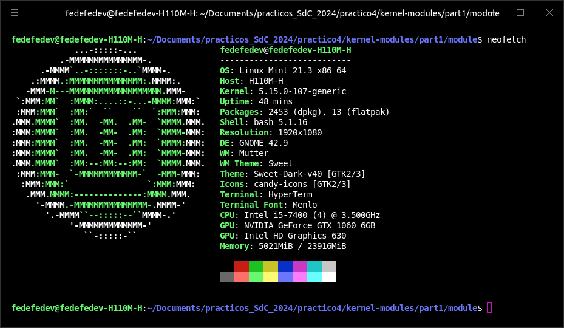
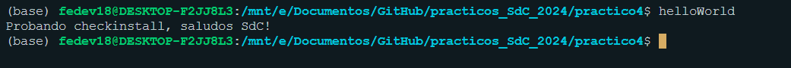

# Trabajo Practico 4: Modulos de Kernel

## Preparacion

Para este trabajo, se usa un SO Debian, virtualizado en una MacBook Air M1, las caracteristicas principales del computador se listan a continuacion en la captura de pantalla de `neofetch`.



Se hace fork de un repositorio de GitLab, luego se lo clona, y se lo inserta como submodulo al repositorio actual, cargado en GitHub. Ademas, se instalan las siguientes dependencias:

```bash
sudo apt-get install build-essential checkinstall 
```

## Desafio 1

### Checkinstall

Es un programa para sistemas operativos Unix-Like que permite instalacion y desinstalacion de software compilado desde el codigo fuente para ser administrado por un sistema de gestion de paquetes. Permite que luego de la compilacion se obtengan paquetes compatibles con:

- Slackware
- RPM
- Debian

La principal ventaja por sobre `make install` es la posibilidad de desinstalar el paquete usando su sistema de gestion de paquetes.

#### Uso

Para ser usado, normalmente luego del script de configuracion se ejecuta la siguiente secuencia de comandos:

```bash
./configure
make
sudo checkinstall #(as root)
```

#### Ejemplo con un Hello World

Se crea un pequeño archivo de C que permita probar una simple salida por consola:

```c
#include <stdio.h>

int main() {
    printf("Probando checkinstall, saludos SdC!\n");
    return 0;
}
```

Se lo compila ahora con `gcc helloWorld.c -o helloWorld`. Para eso se crea un Makefile:

```bash
all:
	gcc helloWorld.c -o helloWorld

install:
	install -D helloWorld /usr/local/bin/helloWorld

clean:
	rm -f helloWorld
```

Luego de `make`, se llama a `sudo checkinstall`, y se pide una descripcion, asi como tambien se termina de compilar y crear el paquete. Ahora, cada que se llama a `helloWorld` en consola se obtiene la salida deseada.



## Desafio 2

### Funciones disponibles en un programa y un modulo

Un programa es un conjunto completo de código que puede ejecutarse de manera independiente. Generalmente, tiene una función principal y puede incluir múltiples módulos y bibliotecas. Un módulo es un archivo que contiene definiciones de funciones, clases y variables que pueden ser reutilizadas en otros programas y módulos. Un módulo puede ser importado en otros módulos o programas.

Las funciones disponibles en un programa son:

- Ejecución Principal
- Importación de Módulos
- Interacción con el Usuario
- Manejo de Archivos
- Ejecución de Tareas

Mientras que, las funciones disponibles en un módulo son:

- Definición de Funciones y Clases
- Variables Globales
- Constantes
- Importación de Otros Módulos
- Encapsulación
- Reutilización

La diferencia radica en que un programa está diseñado para ejecutarse de manera independiente, mientras que un módulo está diseñado para ser importado y reutilizado en otros programas o módulos, es decir, el objetivo de un programa es resolver una tarea o problema específico mientras que un módulo se enfoca en dar funcionalidades y que estas se puedan utilizar en dichos programas.

### Espacio de usuario o espacio de kernel

El espacio de usuario es el entorno en el cual se ejecutan las aplicaciones y programas. En cambio, el espacio del kernel es el entorno en el que se ejecuta el núcleo del sistema operativo. Este entorno tiene acceso completo y sin restricciones al hardware y a todos los recursos del sistema. 

### Espacio de datos

Se refiere a la memoria en la que se almacenan los datos durante la ejecución de un programa. Hay dos tipos de espacio de datos, el espacio de datos de usuario que es el área de memoria donde se ejecutan las aplicaciones y programas del usuario, sus principales características son el acceso restringido para evitar que las aplicaciones interfieran con el sistema operativo. Otra característica es la seguridad, se protege cada aplicación del acceso no autorizado a la memoria de otras aplicaciones. El otro es el espacio de datos del Kernel, el cual es el área de memoria reservada para el núcleo del sistema operativo, sus principales características son el acceso sin restricción, en donde el kernel tiene acceso completo a todo el hardware y la memoria del sistema. Como también gestiona recursos del sistema, memoria, dispositivos de hardware y proporciona servicios a las aplicaciones.

### Drivers. Contenido de /dev

Los drivers son programas que permiten que el sistema operativo se comunique con el hardware del sistema. Actúan como intermediarios, traduciendo las instrucciones del sistema operativo en acciones específicas que el hardware puede ejecutar. El directorio `/dev` en linux contiene archivos especiales que representan dispositivos del sistema. Estos archivos permiten al software interactuar con el hardware mediante el acceso a estos archivos como si fueran archivos normales. Los mas comunes son:

- `/dev/sda`: se refiere al primer disco duro.
- `/dev/tty`: se refiere a las terminales.
- `/dev/null`: Dispositivo que descarta toda la entrada.
- `/dev/random`: Generador de números aleatorios.
- `/dev/loop0`: Primer dispositivo de loopback, usado para montar archivos como si fueran discos.

Si se ejecuta la sentencia `ls -l dev` en un computador, se obtiene algo como lo siguiente:

```bash
total 0
crw-r--r--  1 root root       10,   235 jun  1 07:45 autofs
drwxr-xr-x  2 root root             720 jun  1 07:51 block
drwxr-xr-x  2 root root              60 jun  1 07:45 bsg
crw-------  1 root root       10,   234 jun  1 07:45 btrfs-control
drwxr-xr-x  3 root root              60 jun  1 07:45 bus
drwxr-xr-x  2 root root            4440 jun  1 21:08 char
crw--w----  1 root tty         5,     1 jun  1 07:45 console
lrwxrwxrwx  1 root root              11 jun  1 07:45 core -> /proc/kcore
drwxr-xr-x  6 root root             120 jun  1 07:45 cpu
crw-------  1 root root       10,   121 jun  1 07:45 cpu_dma_latency
crw-------  1 root root       10,   203 jun  1 07:45 cuse
drwxr-xr-x  7 root root             140 jun  1 07:45 disk
drwxr-xr-x  2 root root              60 jun  1 07:45 dma_heap
drwxr-xr-x  3 root root             100 jun  1 07:45 dri
crw-------  1 root root      236,     0 jun  1 07:45 drm_dp_aux0
crw-------  1 root root      236,     1 jun  1 07:45 drm_dp_aux1
crw-------  1 root root       10,   123 jun  1 07:45 ecryptfs
crw-rw----  1 root video      29,     0 jun  1 07:45 fb0
lrwxrwxrwx  1 root root              13 jun  1 07:45 fd -> /proc/self/fd
crw-rw-rw-  1 root root        1,     7 jun  1 07:45 full
crw-rw-rw-  1 root root       10,   229 jun  1 07:45 fuse
crw-------  1 root root      254,     0 jun  1 07:45 gpiochip0
crw-------  1 root root      241,     0 jun  1 20:52 hidraw0
crw-------  1 root root      241,     1 jun  1 21:08 hidraw1
crw-------  1 root root      241,     2 jun  1 21:08 hidraw2
crw-------  1 root root       10,   228 jun  1 07:45 hpet
drwxr-xr-x  2 root root               0 jun  1 07:45 hugepages
crw-------  1 root root       10,   183 jun  1 07:45 hwrng
crw-------  1 root root       89,     0 jun  1 07:45 i2c-0
crw-------  1 root root       89,     1 jun  1 07:45 i2c-1
crw-------  1 root root       89,     2 jun  1 07:45 i2c-2
crw-------  1 root root       89,     3 jun  1 07:45 i2c-3
crw-------  1 root root       89,     4 jun  1 07:45 i2c-4
crw-------  1 root root       89,     5 jun  1 07:45 i2c-5
crw-------  1 root root       89,     6 jun  1 07:45 i2c-6
lrwxrwxrwx  1 root root              12 jun  1 07:45 initctl -> /run/initctl
drwxr-xr-x  4 root root             400 jun  1 21:08 input
crw-r--r--  1 root root        1,    11 jun  1 07:45 kmsg
crw-rw----+ 1 root kvm        10,   232 jun  1 07:45 kvm
lrwxrwxrwx  1 root root              28 jun  1 07:45 log -> /run/systemd/journal/dev-log
brw-rw----  1 root disk        7,     0 jun  1 07:45 loop0
brw-rw----  1 root disk        7,     1 jun  1 07:45 loop1
brw-rw----  1 root disk        7,    10 jun  1 07:45 loop10
brw-rw----  1 root disk        7,    11 jun  1 07:45 loop11
brw-rw----  1 root disk        7,    12 jun  1 07:45 loop12
brw-rw----  1 root disk        7,    13 jun  1 07:45 loop13
brw-rw----  1 root disk        7,    14 jun  1 07:45 loop14
brw-rw----  1 root disk        7,    15 jun  1 07:45 loop15
brw-rw----  1 root disk        7,    16 jun  1 07:45 loop16
brw-rw----  1 root disk        7,    17 jun  1 07:45 loop17
brw-rw----  1 root disk        7,    18 jun  1 07:45 loop18
brw-rw----  1 root disk        7,    19 jun  1 07:45 loop19
brw-rw----  1 root disk        7,     2 jun  1 07:45 loop2
brw-rw----  1 root disk        7,    20 jun  1 07:45 loop20
brw-rw----  1 root disk        7,    21 jun  1 07:45 loop21
brw-rw----  1 root disk        7,    22 jun  1 07:45 loop22
brw-rw----  1 root disk        7,    23 jun  1 07:45 loop23
brw-rw----  1 root disk        7,    24 jun  1 07:45 loop24
brw-rw----  1 root disk        7,    25 jun  1 07:45 loop25
brw-rw----  1 root disk        7,    26 jun  1 07:45 loop26
brw-rw----  1 root disk        7,    27 jun  1 07:51 loop27
brw-rw----  1 root disk        7,    28 jun  1 07:45 loop28
brw-rw----  1 root disk        7,    29 jun  1 07:45 loop29
brw-rw----  1 root disk        7,     3 jun  1 07:45 loop3
brw-rw----  1 root disk        7,    30 jun  1 07:45 loop30
brw-rw----  1 root disk        7,     4 jun  1 07:45 loop4
brw-rw----  1 root disk        7,     5 jun  1 07:45 loop5
brw-rw----  1 root disk        7,     6 jun  1 07:45 loop6
brw-rw----  1 root disk        7,     7 jun  1 07:45 loop7
brw-rw----  1 root disk        7,     8 jun  1 07:45 loop8
brw-rw----  1 root disk        7,     9 jun  1 07:45 loop9
crw-rw----  1 root disk       10,   237 jun  1 07:45 loop-control
drwxr-xr-x  2 root root              60 jun  1 07:45 mapper
crw-------  1 root root       10,   227 jun  1 07:45 mcelog
crw-rw----+ 1 root video     238,     0 jun  1 07:45 media0
crw-------  1 root root      240,     0 jun  1 07:45 mei0
crw-r-----  1 root kmem        1,     1 jun  1 07:45 mem
drwxrwxrwt  2 root root              40 jun  1 07:45 mqueue
drwxr-xr-x  2 root root              60 jun  1 07:45 net
crw-rw-rw-  1 root root        1,     3 jun  1 07:45 null
crw-------  1 root root       10,   144 jun  1 07:45 nvram
crw-r-----  1 root kmem        1,     4 jun  1 07:45 port
crw-------  1 root root      108,     0 jun  1 07:45 ppp
crw-------  1 root root       10,     1 jun  1 07:45 psaux
crw-rw-rw-  1 root tty         5,     2 jun  1 22:16 ptmx
crw-------  1 root root      246,     0 jun  1 07:45 ptp0
drwxr-xr-x  2 root root               0 jun  1 07:45 pts
crw-rw-rw-  1 root root        1,     8 jun  1 07:45 random
crw-rw-r--+ 1 root root       10,   242 jun  1 07:45 rfkill
lrwxrwxrwx  1 root root               4 jun  1 07:45 rtc -> rtc0
crw-------  1 root root      248,     0 jun  1 07:45 rtc0
brw-rw----  1 root disk        8,     0 jun  1 07:45 sda
brw-rw----  1 root disk        8,     1 jun  1 07:45 sda1
brw-rw----  1 root disk        8,     2 jun  1 07:45 sda2
crw-rw----  1 root disk       21,     0 jun  1 07:45 sg0
crw-------  1 root root       10,   126 jun  1 07:45 sgx_provision
crw-rw----  1 root sgx        10,   125 jun  1 07:45 sgx_vepc
drwxrwxrwt  2 root root              40 jun  1 22:16 shm
crw-------  1 root root       10,   231 jun  1 07:45 snapshot
drwxr-xr-x  4 root root             340 jun  1 21:08 snd
lrwxrwxrwx  1 root root              15 jun  1 07:45 stderr -> /proc/self/fd/2
lrwxrwxrwx  1 root root              15 jun  1 07:45 stdin -> /proc/self/fd/0
lrwxrwxrwx  1 root root              15 jun  1 07:45 stdout -> /proc/self/fd/1
crw-rw----  1 tss  root       10,   224 jun  1 07:45 tpm0
crw-rw----  1 tss  tss       253, 65536 jun  1 07:45 tpmrm0
crw-rw-rw-  1 root tty         5,     0 jun  1 22:13 tty
crw--w----  1 root tty         4,     0 jun  1 07:45 tty0
crw--w----  1 root tty         4,     1 jun  1 07:45 tty1
crw--w----  1 root tty         4,    10 jun  1 07:45 tty10
crw--w----  1 root tty         4,    11 jun  1 07:45 tty11
crw--w----  1 root tty         4,    12 jun  1 07:45 tty12
crw--w----  1 root tty         4,    13 jun  1 07:45 tty13
crw--w----  1 root tty         4,    14 jun  1 07:45 tty14
crw--w----  1 root tty         4,    15 jun  1 07:45 tty15
crw--w----  1 root tty         4,    16 jun  1 07:45 tty16
crw--w----  1 root tty         4,    17 jun  1 07:45 tty17
crw--w----  1 root tty         4,    18 jun  1 07:45 tty18
crw--w----  1 root tty         4,    19 jun  1 07:45 tty19
crw--w----  1 nico tty         4,     2 jun  1 07:45 tty2
crw--w----  1 root tty         4,    20 jun  1 07:45 tty20
crw--w----  1 root tty         4,    21 jun  1 07:45 tty21
crw--w----  1 root tty         4,    22 jun  1 07:45 tty22
crw--w----  1 root tty         4,    23 jun  1 07:45 tty23
crw--w----  1 root tty         4,    24 jun  1 07:45 tty24
crw--w----  1 root tty         4,    25 jun  1 07:45 tty25
crw--w----  1 root tty         4,    26 jun  1 07:45 tty26
crw--w----  1 root tty         4,    27 jun  1 07:45 tty27
crw--w----  1 root tty         4,    28 jun  1 07:45 tty28
crw--w----  1 root tty         4,    29 jun  1 07:45 tty29
crw--w----  1 root tty         4,     3 jun  1 07:45 tty3
crw--w----  1 root tty         4,    30 jun  1 07:45 tty30
crw--w----  1 root tty         4,    31 jun  1 07:45 tty31
crw--w----  1 root tty         4,    32 jun  1 07:45 tty32
crw--w----  1 root tty         4,    33 jun  1 07:45 tty33
crw--w----  1 root tty         4,    34 jun  1 07:45 tty34
crw--w----  1 root tty         4,    35 jun  1 07:45 tty35
crw--w----  1 root tty         4,    36 jun  1 07:45 tty36
crw--w----  1 root tty         4,    37 jun  1 07:45 tty37
crw--w----  1 root tty         4,    38 jun  1 07:45 tty38
crw--w----  1 root tty         4,    39 jun  1 07:45 tty39
crw--w----  1 root tty         4,     4 jun  1 07:45 tty4
crw--w----  1 root tty         4,    40 jun  1 07:45 tty40
crw--w----  1 root tty         4,    41 jun  1 07:45 tty41
crw--w----  1 root tty         4,    42 jun  1 07:45 tty42
crw--w----  1 root tty         4,    43 jun  1 07:45 tty43
crw--w----  1 root tty         4,    44 jun  1 07:45 tty44
crw--w----  1 root tty         4,    45 jun  1 07:45 tty45
crw--w----  1 root tty         4,    46 jun  1 07:45 tty46
crw--w----  1 root tty         4,    47 jun  1 07:45 tty47
crw--w----  1 root tty         4,    48 jun  1 07:45 tty48
crw--w----  1 root tty         4,    49 jun  1 07:45 tty49
crw--w----  1 root tty         4,     5 jun  1 07:45 tty5
crw--w----  1 root tty         4,    50 jun  1 07:45 tty50
crw--w----  1 root tty         4,    51 jun  1 07:45 tty51
crw--w----  1 root tty         4,    52 jun  1 07:45 tty52
crw--w----  1 root tty         4,    53 jun  1 07:45 tty53
crw--w----  1 root tty         4,    54 jun  1 07:45 tty54
crw--w----  1 root tty         4,    55 jun  1 07:45 tty55
crw--w----  1 root tty         4,    56 jun  1 07:45 tty56
crw--w----  1 root tty         4,    57 jun  1 07:45 tty57
crw--w----  1 root tty         4,    58 jun  1 07:45 tty58
crw--w----  1 root tty         4,    59 jun  1 07:45 tty59
crw--w----  1 root tty         4,     6 jun  1 07:45 tty6
crw--w----  1 root tty         4,    60 jun  1 07:45 tty60
crw--w----  1 root tty         4,    61 jun  1 07:45 tty61
crw--w----  1 root tty         4,    62 jun  1 07:45 tty62
crw--w----  1 root tty         4,    63 jun  1 07:45 tty63
crw--w----  1 root tty         4,     7 jun  1 07:45 tty7
crw--w----  1 root tty         4,     8 jun  1 07:45 tty8
crw--w----  1 root tty         4,     9 jun  1 07:45 tty9
crw-------  1 root root        5,     3 jun  1 07:45 ttyprintk
crw-rw----  1 root dialout     4,    64 jun  1 07:45 ttyS0
crw-rw----  1 root dialout     4,    65 jun  1 07:45 ttyS1
crw-rw----  1 root dialout     4,    74 jun  1 07:45 ttyS10
crw-rw----  1 root dialout     4,    75 jun  1 07:45 ttyS11
crw-rw----  1 root dialout     4,    76 jun  1 07:45 ttyS12
crw-rw----  1 root dialout     4,    77 jun  1 07:45 ttyS13
crw-rw----  1 root dialout     4,    78 jun  1 07:45 ttyS14
crw-rw----  1 root dialout     4,    79 jun  1 07:45 ttyS15
crw-rw----  1 root dialout     4,    80 jun  1 07:45 ttyS16
crw-rw----  1 root dialout     4,    81 jun  1 07:45 ttyS17
crw-rw----  1 root dialout     4,    82 jun  1 07:45 ttyS18
crw-rw----  1 root dialout     4,    83 jun  1 07:45 ttyS19
crw-rw----  1 root dialout     4,    66 jun  1 07:45 ttyS2
crw-rw----  1 root dialout     4,    84 jun  1 07:45 ttyS20
crw-rw----  1 root dialout     4,    85 jun  1 07:45 ttyS21
crw-rw----  1 root dialout     4,    86 jun  1 07:45 ttyS22
crw-rw----  1 root dialout     4,    87 jun  1 07:45 ttyS23
crw-rw----  1 root dialout     4,    88 jun  1 07:45 ttyS24
crw-rw----  1 root dialout     4,    89 jun  1 07:45 ttyS25
crw-rw----  1 root dialout     4,    90 jun  1 07:45 ttyS26
crw-rw----  1 root dialout     4,    91 jun  1 07:45 ttyS27
crw-rw----  1 root dialout     4,    92 jun  1 07:45 ttyS28
crw-rw----  1 root dialout     4,    93 jun  1 07:45 ttyS29
crw-rw----  1 root dialout     4,    67 jun  1 07:45 ttyS3
crw-rw----  1 root dialout     4,    94 jun  1 07:45 ttyS30
crw-rw----  1 root dialout     4,    95 jun  1 07:45 ttyS31
crw-rw----  1 root dialout     4,    68 jun  1 07:45 ttyS4
crw-rw----  1 root dialout     4,    69 jun  1 07:45 ttyS5
crw-rw----  1 root dialout     4,    70 jun  1 07:45 ttyS6
crw-rw----  1 root dialout     4,    71 jun  1 07:45 ttyS7
crw-rw----  1 root dialout     4,    72 jun  1 07:45 ttyS8
crw-rw----  1 root dialout     4,    73 jun  1 07:45 ttyS9
crw-rw----  1 root kvm        10,   122 jun  1 07:45 udmabuf
crw-------  1 root root       10,   239 jun  1 07:45 uhid
crw-------  1 root root       10,   223 jun  1 07:45 uinput
crw-rw-rw-  1 root root        1,     9 jun  1 07:45 urandom
drwxr-xr-x  2 root root              60 jun  1 21:08 usb
crw-------  1 root root       10,   124 jun  1 07:45 userfaultfd
crw-------  1 root root       10,   240 jun  1 07:45 userio
drwxr-xr-x  4 root root              80 jun  1 07:45 v4l
crw-------  1 root root       10,   120 jun  1 07:45 vboxdrv
crw-rw-rw-  1 root root       10,   119 jun  1 07:45 vboxdrvu
crw-------  1 root root       10,   118 jun  1 07:45 vboxnetctl
drwxr-x---  3 root vboxusers         60 jun  1 07:45 vboxusb
crw-rw----  1 root tty         7,     0 jun  1 07:45 vcs
crw-rw----  1 root tty         7,     1 jun  1 07:45 vcs1
crw-rw----  1 root tty         7,     2 jun  1 07:45 vcs2
crw-rw----  1 root tty         7,     3 jun  1 07:45 vcs3
crw-rw----  1 root tty         7,     4 jun  1 07:45 vcs4
crw-rw----  1 root tty         7,     5 jun  1 07:45 vcs5
crw-rw----  1 root tty         7,     6 jun  1 07:45 vcs6
crw-rw----  1 root tty         7,   128 jun  1 07:45 vcsa
crw-rw----  1 root tty         7,   129 jun  1 07:45 vcsa1
crw-rw----  1 root tty         7,   130 jun  1 07:45 vcsa2
crw-rw----  1 root tty         7,   131 jun  1 07:45 vcsa3
crw-rw----  1 root tty         7,   132 jun  1 07:45 vcsa4
crw-rw----  1 root tty         7,   133 jun  1 07:45 vcsa5
crw-rw----  1 root tty         7,   134 jun  1 07:45 vcsa6
crw-rw----  1 root tty         7,    64 jun  1 07:45 vcsu
crw-rw----  1 root tty         7,    65 jun  1 07:45 vcsu1
crw-rw----  1 root tty         7,    66 jun  1 07:45 vcsu2
crw-rw----  1 root tty         7,    67 jun  1 07:45 vcsu3
crw-rw----  1 root tty         7,    68 jun  1 07:45 vcsu4
crw-rw----  1 root tty         7,    69 jun  1 07:45 vcsu5
crw-rw----  1 root tty         7,    70 jun  1 07:45 vcsu6
drwxr-xr-x  2 root root              60 jun  1 07:45 vfio
crw-------  1 root root       10,   127 jun  1 07:45 vga_arbiter
crw-------  1 root root       10,   137 jun  1 07:45 vhci
crw-rw----  1 root kvm        10,   238 jun  1 07:45 vhost-net
crw-rw----  1 root kvm        10,   241 jun  1 07:45 vhost-vsock
crw-rw----+ 1 root video      81,     0 jun  1 07:45 video0
crw-rw----+ 1 root video      81,     1 jun  1 07:45 video1
crw-rw-rw-  1 root root        1,     5 jun  1 07:45 zero
crw-------  1 root root       10,   249 jun  1 07:45 zfs
```

Y, al llamar a `/dev df -h`:

```bash
S.ficheros     Tamaño Usados  Disp Uso% Montado en
tmpfs            772M   2,2M  770M   1% /run
/dev/sda2        219G   124G   84G  60% /
tmpfs            3,8G   258M  3,6G   7% /dev/shm
tmpfs            5,0M   4,0K  5,0M   1% /run/lock
efivarfs         108K   102K  1,6K  99% /sys/firmware/efi/efivars
tmpfs            3,8G      0  3,8G   0% /run/qemu
/dev/sda1        511M   6,1M  505M   2% /boot/efi
tmpfs            772M   152K  772M   1% /run/user/1000
```

Donde el fichero `tmpfs` es **Temporary File System**, es un Sistema de archivos temporal en RAM, usado para datos que cambian frecuentemente y no necesitan ser persistentes.

- `/dev/sda2` es la partición principal del disco duro, contiene el sistema operativo y los datos de usuario.
- `tmpfs - /dev/shm` se refiere a Memoria compartida, usada por procesos para comunicarse entre sí. Está montada en /dev/shm
- `tmpfs - /run/lock` se refiere a Bloqueo de archivos temporales, usado para gestionar archivos de bloqueo que previenen que múltiples procesos accedan al mismo recurso simultáneamente. Está montado en /run/lock.
- `efivarfs - /sys/firmware/efi/efivars` se trata de un Sistema de archivos especial para variables EFI (Extensible Firmware Interface), usado por el firmware UEFI. Está montado en /sys/firmware/efi/efivars.
- `tmpfs - /run/qemu` se trata de un Sistema de archivos temporal que puede ser usado por máquinas virtuales. Está montado en /run/qemu.
- `/dev/sda1 - /boot/efi` es la Partición EFI, contiene archivos necesarios para arrancar el sistema en modo UEFI.
- `tmpfs - /run/user/1000` es el Directorio temporal para el usuario con ID 1000, generalmente el primer usuario creado en el sistema.


## Practico

Para esta primera parte, al navegar a la carpeta `module`, se debe instanciar el modulo propuesto, y para ello se corre el siguiente comando:

```bash
sudo insmod mimodulo.ko
```

Y luego, al ejecutar `sudo dmesg > dmesg_output.txt` se obtiene lo siguiente:

```bash
[    0.000000] Booting Linux on physical CPU 0x0000000000 [0x610f0000]
[    0.000000] Linux version 6.1.0-21-arm64 (debian-kernel@lists.debian.org) (gcc-12 (Debian 12.2.0-14) 12.2.0, GNU ld (GNU Binutils for Debian) 2.40) #1 SMP Debian 6.1.90-1 (2024-05-03)
[    0.000000] efi: EFI v2.70 by EDK II
[    0.000000] efi: ACPI 2.0=0x16fc90018 SMBIOS=0xfffff000 SMBIOS 3.0=0x16fcb4000 MOKvar=0x16fc40000 MEMRESERVE=0x16e572798
[    0.000000] secureboot: Secure boot disabled
[    0.000000] ACPI: Early table checksum verification disabled
[    0.000000] ACPI: RSDP 0x000000016FC90018 000024 (v02 APPLE )
[    0.000000] ACPI: XSDT 0x000000016FC9FE98 000044 (v01 APPLE  Apple Vz 00000001      01000013)
[    0.000000] ACPI: FACP 0x000000016FC9FA98 000114 (v06 APPLE  Apple Vz 00000001 AAPL 20180427)
[    0.000000] ACPI: DSDT 0x000000016FC9F698 000394 (v02 APPLE  Apple Vz 00000001 AAPL 20180427)
[    0.000000] ACPI: GTDT 0x000000016FC9FC18 000068 (v03 APPLE  Apple Vz 00000001 AAPL 20180427)
[    0.000000] ACPI: APIC 0x000000016FC9E998 0001AC (v05 APPLE  Apple Vz 00000001 AAPL 20180427)
[    0.000000] ACPI: MCFG 0x000000016FC9FF98 00003C (v01 APPLE  Apple Vz 00000001 AAPL 20180427)
[    0.000000] NUMA: Failed to initialise from firmware
[    0.000000] NUMA: Faking a node at [mem 0x0000000070000000-0x000000016fffffff]
[    0.000000] NUMA: NODE_DATA [mem 0x16f713380-0x16f715fff]
[    0.000000] Zone ranges:
[    0.000000]   DMA      [mem 0x0000000070000000-0x00000000ffffffff]
[    0.000000]   DMA32    empty
[    0.000000]   Normal   [mem 0x0000000100000000-0x000000016fffffff]
[    0.000000] Movable zone start for each node
[    0.000000] Early memory node ranges
[    0.000000]   node   0: [mem 0x0000000070000000-0x00000000ffffdfff]
[    0.000000]   node   0: [mem 0x00000000ffffe000-0x00000000ffffffff]
[    0.000000]   node   0: [mem 0x0000000100000000-0x000000016e64ffff]
[    0.000000]   node   0: [mem 0x000000016e650000-0x000000016e79ffff]
[    0.000000]   node   0: [mem 0x000000016e7a0000-0x000000016fb9ffff]
[    0.000000]   node   0: [mem 0x000000016fba0000-0x000000016fc2ffff]
[    0.000000]   node   0: [mem 0x000000016fc30000-0x000000016fc3ffff]
[    0.000000]   node   0: [mem 0x000000016fc40000-0x000000016fc7ffff]
[    0.000000]   node   0: [mem 0x000000016fc80000-0x000000016fcb2fff]
[    0.000000]   node   0: [mem 0x000000016fcb3000-0x000000016fcb4fff]
[    0.000000]   node   0: [mem 0x000000016fcb5000-0x000000016fffffff]
[    0.000000] Initmem setup node 0 [mem 0x0000000070000000-0x000000016fffffff]
[    0.000000] cma: Reserved 64 MiB at 0x00000000fbe00000
[    0.000000] psci: probing for conduit method from ACPI.
[    0.000000] psci: PSCIv1.1 detected in firmware.
[    0.000000] psci: Using standard PSCI v0.2 function IDs
[    0.000000] psci: Trusted OS migration not required
[    0.000000] psci: SMC Calling Convention v1.0
[    0.000000] percpu: Embedded 31 pages/cpu s86632 r8192 d32152 u126976
[    0.000000] pcpu-alloc: s86632 r8192 d32152 u126976 alloc=31*4096
[    0.000000] pcpu-alloc: [0] 0 [0] 1 [0] 2 [0] 3
[    0.000000] Detected PIPT I-cache on CPU0
[    0.000000] CPU features: detected: Address authentication (IMP DEF algorithm)
[    0.000000] CPU features: detected: GIC system register CPU interface
[    0.000000] CPU features: detected: Spectre-v4
[    0.000000] alternatives: applying boot alternatives
[    0.000000] Fallback order for Node 0: 0
[    0.000000] Built 1 zonelists, mobility grouping on.  Total pages: 1032192
[    0.000000] Policy zone: Normal
[    0.000000] Kernel command line: BOOT_IMAGE=/boot/vmlinuz-6.1.0-21-arm64 root=UUID=8886428d-e9f6-4f33-883f-467ee75a767e ro quiet
[    0.000000] Unknown kernel command line parameters "BOOT_IMAGE=/boot/vmlinuz-6.1.0-21-arm64", will be passed to user space.
[    0.000000] Dentry cache hash table entries: 524288 (order: 10, 4194304 bytes, linear)
[    0.000000] Inode-cache hash table entries: 262144 (order: 9, 2097152 bytes, linear)
[    0.000000] mem auto-init: stack:all(zero), heap alloc:on, heap free:off
[    0.000000] software IO TLB: area num 4.
[    0.000000] software IO TLB: mapped [mem 0x00000000f7e00000-0x00000000fbe00000] (64MB)
[    0.000000] Memory: 2359288K/4194304K available (13056K kernel code, 2800K rwdata, 9452K rodata, 6464K init, 626K bss, 227036K reserved, 65536K cma-reserved)
[    0.000000] SLUB: HWalign=64, Order=0-3, MinObjects=0, CPUs=4, Nodes=1
[    0.000000] ftrace: allocating 43954 entries in 172 pages
[    0.000000] ftrace: allocated 172 pages with 4 groups
[    0.000000] trace event string verifier disabled
[    0.000000] rcu: Hierarchical RCU implementation.
[    0.000000] rcu: 	RCU restricting CPUs from NR_CPUS=256 to nr_cpu_ids=4.
[    0.000000] 	Rude variant of Tasks RCU enabled.
[    0.000000] 	Tracing variant of Tasks RCU enabled.
[    0.000000] rcu: RCU calculated value of scheduler-enlistment delay is 25 jiffies.
[    0.000000] rcu: Adjusting geometry for rcu_fanout_leaf=16, nr_cpu_ids=4
[    0.000000] NR_IRQS: 64, nr_irqs: 64, preallocated irqs: 0
[    0.000000] GICv3: 224 SPIs implemented
[    0.000000] GICv3: 0 Extended SPIs implemented
[    0.000000] Root IRQ handler: gic_handle_irq
[    0.000000] GICv3: GICv3 features: 16 PPIs, RSS
[    0.000000] GICv3: CPU0: found redistributor 0 region 0:0x0000000010010000
[    0.000000] GICv2m: range[mem 0x1fff0000-0x1fff0fff], SPI[128:255]
[    0.000000] rcu: srcu_init: Setting srcu_struct sizes based on contention.
[    0.000000] arch_timer: cp15 timer(s) running at 24.00MHz (virt).
[    0.000000] clocksource: arch_sys_counter: mask: 0xffffffffffffff max_cycles: 0x588fe9dc0, max_idle_ns: 440795202592 ns
[    0.000000] sched_clock: 56 bits at 24MHz, resolution 41ns, wraps every 4398046511097ns
[    0.000025] Console: colour dummy device 80x25
[    0.000030] printk: console [tty0] enabled
[    0.000052] ACPI: Core revision 20220331
[    0.000082] Calibrating delay loop (skipped), value calculated using timer frequency.. 48.00 BogoMIPS (lpj=96000)
[    0.000083] pid_max: default: 32768 minimum: 301
[    0.000118] LSM: Security Framework initializing
[    0.000125] landlock: Up and running.
[    0.000126] Yama: disabled by default; enable with sysctl kernel.yama.*
[    0.000147] AppArmor: AppArmor initialized
[    0.000148] TOMOYO Linux initialized
[    0.000154] LSM support for eBPF active
[    0.000192] Mount-cache hash table entries: 8192 (order: 4, 65536 bytes, linear)
[    0.000208] Mountpoint-cache hash table entries: 8192 (order: 4, 65536 bytes, linear)
[    0.000457] ACPI PPTT: No PPTT table found, CPU and cache topology may be inaccurate
[    0.000616] cblist_init_generic: Setting adjustable number of callback queues.
[    0.000617] cblist_init_generic: Setting shift to 2 and lim to 1.
[    0.000627] cblist_init_generic: Setting adjustable number of callback queues.
[    0.000627] cblist_init_generic: Setting shift to 2 and lim to 1.
[    0.000652] rcu: Hierarchical SRCU implementation.
[    0.000653] rcu: 	Max phase no-delay instances is 1000.
[    0.000860] Remapping and enabling EFI services.
[    0.000971] smp: Bringing up secondary CPUs ...
[    0.001147] Detected PIPT I-cache on CPU1
[    0.001162] GICv3: CPU1: found redistributor 1 region 0:0x0000000010030000
[    0.001216] CPU1: Booted secondary processor 0x0000000001 [0x610f0000]
[    0.001455] Detected PIPT I-cache on CPU2
[    0.001469] GICv3: CPU2: found redistributor 2 region 0:0x0000000010050000
[    0.001523] CPU2: Booted secondary processor 0x0000000002 [0x610f0000]
[    0.001718] Detected PIPT I-cache on CPU3
[    0.001733] GICv3: CPU3: found redistributor 3 region 0:0x0000000010070000
[    0.001786] CPU3: Booted secondary processor 0x0000000003 [0x610f0000]
[    0.001833] smp: Brought up 1 node, 4 CPUs
[    0.001834] SMP: Total of 4 processors activated.
[    0.001835] CPU features: detected: ARMv8.4 Translation Table Level
[    0.001836] CPU features: detected: Data cache clean to the PoU not required for I/D coherence
[    0.001836] CPU features: detected: Common not Private translations
[    0.001836] CPU features: detected: CRC32 instructions
[    0.001837] CPU features: detected: Data cache clean to Point of Deep Persistence
[    0.001837] CPU features: detected: Data cache clean to Point of Persistence
[    0.001837] CPU features: detected: E0PD
[    0.001838] CPU features: detected: Generic authentication (IMP DEF algorithm)
[    0.001838] CPU features: detected: RCpc load-acquire (LDAPR)
[    0.001838] CPU features: detected: LSE atomic instructions
[    0.001839] CPU features: detected: Privileged Access Never
[    0.001839] CPU features: detected: RAS Extension Support
[    0.001839] CPU features: detected: Speculation barrier (SB)
[    0.001840] CPU features: detected: TLB range maintenance instructions
[    0.001840] CPU features: detected: Speculative Store Bypassing Safe (SSBS)
[    0.001898] CPU: All CPU(s) started at EL1
[    0.001901] alternatives: applying system-wide alternatives
[    0.009052] node 0 deferred pages initialised in 4ms
[    0.010174] devtmpfs: initialized
[    0.010526] Registered cp15_barrier emulation handler
[    0.010527] setend instruction emulation is not supported on this system
[    0.010566] clocksource: jiffies: mask: 0xffffffff max_cycles: 0xffffffff, max_idle_ns: 7645041785100000 ns
[    0.010582] futex hash table entries: 1024 (order: 4, 65536 bytes, linear)
[    0.010684] pinctrl core: initialized pinctrl subsystem
[    0.010762] SMBIOS 3.3.0 present.
[    0.010764] DMI: Apple Inc. Apple Virtualization Generic Platform, BIOS 2022.100.22.0.0 02/09/2024
[    0.010915] NET: Registered PF_NETLINK/PF_ROUTE protocol family
[    0.011640] DMA: preallocated 512 KiB GFP_KERNEL pool for atomic allocations
[    0.011663] DMA: preallocated 512 KiB GFP_KERNEL|GFP_DMA pool for atomic allocations
[    0.011695] DMA: preallocated 512 KiB GFP_KERNEL|GFP_DMA32 pool for atomic allocations
[    0.011701] audit: initializing netlink subsys (disabled)
[    0.011791] audit: type=2000 audit(0.008:1): state=initialized audit_enabled=0 res=1
[    0.011847] thermal_sys: Registered thermal governor 'fair_share'
[    0.011847] thermal_sys: Registered thermal governor 'bang_bang'
[    0.011848] thermal_sys: Registered thermal governor 'step_wise'
[    0.011848] thermal_sys: Registered thermal governor 'user_space'
[    0.011848] thermal_sys: Registered thermal governor 'power_allocator'
[    0.011853] cpuidle: using governor ladder
[    0.011854] cpuidle: using governor menu
[    0.011869] hw-breakpoint: found 6 breakpoint and 4 watchpoint registers.
[    0.011945] ASID allocator initialised with 256 entries
[    0.011967] acpiphp: ACPI Hot Plug PCI Controller Driver version: 0.5
[    0.012034] Serial: AMBA PL011 UART driver
[    0.012087] KASLR enabled
[    0.012835] HugeTLB: registered 1.00 GiB page size, pre-allocated 0 pages
[    0.012836] HugeTLB: 0 KiB vmemmap can be freed for a 1.00 GiB page
[    0.012837] HugeTLB: registered 32.0 MiB page size, pre-allocated 0 pages
[    0.012837] HugeTLB: 0 KiB vmemmap can be freed for a 32.0 MiB page
[    0.012838] HugeTLB: registered 2.00 MiB page size, pre-allocated 0 pages
[    0.012838] HugeTLB: 0 KiB vmemmap can be freed for a 2.00 MiB page
[    0.012838] HugeTLB: registered 64.0 KiB page size, pre-allocated 0 pages
[    0.012838] HugeTLB: 0 KiB vmemmap can be freed for a 64.0 KiB page
[    0.013405] ACPI: Added _OSI(Module Device)
[    0.013406] ACPI: Added _OSI(Processor Device)
[    0.013406] ACPI: Added _OSI(3.0 _SCP Extensions)
[    0.013407] ACPI: Added _OSI(Processor Aggregator Device)
[    0.013481] ACPI: 1 ACPI AML tables successfully acquired and loaded
[    0.013570] ACPI: Interpreter enabled
[    0.013571] ACPI: Using GIC for interrupt routing
[    0.013575] ACPI: MCFG table detected, 1 entries
[    0.013784] ACPI: PCI Root Bridge [PCI0] (domain 0000 [bus 00-ff])
[    0.013787] acpi PNP0A08:00: _OSC: OS supports [ExtendedConfig ASPM ClockPM Segments MSI HPX-Type3]
[    0.013789] acpi PNP0A08:00: _OSC: OS requested [PCIeHotplug SHPCHotplug PME AER PCIeCapability LTR]
[    0.013790] acpi PNP0A08:00: _OSC: platform willing to grant [PCIeHotplug SHPCHotplug PME AER PCIeCapability LTR]
[    0.013790] acpi PNP0A08:00: _OSC: platform retains control of PCIe features (AE_NOT_FOUND)
[    0.013797] acpi PNP0A08:00: ECAM area [mem 0x40000000-0x4fffffff] reserved by PNP0C02:00
[    0.013802] acpi PNP0A08:00: ECAM at [mem 0x40000000-0x4fffffff] for [bus 00-ff]
[    0.013806] ACPI: Remapped I/O 0x000000006fff0000 to [io  0x0000-0xffff window]
[    0.013823] PCI host bridge to bus 0000:00
[    0.013824] pci_bus 0000:00: root bus resource [mem 0x50000000-0x6ffdffff window]
[    0.013824] pci_bus 0000:00: root bus resource [mem 0x180000000-0x1bfffffff window]
[    0.013825] pci_bus 0000:00: root bus resource [io  0x0000-0xffff window]
[    0.013826] pci_bus 0000:00: root bus resource [bus 00-ff]
[    0.013843] pci 0000:00:00.0: [106b:1a05] type 00 class 0x060000
[    0.013975] pci 0000:00:01.0: [1af4:1041] type 00 class 0x020000
[    0.014008] pci 0000:00:01.0: reg 0x10: [mem 0x180020000-0x180023fff 64bit]
[    0.014022] pci 0000:00:01.0: reg 0x18: [mem 0x5000a000-0x5000a03f]
[    0.014201] pci 0000:00:05.0: [1af4:1042] type 00 class 0x018000
[    0.014229] pci 0000:00:05.0: reg 0x10: [mem 0x18001c000-0x18001ffff 64bit]
[    0.014242] pci 0000:00:05.0: reg 0x18: [mem 0x50009000-0x5000903f]
[    0.014418] pci 0000:00:06.0: [1af4:105a] type 00 class 0x018000
[    0.014446] pci 0000:00:06.0: reg 0x10: [mem 0x180018000-0x18001bfff 64bit]
[    0.014459] pci 0000:00:06.0: reg 0x18: [mem 0x50008000-0x5000803f]
[    0.014628] pci 0000:00:07.0: [1af4:1050] type 00 class 0x038000
[    0.014657] pci 0000:00:07.0: reg 0x10: [mem 0x180014000-0x180017fff 64bit]
[    0.014670] pci 0000:00:07.0: reg 0x18: [mem 0x50007000-0x5000703f]
[    0.014843] pci 0000:00:08.0: [1af4:1059] type 00 class 0x040100
[    0.014870] pci 0000:00:08.0: reg 0x10: [mem 0x180010000-0x180013fff 64bit]
[    0.014882] pci 0000:00:08.0: reg 0x18: [mem 0x50004000-0x5000407f]
[    0.015090] pci 0000:00:09.0: [1af4:1059] type 00 class 0x040100
[    0.015117] pci 0000:00:09.0: reg 0x10: [mem 0x18000c000-0x18000ffff 64bit]
[    0.015130] pci 0000:00:09.0: reg 0x18: [mem 0x50003000-0x5000307f]
[    0.015309] pci 0000:00:0a.0: [1af4:1044] type 00 class 0x100000
[    0.015336] pci 0000:00:0a.0: reg 0x10: [mem 0x180008000-0x18000bfff 64bit]
[    0.015349] pci 0000:00:0a.0: reg 0x18: [mem 0x50006000-0x5000603f]
[    0.015509] pci 0000:00:0b.0: [1af4:1045] type 00 class 0x058000
[    0.015536] pci 0000:00:0b.0: reg 0x10: [mem 0x180004000-0x180007fff 64bit]
[    0.015549] pci 0000:00:0b.0: reg 0x18: [mem 0x50005000-0x5000503f]
[    0.015711] pci 0000:00:0c.0: [1af4:1043] type 00 class 0x078000
[    0.015738] pci 0000:00:0c.0: reg 0x10: [mem 0x180000000-0x180003fff 64bit]
[    0.015751] pci 0000:00:0c.0: reg 0x18: [mem 0x50002000-0x5000207f]
[    0.015904] pci 0000:00:0d.0: [106b:1a06] type 00 class 0x0c0330
[    0.015921] pci 0000:00:0d.0: reg 0x10: [mem 0x50001000-0x50001fff]
[    0.015928] pci 0000:00:0d.0: reg 0x14: [mem 0x50000000-0x500003ff]
[    0.016057] pci 0000:00:01.0: BAR 0: assigned [mem 0x180000000-0x180003fff 64bit]
[    0.016071] pci 0000:00:05.0: BAR 0: assigned [mem 0x180004000-0x180007fff 64bit]
[    0.016084] pci 0000:00:06.0: BAR 0: assigned [mem 0x180008000-0x18000bfff 64bit]
[    0.016097] pci 0000:00:07.0: BAR 0: assigned [mem 0x18000c000-0x18000ffff 64bit]
[    0.016110] pci 0000:00:08.0: BAR 0: assigned [mem 0x180010000-0x180013fff 64bit]
[    0.016123] pci 0000:00:09.0: BAR 0: assigned [mem 0x180014000-0x180017fff 64bit]
[    0.016137] pci 0000:00:0a.0: BAR 0: assigned [mem 0x180018000-0x18001bfff 64bit]
[    0.016150] pci 0000:00:0b.0: BAR 0: assigned [mem 0x18001c000-0x18001ffff 64bit]
[    0.016164] pci 0000:00:0c.0: BAR 0: assigned [mem 0x180020000-0x180023fff 64bit]
[    0.016177] pci 0000:00:0d.0: BAR 0: assigned [mem 0x50000000-0x50000fff]
[    0.016180] pci 0000:00:0d.0: BAR 1: assigned [mem 0x50001000-0x500013ff]
[    0.016184] pci 0000:00:08.0: BAR 2: assigned [mem 0x50001400-0x5000147f]
[    0.016188] pci 0000:00:09.0: BAR 2: assigned [mem 0x50001480-0x500014ff]
[    0.016193] pci 0000:00:0c.0: BAR 2: assigned [mem 0x50001500-0x5000157f]
[    0.016197] pci 0000:00:01.0: BAR 2: assigned [mem 0x50001580-0x500015bf]
[    0.016202] pci 0000:00:05.0: BAR 2: assigned [mem 0x500015c0-0x500015ff]
[    0.016206] pci 0000:00:06.0: BAR 2: assigned [mem 0x50001600-0x5000163f]
[    0.016211] pci 0000:00:07.0: BAR 2: assigned [mem 0x50001640-0x5000167f]
[    0.016215] pci 0000:00:0a.0: BAR 2: assigned [mem 0x50001680-0x500016bf]
[    0.016220] pci 0000:00:0b.0: BAR 2: assigned [mem 0x500016c0-0x500016ff]
[    0.016225] pci_bus 0000:00: resource 4 [mem 0x50000000-0x6ffdffff window]
[    0.016226] pci_bus 0000:00: resource 5 [mem 0x180000000-0x1bfffffff window]
[    0.016227] pci_bus 0000:00: resource 6 [io  0x0000-0xffff window]
[    0.016349] iommu: Default domain type: Translated
[    0.016350] iommu: DMA domain TLB invalidation policy: strict mode
[    0.016394] pps_core: LinuxPPS API ver. 1 registered
[    0.016395] pps_core: Software ver. 5.3.6 - Copyright 2005-2007 Rodolfo Giometti <giometti@linux.it>
[    0.016396] PTP clock support registered
[    0.016404] EDAC MC: Ver: 3.0.0
[    0.016562] Registered efivars operations
[    0.016809] NetLabel: Initializing
[    0.016809] NetLabel:  domain hash size = 128
[    0.016810] NetLabel:  protocols = UNLABELED CIPSOv4 CALIPSO
[    0.016817] NetLabel:  unlabeled traffic allowed by default
[    0.016883] vgaarb: loaded
[    0.017008] clocksource: Switched to clocksource arch_sys_counter
[    0.017109] VFS: Disk quotas dquot_6.6.0
[    0.017116] VFS: Dquot-cache hash table entries: 512 (order 0, 4096 bytes)
[    0.017200] AppArmor: AppArmor Filesystem Enabled
[    0.017205] pnp: PnP ACPI init
[    0.017226] system 00:00: [mem 0x40000000-0x4fffffff] could not be reserved
[    0.017230] pnp: PnP ACPI: found 1 devices
[    0.020276] NET: Registered PF_INET protocol family
[    0.020414] IP idents hash table entries: 65536 (order: 7, 524288 bytes, linear)
[    0.020951] tcp_listen_portaddr_hash hash table entries: 2048 (order: 3, 32768 bytes, linear)
[    0.021037] Table-perturb hash table entries: 65536 (order: 6, 262144 bytes, linear)
[    0.021105] TCP established hash table entries: 32768 (order: 6, 262144 bytes, linear)
[    0.021332] TCP bind hash table entries: 32768 (order: 8, 1048576 bytes, linear)
[    0.021371] TCP: Hash tables configured (established 32768 bind 32768)
[    0.021468] MPTCP token hash table entries: 4096 (order: 4, 98304 bytes, linear)
[    0.021490] UDP hash table entries: 2048 (order: 4, 65536 bytes, linear)
[    0.021509] UDP-Lite hash table entries: 2048 (order: 4, 65536 bytes, linear)
[    0.021534] NET: Registered PF_UNIX/PF_LOCAL protocol family
[    0.021542] NET: Registered PF_XDP protocol family
[    0.021570] pci 0000:00:0d.0: enabling device (0010 -> 0012)
[    0.021606] PCI: CLS 0 bytes, default 64
[    0.021728] Trying to unpack rootfs image as initramfs...
[    0.021760] kvm [1]: HYP mode not available
[    0.022459] Initialise system trusted keyrings
[    0.022469] Key type blacklist registered
[    0.022548] workingset: timestamp_bits=42 max_order=20 bucket_order=0
[    0.023153] zbud: loaded
[    0.023317] integrity: Platform Keyring initialized
[    0.023323] integrity: Machine keyring initialized
[    0.023324] Key type asymmetric registered
[    0.023324] Asymmetric key parser 'x509' registered
[    0.225301] Freeing initrd memory: 45352K
[    0.229371] alg: self-tests for CTR-KDF (hmac(sha256)) passed
[    0.229430] Block layer SCSI generic (bsg) driver version 0.4 loaded (major 247)
[    0.229500] io scheduler mq-deadline registered
[    0.230496] pl061_gpio ARMH0061:00: PL061 GPIO chip registered
[    0.230550] shpchp: Standard Hot Plug PCI Controller Driver version: 0.4
[    0.230604] input: Power Button as /devices/LNXSYSTM:00/PNP0C0C:00/input/input0
[    0.230611] ACPI: button: Power Button [PWRB]
[    0.230957] Serial: 8250/16550 driver, 4 ports, IRQ sharing enabled
[    0.231194] Serial: AMBA driver
[    0.231196] SuperH (H)SCI(F) driver initialized
[    0.231206] msm_serial: driver initialized
[    0.231408] mousedev: PS/2 mouse device common for all mice
[    0.231581] rtc-efi rtc-efi.0: registered as rtc0
[    0.231611] rtc-efi rtc-efi.0: setting system clock to 2024-06-02T18:45:13 UTC (1717353913)
[    0.231756] ledtrig-cpu: registered to indicate activity on CPUs
[    0.237868] NET: Registered PF_INET6 protocol family
[    0.240156] Segment Routing with IPv6
[    0.240164] In-situ OAM (IOAM) with IPv6
[    0.240173] mip6: Mobile IPv6
[    0.240175] NET: Registered PF_PACKET protocol family
[    0.240223] mpls_gso: MPLS GSO support
[    0.240348] registered taskstats version 1
[    0.240352] Loading compiled-in X.509 certificates
[    0.249580] Loaded X.509 cert 'Debian Secure Boot CA: 6ccece7e4c6c0d1f6149f3dd27dfcc5cbb419ea1'
[    0.249587] Loaded X.509 cert 'Debian Secure Boot Signer 2022 - linux: 14011249c2675ea8e5148542202005810584b25f'
[    0.249817] zswap: loaded using pool lzo/zbud
[    0.249948] Key type .fscrypt registered
[    0.249949] Key type fscrypt-provisioning registered
[    0.251838] Key type encrypted registered
[    0.251840] AppArmor: AppArmor sha1 policy hashing enabled
[    0.251964] ima: secureboot mode disabled
[    0.251967] ima: No TPM chip found, activating TPM-bypass!
[    0.251968] ima: Allocated hash algorithm: sha256
[    0.251973] ima: No architecture policies found
[    0.251979] evm: Initialising EVM extended attributes:
[    0.251979] evm: security.selinux
[    0.251980] evm: security.SMACK64 (disabled)
[    0.251980] evm: security.SMACK64EXEC (disabled)
[    0.251980] evm: security.SMACK64TRANSMUTE (disabled)
[    0.251980] evm: security.SMACK64MMAP (disabled)
[    0.251981] evm: security.apparmor
[    0.251981] evm: security.ima
[    0.251981] evm: security.capability
[    0.251982] evm: HMAC attrs: 0x1
[    0.302636] clk: Disabling unused clocks
[    0.303201] Freeing unused kernel memory: 6464K
[    0.306914] Checked W+X mappings: passed, no W+X pages found
[    0.306917] Run /init as init process
[    0.306918]   with arguments:
[    0.306919]     /init
[    0.306919]   with environment:
[    0.306920]     HOME=/
[    0.306920]     TERM=linux
[    0.306920]     BOOT_IMAGE=/boot/vmlinuz-6.1.0-21-arm64
[    0.380455] ACPI: bus type USB registered
[    0.380466] usbcore: registered new interface driver usbfs
[    0.380470] usbcore: registered new interface driver hub
[    0.380474] usbcore: registered new device driver usb
[    0.386685] xhci_hcd 0000:00:0d.0: xHCI Host Controller
[    0.386688] xhci_hcd 0000:00:0d.0: new USB bus registered, assigned bus number 1
[    0.386792] xhci_hcd 0000:00:0d.0: hcc params 0x02600001 hci version 0x110 quirks 0x0000000000000010
[    0.387070] xhci_hcd 0000:00:0d.0: xHCI Host Controller
[    0.387071] xhci_hcd 0000:00:0d.0: new USB bus registered, assigned bus number 2
[    0.387074] xhci_hcd 0000:00:0d.0: Host supports USB 3.1 Enhanced SuperSpeed
[    0.387098] usb usb1: New USB device found, idVendor=1d6b, idProduct=0002, bcdDevice= 6.01
[    0.387099] usb usb1: New USB device strings: Mfr=3, Product=2, SerialNumber=1
[    0.387099] usb usb1: Product: xHCI Host Controller
[    0.387100] usb usb1: Manufacturer: Linux 6.1.0-21-arm64 xhci-hcd
[    0.387100] usb usb1: SerialNumber: 0000:00:0d.0
[    0.387179] hub 1-0:1.0: USB hub found
[    0.387194] hub 1-0:1.0: 8 ports detected
[    0.387344] usb usb2: We don't know the algorithms for LPM for this host, disabling LPM.
[    0.387354] usb usb2: New USB device found, idVendor=1d6b, idProduct=0003, bcdDevice= 6.01
[    0.387355] usb usb2: New USB device strings: Mfr=3, Product=2, SerialNumber=1
[    0.387355] usb usb2: Product: xHCI Host Controller
[    0.387356] usb usb2: Manufacturer: Linux 6.1.0-21-arm64 xhci-hcd
[    0.387357] usb usb2: SerialNumber: 0000:00:0d.0
[    0.387426] hub 2-0:1.0: USB hub found
[    0.387440] hub 2-0:1.0: 8 ports detected
[    0.485612] virtio_blk virtio1: 1/0/0 default/read/poll queues
[    0.486071] virtio_blk virtio1: [vda] 134217728 512-byte logical blocks (68.7 GB/64.0 GiB)
[    0.487425]  vda: vda1 vda2 vda3
[    0.501824] ACPI: bus type drm_connector registered
[    0.512043] [drm] pci: virtio-gpu-pci detected at 0000:00:07.0
[    0.512080] [drm] features: -virgl -edid -resource_blob -host_visible
[    0.512081] [drm] features: -context_init
[    0.512476] [drm] number of scanouts: 1
[    0.512479] [drm] number of cap sets: 0
[    0.512705] [drm] Initialized virtio_gpu 0.1.0 0 for 0000:00:07.0 on minor 0
[    0.515388] virtio-pci 0000:00:07.0: [drm] drm_plane_enable_fb_damage_clips() not called
[    0.515393] Console: switching to colour frame buffer device 167x47
[    0.518745] virtio-pci 0000:00:07.0: [drm] fb0: virtio_gpudrmfb frame buffer device
[    0.521286] virtio_net virtio0 enp0s1: renamed from eth0
[    0.593579] PM: Image not found (code -22)
[    0.649161] usb 1-1: new full-speed USB device number 2 using xhci_hcd
[    0.652816] EXT4-fs (vda2): mounted filesystem with ordered data mode. Quota mode: none.
[    0.682652] Not activating Mandatory Access Control as /sbin/tomoyo-init does not exist.
[    0.728739] systemd[1]: Inserted module 'autofs4'
[    0.734746] random: crng init done
[    0.752441] systemd[1]: systemd 252.22-1~deb12u1 running in system mode (+PAM +AUDIT +SELINUX +APPARMOR +IMA +SMACK +SECCOMP +GCRYPT -GNUTLS +OPENSSL +ACL +BLKID +CURL +ELFUTILS +FIDO2 +IDN2 -IDN +IPTC +KMOD +LIBCRYPTSETUP +LIBFDISK +PCRE2 -PWQUALITY +P11KIT +QRENCODE +TPM2 +BZIP2 +LZ4 +XZ +ZLIB +ZSTD -BPF_FRAMEWORK -XKBCOMMON +UTMP +SYSVINIT default-hierarchy=unified)
[    0.752444] systemd[1]: Detected virtualization apple.
[    0.752446] systemd[1]: Detected architecture arm64.
[    0.753848] systemd[1]: Hostname set to <debian>.
[    0.797340] usb 1-1: New USB device found, idVendor=05ac, idProduct=8105, bcdDevice= 0.00
[    0.797343] usb 1-1: New USB device strings: Mfr=2, Product=3, SerialNumber=0
[    0.797344] usb 1-1: Product: Virtual USB Keyboard
[    0.797345] usb 1-1: Manufacturer: Apple Inc.
[    0.848726] systemd[1]: Queued start job for default target graphical.target.
[    0.878296] systemd[1]: Created slice system-getty.slice - Slice /system/getty.
[    0.878487] systemd[1]: Created slice system-modprobe.slice - Slice /system/modprobe.
[    0.878626] systemd[1]: Created slice system-systemd\x2dfsck.slice - Slice /system/systemd-fsck.
[    0.878715] systemd[1]: Created slice user.slice - User and Session Slice.
[    0.878752] systemd[1]: Started systemd-ask-password-wall.path - Forward Password Requests to Wall Directory Watch.
[    0.878845] systemd[1]: Set up automount proc-sys-fs-binfmt_misc.automount - Arbitrary Executable File Formats File System Automount Point.
[    0.878858] systemd[1]: Expecting device dev-disk-by\x2duuid-C685\x2d1D26.device - /dev/disk/by-uuid/C685-1D26...
[    0.878863] systemd[1]: Expecting device dev-disk-by\x2duuid-cba290a0\x2da937\x2d4ae6\x2d837b\x2d33b49c86020e.device - /dev/disk/by-uuid/cba290a0-a937-4ae6-837b-33b49c86020e...
[    0.878881] systemd[1]: Reached target integritysetup.target - Local Integrity Protected Volumes.
[    0.878899] systemd[1]: Reached target nss-user-lookup.target - User and Group Name Lookups.
[    0.878908] systemd[1]: Reached target remote-fs.target - Remote File Systems.
[    0.878914] systemd[1]: Reached target slices.target - Slice Units.
[    0.878938] systemd[1]: Reached target veritysetup.target - Local Verity Protected Volumes.
[    0.879001] systemd[1]: Listening on systemd-fsckd.socket - fsck to fsckd communication Socket.
[    0.879027] systemd[1]: Listening on systemd-initctl.socket - initctl Compatibility Named Pipe.
[    0.879217] systemd[1]: Listening on systemd-journald-audit.socket - Journal Audit Socket.
[    0.879280] systemd[1]: Listening on systemd-journald-dev-log.socket - Journal Socket (/dev/log).
[    0.879336] systemd[1]: Listening on systemd-journald.socket - Journal Socket.
[    0.879605] systemd[1]: Listening on systemd-udevd-control.socket - udev Control Socket.
[    0.879654] systemd[1]: Listening on systemd-udevd-kernel.socket - udev Kernel Socket.
[    0.880037] systemd[1]: Mounting dev-hugepages.mount - Huge Pages File System...
[    0.880484] systemd[1]: Mounting dev-mqueue.mount - POSIX Message Queue File System...
[    0.880969] systemd[1]: Mounting sys-kernel-debug.mount - Kernel Debug File System...
[    0.881436] systemd[1]: Mounting sys-kernel-tracing.mount - Kernel Trace File System...
[    0.882735] systemd[1]: Starting keyboard-setup.service - Set the console keyboard layout...
[    0.883247] systemd[1]: Starting kmod-static-nodes.service - Create List of Static Device Nodes...
[    0.883774] systemd[1]: Starting modprobe@configfs.service - Load Kernel Module configfs...
[    0.884512] systemd[1]: Starting modprobe@dm_mod.service - Load Kernel Module dm_mod...
[    0.885881] systemd[1]: Starting modprobe@drm.service - Load Kernel Module drm...
[    0.886358] systemd[1]: Starting modprobe@efi_pstore.service - Load Kernel Module efi_pstore...
[    0.887777] systemd[1]: Starting modprobe@fuse.service - Load Kernel Module fuse...
[    0.888212] systemd[1]: Starting modprobe@loop.service - Load Kernel Module loop...
[    0.888275] systemd[1]: systemd-fsck-root.service - File System Check on Root Device was skipped because of an unmet condition check (ConditionPathExists=!/run/initramfs/fsck-root).
[    0.888512] pstore: Using crash dump compression: deflate
[    0.889354] systemd[1]: Starting systemd-journald.service - Journal Service...
[    0.890584] systemd[1]: Starting systemd-modules-load.service - Load Kernel Modules...
[    0.890924] systemd[1]: Starting systemd-remount-fs.service - Remount Root and Kernel File Systems...
[    0.891257] systemd[1]: Starting systemd-udev-trigger.service - Coldplug All udev Devices...
[    0.891875] systemd[1]: Mounted dev-hugepages.mount - Huge Pages File System.
[    0.891982] systemd[1]: Mounted dev-mqueue.mount - POSIX Message Queue File System.
[    0.892064] systemd[1]: Mounted sys-kernel-debug.mount - Kernel Debug File System.
[    0.892188] systemd[1]: Mounted sys-kernel-tracing.mount - Kernel Trace File System.
[    0.892468] systemd[1]: Finished kmod-static-nodes.service - Create List of Static Device Nodes.
[    0.892665] systemd[1]: modprobe@configfs.service: Deactivated successfully.
[    0.892715] systemd[1]: Finished modprobe@configfs.service - Load Kernel Module configfs.
[    0.892866] systemd[1]: modprobe@drm.service: Deactivated successfully.
[    0.892913] systemd[1]: Finished modprobe@drm.service - Load Kernel Module drm.
[    0.893398] systemd[1]: Mounting sys-kernel-config.mount - Kernel Configuration File System...
[    0.894467] device-mapper: core: CONFIG_IMA_DISABLE_HTABLE is disabled. Duplicate IMA measurements will not be recorded in the IMA log.
[    0.894485] device-mapper: uevent: version 1.0.3
[    0.894547] device-mapper: ioctl: 4.47.0-ioctl (2022-07-28) initialised: dm-devel@redhat.com
[    0.894731] fuse: init (API version 7.37)
[    0.894940] systemd[1]: modprobe@dm_mod.service: Deactivated successfully.
[    0.895015] systemd[1]: Finished modprobe@dm_mod.service - Load Kernel Module dm_mod.
[    0.895486] systemd[1]: modprobe@fuse.service: Deactivated successfully.
[    0.895547] systemd[1]: Finished modprobe@fuse.service - Load Kernel Module fuse.
[    0.896011] systemd[1]: Mounting sys-fs-fuse-connections.mount - FUSE Control File System...
[    0.896897] systemd[1]: Mounted sys-kernel-config.mount - Kernel Configuration File System.
[    0.898759] loop: module loaded
[    0.899019] systemd[1]: modprobe@loop.service: Deactivated successfully.
[    0.899092] systemd[1]: Finished modprobe@loop.service - Load Kernel Module loop.
[    0.899234] systemd[1]: Finished systemd-modules-load.service - Load Kernel Modules.
[    0.899415] systemd[1]: systemd-repart.service - Repartition Root Disk was skipped because no trigger condition checks were met.
[    0.899860] systemd[1]: Starting systemd-sysctl.service - Apply Kernel Variables...
[    0.901426] pstore: Registered efi as persistent store backend
[    0.901686] systemd[1]: modprobe@efi_pstore.service: Deactivated successfully.
[    0.901765] systemd[1]: Finished modprobe@efi_pstore.service - Load Kernel Module efi_pstore.
[    0.901866] systemd[1]: Mounted sys-fs-fuse-connections.mount - FUSE Control File System.
[    0.903891] EXT4-fs (vda2): re-mounted. Quota mode: none.
[    0.904388] systemd[1]: Finished systemd-remount-fs.service - Remount Root and Kernel File Systems.
[    0.904505] systemd[1]: systemd-firstboot.service - First Boot Wizard was skipped because of an unmet condition check (ConditionFirstBoot=yes).
[    0.904526] systemd[1]: systemd-pstore.service - Platform Persistent Storage Archival was skipped because of an unmet condition check (ConditionDirectoryNotEmpty=/sys/fs/pstore).
[    0.905005] systemd[1]: Starting systemd-random-seed.service - Load/Save Random Seed...
[    0.905531] systemd[1]: Starting systemd-sysusers.service - Create System Users...
[    0.915051] systemd[1]: Started systemd-journald.service - Journal Service.
[    0.925211] usb 1-2: new full-speed USB device number 3 using xhci_hcd
[    0.927319] systemd-journald[239]: Received client request to flush runtime journal.
[    1.058790] Adding 999420k swap on /dev/vda3.  Priority:-2 extents:1 across:999420k FS
[    1.077329] usb 1-2: New USB device found, idVendor=05ac, idProduct=8106, bcdDevice= 0.00
[    1.077332] usb 1-2: New USB device strings: Mfr=2, Product=3, SerialNumber=0
[    1.077333] usb 1-2: Product: Virtual USB Digitizer
[    1.077334] usb 1-2: Manufacturer: Apple Inc.
[    1.106562] usbcore: registered new device driver apple-mfi-fastcharge
[    1.109099] hid: raw HID events driver (C) Jiri Kosina
[    1.111061] usbcore: registered new interface driver usbhid
[    1.111062] usbhid: USB HID core driver
[    1.112104] input: Apple Inc. Virtual USB Keyboard as /devices/pci0000:00/0000:00:0d.0/usb1/1-1/1-1:1.0/0003:05AC:8105.0001/input/input1
[    1.169988] hid-generic 0003:05AC:8105.0001: input,hidraw0: USB HID v1.10 Keyboard [Apple Inc. Virtual USB Keyboard] on usb-0000:00:0d.0-1/input0
[    1.170102] input: Apple Inc. Virtual USB Digitizer as /devices/pci0000:00/0000:00:0d.0/usb1/1-2/1-2:1.0/0003:05AC:8106.0002/input/input2
[    1.170270] hid-generic 0003:05AC:8106.0002: input,hidraw1: USB HID v1.10 Mouse [Apple Inc. Virtual USB Digitizer] on usb-0000:00:0d.0-2/input0
[    1.930390] virtio-fs: tag <share> not found
[    1.971376] audit: type=1400 audit(1717353915.236:2): apparmor="STATUS" operation="profile_load" profile="unconfined" name="lsb_release" pid=433 comm="apparmor_parser"
[    1.971463] audit: type=1400 audit(1717353915.236:3): apparmor="STATUS" operation="profile_load" profile="unconfined" name="nvidia_modprobe" pid=434 comm="apparmor_parser"
[    1.971467] audit: type=1400 audit(1717353915.236:4): apparmor="STATUS" operation="profile_load" profile="unconfined" name="nvidia_modprobe//kmod" pid=434 comm="apparmor_parser"
[    1.979248] audit: type=1400 audit(1717353915.240:5): apparmor="STATUS" operation="profile_load" profile="unconfined" name="/usr/bin/man" pid=439 comm="apparmor_parser"
[    1.979253] audit: type=1400 audit(1717353915.240:6): apparmor="STATUS" operation="profile_load" profile="unconfined" name="man_filter" pid=439 comm="apparmor_parser"
[    1.979254] audit: type=1400 audit(1717353915.240:7): apparmor="STATUS" operation="profile_load" profile="unconfined" name="man_groff" pid=439 comm="apparmor_parser"
[    1.979824] audit: type=1400 audit(1717353915.244:8): apparmor="STATUS" operation="profile_load" profile="unconfined" name="libreoffice-senddoc" pid=441 comm="apparmor_parser"
[    1.979849] audit: type=1400 audit(1717353915.244:9): apparmor="STATUS" operation="profile_load" profile="unconfined" name="libreoffice-oosplash" pid=440 comm="apparmor_parser"
[    1.982282] audit: type=1400 audit(1717353915.248:10): apparmor="STATUS" operation="profile_load" profile="unconfined" name="/usr/lib/NetworkManager/nm-dhcp-client.action" pid=435 comm="apparmor_parser"
[    2.202129] NET: Registered PF_QIPCRTR protocol family
[   14.138349] rfkill: input handler disabled
[   14.530099] input: spice vdagent tablet as /devices/virtual/input/input3
[   21.731657] rfkill: input handler enabled
[   22.462605] rfkill: input handler disabled
[   23.237412] input: spice vdagent tablet as /devices/virtual/input/input4
[  495.394085] mimodulo: loading out-of-tree module taints kernel.
[  495.394594] mimodulo: module verification failed: signature and/or required key missing - tainting kernel
[  495.395847] Modulo cargado en el kernel.

```

Para corroborar que el modulo se cargo correctamente, se ejecuta la instruccion `lsmod | grep mod`, encontrandose lo siguiente:

```bash
mimodulo               16384  0
dm_mod                143360  0
dax                    32768  1 dm_mod
virtio_pci_modern_dev    16384  1 virtio_pci
```

Ahora, se ejecuta la instruccion `sudo rmmod mimodulo`, cuyo objetivo es quitar el modulo del kernel, y se obtiene entonces asi:

```bash
[    0.000000] Booting Linux on physical CPU 0x0000000000 [0x610f0000]
[    0.000000] Linux version 6.1.0-21-arm64 (debian-kernel@lists.debian.org) (gcc-12 (Debian 12.2.0-14) 12.2.0, GNU ld (GNU Binutils for Debian) 2.40) #1 SMP Debian 6.1.90-1 (2024-05-03)
[    0.000000] efi: EFI v2.70 by EDK II
[    0.000000] efi: ACPI 2.0=0x16fc90018 SMBIOS=0xfffff000 SMBIOS 3.0=0x16fcb4000 MOKvar=0x16fc40000 MEMRESERVE=0x16e572798
[    0.000000] secureboot: Secure boot disabled
[    0.000000] ACPI: Early table checksum verification disabled
[    0.000000] ACPI: RSDP 0x000000016FC90018 000024 (v02 APPLE )
[    0.000000] ACPI: XSDT 0x000000016FC9FE98 000044 (v01 APPLE  Apple Vz 00000001      01000013)
[    0.000000] ACPI: FACP 0x000000016FC9FA98 000114 (v06 APPLE  Apple Vz 00000001 AAPL 20180427)
[    0.000000] ACPI: DSDT 0x000000016FC9F698 000394 (v02 APPLE  Apple Vz 00000001 AAPL 20180427)
[    0.000000] ACPI: GTDT 0x000000016FC9FC18 000068 (v03 APPLE  Apple Vz 00000001 AAPL 20180427)
[    0.000000] ACPI: APIC 0x000000016FC9E998 0001AC (v05 APPLE  Apple Vz 00000001 AAPL 20180427)
[    0.000000] ACPI: MCFG 0x000000016FC9FF98 00003C (v01 APPLE  Apple Vz 00000001 AAPL 20180427)
[    0.000000] NUMA: Failed to initialise from firmware
[    0.000000] NUMA: Faking a node at [mem 0x0000000070000000-0x000000016fffffff]
[    0.000000] NUMA: NODE_DATA [mem 0x16f713380-0x16f715fff]
[    0.000000] Zone ranges:
[    0.000000]   DMA      [mem 0x0000000070000000-0x00000000ffffffff]
[    0.000000]   DMA32    empty
[    0.000000]   Normal   [mem 0x0000000100000000-0x000000016fffffff]
[    0.000000] Movable zone start for each node
[    0.000000] Early memory node ranges
[    0.000000]   node   0: [mem 0x0000000070000000-0x00000000ffffdfff]
[    0.000000]   node   0: [mem 0x00000000ffffe000-0x00000000ffffffff]
[    0.000000]   node   0: [mem 0x0000000100000000-0x000000016e64ffff]
[    0.000000]   node   0: [mem 0x000000016e650000-0x000000016e79ffff]
[    0.000000]   node   0: [mem 0x000000016e7a0000-0x000000016fb9ffff]
[    0.000000]   node   0: [mem 0x000000016fba0000-0x000000016fc2ffff]
[    0.000000]   node   0: [mem 0x000000016fc30000-0x000000016fc3ffff]
[    0.000000]   node   0: [mem 0x000000016fc40000-0x000000016fc7ffff]
[    0.000000]   node   0: [mem 0x000000016fc80000-0x000000016fcb2fff]
[    0.000000]   node   0: [mem 0x000000016fcb3000-0x000000016fcb4fff]
[    0.000000]   node   0: [mem 0x000000016fcb5000-0x000000016fffffff]
[    0.000000] Initmem setup node 0 [mem 0x0000000070000000-0x000000016fffffff]
[    0.000000] cma: Reserved 64 MiB at 0x00000000fbe00000
[    0.000000] psci: probing for conduit method from ACPI.
[    0.000000] psci: PSCIv1.1 detected in firmware.
[    0.000000] psci: Using standard PSCI v0.2 function IDs
[    0.000000] psci: Trusted OS migration not required
[    0.000000] psci: SMC Calling Convention v1.0
[    0.000000] percpu: Embedded 31 pages/cpu s86632 r8192 d32152 u126976
[    0.000000] pcpu-alloc: s86632 r8192 d32152 u126976 alloc=31*4096
[    0.000000] pcpu-alloc: [0] 0 [0] 1 [0] 2 [0] 3
[    0.000000] Detected PIPT I-cache on CPU0
[    0.000000] CPU features: detected: Address authentication (IMP DEF algorithm)
[    0.000000] CPU features: detected: GIC system register CPU interface
[    0.000000] CPU features: detected: Spectre-v4
[    0.000000] alternatives: applying boot alternatives
[    0.000000] Fallback order for Node 0: 0
[    0.000000] Built 1 zonelists, mobility grouping on.  Total pages: 1032192
[    0.000000] Policy zone: Normal
[    0.000000] Kernel command line: BOOT_IMAGE=/boot/vmlinuz-6.1.0-21-arm64 root=UUID=8886428d-e9f6-4f33-883f-467ee75a767e ro quiet
[    0.000000] Unknown kernel command line parameters "BOOT_IMAGE=/boot/vmlinuz-6.1.0-21-arm64", will be passed to user space.
[    0.000000] Dentry cache hash table entries: 524288 (order: 10, 4194304 bytes, linear)
[    0.000000] Inode-cache hash table entries: 262144 (order: 9, 2097152 bytes, linear)
[    0.000000] mem auto-init: stack:all(zero), heap alloc:on, heap free:off
[    0.000000] software IO TLB: area num 4.
[    0.000000] software IO TLB: mapped [mem 0x00000000f7e00000-0x00000000fbe00000] (64MB)
[    0.000000] Memory: 2359288K/4194304K available (13056K kernel code, 2800K rwdata, 9452K rodata, 6464K init, 626K bss, 227036K reserved, 65536K cma-reserved)
[    0.000000] SLUB: HWalign=64, Order=0-3, MinObjects=0, CPUs=4, Nodes=1
[    0.000000] ftrace: allocating 43954 entries in 172 pages
[    0.000000] ftrace: allocated 172 pages with 4 groups
[    0.000000] trace event string verifier disabled
[    0.000000] rcu: Hierarchical RCU implementation.
[    0.000000] rcu: 	RCU restricting CPUs from NR_CPUS=256 to nr_cpu_ids=4.
[    0.000000] 	Rude variant of Tasks RCU enabled.
[    0.000000] 	Tracing variant of Tasks RCU enabled.
[    0.000000] rcu: RCU calculated value of scheduler-enlistment delay is 25 jiffies.
[    0.000000] rcu: Adjusting geometry for rcu_fanout_leaf=16, nr_cpu_ids=4
[    0.000000] NR_IRQS: 64, nr_irqs: 64, preallocated irqs: 0
[    0.000000] GICv3: 224 SPIs implemented
[    0.000000] GICv3: 0 Extended SPIs implemented
[    0.000000] Root IRQ handler: gic_handle_irq
[    0.000000] GICv3: GICv3 features: 16 PPIs, RSS
[    0.000000] GICv3: CPU0: found redistributor 0 region 0:0x0000000010010000
[    0.000000] GICv2m: range[mem 0x1fff0000-0x1fff0fff], SPI[128:255]
[    0.000000] rcu: srcu_init: Setting srcu_struct sizes based on contention.
[    0.000000] arch_timer: cp15 timer(s) running at 24.00MHz (virt).
[    0.000000] clocksource: arch_sys_counter: mask: 0xffffffffffffff max_cycles: 0x588fe9dc0, max_idle_ns: 440795202592 ns
[    0.000000] sched_clock: 56 bits at 24MHz, resolution 41ns, wraps every 4398046511097ns
[    0.000025] Console: colour dummy device 80x25
[    0.000030] printk: console [tty0] enabled
[    0.000052] ACPI: Core revision 20220331
[    0.000082] Calibrating delay loop (skipped), value calculated using timer frequency.. 48.00 BogoMIPS (lpj=96000)
[    0.000083] pid_max: default: 32768 minimum: 301
[    0.000118] LSM: Security Framework initializing
[    0.000125] landlock: Up and running.
[    0.000126] Yama: disabled by default; enable with sysctl kernel.yama.*
[    0.000147] AppArmor: AppArmor initialized
[    0.000148] TOMOYO Linux initialized
[    0.000154] LSM support for eBPF active
[    0.000192] Mount-cache hash table entries: 8192 (order: 4, 65536 bytes, linear)
[    0.000208] Mountpoint-cache hash table entries: 8192 (order: 4, 65536 bytes, linear)
[    0.000457] ACPI PPTT: No PPTT table found, CPU and cache topology may be inaccurate
[    0.000616] cblist_init_generic: Setting adjustable number of callback queues.
[    0.000617] cblist_init_generic: Setting shift to 2 and lim to 1.
[    0.000627] cblist_init_generic: Setting adjustable number of callback queues.
[    0.000627] cblist_init_generic: Setting shift to 2 and lim to 1.
[    0.000652] rcu: Hierarchical SRCU implementation.
[    0.000653] rcu: 	Max phase no-delay instances is 1000.
[    0.000860] Remapping and enabling EFI services.
[    0.000971] smp: Bringing up secondary CPUs ...
[    0.001147] Detected PIPT I-cache on CPU1
[    0.001162] GICv3: CPU1: found redistributor 1 region 0:0x0000000010030000
[    0.001216] CPU1: Booted secondary processor 0x0000000001 [0x610f0000]
[    0.001455] Detected PIPT I-cache on CPU2
[    0.001469] GICv3: CPU2: found redistributor 2 region 0:0x0000000010050000
[    0.001523] CPU2: Booted secondary processor 0x0000000002 [0x610f0000]
[    0.001718] Detected PIPT I-cache on CPU3
[    0.001733] GICv3: CPU3: found redistributor 3 region 0:0x0000000010070000
[    0.001786] CPU3: Booted secondary processor 0x0000000003 [0x610f0000]
[    0.001833] smp: Brought up 1 node, 4 CPUs
[    0.001834] SMP: Total of 4 processors activated.
[    0.001835] CPU features: detected: ARMv8.4 Translation Table Level
[    0.001836] CPU features: detected: Data cache clean to the PoU not required for I/D coherence
[    0.001836] CPU features: detected: Common not Private translations
[    0.001836] CPU features: detected: CRC32 instructions
[    0.001837] CPU features: detected: Data cache clean to Point of Deep Persistence
[    0.001837] CPU features: detected: Data cache clean to Point of Persistence
[    0.001837] CPU features: detected: E0PD
[    0.001838] CPU features: detected: Generic authentication (IMP DEF algorithm)
[    0.001838] CPU features: detected: RCpc load-acquire (LDAPR)
[    0.001838] CPU features: detected: LSE atomic instructions
[    0.001839] CPU features: detected: Privileged Access Never
[    0.001839] CPU features: detected: RAS Extension Support
[    0.001839] CPU features: detected: Speculation barrier (SB)
[    0.001840] CPU features: detected: TLB range maintenance instructions
[    0.001840] CPU features: detected: Speculative Store Bypassing Safe (SSBS)
[    0.001898] CPU: All CPU(s) started at EL1
[    0.001901] alternatives: applying system-wide alternatives
[    0.009052] node 0 deferred pages initialised in 4ms
[    0.010174] devtmpfs: initialized
[    0.010526] Registered cp15_barrier emulation handler
[    0.010527] setend instruction emulation is not supported on this system
[    0.010566] clocksource: jiffies: mask: 0xffffffff max_cycles: 0xffffffff, max_idle_ns: 7645041785100000 ns
[    0.010582] futex hash table entries: 1024 (order: 4, 65536 bytes, linear)
[    0.010684] pinctrl core: initialized pinctrl subsystem
[    0.010762] SMBIOS 3.3.0 present.
[    0.010764] DMI: Apple Inc. Apple Virtualization Generic Platform, BIOS 2022.100.22.0.0 02/09/2024
[    0.010915] NET: Registered PF_NETLINK/PF_ROUTE protocol family
[    0.011640] DMA: preallocated 512 KiB GFP_KERNEL pool for atomic allocations
[    0.011663] DMA: preallocated 512 KiB GFP_KERNEL|GFP_DMA pool for atomic allocations
[    0.011695] DMA: preallocated 512 KiB GFP_KERNEL|GFP_DMA32 pool for atomic allocations
[    0.011701] audit: initializing netlink subsys (disabled)
[    0.011791] audit: type=2000 audit(0.008:1): state=initialized audit_enabled=0 res=1
[    0.011847] thermal_sys: Registered thermal governor 'fair_share'
[    0.011847] thermal_sys: Registered thermal governor 'bang_bang'
[    0.011848] thermal_sys: Registered thermal governor 'step_wise'
[    0.011848] thermal_sys: Registered thermal governor 'user_space'
[    0.011848] thermal_sys: Registered thermal governor 'power_allocator'
[    0.011853] cpuidle: using governor ladder
[    0.011854] cpuidle: using governor menu
[    0.011869] hw-breakpoint: found 6 breakpoint and 4 watchpoint registers.
[    0.011945] ASID allocator initialised with 256 entries
[    0.011967] acpiphp: ACPI Hot Plug PCI Controller Driver version: 0.5
[    0.012034] Serial: AMBA PL011 UART driver
[    0.012087] KASLR enabled
[    0.012835] HugeTLB: registered 1.00 GiB page size, pre-allocated 0 pages
[    0.012836] HugeTLB: 0 KiB vmemmap can be freed for a 1.00 GiB page
[    0.012837] HugeTLB: registered 32.0 MiB page size, pre-allocated 0 pages
[    0.012837] HugeTLB: 0 KiB vmemmap can be freed for a 32.0 MiB page
[    0.012838] HugeTLB: registered 2.00 MiB page size, pre-allocated 0 pages
[    0.012838] HugeTLB: 0 KiB vmemmap can be freed for a 2.00 MiB page
[    0.012838] HugeTLB: registered 64.0 KiB page size, pre-allocated 0 pages
[    0.012838] HugeTLB: 0 KiB vmemmap can be freed for a 64.0 KiB page
[    0.013405] ACPI: Added _OSI(Module Device)
[    0.013406] ACPI: Added _OSI(Processor Device)
[    0.013406] ACPI: Added _OSI(3.0 _SCP Extensions)
[    0.013407] ACPI: Added _OSI(Processor Aggregator Device)
[    0.013481] ACPI: 1 ACPI AML tables successfully acquired and loaded
[    0.013570] ACPI: Interpreter enabled
[    0.013571] ACPI: Using GIC for interrupt routing
[    0.013575] ACPI: MCFG table detected, 1 entries
[    0.013784] ACPI: PCI Root Bridge [PCI0] (domain 0000 [bus 00-ff])
[    0.013787] acpi PNP0A08:00: _OSC: OS supports [ExtendedConfig ASPM ClockPM Segments MSI HPX-Type3]
[    0.013789] acpi PNP0A08:00: _OSC: OS requested [PCIeHotplug SHPCHotplug PME AER PCIeCapability LTR]
[    0.013790] acpi PNP0A08:00: _OSC: platform willing to grant [PCIeHotplug SHPCHotplug PME AER PCIeCapability LTR]
[    0.013790] acpi PNP0A08:00: _OSC: platform retains control of PCIe features (AE_NOT_FOUND)
[    0.013797] acpi PNP0A08:00: ECAM area [mem 0x40000000-0x4fffffff] reserved by PNP0C02:00
[    0.013802] acpi PNP0A08:00: ECAM at [mem 0x40000000-0x4fffffff] for [bus 00-ff]
[    0.013806] ACPI: Remapped I/O 0x000000006fff0000 to [io  0x0000-0xffff window]
[    0.013823] PCI host bridge to bus 0000:00
[    0.013824] pci_bus 0000:00: root bus resource [mem 0x50000000-0x6ffdffff window]
[    0.013824] pci_bus 0000:00: root bus resource [mem 0x180000000-0x1bfffffff window]
[    0.013825] pci_bus 0000:00: root bus resource [io  0x0000-0xffff window]
[    0.013826] pci_bus 0000:00: root bus resource [bus 00-ff]
[    0.013843] pci 0000:00:00.0: [106b:1a05] type 00 class 0x060000
[    0.013975] pci 0000:00:01.0: [1af4:1041] type 00 class 0x020000
[    0.014008] pci 0000:00:01.0: reg 0x10: [mem 0x180020000-0x180023fff 64bit]
[    0.014022] pci 0000:00:01.0: reg 0x18: [mem 0x5000a000-0x5000a03f]
[    0.014201] pci 0000:00:05.0: [1af4:1042] type 00 class 0x018000
[    0.014229] pci 0000:00:05.0: reg 0x10: [mem 0x18001c000-0x18001ffff 64bit]
[    0.014242] pci 0000:00:05.0: reg 0x18: [mem 0x50009000-0x5000903f]
[    0.014418] pci 0000:00:06.0: [1af4:105a] type 00 class 0x018000
[    0.014446] pci 0000:00:06.0: reg 0x10: [mem 0x180018000-0x18001bfff 64bit]
[    0.014459] pci 0000:00:06.0: reg 0x18: [mem 0x50008000-0x5000803f]
[    0.014628] pci 0000:00:07.0: [1af4:1050] type 00 class 0x038000
[    0.014657] pci 0000:00:07.0: reg 0x10: [mem 0x180014000-0x180017fff 64bit]
[    0.014670] pci 0000:00:07.0: reg 0x18: [mem 0x50007000-0x5000703f]
[    0.014843] pci 0000:00:08.0: [1af4:1059] type 00 class 0x040100
[    0.014870] pci 0000:00:08.0: reg 0x10: [mem 0x180010000-0x180013fff 64bit]
[    0.014882] pci 0000:00:08.0: reg 0x18: [mem 0x50004000-0x5000407f]
[    0.015090] pci 0000:00:09.0: [1af4:1059] type 00 class 0x040100
[    0.015117] pci 0000:00:09.0: reg 0x10: [mem 0x18000c000-0x18000ffff 64bit]
[    0.015130] pci 0000:00:09.0: reg 0x18: [mem 0x50003000-0x5000307f]
[    0.015309] pci 0000:00:0a.0: [1af4:1044] type 00 class 0x100000
[    0.015336] pci 0000:00:0a.0: reg 0x10: [mem 0x180008000-0x18000bfff 64bit]
[    0.015349] pci 0000:00:0a.0: reg 0x18: [mem 0x50006000-0x5000603f]
[    0.015509] pci 0000:00:0b.0: [1af4:1045] type 00 class 0x058000
[    0.015536] pci 0000:00:0b.0: reg 0x10: [mem 0x180004000-0x180007fff 64bit]
[    0.015549] pci 0000:00:0b.0: reg 0x18: [mem 0x50005000-0x5000503f]
[    0.015711] pci 0000:00:0c.0: [1af4:1043] type 00 class 0x078000
[    0.015738] pci 0000:00:0c.0: reg 0x10: [mem 0x180000000-0x180003fff 64bit]
[    0.015751] pci 0000:00:0c.0: reg 0x18: [mem 0x50002000-0x5000207f]
[    0.015904] pci 0000:00:0d.0: [106b:1a06] type 00 class 0x0c0330
[    0.015921] pci 0000:00:0d.0: reg 0x10: [mem 0x50001000-0x50001fff]
[    0.015928] pci 0000:00:0d.0: reg 0x14: [mem 0x50000000-0x500003ff]
[    0.016057] pci 0000:00:01.0: BAR 0: assigned [mem 0x180000000-0x180003fff 64bit]
[    0.016071] pci 0000:00:05.0: BAR 0: assigned [mem 0x180004000-0x180007fff 64bit]
[    0.016084] pci 0000:00:06.0: BAR 0: assigned [mem 0x180008000-0x18000bfff 64bit]
[    0.016097] pci 0000:00:07.0: BAR 0: assigned [mem 0x18000c000-0x18000ffff 64bit]
[    0.016110] pci 0000:00:08.0: BAR 0: assigned [mem 0x180010000-0x180013fff 64bit]
[    0.016123] pci 0000:00:09.0: BAR 0: assigned [mem 0x180014000-0x180017fff 64bit]
[    0.016137] pci 0000:00:0a.0: BAR 0: assigned [mem 0x180018000-0x18001bfff 64bit]
[    0.016150] pci 0000:00:0b.0: BAR 0: assigned [mem 0x18001c000-0x18001ffff 64bit]
[    0.016164] pci 0000:00:0c.0: BAR 0: assigned [mem 0x180020000-0x180023fff 64bit]
[    0.016177] pci 0000:00:0d.0: BAR 0: assigned [mem 0x50000000-0x50000fff]
[    0.016180] pci 0000:00:0d.0: BAR 1: assigned [mem 0x50001000-0x500013ff]
[    0.016184] pci 0000:00:08.0: BAR 2: assigned [mem 0x50001400-0x5000147f]
[    0.016188] pci 0000:00:09.0: BAR 2: assigned [mem 0x50001480-0x500014ff]
[    0.016193] pci 0000:00:0c.0: BAR 2: assigned [mem 0x50001500-0x5000157f]
[    0.016197] pci 0000:00:01.0: BAR 2: assigned [mem 0x50001580-0x500015bf]
[    0.016202] pci 0000:00:05.0: BAR 2: assigned [mem 0x500015c0-0x500015ff]
[    0.016206] pci 0000:00:06.0: BAR 2: assigned [mem 0x50001600-0x5000163f]
[    0.016211] pci 0000:00:07.0: BAR 2: assigned [mem 0x50001640-0x5000167f]
[    0.016215] pci 0000:00:0a.0: BAR 2: assigned [mem 0x50001680-0x500016bf]
[    0.016220] pci 0000:00:0b.0: BAR 2: assigned [mem 0x500016c0-0x500016ff]
[    0.016225] pci_bus 0000:00: resource 4 [mem 0x50000000-0x6ffdffff window]
[    0.016226] pci_bus 0000:00: resource 5 [mem 0x180000000-0x1bfffffff window]
[    0.016227] pci_bus 0000:00: resource 6 [io  0x0000-0xffff window]
[    0.016349] iommu: Default domain type: Translated
[    0.016350] iommu: DMA domain TLB invalidation policy: strict mode
[    0.016394] pps_core: LinuxPPS API ver. 1 registered
[    0.016395] pps_core: Software ver. 5.3.6 - Copyright 2005-2007 Rodolfo Giometti <giometti@linux.it>
[    0.016396] PTP clock support registered
[    0.016404] EDAC MC: Ver: 3.0.0
[    0.016562] Registered efivars operations
[    0.016809] NetLabel: Initializing
[    0.016809] NetLabel:  domain hash size = 128
[    0.016810] NetLabel:  protocols = UNLABELED CIPSOv4 CALIPSO
[    0.016817] NetLabel:  unlabeled traffic allowed by default
[    0.016883] vgaarb: loaded
[    0.017008] clocksource: Switched to clocksource arch_sys_counter
[    0.017109] VFS: Disk quotas dquot_6.6.0
[    0.017116] VFS: Dquot-cache hash table entries: 512 (order 0, 4096 bytes)
[    0.017200] AppArmor: AppArmor Filesystem Enabled
[    0.017205] pnp: PnP ACPI init
[    0.017226] system 00:00: [mem 0x40000000-0x4fffffff] could not be reserved
[    0.017230] pnp: PnP ACPI: found 1 devices
[    0.020276] NET: Registered PF_INET protocol family
[    0.020414] IP idents hash table entries: 65536 (order: 7, 524288 bytes, linear)
[    0.020951] tcp_listen_portaddr_hash hash table entries: 2048 (order: 3, 32768 bytes, linear)
[    0.021037] Table-perturb hash table entries: 65536 (order: 6, 262144 bytes, linear)
[    0.021105] TCP established hash table entries: 32768 (order: 6, 262144 bytes, linear)
[    0.021332] TCP bind hash table entries: 32768 (order: 8, 1048576 bytes, linear)
[    0.021371] TCP: Hash tables configured (established 32768 bind 32768)
[    0.021468] MPTCP token hash table entries: 4096 (order: 4, 98304 bytes, linear)
[    0.021490] UDP hash table entries: 2048 (order: 4, 65536 bytes, linear)
[    0.021509] UDP-Lite hash table entries: 2048 (order: 4, 65536 bytes, linear)
[    0.021534] NET: Registered PF_UNIX/PF_LOCAL protocol family
[    0.021542] NET: Registered PF_XDP protocol family
[    0.021570] pci 0000:00:0d.0: enabling device (0010 -> 0012)
[    0.021606] PCI: CLS 0 bytes, default 64
[    0.021728] Trying to unpack rootfs image as initramfs...
[    0.021760] kvm [1]: HYP mode not available
[    0.022459] Initialise system trusted keyrings
[    0.022469] Key type blacklist registered
[    0.022548] workingset: timestamp_bits=42 max_order=20 bucket_order=0
[    0.023153] zbud: loaded
[    0.023317] integrity: Platform Keyring initialized
[    0.023323] integrity: Machine keyring initialized
[    0.023324] Key type asymmetric registered
[    0.023324] Asymmetric key parser 'x509' registered
[    0.225301] Freeing initrd memory: 45352K
[    0.229371] alg: self-tests for CTR-KDF (hmac(sha256)) passed
[    0.229430] Block layer SCSI generic (bsg) driver version 0.4 loaded (major 247)
[    0.229500] io scheduler mq-deadline registered
[    0.230496] pl061_gpio ARMH0061:00: PL061 GPIO chip registered
[    0.230550] shpchp: Standard Hot Plug PCI Controller Driver version: 0.4
[    0.230604] input: Power Button as /devices/LNXSYSTM:00/PNP0C0C:00/input/input0
[    0.230611] ACPI: button: Power Button [PWRB]
[    0.230957] Serial: 8250/16550 driver, 4 ports, IRQ sharing enabled
[    0.231194] Serial: AMBA driver
[    0.231196] SuperH (H)SCI(F) driver initialized
[    0.231206] msm_serial: driver initialized
[    0.231408] mousedev: PS/2 mouse device common for all mice
[    0.231581] rtc-efi rtc-efi.0: registered as rtc0
[    0.231611] rtc-efi rtc-efi.0: setting system clock to 2024-06-02T18:45:13 UTC (1717353913)
[    0.231756] ledtrig-cpu: registered to indicate activity on CPUs
[    0.237868] NET: Registered PF_INET6 protocol family
[    0.240156] Segment Routing with IPv6
[    0.240164] In-situ OAM (IOAM) with IPv6
[    0.240173] mip6: Mobile IPv6
[    0.240175] NET: Registered PF_PACKET protocol family
[    0.240223] mpls_gso: MPLS GSO support
[    0.240348] registered taskstats version 1
[    0.240352] Loading compiled-in X.509 certificates
[    0.249580] Loaded X.509 cert 'Debian Secure Boot CA: 6ccece7e4c6c0d1f6149f3dd27dfcc5cbb419ea1'
[    0.249587] Loaded X.509 cert 'Debian Secure Boot Signer 2022 - linux: 14011249c2675ea8e5148542202005810584b25f'
[    0.249817] zswap: loaded using pool lzo/zbud
[    0.249948] Key type .fscrypt registered
[    0.249949] Key type fscrypt-provisioning registered
[    0.251838] Key type encrypted registered
[    0.251840] AppArmor: AppArmor sha1 policy hashing enabled
[    0.251964] ima: secureboot mode disabled
[    0.251967] ima: No TPM chip found, activating TPM-bypass!
[    0.251968] ima: Allocated hash algorithm: sha256
[    0.251973] ima: No architecture policies found
[    0.251979] evm: Initialising EVM extended attributes:
[    0.251979] evm: security.selinux
[    0.251980] evm: security.SMACK64 (disabled)
[    0.251980] evm: security.SMACK64EXEC (disabled)
[    0.251980] evm: security.SMACK64TRANSMUTE (disabled)
[    0.251980] evm: security.SMACK64MMAP (disabled)
[    0.251981] evm: security.apparmor
[    0.251981] evm: security.ima
[    0.251981] evm: security.capability
[    0.251982] evm: HMAC attrs: 0x1
[    0.302636] clk: Disabling unused clocks
[    0.303201] Freeing unused kernel memory: 6464K
[    0.306914] Checked W+X mappings: passed, no W+X pages found
[    0.306917] Run /init as init process
[    0.306918]   with arguments:
[    0.306919]     /init
[    0.306919]   with environment:
[    0.306920]     HOME=/
[    0.306920]     TERM=linux
[    0.306920]     BOOT_IMAGE=/boot/vmlinuz-6.1.0-21-arm64
[    0.380455] ACPI: bus type USB registered
[    0.380466] usbcore: registered new interface driver usbfs
[    0.380470] usbcore: registered new interface driver hub
[    0.380474] usbcore: registered new device driver usb
[    0.386685] xhci_hcd 0000:00:0d.0: xHCI Host Controller
[    0.386688] xhci_hcd 0000:00:0d.0: new USB bus registered, assigned bus number 1
[    0.386792] xhci_hcd 0000:00:0d.0: hcc params 0x02600001 hci version 0x110 quirks 0x0000000000000010
[    0.387070] xhci_hcd 0000:00:0d.0: xHCI Host Controller
[    0.387071] xhci_hcd 0000:00:0d.0: new USB bus registered, assigned bus number 2
[    0.387074] xhci_hcd 0000:00:0d.0: Host supports USB 3.1 Enhanced SuperSpeed
[    0.387098] usb usb1: New USB device found, idVendor=1d6b, idProduct=0002, bcdDevice= 6.01
[    0.387099] usb usb1: New USB device strings: Mfr=3, Product=2, SerialNumber=1
[    0.387099] usb usb1: Product: xHCI Host Controller
[    0.387100] usb usb1: Manufacturer: Linux 6.1.0-21-arm64 xhci-hcd
[    0.387100] usb usb1: SerialNumber: 0000:00:0d.0
[    0.387179] hub 1-0:1.0: USB hub found
[    0.387194] hub 1-0:1.0: 8 ports detected
[    0.387344] usb usb2: We don't know the algorithms for LPM for this host, disabling LPM.
[    0.387354] usb usb2: New USB device found, idVendor=1d6b, idProduct=0003, bcdDevice= 6.01
[    0.387355] usb usb2: New USB device strings: Mfr=3, Product=2, SerialNumber=1
[    0.387355] usb usb2: Product: xHCI Host Controller
[    0.387356] usb usb2: Manufacturer: Linux 6.1.0-21-arm64 xhci-hcd
[    0.387357] usb usb2: SerialNumber: 0000:00:0d.0
[    0.387426] hub 2-0:1.0: USB hub found
[    0.387440] hub 2-0:1.0: 8 ports detected
[    0.485612] virtio_blk virtio1: 1/0/0 default/read/poll queues
[    0.486071] virtio_blk virtio1: [vda] 134217728 512-byte logical blocks (68.7 GB/64.0 GiB)
[    0.487425]  vda: vda1 vda2 vda3
[    0.501824] ACPI: bus type drm_connector registered
[    0.512043] [drm] pci: virtio-gpu-pci detected at 0000:00:07.0
[    0.512080] [drm] features: -virgl -edid -resource_blob -host_visible
[    0.512081] [drm] features: -context_init
[    0.512476] [drm] number of scanouts: 1
[    0.512479] [drm] number of cap sets: 0
[    0.512705] [drm] Initialized virtio_gpu 0.1.0 0 for 0000:00:07.0 on minor 0
[    0.515388] virtio-pci 0000:00:07.0: [drm] drm_plane_enable_fb_damage_clips() not called
[    0.515393] Console: switching to colour frame buffer device 167x47
[    0.518745] virtio-pci 0000:00:07.0: [drm] fb0: virtio_gpudrmfb frame buffer device
[    0.521286] virtio_net virtio0 enp0s1: renamed from eth0
[    0.593579] PM: Image not found (code -22)
[    0.649161] usb 1-1: new full-speed USB device number 2 using xhci_hcd
[    0.652816] EXT4-fs (vda2): mounted filesystem with ordered data mode. Quota mode: none.
[    0.682652] Not activating Mandatory Access Control as /sbin/tomoyo-init does not exist.
[    0.728739] systemd[1]: Inserted module 'autofs4'
[    0.734746] random: crng init done
[    0.752441] systemd[1]: systemd 252.22-1~deb12u1 running in system mode (+PAM +AUDIT +SELINUX +APPARMOR +IMA +SMACK +SECCOMP +GCRYPT -GNUTLS +OPENSSL +ACL +BLKID +CURL +ELFUTILS +FIDO2 +IDN2 -IDN +IPTC +KMOD +LIBCRYPTSETUP +LIBFDISK +PCRE2 -PWQUALITY +P11KIT +QRENCODE +TPM2 +BZIP2 +LZ4 +XZ +ZLIB +ZSTD -BPF_FRAMEWORK -XKBCOMMON +UTMP +SYSVINIT default-hierarchy=unified)
[    0.752444] systemd[1]: Detected virtualization apple.
[    0.752446] systemd[1]: Detected architecture arm64.
[    0.753848] systemd[1]: Hostname set to <debian>.
[    0.797340] usb 1-1: New USB device found, idVendor=05ac, idProduct=8105, bcdDevice= 0.00
[    0.797343] usb 1-1: New USB device strings: Mfr=2, Product=3, SerialNumber=0
[    0.797344] usb 1-1: Product: Virtual USB Keyboard
[    0.797345] usb 1-1: Manufacturer: Apple Inc.
[    0.848726] systemd[1]: Queued start job for default target graphical.target.
[    0.878296] systemd[1]: Created slice system-getty.slice - Slice /system/getty.
[    0.878487] systemd[1]: Created slice system-modprobe.slice - Slice /system/modprobe.
[    0.878626] systemd[1]: Created slice system-systemd\x2dfsck.slice - Slice /system/systemd-fsck.
[    0.878715] systemd[1]: Created slice user.slice - User and Session Slice.
[    0.878752] systemd[1]: Started systemd-ask-password-wall.path - Forward Password Requests to Wall Directory Watch.
[    0.878845] systemd[1]: Set up automount proc-sys-fs-binfmt_misc.automount - Arbitrary Executable File Formats File System Automount Point.
[    0.878858] systemd[1]: Expecting device dev-disk-by\x2duuid-C685\x2d1D26.device - /dev/disk/by-uuid/C685-1D26...
[    0.878863] systemd[1]: Expecting device dev-disk-by\x2duuid-cba290a0\x2da937\x2d4ae6\x2d837b\x2d33b49c86020e.device - /dev/disk/by-uuid/cba290a0-a937-4ae6-837b-33b49c86020e...
[    0.878881] systemd[1]: Reached target integritysetup.target - Local Integrity Protected Volumes.
[    0.878899] systemd[1]: Reached target nss-user-lookup.target - User and Group Name Lookups.
[    0.878908] systemd[1]: Reached target remote-fs.target - Remote File Systems.
[    0.878914] systemd[1]: Reached target slices.target - Slice Units.
[    0.878938] systemd[1]: Reached target veritysetup.target - Local Verity Protected Volumes.
[    0.879001] systemd[1]: Listening on systemd-fsckd.socket - fsck to fsckd communication Socket.
[    0.879027] systemd[1]: Listening on systemd-initctl.socket - initctl Compatibility Named Pipe.
[    0.879217] systemd[1]: Listening on systemd-journald-audit.socket - Journal Audit Socket.
[    0.879280] systemd[1]: Listening on systemd-journald-dev-log.socket - Journal Socket (/dev/log).
[    0.879336] systemd[1]: Listening on systemd-journald.socket - Journal Socket.
[    0.879605] systemd[1]: Listening on systemd-udevd-control.socket - udev Control Socket.
[    0.879654] systemd[1]: Listening on systemd-udevd-kernel.socket - udev Kernel Socket.
[    0.880037] systemd[1]: Mounting dev-hugepages.mount - Huge Pages File System...
[    0.880484] systemd[1]: Mounting dev-mqueue.mount - POSIX Message Queue File System...
[    0.880969] systemd[1]: Mounting sys-kernel-debug.mount - Kernel Debug File System...
[    0.881436] systemd[1]: Mounting sys-kernel-tracing.mount - Kernel Trace File System...
[    0.882735] systemd[1]: Starting keyboard-setup.service - Set the console keyboard layout...
[    0.883247] systemd[1]: Starting kmod-static-nodes.service - Create List of Static Device Nodes...
[    0.883774] systemd[1]: Starting modprobe@configfs.service - Load Kernel Module configfs...
[    0.884512] systemd[1]: Starting modprobe@dm_mod.service - Load Kernel Module dm_mod...
[    0.885881] systemd[1]: Starting modprobe@drm.service - Load Kernel Module drm...
[    0.886358] systemd[1]: Starting modprobe@efi_pstore.service - Load Kernel Module efi_pstore...
[    0.887777] systemd[1]: Starting modprobe@fuse.service - Load Kernel Module fuse...
[    0.888212] systemd[1]: Starting modprobe@loop.service - Load Kernel Module loop...
[    0.888275] systemd[1]: systemd-fsck-root.service - File System Check on Root Device was skipped because of an unmet condition check (ConditionPathExists=!/run/initramfs/fsck-root).
[    0.888512] pstore: Using crash dump compression: deflate
[    0.889354] systemd[1]: Starting systemd-journald.service - Journal Service...
[    0.890584] systemd[1]: Starting systemd-modules-load.service - Load Kernel Modules...
[    0.890924] systemd[1]: Starting systemd-remount-fs.service - Remount Root and Kernel File Systems...
[    0.891257] systemd[1]: Starting systemd-udev-trigger.service - Coldplug All udev Devices...
[    0.891875] systemd[1]: Mounted dev-hugepages.mount - Huge Pages File System.
[    0.891982] systemd[1]: Mounted dev-mqueue.mount - POSIX Message Queue File System.
[    0.892064] systemd[1]: Mounted sys-kernel-debug.mount - Kernel Debug File System.
[    0.892188] systemd[1]: Mounted sys-kernel-tracing.mount - Kernel Trace File System.
[    0.892468] systemd[1]: Finished kmod-static-nodes.service - Create List of Static Device Nodes.
[    0.892665] systemd[1]: modprobe@configfs.service: Deactivated successfully.
[    0.892715] systemd[1]: Finished modprobe@configfs.service - Load Kernel Module configfs.
[    0.892866] systemd[1]: modprobe@drm.service: Deactivated successfully.
[    0.892913] systemd[1]: Finished modprobe@drm.service - Load Kernel Module drm.
[    0.893398] systemd[1]: Mounting sys-kernel-config.mount - Kernel Configuration File System...
[    0.894467] device-mapper: core: CONFIG_IMA_DISABLE_HTABLE is disabled. Duplicate IMA measurements will not be recorded in the IMA log.
[    0.894485] device-mapper: uevent: version 1.0.3
[    0.894547] device-mapper: ioctl: 4.47.0-ioctl (2022-07-28) initialised: dm-devel@redhat.com
[    0.894731] fuse: init (API version 7.37)
[    0.894940] systemd[1]: modprobe@dm_mod.service: Deactivated successfully.
[    0.895015] systemd[1]: Finished modprobe@dm_mod.service - Load Kernel Module dm_mod.
[    0.895486] systemd[1]: modprobe@fuse.service: Deactivated successfully.
[    0.895547] systemd[1]: Finished modprobe@fuse.service - Load Kernel Module fuse.
[    0.896011] systemd[1]: Mounting sys-fs-fuse-connections.mount - FUSE Control File System...
[    0.896897] systemd[1]: Mounted sys-kernel-config.mount - Kernel Configuration File System.
[    0.898759] loop: module loaded
[    0.899019] systemd[1]: modprobe@loop.service: Deactivated successfully.
[    0.899092] systemd[1]: Finished modprobe@loop.service - Load Kernel Module loop.
[    0.899234] systemd[1]: Finished systemd-modules-load.service - Load Kernel Modules.
[    0.899415] systemd[1]: systemd-repart.service - Repartition Root Disk was skipped because no trigger condition checks were met.
[    0.899860] systemd[1]: Starting systemd-sysctl.service - Apply Kernel Variables...
[    0.901426] pstore: Registered efi as persistent store backend
[    0.901686] systemd[1]: modprobe@efi_pstore.service: Deactivated successfully.
[    0.901765] systemd[1]: Finished modprobe@efi_pstore.service - Load Kernel Module efi_pstore.
[    0.901866] systemd[1]: Mounted sys-fs-fuse-connections.mount - FUSE Control File System.
[    0.903891] EXT4-fs (vda2): re-mounted. Quota mode: none.
[    0.904388] systemd[1]: Finished systemd-remount-fs.service - Remount Root and Kernel File Systems.
[    0.904505] systemd[1]: systemd-firstboot.service - First Boot Wizard was skipped because of an unmet condition check (ConditionFirstBoot=yes).
[    0.904526] systemd[1]: systemd-pstore.service - Platform Persistent Storage Archival was skipped because of an unmet condition check (ConditionDirectoryNotEmpty=/sys/fs/pstore).
[    0.905005] systemd[1]: Starting systemd-random-seed.service - Load/Save Random Seed...
[    0.905531] systemd[1]: Starting systemd-sysusers.service - Create System Users...
[    0.915051] systemd[1]: Started systemd-journald.service - Journal Service.
[    0.925211] usb 1-2: new full-speed USB device number 3 using xhci_hcd
[    0.927319] systemd-journald[239]: Received client request to flush runtime journal.
[    1.058790] Adding 999420k swap on /dev/vda3.  Priority:-2 extents:1 across:999420k FS
[    1.077329] usb 1-2: New USB device found, idVendor=05ac, idProduct=8106, bcdDevice= 0.00
[    1.077332] usb 1-2: New USB device strings: Mfr=2, Product=3, SerialNumber=0
[    1.077333] usb 1-2: Product: Virtual USB Digitizer
[    1.077334] usb 1-2: Manufacturer: Apple Inc.
[    1.106562] usbcore: registered new device driver apple-mfi-fastcharge
[    1.109099] hid: raw HID events driver (C) Jiri Kosina
[    1.111061] usbcore: registered new interface driver usbhid
[    1.111062] usbhid: USB HID core driver
[    1.112104] input: Apple Inc. Virtual USB Keyboard as /devices/pci0000:00/0000:00:0d.0/usb1/1-1/1-1:1.0/0003:05AC:8105.0001/input/input1
[    1.169988] hid-generic 0003:05AC:8105.0001: input,hidraw0: USB HID v1.10 Keyboard [Apple Inc. Virtual USB Keyboard] on usb-0000:00:0d.0-1/input0
[    1.170102] input: Apple Inc. Virtual USB Digitizer as /devices/pci0000:00/0000:00:0d.0/usb1/1-2/1-2:1.0/0003:05AC:8106.0002/input/input2
[    1.170270] hid-generic 0003:05AC:8106.0002: input,hidraw1: USB HID v1.10 Mouse [Apple Inc. Virtual USB Digitizer] on usb-0000:00:0d.0-2/input0
[    1.930390] virtio-fs: tag <share> not found
[    1.971376] audit: type=1400 audit(1717353915.236:2): apparmor="STATUS" operation="profile_load" profile="unconfined" name="lsb_release" pid=433 comm="apparmor_parser"
[    1.971463] audit: type=1400 audit(1717353915.236:3): apparmor="STATUS" operation="profile_load" profile="unconfined" name="nvidia_modprobe" pid=434 comm="apparmor_parser"
[    1.971467] audit: type=1400 audit(1717353915.236:4): apparmor="STATUS" operation="profile_load" profile="unconfined" name="nvidia_modprobe//kmod" pid=434 comm="apparmor_parser"
[    1.979248] audit: type=1400 audit(1717353915.240:5): apparmor="STATUS" operation="profile_load" profile="unconfined" name="/usr/bin/man" pid=439 comm="apparmor_parser"
[    1.979253] audit: type=1400 audit(1717353915.240:6): apparmor="STATUS" operation="profile_load" profile="unconfined" name="man_filter" pid=439 comm="apparmor_parser"
[    1.979254] audit: type=1400 audit(1717353915.240:7): apparmor="STATUS" operation="profile_load" profile="unconfined" name="man_groff" pid=439 comm="apparmor_parser"
[    1.979824] audit: type=1400 audit(1717353915.244:8): apparmor="STATUS" operation="profile_load" profile="unconfined" name="libreoffice-senddoc" pid=441 comm="apparmor_parser"
[    1.979849] audit: type=1400 audit(1717353915.244:9): apparmor="STATUS" operation="profile_load" profile="unconfined" name="libreoffice-oosplash" pid=440 comm="apparmor_parser"
[    1.982282] audit: type=1400 audit(1717353915.248:10): apparmor="STATUS" operation="profile_load" profile="unconfined" name="/usr/lib/NetworkManager/nm-dhcp-client.action" pid=435 comm="apparmor_parser"
[    2.202129] NET: Registered PF_QIPCRTR protocol family
[   14.138349] rfkill: input handler disabled
[   14.530099] input: spice vdagent tablet as /devices/virtual/input/input3
[   21.731657] rfkill: input handler enabled
[   22.462605] rfkill: input handler disabled
[   23.237412] input: spice vdagent tablet as /devices/virtual/input/input4
[  495.394085] mimodulo: loading out-of-tree module taints kernel.
[  495.394594] mimodulo: module verification failed: signature and/or required key missing - tainting kernel
[  495.395847] Modulo cargado en el kernel.
[ 1585.745148] Modulo descargado del kernel.
```

Al llamar a la instruccion `modinfo mimodulo.ko` se obtiene:

```
filename:       /mnt/e/Documentos/GitHub/practicos_SdC_2024/practico4/kernel-modules/part1/module/mimodulo.ko
author:         Catedra de SdeC
description:    Primer modulo ejemplo
license:        GPL
depends:        
name:           mimodulo
vermagic:       6.1.0-21-arm64 SMP mod_unload modversions aarch64
```

Al ejecutar `cat /proc/modules | grep mod` se encuentra:

```bash
dm_mod 143360 0 - Live 0x0000000000000000
dax 32768 1 dm_mod, Live 0x0000000000000000
virtio_pci_modern_dev 16384 1 virtio_pci, Live 0x0000000000000000
```

Lo que corrobora que el modulo se descargo del kernel correctamente.

A modo de agregar informacion, se tiene el siguiente codigo a compilar para el modulo:

```c
#include <linux/module.h>	/* Requerido por todos los módulos */
#include <linux/kernel.h>	/* Definición de KERN_INFO */
MODULE_LICENSE("GPL"); 	/*  Licencia del modulo */
MODULE_DESCRIPTION("Primer modulo ejemplo");
MODULE_AUTHOR("Catedra de SdeC");

/* Función que se invoca cuando se carga el módulo en el kernel */
int modulo_lin_init(void)
{
	printk(KERN_INFO "Modulo cargado en el kernel.\n");

	/* Devolver 0 para indicar una carga correcta del módulo */
	return 0;
}

/* Función que se invoca cuando se descarga el módulo del kernel */
void modulo_lin_clean(void)
{
	printk(KERN_INFO "Modulo descargado del kernel.\n");
}

/* Declaración de funciones init y exit */
module_init(modulo_lin_init);
module_exit(modulo_lin_clean);
```

Y el Makefile utilizado es el siguiente:

```bash
obj-m +=  mimodulo.o

all:
	make -C /lib/modules/$(shell uname -r)/build M=$(PWD) modules

clean:
	make -C /lib/modules/$(shell uname -r)/build M=$(PWD) clean
```

En donde es importante la sentencia `uname -r`, la cual brinda informacion del kernel que esta siendo utilizado por el sistema operativo. En el caso de la maquina utilizada para la compilacion, se tiene `6.1.0-21-arm64`, luego, en WSL, utilizado para algunos codigos anteriormente, se tiene `5.15.146.1-microsoft-standard-WSL2`.

#### Drivers y modulos en las PCs del grupo

Se corre la linea `lsmod | grep .` en cada una de las computadoras de los integrantes del grupo, de esa forma se obtiene la siguiente comparacion:

| Módulo                       | Tamaño   | Usado por Nico                             | Usado por Facu               | Usado por Fede                           |
|------------------------------|----------|--------------------------------------------|------------------------------|------------------------------------------|
| hid_xiaomi                   | 12288    | 0                                          | -                            | -                                        |
| uhid                         | 20480    | 1                                          | -                            | -                                        |
| rfcomm                       | 98304    | 16                                         | -                            | -                                        |
| xt_conntrack                 | 12288    | 1                                          | -                            | -                                        |
| nft_chain_nat                | 12288    | 3                                          | -                            | -                                        |
| xt_MASQUERADE                | 16384    | 1                                          | -                            | -                                        |
| nf_nat                       | 61440    | 2 nft_chain_nat,xt_MASQUERADE               | -                            | -                                        |
| nf_conntrack                | 208896   | 3 xt_conntrack,nf_nat,xt_MASQUERADE        | -                            | -                                        |
| nf_defrag_ipv6              | 24576    | 1 nf_conntrack                             | -                            | -                                        |
| nf_defrag_ipv4              | 12288    | 1 nf_conntrack                             | -                            | -                                        |
| xfrm_user                   | 61440    | 1                                          | -                            | -                                        |
| xfrm_algo                   | 20480    | 1 xfrm_user                                | -                            | -                                        |
| xt_addrtype                 | 12288    | 2                                          | -                            | -                                        |
| nft_compat                  | 20480    | 4                                          | -                            | -                                        |
| nf_tables                   | 372736   | 57 nft_compat,nft_chain_nat                | -                            | -                                        |
| libcrc32c                   | 12288    | 3 nf_conntrack,nf_nat,nf_tables            | -                            | -                                        |
| nfnetlink                   | 20480    | 3 nft_compat,nf_tables                     | -                            | -                                        |
| vboxnetadp                  | 28672    | 0                                          | -                            | -                                        |
| vboxnetflt                  | 36864    | 0                                          | -                            | -                                        |
| vboxdrv                     | 692224   | 2 vboxnetadp,vboxnetflt                    | -                            | -                                        |
| ccm                         | 20480    | 3                                          | -                            | -                                        |
| snd_hda_codec_hdmi          | 94208    | 1                                          | -                            | -                                        |
| snd_hda_codec_realtek       | 192512   | 1                                          | -                            | -                                        |
| snd_hda_codec_generic       | 122880   | 1 snd_hda_codec_realtek                    | -                            | -                                        |
| ledtrig_audio               | 12288    | 1 snd_hda_codec_generic                    | -                            | -                                        |
| cmac                        | 12288    | 3                                          | -                            | -                                        |
| algif_hash                  | 12288    | 1                                          | -                            | -                                        |
| algif_skcipher              | 12288    | 1                                          | -                            | -                                        |
| af_alg                      | 32768    | 6 algif_hash,algif_skcipher                | -                            | -                                        |
| bnep                        | 32768    | 2                                          | -                            | -                                        |
| snd_sof_pci_intel_skl       | 12288    | 0                                          | -                            | -                                        |
| snd_sof_intel_hda_common    | 200704   | 1 snd_sof_pci_intel_skl                    | -                            | -                                        |
| soundwire_intel             | 65536    | 1 snd_sof_intel_hda_common                 | -                            | -                                        |
| snd_sof_intel_hda_mlink     | 45056    | 2 soundwire_intel,snd_sof_intel_hda_common | -                            | -                                        |
| soundwire_cadence           | 40960    | 1 soundwire_intel                          | -                            | -                                        |
| snd_sof_intel_hda           | 24576    | 1 snd_sof_intel_hda_common                 | -                            | -                                        |
| snd_sof_pci                 | 24576    | 2 snd_sof_intel_hda_common,snd_sof_pci_intel_skl | -                            | -                                        |
| snd_sof_xtensa_dsp          | 12288    | 1 snd_sof_intel_hda_common                 | -                            | -                                        |
| snd_sof                    | 360448   | 3 snd_sof_pci,snd_sof_intel_hda_common,snd_sof_intel_hda | -                     | -                                        |
| snd_sof_utils               | 16384    | 1 snd_sof                                  | -                            | -                                        |
| soundwire_generic_allocation| 12288    | 1 soundwire_intel                          | -                            | -                                        |
| soundwire_bus               | 110592   | 3 soundwire_intel,soundwire_generic_allocation,soundwire_cadence | -        | -                                        |
| snd_soc_avs                 | 184320   | 0                                          | -                            | -                                        |
| snd_soc_hda_codec           | 24576    | 1 snd_soc_avs                              | -                            | -                                        |
| snd_soc_skl                 | 212992   | 0                                          | -                            | -                                        |
| snd_soc_hdac_hda            | 24576    | 2 snd_sof_intel_hda_common,snd_soc_skl     | -                            | -                                        |
| snd_hda_ext_core            | 36864    | 7 snd_soc_avs,snd_soc_hda_codec,snd_sof_intel_hda_common,snd_soc_hdac_hda,snd_sof_intel_hda_mlink,snd_soc_skl,snd_sof_intel_hda | -  | -                                        |
| intel_rapl_msr              | 20480    | 0                                          | 0                            | -                                        |
| snd_soc_sst_ipc             | 20480    | 1 snd_soc_skl                              | -                            | -                                        |
| intel_rapl_common           | 40960    | 1 intel_rapl_msr                           | 1 intel_rapl_msr             | -                                        |
| snd_soc_sst_dsp             | 40960    | 1 snd_soc_skl                              | -                            | -                                        |
| intel_tcc_cooling           | 12288    | 0                                          | -                            | -                                        |
| x86_pkg_temp_thermal        | 20480    | 0                                          | -                            | -                                        |
| snd_soc_acpi_intel_match    | 94208    | 3 snd_sof_intel_hda_common,snd_soc_skl,snd_sof_pci_intel_skl | -                     | -                                        |
| intel_powerclamp            | 24576    | 0                                          | -                            | -                                        |
| snd_soc_acpi                | 12288    | 3 snd_soc_acpi_intel_match,snd_sof_intel_hda_common,snd_soc_skl | -               | -                                        |
| coretemp                    | 24576    | 0                                          | -                            | -                                        |
| snd_soc_core                | 446464   | 7 snd_soc_avs,snd_soc_hda_codec,soundwire_intel,snd_sof,snd_sof_intel_hda_common,snd_soc_hdac_hda,snd_soc_skl | - | -                                        |
| kvm_intel                   | 487424   | 0                                          | -                            | -                                        |
| binfmt_misc                 | 24576    | 1                                          | 1                            | 1                                        |
| snd_compress                | 28672    | 2 snd_soc_avs,snd_soc_core                 | -                            | -                                        |
| ac97_bus                    | 12288    | 1 snd_soc_core                             | 1 snd_ac97_codec             | -                                        |
| nls_iso8859_1               | 12288    | 1                                          | 1                            | -                                        |
| snd_pcm_dmaengine           | 16384    | 1 snd_soc_core                             | -                            | -                                        |
| snd_hda_intel               | 61440    | 5                                          | -                            | -                                        |
| snd_intel_dspcfg            | 32768    | 5 snd_soc_avs,snd_hda_intel,snd_sof,snd_sof_intel_hda_common,snd_soc_skl | -             | -                                        |
| snd_usb_audio               | 450560   | 0                                          | -                            | -                                        |
| kvm                         | 1409024  | 1 kvm_intel                                | -                            | -                                        |
| snd_intel_sdw_acpi          | 16384    | 2 snd_sof_intel_hda_common,snd_intel_dspcfg | -                            | -                                        |
| btusb                       | 81920    | 0                                          | -                            | -                                        |
| snd_hda_codec               | 176128   | 4 snd_hda_codec_hdmi,snd_hda_intel,snd_hda_codec_realtek,snd_hda_codec_generic | - | -                                        |
| btrtl                       | 28672    | 1 btusb                                    | -                            | -                                        |
| snd_usbmidi_lib             | 53248    | 1 snd_usb_audio                            | -                            | -                                        |
| snd_hda_core                | 110592   | 9 snd_hda_codec_hdmi,snd_hda_intel,snd_hda_codec,snd_hda_codec_realtek,snd_hda_codec_generic,snd_soc_avs,snd_soc_hda_codec,snd_soc_hdac_hda,snd_sof_intel_hda | - | -                                        |
| snd_rawmidi                 | 45056    | 1 snd_usbmidi_lib                          | -                            | -                                        |
| uvcvideo                    | 114688   | 0                                          | -                            | -                                        |
| videobuf2_vmalloc           | 20480    | 1 uvcvideo                                 | -                            | -                                        |
| btbcm                       | 20480    | 1 btusb                                    | -                            | -                                        |
| snd_hwdep                   | 20480    | 2 snd_usb_audio,snd_hda_codec              | -                            | -                                        |
| btintel                     | 49152    | 1 btusb                                    | -                            | -                                        |
| irqbypass                   | 16384    | 1 kvm                                      | -                            | -                                        |
| videobuf2_memops            | 20480    | 1 videobuf2_vmalloc                        | -                            | -                                        |
| btmtk                       | 16384    | 1 btusb                                    | -                            | -                                        |
| rapl                        | 20480    | 0                                          | -                            | -                                        |
| snd_pcm                     | 151552   | 11 snd_hda_codec_hdmi,snd_hda_intel,snd_usb_audio,snd_hda_codec,snd_compress,snd_soc_avs,snd_soc_core,snd_hda_core,snd_pcm_dmaengine,snd_soc_skl,snd_sof | - | -                                        |
| bluetooth                   | 933888   | 43 btrtl,btmtk,btintel,btbcm,bnep,btusb,rfcomm | -                      | -                                        |
| videobuf2_v4l2              | 40960    | 1 uvcvideo                                 | -                            | -                                        |
| snd_timer                   | 45056    | 1 snd_seq                                  | 2 snd_seq,snd_hrtimer        | 2 snd_seq,snd_hrtimer                    |
| snd_seq_device              | 16384    | 1 snd_seq                                  | 1 snd_seq                    | 1 snd_seq                                |
| videobuf2_common            | 81920    | 2 videobuf2_v4l2,uvcvideo                  | -                            | -                                        |
| snd                        | 118784   | 18 snd_hda_codec_hdmi,snd_hda_intel,snd_usb_audio,snd_hda_codec,snd_usbmidi_lib,snd_soc_avs,snd_soc_core,snd_hwdep,snd_seq,snd_seq_device,snd_compress,snd_pcm,snd_rawmidi,snd_soc_skl,snd_timer,snd_hrtimer,snd_hda_codec_realtek,snd_hda_codec_generic | 5 snd_seq,snd_seq_device,snd_timer | 5 snd_seq,snd_seq_device,snd_timer       |
| videodev                    | 278528   | 3 videobuf2_v4l2,uvcvideo,videobuf2_common | -                            | -                                        |
| processor_thermal_device_pci| 16384    | 0                                          | -                            | -                                        |
| cfg80211                    | 1105920  | 0                                          | -                            | -                                        |
| mei_me                      | 53248    | 1                                          | 1                            | -                                        |
| processor_thermal_device    | 24576    | 1 processor_thermal_device_pci             | -                            | -                                        |
| processor_thermal_rfim      | 16384    | 1 processor_thermal_device                 | -                            | -                                        |
| processor_thermal_mbox      | 16384    | 1 processor_thermal_device                 | -                            | -                                        |
| processor_thermal_rapl      | 20480    | 1 processor_thermal_device                 | -                            | -                                        |
| intel_rapl_common           | 40960    | 1 intel_rapl_msr                           | 1 intel_rapl_msr             | -                                        |
| mei                         | 151552   | 3 mei_me                                   | 1                            | -                                        |
| idma64                      | 20480    | 0                                          | -                            | -                                        |
| efi_pstore                  | 16384    | 0                                          | -                            | 0                                        |
| ideapad_laptop              | 28672    | 0                                          | -                            | -                                        |
| platform_profile            | 16384    | 1 ideapad_laptop                           | -                            | -                                        |
| int3403_thermal             | 20480    | 0                                          | -                            | -                                        |
| soundcore                   | 16384    | 2 snd                                      | 1 snd                        | 1 snd                                    |
| intel_soc_dts_iosf          | 20480    | 1 processor_thermal_device_pci             | -                            | -                                        |
| int3400_thermal             | 20480    | 0                                          | -                            | -                                        |
| acpi_pad                    | 20480    | 0                                          | -                            | -                                        |
| intel_pch_thermal           | 16384    | 0                                          | -                            | -                                        |
| mac_hid                     | 16384    | 0                                          | -                            | -                                        |
| int340x_thermal_zone        | 16384    | 2 int3403_thermal,processor_thermal_device | -                            | -                                        |
| auth_rpcgss                 | 77824    | 1                                          | -                            | -                                        |
| sunrpc                      | 561152   | 13 auth_rpcgss                             | -                            | -                                        |
| zram                        | 32768    | 2                                          | -                            | -                                        |
| hid_multitouch              | 32768    | 0                                          | -                            | -                                        |
| uas                         | 28672    | 0                                          | -                            | -                                        |
| usb_storage                 | 81920    | 2 uas                                      | -                            | -                                        |
| hid_generic                 | 16384    | 0                                          | 0                            | 0                                        |
| usbhid                      | 61440    | 2 hid_xiaomi,hid_generic                   | 0                            | 0                                        |
| i915                       | 2990080  | 23                                         | -                            | -                                        |
| rtsx_pci_sdmmc              | 32768    | 0                                          | -                            | -                                        |
| drm_buddy                   | 20480    | 1 i915                                     | -                            | -                                        |
| drm_display_helper          | 184320   | 1 i915                                     | -                            | -                                        |
| cec                         | 53248    | 2 drm_display_helper,i915                  | -                            | -                                        |
| nvme                        | 61440    | 3                                          | -                            | -                                        |
| nvme_core                   | 204800   | 6 nvme                                     | -                            | -                                        |
| hid_xiaomi                  | 12288    | 0                                          | 0                            | -                                        |
| hid_generic                 | 16384    | 0                                          | 0                            | 0                                        |
| usbhid                      | 57344    | 0                                          | 0                            | 0                                        |
| apple_mfi_fastcharge        | 20480    | -                                          | -                            | 0                                        |
| joydev                      | 32768    | -                                          | -                            | 0                                        |
| aes_ce_blk                  | 32768    | -                                          | -                            | 0                                        |
| aes_ce_cipher               | 16384    | -                                          | -                            | 1 aes_ce_blk                            |
| polyval_ce                  | 16384    | -                                          | -                            | 0                                        |
| polyval_generic             | 16384    | -                                          | -                            | 1 polyval_ce                            |
| ghash_ce                    | 20480    | -                                          | -                            | 0                                        |
| gf128mul                    | 16384    | -                                          | -                            | 2 polyval_generic,ghash_ce              |
| sha3_ce                     | 16384    | -                                          | -                            | 0                                        |
| sha3_generic                | 16384    | -                                          | -                            | 1 sha3_ce                               |
| sha512_ce                   | 16384    | -                                          | -                            | 0                                        |
| sha512_arm64                | 20480    | -                                          | -                            | 1 sha512_ce                             |
| sha2_ce                     | 16384    | -                                          | -                            | 0                                        |
| sha256_arm64                | 24576    | -                                          | -                            | 1 sha2_ce,sha512_arm64,sha3_generic       |
| sha1_ce                     | 16384    | -                                          | -                            | 0                                        |
| virtio_balloon              | 28672    | -                                          | -                            | 0                                        |
| virtio_console              | 45056    | -                                          | -                            | 1 virtio_balloon                       |
| virtiofs                    | 32768    | -                                          | -                            | 1 virtio_console                       |
| evdev                       | 28672    | -                                          | -                            | 6                                        |
| loop                        | 36864    | -                                          | -                            | 0                                        |
| fuse                        | 135168   | -                                          | -                            | 6 virtiofs,loop                        |
| dm_mod                      | 143360   | -                                          | -                            | 0                                        |
| dax                         | 32768    | -                                          | -                            | 1 dm_mod                                |
| configfs                    | 49152    | -                                          | -                            | 1                                        |
| efivarfs                    | 20480    | -                                          | -                            | 1                                        |
| virtio_rng                  | 16384    | -                                          | -                            | 0                                        |
| ip_tables                   | 32768    | -                                          | -                            | 0                                        |
| x_tables                    | 36864    | -                                          | -                            | 1 ip_tables                             |
| autofs4                     | 45056    | -                                          | -                            | 2                                        |
| ext4                        | 765952   | -                                          | -                            | 1 autofs4                               |
| crc16                       | 16384    | -                                          | -                            | 1 ext4                                  |
| mbcache                     | 20480    | -                                          | -                            | 1 ext4                                  |
| jbd2                        | 139264   | -                                          | -                            | 1 ext4                                  |
| crc32c_generic              | 16384    | -                                          | -                            | 2 ext4,mbcache                          |
| virtio_gpu                  | 69632    | -                                          | -                            | 1 virtiofs                              |
| virtio_dma_buf              | 16384    | -                                          | -                            | 1 virtio_gpu                            |
| drm_shmem_helper            | 20480    | -                                          | -                            | 1 virtio_gpu                            |
| drm_kms_helper              | 139264   | -                                          | -                            | 3 drm_shmem_helper,virtio_gpu            |
| drm                         | 442368   | -                                          | -                            | 5 drm_kms_helper,drm_shmem_helper,virtio_gpu |
| virtio_net                  | 57344    | -                                          | -                            | 0                                        |
| net_failover                | 20480    | -                                          | -                            | 1 virtio_net                            |
| virtio_blk                  | 28672    | -                                          | -                            | 4                                        |
| failover                    | 16384    | -                                          | -                            | 1 net_failover                          |
| xhci_pci                    | 24576    | -                                          | -                            | 0                                        |
| xhci_hcd                    | 258048   | -                                          | -                            | 1 xhci_pci                              |
| usbcore                     | 270336   | -                                          | -                            | 4 xhci_hcd,xhci_pci,usbhid,xhci_pci     |
| crct10dif_ce                | 16384    | -                                          | -                            | 0                                        |
| crct10dif_common            | 16384    | -                                          | -                            | 1 crct10dif_ce                         |
| usb_common                  | 16384    | -                                          | -                            | 2 xhci_hcd,usbcore                     |
| virtio_pci                  | 28672    | -                                          | -                            | 0                                        |
| virtio_pci_legacy_dev       | 16384    | -                                          | -                            | 1 virtio_pci                           |
| virtio_pci_modern_dev       | 16384    | -                                          | -                            | 1 virtio_pci                           |

##### Resumen

- Nico tiene una gran cantidad de módulos cargados en comparación con los otros dos. Presenta una variedad de módulos relacionados con el audio, redes y virtualización. Se destaca por tener muchos módulos asociados a tecnologías de audio como `snd`, `soundcore`, `snd_hda_codec`, `snd_soc_core`, entre otros. Además, incluye varios módulos de virtualización como `kvm`, `vboxdrv`, `vboxnetflt`, y módulos relacionados con redes como `mac80211`, `btusb`, `iwlwifi`, entre otros.

- Facu y Fede tienen una cantidad más limitada de módulos cargados en comparación con Nico. Ambos parecen estar corriendo sistemas más básicos o especializados. Facu parece tener un sistema más minimalista, con una cantidad relativamente pequeña de módulos cargados, incluyendo algunos módulos de entrada como `evdev`, módulos de red como `virtio_net`, y módulos de almacenamiento como `virtio_blk`.

- Fede tiene una configuración similar a Facu en términos de cantidad de módulos cargados, pero con algunos módulos adicionales como `drm` y `virtio_gpu`, ya que esta usando herramientas de virtualizacion.

### Comparacion de modinfo

| Campo          | des_generic.ko                              | mimodulo.ko                                  |
|----------------|---------------------------------------------|----------------------------------------------|
| filename       | /lib/modules/6.5.0-35-generic/kernel/crypto/des_generic.ko | /mnt/e/Documentos/GitHub/practicos_SdC_2024/practico4/kernel-modules/part1/module/mimodulo.ko |
| alias          | crypto-des3_ede-generic                    | N/A                                          |
|                | des3_ede-generic                            |                                              |
|                | crypto-des3_ede                            |                                              |
|                | des3_ede                                    |                                              |
|                | crypto-des-generic                         |                                              |
|                | des-generic                                 |                                              |
|                | crypto-des                                  |                                              |
|                | des                                         |                                              |
| author         | Dag Arne Osvik <da@osvik.no>               | Catedra de SdeC                              |
| description    | DES & Triple DES EDE Cipher Algorithms      | Primer modulo ejemplo                        |
| license        | GPL                                         | GPL                                          |
| srcversion     | 96D62A505E5B9C5A4006C77                     | N/A                                          |
| depends        | libdes                                      | N/A                                          |
| retpoline      | Y                                           | N/A                                          |
| intree         | Y                                           | N/A                                          |
| name           | des_generic                                 | mimodulo                                     |
| vermagic       | 6.5.0-35-generic SMP preempt mod_unload modversions | 6.1.0-21-arm64 SMP mod_unload modversions aarch64 |
| sig_id         | PKCS#7                                      | N/A                                          |
| signer         | Build time autogenerated kernel key        | N/A                                          |
| sig_key        | 62:0D:BC:92:0F:39:43:69:D0:2E:AB:3B:16:AD:C1:49:64:BF:9B:1E | N/A                                          |
| sig_hashalgo   | sha512                                      | N/A                                          |
| signature      | Multiple lines of signature data            | N/A                                          |

#### Resumen

- **Alias**: mientras que el módulo des_generic.ko tiene varios alias relacionados con algoritmos de cifrado DES y Triple DES, el módulo mimodulo.ko no tiene alias definidos.
- **Autor**: El autor del módulo des_generic.ko es Dag Arne Osvik, mientras que el módulo mimodulo.ko fue desarrollado por la Cátedra de Sistemas de Computación.
- **Descripción**: El módulo des_generic.ko implementa algoritmos de cifrado DES y Triple DES, mientras que mimodulo.ko es un ejemplo de módulo sin una descripción específica de su funcionalidad.
- **Dependencias**: El módulo des_generic.ko depende de la librería libdes, mientras que mimodulo.ko no tiene dependencias especificadas.
Versionado: Los módulos tienen diferentes versiones del kernel (vermagic). des_generic.ko está asociado con la versión 6.5.0-35-generic, mientras que mimodulo.ko está relacionado con la versión 6.1.0-21-arm64.
- **Firma y firma del kernel**: Solo el módulo des_generic.ko contiene información sobre la firma y firma del kernel, mientras que mimodulo.ko no tiene esta información.
- **Licencia**: Ambos módulos tienen licencia GPL.

### hwinfo en PC real

Se ejecuto el comando `hwinfo` en las 3 computadoras del grupo. Los resultados de cada una de las ejecuciones por separado en los siguientes links:

- [Nico](./hwinfo/hwinfo_Nico.txt)
- [Facu](./hwinfo/hwinfo_Facu.txt)
- [Fede](./hwinfo/hwinfo_Fede.txt)

### Diferencias entre modulo y programa

En el contexto de la programación, Linux y los sistemas de computación en general, la distinción entre un módulo y un programa radica en su tamaño, funcionalidad y propósito:

#### Módulo:

- **Unidad de código más pequeña**: un módulo es un componente reutilizable de código que encapsula una funcionalidad específica dentro de un programa más grande. Suele ser más pequeño y enfocado que un programa completo.
- **Funciones específicas**: los módulos agrupan funciones, variables, clases u otras estructuras de programación relacionadas entre sí, proporcionando una unidad lógica y modular al código.
- **Reutilización y organización**: se utilizan para organizar y reutilizar código de manera eficiente, mejorando la legibilidad, el mantenimiento y la extensibilidad del software.

Programa:

- **Unidad de código completa**: un programa es una entidad autosuficiente que contiene todas las instrucciones y datos necesarios para realizar una tarea o cumplir un objetivo específico.
- **Función completa**: un programa define un conjunto de acciones y comportamientos que se ejecutan secuencialmente para lograr un resultado final.
- **Ejecución independiente**: los programas se ejecutan de forma independiente, no requieren de otros programas para funcionar.

### Llamadas a sistema

Para observar las llamadas a sistema realizadas por un programa en C se tienen diferentes opciones:

- `strace`: es una herramienta de rastreo de sistemas que registra y muestra las llamadas al sistema, las señales y las entradas/salidas de un programa. Ver [manual](https://linux.die.net/man/1/strace).
- `gdb`: es un depurador de código fuente que permite inspeccionar y controlar la ejecución de un programa paso a paso. Ver [documentacion](https://www.gnu.org/software/gdb/gdb.html).
- `perf`: es una herramienta de perfilado que proporciona información detallada sobre el rendimiento y la ejecución de un programa. Ver [informacion](https://perf.wiki.kernel.org/index.php/Main_Page).
- `dtrace`: es una herramienta de rastreo y análisis de sistemas disponible en Solaris y macOS. Ver [documentacion](https://docs.oracle.com/cd/E23824_01/html/E22973/gkurw.html).

#### Ejemplo con strace

Para esto, se ejecuta el comando `strace ./helloWorld`, usando el mismo programa del desafio 1.

```bash
execve("./helloWorld", ["./helloWorld"], 0x7ffc4e541150 /* 36 vars */) = 0
brk(NULL)                               = 0x563bb4306000
arch_prctl(0x3001 /* ARCH_??? */, 0x7ffcb586b5b0) = -1 EINVAL (Invalid argument)
mmap(NULL, 8192, PROT_READ|PROT_WRITE, MAP_PRIVATE|MAP_ANONYMOUS, -1, 0) = 0x7fdf07978000
access("/etc/ld.so.preload", R_OK)      = -1 ENOENT (No such file or directory)
openat(AT_FDCWD, "/etc/ld.so.cache", O_RDONLY|O_CLOEXEC) = 3
newfstatat(3, "", {st_mode=S_IFREG|0644, st_size=31115, ...}, AT_EMPTY_PATH) = 0
mmap(NULL, 31115, PROT_READ, MAP_PRIVATE, 3, 0) = 0x7fdf07970000
close(3)                                = 0
openat(AT_FDCWD, "/lib/x86_64-linux-gnu/libc.so.6", O_RDONLY|O_CLOEXEC) = 3
read(3, "\177ELF\2\1\1\3\0\0\0\0\0\0\0\0\3\0>\0\1\0\0\0P\237\2\0\0\0\0\0"..., 832) = 832
pread64(3, "\6\0\0\0\4\0\0\0@\0\0\0\0\0\0\0@\0\0\0\0\0\0\0@\0\0\0\0\0\0\0"..., 784, 64) = 784
pread64(3, "\4\0\0\0 \0\0\0\5\0\0\0GNU\0\2\0\0\300\4\0\0\0\3\0\0\0\0\0\0\0"..., 48, 848) = 48
pread64(3, "\4\0\0\0\24\0\0\0\3\0\0\0GNU\0I\17\357\204\3$\f\221\2039x\324\224\323\236S"..., 68, 896) = 68
newfstatat(3, "", {st_mode=S_IFREG|0755, st_size=2220400, ...}, AT_EMPTY_PATH) = 0
pread64(3, "\6\0\0\0\4\0\0\0@\0\0\0\0\0\0\0@\0\0\0\0\0\0\0@\0\0\0\0\0\0\0"..., 784, 64) = 784
mmap(NULL, 2264656, PROT_READ, MAP_PRIVATE|MAP_DENYWRITE, 3, 0) = 0x7fdf07747000
mprotect(0x7fdf0776f000, 2023424, PROT_NONE) = 0
mmap(0x7fdf0776f000, 1658880, PROT_READ|PROT_EXEC, MAP_PRIVATE|MAP_FIXED|MAP_DENYWRITE, 3, 0x28000) = 0x7fdf0776f000
mmap(0x7fdf07904000, 360448, PROT_READ, MAP_PRIVATE|MAP_FIXED|MAP_DENYWRITE, 3, 0x1bd000) = 0x7fdf07904000
mmap(0x7fdf0795d000, 24576, PROT_READ|PROT_WRITE, MAP_PRIVATE|MAP_FIXED|MAP_DENYWRITE, 3, 0x215000) = 0x7fdf0795d000
mmap(0x7fdf07963000, 52816, PROT_READ|PROT_WRITE, MAP_PRIVATE|MAP_FIXED|MAP_ANONYMOUS, -1, 0) = 0x7fdf07963000
close(3)                                = 0
mmap(NULL, 12288, PROT_READ|PROT_WRITE, MAP_PRIVATE|MAP_ANONYMOUS, -1, 0) = 0x7fdf07744000
arch_prctl(ARCH_SET_FS, 0x7fdf07744740) = 0
set_tid_address(0x7fdf07744a10)         = 69998
set_robust_list(0x7fdf07744a20, 24)     = 0
rseq(0x7fdf077450e0, 0x20, 0, 0x53053053) = 0
mprotect(0x7fdf0795d000, 16384, PROT_READ) = 0
mprotect(0x563bb40b9000, 4096, PROT_READ) = 0
mprotect(0x7fdf079b2000, 8192, PROT_READ) = 0
prlimit64(0, RLIMIT_STACK, NULL, {rlim_cur=8192*1024, rlim_max=RLIM64_INFINITY}) = 0
munmap(0x7fdf07970000, 31115)           = 0
newfstatat(1, "", {st_mode=S_IFCHR|0620, st_rdev=makedev(0x88, 0), ...}, AT_EMPTY_PATH) = 0
getrandom("\x42\x91\x48\x77\xb2\x4c\x67\x9f", 8, GRND_NONBLOCK) = 8
brk(NULL)                               = 0x563bb4306000
brk(0x563bb4327000)                     = 0x563bb4327000
write(1, "Probando checkinstall, saludos S"..., 36Probando checkinstall, saludos SdC!
) = 36
exit_group(0)                           = ?
+++ exited with 0 +++
(base) fedev18@DESKTOP-F2JJ8L3:/mnt/e/Documentos/GitHub/practicos_SdC_2024/practico4$ strace ./helloWorld > strace_helloWorld.txt
execve("./helloWorld", ["./helloWorld"], 0x7ffd0f348c60 /* 36 vars */) = 0
brk(NULL)                               = 0x560501c21000
arch_prctl(0x3001 /* ARCH_??? */, 0x7fffa0358ac0) = -1 EINVAL (Invalid argument)
mmap(NULL, 8192, PROT_READ|PROT_WRITE, MAP_PRIVATE|MAP_ANONYMOUS, -1, 0) = 0x7f137b2da000    
access("/etc/ld.so.preload", R_OK)      = -1 ENOENT (No such file or directory)
openat(AT_FDCWD, "/etc/ld.so.cache", O_RDONLY|O_CLOEXEC) = 3
newfstatat(3, "", {st_mode=S_IFREG|0644, st_size=31115, ...}, AT_EMPTY_PATH) = 0
mmap(NULL, 31115, PROT_READ, MAP_PRIVATE, 3, 0) = 0x7f137b2d2000
close(3)                                = 0
openat(AT_FDCWD, "/lib/x86_64-linux-gnu/libc.so.6", O_RDONLY|O_CLOEXEC) = 3
read(3, "\177ELF\2\1\1\3\0\0\0\0\0\0\0\0\3\0>\0\1\0\0\0P\237\2\0\0\0\0\0"..., 832) = 832     
pread64(3, "\6\0\0\0\4\0\0\0@\0\0\0\0\0\0\0@\0\0\0\0\0\0\0@\0\0\0\0\0\0\0"..., 784, 64) = 784
pread64(3, "\4\0\0\0 \0\0\0\5\0\0\0GNU\0\2\0\0\300\4\0\0\0\3\0\0\0\0\0\0\0"..., 48, 848) = 48
pread64(3, "\4\0\0\0\24\0\0\0\3\0\0\0GNU\0I\17\357\204\3$\f\221\2039x\324\224\323\236S"..., 68, 896) = 68
newfstatat(3, "", {st_mode=S_IFREG|0755, st_size=2220400, ...}, AT_EMPTY_PATH) = 0
pread64(3, "\6\0\0\0\4\0\0\0@\0\0\0\0\0\0\0@\0\0\0\0\0\0\0@\0\0\0\0\0\0\0"..., 784, 64) = 784
mmap(NULL, 2264656, PROT_READ, MAP_PRIVATE|MAP_DENYWRITE, 3, 0) = 0x7f137b0a9000
mprotect(0x7f137b0d1000, 2023424, PROT_NONE) = 0
mmap(0x7f137b0d1000, 1658880, PROT_READ|PROT_EXEC, MAP_PRIVATE|MAP_FIXED|MAP_DENYWRITE, 3, 0x28000) = 0x7f137b0d1000
mmap(0x7f137b266000, 360448, PROT_READ, MAP_PRIVATE|MAP_FIXED|MAP_DENYWRITE, 3, 0x1bd000) = 0x7f137b266000
mmap(0x7f137b2bf000, 24576, PROT_READ|PROT_WRITE, MAP_PRIVATE|MAP_FIXED|MAP_DENYWRITE, 3, 0x215000) = 0x7f137b2bf000
mmap(0x7f137b2c5000, 52816, PROT_READ|PROT_WRITE, MAP_PRIVATE|MAP_FIXED|MAP_ANONYMOUS, -1, 0) = 0x7f137b2c5000
close(3)                                = 0
mmap(NULL, 12288, PROT_READ|PROT_WRITE, MAP_PRIVATE|MAP_ANONYMOUS, -1, 0) = 0x7f137b0a6000
arch_prctl(ARCH_SET_FS, 0x7f137b0a6740) = 0
set_tid_address(0x7f137b0a6a10)         = 70079
set_robust_list(0x7f137b0a6a20, 24)     = 0
rseq(0x7f137b0a70e0, 0x20, 0, 0x53053053) = 0
mprotect(0x7f137b2bf000, 16384, PROT_READ) = 0
mprotect(0x560500e05000, 4096, PROT_READ) = 0
mprotect(0x7f137b314000, 8192, PROT_READ) = 0
prlimit64(0, RLIMIT_STACK, NULL, {rlim_cur=8192*1024, rlim_max=RLIM64_INFINITY}) = 0
munmap(0x7f137b2d2000, 31115)           = 0
newfstatat(1, "", {st_mode=S_IFREG|0777, st_size=0, ...}, AT_EMPTY_PATH) = 0
getrandom("\xff\xcc\x58\xe4\x32\xf2\xfd\xff", 8, GRND_NONBLOCK) = 8
brk(NULL)                               = 0x560501c21000
brk(0x560501c42000)                     = 0x560501c42000
write(1, "Probando checkinstall, saludos S"..., 36) = 36
exit_group(0)                           = ?
+++ exited with 0 +++
```

Se puede encontrar la siguiente informacion:

1. Configuracion inicial: 
    - La linea `execve("./helloWorld", ["./helloWorld"], 0x7ffc...)` indica que el programa intenta ejecutarse a si mismo.
    - `brk(NULL)` establece el espacio de memoria inicial para el segmento de datos del programa.
    - `arch_prctl(ARCH_???, ...)`: este syscall intenta establecer una configuración específica de la arquitectura, pero falla con un error "Invalid argument". Es probable que no sea crítico para el funcionamiento del programa.
2. Carga de bibliotecas: 
    - `mmap(NULL, 8192, ...)`: asigna una region de memoria temporal.
    - `access("/etc/ld.so.preload", R_OK)` verifica si se ha configurado una biblioteca especifica (`ld.so.preload`) para cargarse antes que otras (no se usa en este caso).
    - `openat(...) "/etc/ld.so.cache"`: abre el archivo que contiene la informacion de cache del linker.
    - `mmap(NULL, 31115, ...)`: mapea el contenido del archivo de cache en la memoria.
    - `openat(...) "/lib/x86_64-linux-gnu/libc.so.6"`: abre la biblioteca de C estandar (`libc.so.6`) necesaria para la mayoria de los programas.
    - Varias llamadas `read` y `pread64`: estas llamadas leen datos del archivo de biblioteca abierto.
    - Mas llamadas `mmap`: estas mapean diferentes secciones de la biblioteca (código, datos, etc.) en el espacio de direcciones del programa.
3. Gestion de memoria:
    - Varias llamadas `mprotect`: cambian los permisos de diferentes regiones de memoria (por ejemplo, haciéndolas de solo lectura).
    - `brk(NULL)`: ajusta nuevamente el tamaño del segmento de datos.
    - `mmap(NULL, 12288, ...)`: asigna otra region de memoria temporal.
4. Ejecucion del programa:
    - Llamadas al sistema relacionadas con la gestión de subprocesos y el manejo de señales (menos relevantes para un programa simple).
    - `write(1, "Probando checkinstall, saludos...", 36)`: esta es la linea clave que muestra la salida del programa.
    - `exit_group(0)`: indica que el programa finaliza con exito.

Se tiene informacion adicional sobre llamadas al sistema:

- `execve()`: ejecuta un archivo binario como un nuevo proceso.
- `brk()`: cambia el límite del segmento de datos del proceso.
- `arch_prctl()`: realiza operaciones de control específicas de la arquitectura.
- `mmap()`: mapea una región de la memoria virtual en el espacio de direcciones del proceso.
- `access()`: verifica los permisos de acceso a un archivo.
- `openat()`: abre un archivo con opciones adicionales.
- `read()`: lee datos de un archivo abierto.
- `pread64()`: lee datos de un archivo abierto en una posición específica.
- `mprotect()`: cambia los permisos de protección de una región de memoria mapeada.
- `write()`: escribe datos en un archivo abierto.
- `exit_group()`: termina el proceso y devuelve un código de salida.

### Segmentation fault

Los **segmentation faults** en C o C++ son un error que ocurre cuando un programa intenta acceder a una ubicación de memoria a la que no tiene permiso para acceder. Generalmente, este error ocurre cuando se viola el acceso a la memoria y es un tipo de falla de protección general. Segfaults es la abreviatura de fallas de segmentación.

El **core dump** se refiere al registro del estado del programa, es decir, sus recursos en la memoria y el procesador. Intentar acceder a memoria inexistente o a memoria que está siendo utilizada por otros procesos también provoca la falla de segmentación que conduce a un volcado del núcleo.

Algunos escenarios comunes en donde aparecen **segmentation faults**:

1. Modificando una cadena de string
2. Acceder a una memoria que esta ocupada
3. Acceder a un indice fuera de un array
4. Mal uso de `scanf()`
5. Stack Overflow

#### Ejemplos

1. Modificacion de string

```c
#include <stdio.h>
 
int main()
{
    char* str;
 
    // Stored in read only part of data segment //
    str = "GfG";
 
    // Problem:  trying to modify read only memory //
    *(str + 1) = 'n';
    return 0;
}
```

2. Acceso a memoria 

```c
#include <stdio.h>
#include <stdlib.h>
 
int main(void)
{
    // allocating memory to p
    int* p = (int*)malloc(8);
    *p = 100;
 
    // deallocated the space allocated to p
    free(p);
 
    // core dump/segmentation fault
    //  as now this statement is illegal
    *p = 110;
    printf("%d", *p);
 
    return 0;
}
```

3. Acceder a indices fuera de un indice

```c
#include <stdio.h>
 
int main(void)
{
    int arr[2];
 
    // Accessing out of bound
    arr[3] = 10;
 
    return (0);
}
```

4. Uso de `scanf()`

```c
#include <stdio.h>
 
int main()
{
    int n = 2;
    scanf("%d", n);
    return 0;
}
```

5. Stack overflow

```c
#include <stdio.h>
 
int main()
{
    int arr[2000000000];
 
    return 0;
}
```

#### Formas de manejarlo

##### Kernel

1. Detección del Fault:

- Cuando un programa realiza una operación de memoria inválida, la unidad de gestión de memoria (MMU) del hardware genera una excepción de "page fault".
- Esta excepción es interceptada por el kernel de Linux.

2. Verificación del Acceso:

- El kernel verifica si la dirección de memoria accedida es válida y si el proceso tiene los permisos adecuados para acceder a esa dirección.
- Si el acceso es válido, el kernel maneja la falta de página.

3. Generación del Signal:

- Si el acceso es inválido, el kernel envía una señal `SIGSEGV` (señal de segmentación) al proceso que causó el error.
- Esta señal indica que el proceso ha intentado acceder a una dirección de memoria no permitida.

##### Programa

1. Recepción del Signal:

- Cuando el programa recibe la señal SIGSEGV, puede tomar varias acciones dependiendo de cómo esté configurado para manejar señales.
- Por defecto, si no hay un manejador específico para SIGSEGV, el programa será terminado por el sistema.

2. Instalación de un Signal Handler:

- Un programa puede instalar un "signal handler" (manejador de señales) personalizado para manejar SIGSEGV usando la función signal o sigaction.
- Este manejador es una función que se ejecuta cuando se recibe la señal. Puede ser usado para tareas como registrar información de depuración, liberar recursos, o intentar una recuperación limitada.

