# Trabajo Práctico 5: Device Drivers

## Introducción

Un "driver" es aquel que conduce, administra, controla, dirige, monitorea la entidad bajo su mando. Un "bus driver" hace eso con un "bus". De manera similar, un "device driver" hace eso con un dispositivo. Un dispositivo puede ser cualquier periférico conectado a una computadora, por ejemplo, un mouse, un teclado, una pantalla/monitor, un disco duro, una cámara, un reloj, etc., cualquier cosa.

Un "driver" puede ser una persona o sistemas automáticos, posiblemente monitoreados por otra persona. Del mismo modo, el "device driver" podría ser una pieza de software u otro periférico/dispositivo, posiblemente controlado por un software. Sin embargo, si se trata de otro periférico/dispositivo, se denomina "device controller" en el lenguaje común. Y por "driver" solo nos referimos a un "software driver". Un "device controller" es un dispositivo en sí mismo y, por lo tanto, muchas veces también necesita un "driver", comúnmente conocido como "bus driver".

Los ejemplos generales de "device controller" incluyen controladores de disco duro, controladores de pantalla, controladores de audio para los dispositivos correspondientes. Ejemplos más técnicos serían los controladores para los protocolos de hardware, como un controlador IDE, un controlador PCI, un controlador USB, un controlador SPI, un controlador I2C, etc. 

## Marco teórico

### Driver (controlador)

Un controlador es un componente de software que permite que el sistema operativo y un dispositivo se comuniquen. Por ejemplo, cuando una aplicación necesita leer datos de un dispositivo, llama a una función implementada por el sistema operativo. A continuación, el sistema operativo llama a una función implementada por el controlador. El controlador, normalmente desarrollado por el fabricante del dispositivo, sabe cómo comunicarse con el hardware del dispositivo para obtener los datos. Una vez que el controlador obtiene los datos, los devuelve al sistema operativo, que luego los devuelve a la aplicación.

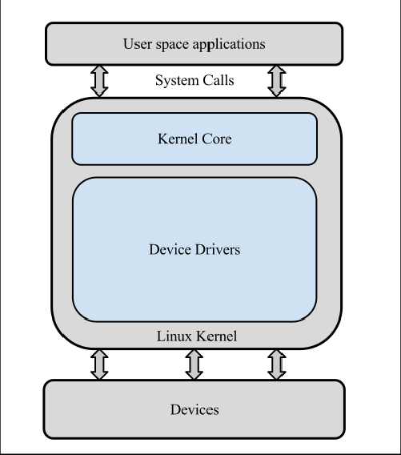

#### Características principales

- **Abstracción del Hardware**: proporcionan una capa de abstracción que oculta los detalles específicos del hardware y ofrecen una interfaz estándar para interactuar con el dispositivo.
- **Gestión de Dispositivos**: manejan la inicialización, configuración y control del hardware.
- **Interacción con el Kernel**: operan en el espacio del kernel, permitiendo un acceso rápido y eficiente al hardware.
- **Manipulación de Operaciones**: implementan operaciones esenciales como lectura, escritura, apertura y cierre del dispositivo.

#### Tipos

- **Drivers de Dispositivos de Bloques**: gestionan dispositivos que manejan datos en bloques, como discos duros y unidades de almacenamiento.
- **Drivers de Dispositivos de Caracteres**: gestionan dispositivos que manejan datos en forma de flujo continuo de caracteres, como puertos serie y terminales.
- **Drivers de Dispositivos de Red**: gestionan interfaces de red, permitiendo la comunicación de datos entre dispositivos a través de redes.

#### Componentes

1. **Registro del Dispositivo**: el driver debe registrarse con el kernel para ser reconocido como un controlador válido.
2. **Inicialización y Limpieza**: funciones para la inicialización y limpieza del driver (`module_init` y `module_exit`).
3. **Estructura de Operaciones del Archivo**: define las operaciones que el driver soporta, como `open`, `read`, `write`, y `close`.
4. **Manejo de Interrupciones**: (opcional) si el dispositivo genera interrupciones, el driver debe manejarlas adecuadamente.
5. **Interfaz de Usuario**: puede proporcionar interfaces en `/dev`, `/sys`, o `/proc` para la interacción con el usuario.

### Character Device Driver (CDD)

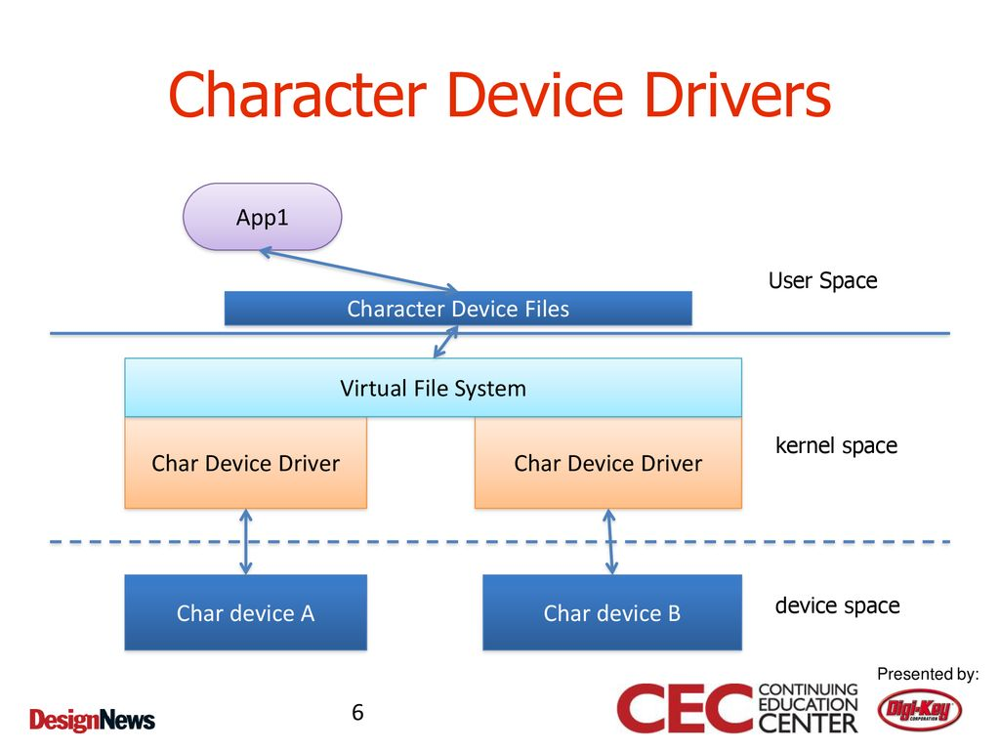

Un **driver de dispositivo de caracteres** en Linux es un tipo de driver que gestiona dispositivos que manejan datos en forma de flujo continuo de caracteres. Este tipo de driver es adecuado para dispositivos como puertos serie, teclados y ratones.

#### Características principales

- **Flujo Continuo de Datos**: maneja datos como un flujo continuo de bytes en lugar de bloques discretos.
- **Interfaz de Dispositivo**: proporciona una interfaz en el espacio de usuario a través de archivos de dispositivo en `/dev`.
- **Operaciones Básicas**: implementa operaciones esenciales como apertura, cierre, lectura y escritura del dispositivo.
- **Registro en el Kernel**: se registra con el kernel para ser reconocido como un controlador válido.

#### Componentes comunes de un CDD

1. **Registro del Dispositivo**: el driver debe registrarse con el kernel, obteniendo un número mayor y menor.
2. **Inicialización y Limpieza**: funciones para la inicialización y limpieza del driver (`module_init` y `module_exit`).
3. **Estructura de Operaciones del Archivo**: define las operaciones que el driver soporta, como `open`, `read`, `write`, y `release`.
4. **Manejo de Datos**: implementa la lógica para manejar la lectura y escritura de datos desde y hacia el dispositivo.
5. **Interacción con el Espacio de Usuario**: proporciona una interfaz para que las aplicaciones de usuario puedan interactuar con el dispositivo a través de llamadas al sistema.

## Desarrollo

### Driver 1

Se parte del siguente codigo fuente:

```c
#include <linux/module.h>
#include <linux/version.h>
#include <linux/kernel.h>

static int __init drv1_init(void) /* Constructor */
{
    printk(KERN_INFO "SdeC: drv1 Registrado exitosamente..!!\n");

    return 0;
}

static void __exit drv1_exit(void) /* Destructor */
{
    printk(KERN_INFO "SdeC: drv1 dice Adios mundo cruel..!!\n");
}

module_init(drv1_init);
module_exit(drv1_exit);

MODULE_LICENSE("GPL");
MODULE_AUTHOR("Anil Kumar Pugalia <email@sarika-pugs.com>");
MODULE_DESCRIPTION("Nuestro primer driver de SdeC");
```

Para compilar, se usa el comando `make`. Se ejecuta luego el comando `sudo insmod` para poder insertar el módulo en el kernel de Linux. De esa última ejecución, se obtiene la siguiente información al llamar a `dmesg`, comando que sirve para mostrar mensajes del buffer de anillos del kernel. Este comando es muy útil para la administración del sistema y la resolución de problemas, ya que proporciona información detallada sobre el estado del sistema, los dispositivos de hardware, los controladores y otros eventos del kernel. Algunas de las funciones son:

- Diagnóstico de hardware: `dmesg` puede mostrar mensajes relacionados con la detección y configuración del hardware durante el proceso de arranque del sistema. Esto incluye información sobre discos duros, tarjetas de red, puertos USB, etc.
- Detección de errores: los mensajes de error generados por el kernel se registran en `dmesg`, lo que facilita la identificación de problemas relacionados con el hardware y los controladores.
- Información sobre el arranque del sistema: los administradores pueden revisar los mensajes de `dmesg` para entender el proceso de arranque del sistema y detectar cualquier problema que haya ocurrido durante el mismo.
- Monitoreo del sistema: `dmesg` puede ser utilizado para monitorear cambios en el sistema, como la conexión o desconexión de dispositivos USB.

Se obtiene la siguiente salida de la ejecución de el comando mencionado:

```
[    0.000000] Booting Linux on physical CPU 0x0000000000 [0x610f0000]
[    0.000000] Linux version 6.1.0-21-arm64 (debian-kernel@lists.debian.org) (gcc-12 (Debian 12.2.0-14) 12.2.0, GNU ld (GNU Binutils for Debian) 2.40) #1 SMP Debian 6.1.90-1 (2024-05-03)
[    0.000000] efi: EFI v2.70 by EDK II
[    0.000000] efi: ACPI 2.0=0x16fc90018 SMBIOS=0xfffff000 SMBIOS 3.0=0x16fcb4000 MOKvar=0x16fc40000 MEMRESERVE=0x16e572798 
[    0.000000] secureboot: Secure boot disabled
[    0.000000] ACPI: Early table checksum verification disabled
[    0.000000] ACPI: RSDP 0x000000016FC90018 000024 (v02 APPLE )
[    0.000000] ACPI: XSDT 0x000000016FC9FE98 000044 (v01 APPLE  Apple Vz 00000001      01000013)
[    0.000000] ACPI: FACP 0x000000016FC9FA98 000114 (v06 APPLE  Apple Vz 00000001 AAPL 20180427)
[    0.000000] ACPI: DSDT 0x000000016FC9F698 000394 (v02 APPLE  Apple Vz 00000001 AAPL 20180427)
[    0.000000] ACPI: GTDT 0x000000016FC9FC18 000068 (v03 APPLE  Apple Vz 00000001 AAPL 20180427)
[    0.000000] ACPI: APIC 0x000000016FC9E998 0001AC (v05 APPLE  Apple Vz 00000001 AAPL 20180427)
[    0.000000] ACPI: MCFG 0x000000016FC9FF98 00003C (v01 APPLE  Apple Vz 00000001 AAPL 20180427)
[    0.000000] NUMA: Failed to initialise from firmware
[    0.000000] NUMA: Faking a node at [mem 0x0000000070000000-0x000000016fffffff]
[    0.000000] NUMA: NODE_DATA [mem 0x16f713380-0x16f715fff]
[    0.000000] Zone ranges:
[    0.000000]   DMA      [mem 0x0000000070000000-0x00000000ffffffff]
[    0.000000]   DMA32    empty
[    0.000000]   Normal   [mem 0x0000000100000000-0x000000016fffffff]
[    0.000000] Movable zone start for each node
[    0.000000] Early memory node ranges
[    0.000000]   node   0: [mem 0x0000000070000000-0x00000000ffffdfff]
[    0.000000]   node   0: [mem 0x00000000ffffe000-0x00000000ffffffff]
[    0.000000]   node   0: [mem 0x0000000100000000-0x000000016e64ffff]
[    0.000000]   node   0: [mem 0x000000016e650000-0x000000016e79ffff]
[    0.000000]   node   0: [mem 0x000000016e7a0000-0x000000016fb9ffff]
[    0.000000]   node   0: [mem 0x000000016fba0000-0x000000016fc2ffff]
[    0.000000]   node   0: [mem 0x000000016fc30000-0x000000016fc3ffff]
[    0.000000]   node   0: [mem 0x000000016fc40000-0x000000016fc7ffff]
[    0.000000]   node   0: [mem 0x000000016fc80000-0x000000016fcb2fff]
[    0.000000]   node   0: [mem 0x000000016fcb3000-0x000000016fcb4fff]
[    0.000000]   node   0: [mem 0x000000016fcb5000-0x000000016fffffff]
[    0.000000] Initmem setup node 0 [mem 0x0000000070000000-0x000000016fffffff]
[    0.000000] cma: Reserved 64 MiB at 0x00000000fbe00000
[    0.000000] psci: probing for conduit method from ACPI.
[    0.000000] psci: PSCIv1.1 detected in firmware.
[    0.000000] psci: Using standard PSCI v0.2 function IDs
[    0.000000] psci: Trusted OS migration not required
[    0.000000] psci: SMC Calling Convention v1.0
[    0.000000] percpu: Embedded 31 pages/cpu s86632 r8192 d32152 u126976
[    0.000000] pcpu-alloc: s86632 r8192 d32152 u126976 alloc=31*4096
[    0.000000] pcpu-alloc: [0] 0 [0] 1 [0] 2 [0] 3 
[    0.000000] Detected PIPT I-cache on CPU0
[    0.000000] CPU features: detected: Address authentication (IMP DEF algorithm)
[    0.000000] CPU features: detected: GIC system register CPU interface
[    0.000000] CPU features: detected: Spectre-v4
[    0.000000] alternatives: applying boot alternatives
[    0.000000] Fallback order for Node 0: 0 
[    0.000000] Built 1 zonelists, mobility grouping on.  Total pages: 1032192
[    0.000000] Policy zone: Normal
[    0.000000] Kernel command line: BOOT_IMAGE=/boot/vmlinuz-6.1.0-21-arm64 root=UUID=8886428d-e9f6-4f33-883f-467ee75a767e ro quiet
[    0.000000] Unknown kernel command line parameters "BOOT_IMAGE=/boot/vmlinuz-6.1.0-21-arm64", will be passed to user space.
[    0.000000] Dentry cache hash table entries: 524288 (order: 10, 4194304 bytes, linear)
[    0.000000] Inode-cache hash table entries: 262144 (order: 9, 2097152 bytes, linear)
[    0.000000] mem auto-init: stack:all(zero), heap alloc:on, heap free:off
[    0.000000] software IO TLB: area num 4.
[    0.000000] software IO TLB: mapped [mem 0x00000000f7e00000-0x00000000fbe00000] (64MB)
[    0.000000] Memory: 2359288K/4194304K available (13056K kernel code, 2800K rwdata, 9452K rodata, 6464K init, 626K bss, 227036K reserved, 65536K cma-reserved)
[    0.000000] SLUB: HWalign=64, Order=0-3, MinObjects=0, CPUs=4, Nodes=1
[    0.000000] ftrace: allocating 43954 entries in 172 pages
[    0.000000] ftrace: allocated 172 pages with 4 groups
[    0.000000] trace event string verifier disabled
[    0.000000] rcu: Hierarchical RCU implementation.
[    0.000000] rcu: 	RCU restricting CPUs from NR_CPUS=256 to nr_cpu_ids=4.
[    0.000000] 	Rude variant of Tasks RCU enabled.
[    0.000000] 	Tracing variant of Tasks RCU enabled.
[    0.000000] rcu: RCU calculated value of scheduler-enlistment delay is 25 jiffies.
[    0.000000] rcu: Adjusting geometry for rcu_fanout_leaf=16, nr_cpu_ids=4
[    0.000000] NR_IRQS: 64, nr_irqs: 64, preallocated irqs: 0
[    0.000000] GICv3: 224 SPIs implemented
[    0.000000] GICv3: 0 Extended SPIs implemented
[    0.000000] Root IRQ handler: gic_handle_irq
[    0.000000] GICv3: GICv3 features: 16 PPIs, RSS
[    0.000000] GICv3: CPU0: found redistributor 0 region 0:0x0000000010010000
[    0.000000] GICv2m: range[mem 0x1fff0000-0x1fff0fff], SPI[128:255]
[    0.000000] rcu: srcu_init: Setting srcu_struct sizes based on contention.
[    0.000000] arch_timer: cp15 timer(s) running at 24.00MHz (virt).
[    0.000000] clocksource: arch_sys_counter: mask: 0xffffffffffffff max_cycles: 0x588fe9dc0, max_idle_ns: 440795202592 ns
[    0.000000] sched_clock: 56 bits at 24MHz, resolution 41ns, wraps every 4398046511097ns
[    0.000020] Console: colour dummy device 80x25
[    0.000025] printk: console [tty0] enabled
[    0.000040] ACPI: Core revision 20220331
[    0.000064] Calibrating delay loop (skipped), value calculated using timer frequency.. 48.00 BogoMIPS (lpj=96000)
[    0.000065] pid_max: default: 32768 minimum: 301
[    0.000098] LSM: Security Framework initializing
[    0.000104] landlock: Up and running.
[    0.000105] Yama: disabled by default; enable with sysctl kernel.yama.*
[    0.000125] AppArmor: AppArmor initialized
[    0.000126] TOMOYO Linux initialized
[    0.000129] LSM support for eBPF active
[    0.000168] Mount-cache hash table entries: 8192 (order: 4, 65536 bytes, linear)
[    0.000183] Mountpoint-cache hash table entries: 8192 (order: 4, 65536 bytes, linear)
[    0.000401] ACPI PPTT: No PPTT table found, CPU and cache topology may be inaccurate
[    0.000498] cblist_init_generic: Setting adjustable number of callback queues.
[    0.000498] cblist_init_generic: Setting shift to 2 and lim to 1.
[    0.000510] cblist_init_generic: Setting adjustable number of callback queues.
[    0.000511] cblist_init_generic: Setting shift to 2 and lim to 1.
[    0.000534] rcu: Hierarchical SRCU implementation.
[    0.000534] rcu: 	Max phase no-delay instances is 1000.
[    0.000699] Remapping and enabling EFI services.
[    0.000795] smp: Bringing up secondary CPUs ...
[    0.000973] Detected PIPT I-cache on CPU1
[    0.000986] GICv3: CPU1: found redistributor 1 region 0:0x0000000010030000
[    0.001040] CPU1: Booted secondary processor 0x0000000001 [0x610f0000]
[    0.001267] Detected PIPT I-cache on CPU2
[    0.001281] GICv3: CPU2: found redistributor 2 region 0:0x0000000010050000
[    0.001336] CPU2: Booted secondary processor 0x0000000002 [0x610f0000]
[    0.001535] Detected PIPT I-cache on CPU3
[    0.001550] GICv3: CPU3: found redistributor 3 region 0:0x0000000010070000
[    0.001603] CPU3: Booted secondary processor 0x0000000003 [0x610f0000]
[    0.001649] smp: Brought up 1 node, 4 CPUs
[    0.001651] SMP: Total of 4 processors activated.
[    0.001652] CPU features: detected: ARMv8.4 Translation Table Level
[    0.001652] CPU features: detected: Data cache clean to the PoU not required for I/D coherence
[    0.001653] CPU features: detected: Common not Private translations
[    0.001653] CPU features: detected: CRC32 instructions
[    0.001653] CPU features: detected: Data cache clean to Point of Deep Persistence
[    0.001654] CPU features: detected: Data cache clean to Point of Persistence
[    0.001654] CPU features: detected: E0PD
[    0.001654] CPU features: detected: Generic authentication (IMP DEF algorithm)
[    0.001655] CPU features: detected: RCpc load-acquire (LDAPR)
[    0.001655] CPU features: detected: LSE atomic instructions
[    0.001655] CPU features: detected: Privileged Access Never
[    0.001656] CPU features: detected: RAS Extension Support
[    0.001656] CPU features: detected: Speculation barrier (SB)
[    0.001656] CPU features: detected: TLB range maintenance instructions
[    0.001657] CPU features: detected: Speculative Store Bypassing Safe (SSBS)
[    0.001719] CPU: All CPU(s) started at EL1
[    0.001722] alternatives: applying system-wide alternatives
[    0.008259] node 0 deferred pages initialised in 4ms
[    0.009133] devtmpfs: initialized
[    0.009533] Registered cp15_barrier emulation handler
[    0.009534] setend instruction emulation is not supported on this system
[    0.009563] clocksource: jiffies: mask: 0xffffffff max_cycles: 0xffffffff, max_idle_ns: 7645041785100000 ns
[    0.009576] futex hash table entries: 1024 (order: 4, 65536 bytes, linear)
[    0.009676] pinctrl core: initialized pinctrl subsystem
[    0.009754] SMBIOS 3.3.0 present.
[    0.009756] DMI: Apple Inc. Apple Virtualization Generic Platform, BIOS 2022.100.22.0.0 02/09/2024
[    0.009906] NET: Registered PF_NETLINK/PF_ROUTE protocol family
[    0.010826] DMA: preallocated 512 KiB GFP_KERNEL pool for atomic allocations
[    0.010926] DMA: preallocated 512 KiB GFP_KERNEL|GFP_DMA pool for atomic allocations
[    0.010957] DMA: preallocated 512 KiB GFP_KERNEL|GFP_DMA32 pool for atomic allocations
[    0.010972] audit: initializing netlink subsys (disabled)
[    0.011098] audit: type=2000 audit(0.008:1): state=initialized audit_enabled=0 res=1
[    0.011172] thermal_sys: Registered thermal governor 'fair_share'
[    0.011173] thermal_sys: Registered thermal governor 'bang_bang'
[    0.011173] thermal_sys: Registered thermal governor 'step_wise'
[    0.011174] thermal_sys: Registered thermal governor 'user_space'
[    0.011174] thermal_sys: Registered thermal governor 'power_allocator'
[    0.011178] cpuidle: using governor ladder
[    0.011180] cpuidle: using governor menu
[    0.011199] hw-breakpoint: found 6 breakpoint and 4 watchpoint registers.
[    0.011293] ASID allocator initialised with 256 entries
[    0.011313] acpiphp: ACPI Hot Plug PCI Controller Driver version: 0.5
[    0.011360] Serial: AMBA PL011 UART driver
[    0.011414] KASLR enabled
[    0.012134] HugeTLB: registered 1.00 GiB page size, pre-allocated 0 pages
[    0.012135] HugeTLB: 0 KiB vmemmap can be freed for a 1.00 GiB page
[    0.012135] HugeTLB: registered 32.0 MiB page size, pre-allocated 0 pages
[    0.012136] HugeTLB: 0 KiB vmemmap can be freed for a 32.0 MiB page
[    0.012136] HugeTLB: registered 2.00 MiB page size, pre-allocated 0 pages
[    0.012137] HugeTLB: 0 KiB vmemmap can be freed for a 2.00 MiB page
[    0.012137] HugeTLB: registered 64.0 KiB page size, pre-allocated 0 pages
[    0.012137] HugeTLB: 0 KiB vmemmap can be freed for a 64.0 KiB page
[    0.012716] ACPI: Added _OSI(Module Device)
[    0.012716] ACPI: Added _OSI(Processor Device)
[    0.012717] ACPI: Added _OSI(3.0 _SCP Extensions)
[    0.012717] ACPI: Added _OSI(Processor Aggregator Device)
[    0.012784] ACPI: 1 ACPI AML tables successfully acquired and loaded
[    0.012875] ACPI: Interpreter enabled
[    0.012876] ACPI: Using GIC for interrupt routing
[    0.012879] ACPI: MCFG table detected, 1 entries
[    0.013075] ACPI: PCI Root Bridge [PCI0] (domain 0000 [bus 00-ff])
[    0.013078] acpi PNP0A08:00: _OSC: OS supports [ExtendedConfig ASPM ClockPM Segments MSI HPX-Type3]
[    0.013080] acpi PNP0A08:00: _OSC: OS requested [PCIeHotplug SHPCHotplug PME AER PCIeCapability LTR]
[    0.013081] acpi PNP0A08:00: _OSC: platform willing to grant [PCIeHotplug SHPCHotplug PME AER PCIeCapability LTR]
[    0.013082] acpi PNP0A08:00: _OSC: platform retains control of PCIe features (AE_NOT_FOUND)
[    0.013089] acpi PNP0A08:00: ECAM area [mem 0x40000000-0x4fffffff] reserved by PNP0C02:00
[    0.013093] acpi PNP0A08:00: ECAM at [mem 0x40000000-0x4fffffff] for [bus 00-ff]
[    0.013097] ACPI: Remapped I/O 0x000000006fff0000 to [io  0x0000-0xffff window]
[    0.013113] PCI host bridge to bus 0000:00
[    0.013114] pci_bus 0000:00: root bus resource [mem 0x50000000-0x6ffdffff window]
[    0.013115] pci_bus 0000:00: root bus resource [mem 0x180000000-0x1bfffffff window]
[    0.013115] pci_bus 0000:00: root bus resource [io  0x0000-0xffff window]
[    0.013116] pci_bus 0000:00: root bus resource [bus 00-ff]
[    0.013133] pci 0000:00:00.0: [106b:1a05] type 00 class 0x060000
[    0.013265] pci 0000:00:01.0: [1af4:1041] type 00 class 0x020000
[    0.013299] pci 0000:00:01.0: reg 0x10: [mem 0x180020000-0x180023fff 64bit]
[    0.013313] pci 0000:00:01.0: reg 0x18: [mem 0x5000a000-0x5000a03f]
[    0.013490] pci 0000:00:05.0: [1af4:1042] type 00 class 0x018000
[    0.013518] pci 0000:00:05.0: reg 0x10: [mem 0x18001c000-0x18001ffff 64bit]
[    0.013531] pci 0000:00:05.0: reg 0x18: [mem 0x50009000-0x5000903f]
[    0.013701] pci 0000:00:06.0: [1af4:105a] type 00 class 0x018000
[    0.013729] pci 0000:00:06.0: reg 0x10: [mem 0x180018000-0x18001bfff 64bit]
[    0.013742] pci 0000:00:06.0: reg 0x18: [mem 0x50008000-0x5000803f]
[    0.013914] pci 0000:00:07.0: [1af4:1050] type 00 class 0x038000
[    0.013943] pci 0000:00:07.0: reg 0x10: [mem 0x180014000-0x180017fff 64bit]
[    0.013956] pci 0000:00:07.0: reg 0x18: [mem 0x50007000-0x5000703f]
[    0.014131] pci 0000:00:08.0: [1af4:1059] type 00 class 0x040100
[    0.014158] pci 0000:00:08.0: reg 0x10: [mem 0x180010000-0x180013fff 64bit]
[    0.014181] pci 0000:00:08.0: reg 0x18: [mem 0x50004000-0x5000407f]
[    0.014392] pci 0000:00:09.0: [1af4:1059] type 00 class 0x040100
[    0.014418] pci 0000:00:09.0: reg 0x10: [mem 0x18000c000-0x18000ffff 64bit]
[    0.014431] pci 0000:00:09.0: reg 0x18: [mem 0x50003000-0x5000307f]
[    0.014614] pci 0000:00:0a.0: [1af4:1044] type 00 class 0x100000
[    0.014641] pci 0000:00:0a.0: reg 0x10: [mem 0x180008000-0x18000bfff 64bit]
[    0.014653] pci 0000:00:0a.0: reg 0x18: [mem 0x50006000-0x5000603f]
[    0.014830] pci 0000:00:0b.0: [1af4:1045] type 00 class 0x058000
[    0.014858] pci 0000:00:0b.0: reg 0x10: [mem 0x180004000-0x180007fff 64bit]
[    0.014871] pci 0000:00:0b.0: reg 0x18: [mem 0x50005000-0x5000503f]
[    0.015035] pci 0000:00:0c.0: [1af4:1043] type 00 class 0x078000
[    0.015062] pci 0000:00:0c.0: reg 0x10: [mem 0x180000000-0x180003fff 64bit]
[    0.015074] pci 0000:00:0c.0: reg 0x18: [mem 0x50002000-0x5000207f]
[    0.015228] pci 0000:00:0d.0: [106b:1a06] type 00 class 0x0c0330
[    0.015244] pci 0000:00:0d.0: reg 0x10: [mem 0x50001000-0x50001fff]
[    0.015251] pci 0000:00:0d.0: reg 0x14: [mem 0x50000000-0x500003ff]
[    0.015380] pci 0000:00:01.0: BAR 0: assigned [mem 0x180000000-0x180003fff 64bit]
[    0.015394] pci 0000:00:05.0: BAR 0: assigned [mem 0x180004000-0x180007fff 64bit]
[    0.015407] pci 0000:00:06.0: BAR 0: assigned [mem 0x180008000-0x18000bfff 64bit]
[    0.015420] pci 0000:00:07.0: BAR 0: assigned [mem 0x18000c000-0x18000ffff 64bit]
[    0.015432] pci 0000:00:08.0: BAR 0: assigned [mem 0x180010000-0x180013fff 64bit]
[    0.015445] pci 0000:00:09.0: BAR 0: assigned [mem 0x180014000-0x180017fff 64bit]
[    0.015458] pci 0000:00:0a.0: BAR 0: assigned [mem 0x180018000-0x18001bfff 64bit]
[    0.015471] pci 0000:00:0b.0: BAR 0: assigned [mem 0x18001c000-0x18001ffff 64bit]
[    0.015483] pci 0000:00:0c.0: BAR 0: assigned [mem 0x180020000-0x180023fff 64bit]
[    0.015496] pci 0000:00:0d.0: BAR 0: assigned [mem 0x50000000-0x50000fff]
[    0.015500] pci 0000:00:0d.0: BAR 1: assigned [mem 0x50001000-0x500013ff]
[    0.015503] pci 0000:00:08.0: BAR 2: assigned [mem 0x50001400-0x5000147f]
[    0.015508] pci 0000:00:09.0: BAR 2: assigned [mem 0x50001480-0x500014ff]
[    0.015512] pci 0000:00:0c.0: BAR 2: assigned [mem 0x50001500-0x5000157f]
[    0.015517] pci 0000:00:01.0: BAR 2: assigned [mem 0x50001580-0x500015bf]
[    0.015521] pci 0000:00:05.0: BAR 2: assigned [mem 0x500015c0-0x500015ff]
[    0.015526] pci 0000:00:06.0: BAR 2: assigned [mem 0x50001600-0x5000163f]
[    0.015530] pci 0000:00:07.0: BAR 2: assigned [mem 0x50001640-0x5000167f]
[    0.015535] pci 0000:00:0a.0: BAR 2: assigned [mem 0x50001680-0x500016bf]
[    0.015539] pci 0000:00:0b.0: BAR 2: assigned [mem 0x500016c0-0x500016ff]
[    0.015545] pci_bus 0000:00: resource 4 [mem 0x50000000-0x6ffdffff window]
[    0.015545] pci_bus 0000:00: resource 5 [mem 0x180000000-0x1bfffffff window]
[    0.015546] pci_bus 0000:00: resource 6 [io  0x0000-0xffff window]
[    0.015634] iommu: Default domain type: Translated 
[    0.015635] iommu: DMA domain TLB invalidation policy: strict mode 
[    0.015662] pps_core: LinuxPPS API ver. 1 registered
[    0.015663] pps_core: Software ver. 5.3.6 - Copyright 2005-2007 Rodolfo Giometti <giometti@linux.it>
[    0.015664] PTP clock support registered
[    0.015671] EDAC MC: Ver: 3.0.0
[    0.015832] Registered efivars operations
[    0.016093] NetLabel: Initializing
[    0.016093] NetLabel:  domain hash size = 128
[    0.016093] NetLabel:  protocols = UNLABELED CIPSOv4 CALIPSO
[    0.016098] NetLabel:  unlabeled traffic allowed by default
[    0.016161] vgaarb: loaded
[    0.016302] clocksource: Switched to clocksource arch_sys_counter
[    0.016401] VFS: Disk quotas dquot_6.6.0
[    0.016409] VFS: Dquot-cache hash table entries: 512 (order 0, 4096 bytes)
[    0.016518] AppArmor: AppArmor Filesystem Enabled
[    0.016524] pnp: PnP ACPI init
[    0.016543] system 00:00: [mem 0x40000000-0x4fffffff] could not be reserved
[    0.016547] pnp: PnP ACPI: found 1 devices
[    0.019550] NET: Registered PF_INET protocol family
[    0.019711] IP idents hash table entries: 65536 (order: 7, 524288 bytes, linear)
[    0.020265] tcp_listen_portaddr_hash hash table entries: 2048 (order: 3, 32768 bytes, linear)
[    0.020350] Table-perturb hash table entries: 65536 (order: 6, 262144 bytes, linear)
[    0.020419] TCP established hash table entries: 32768 (order: 6, 262144 bytes, linear)
[    0.020653] TCP bind hash table entries: 32768 (order: 8, 1048576 bytes, linear)
[    0.020688] TCP: Hash tables configured (established 32768 bind 32768)
[    0.020773] MPTCP token hash table entries: 4096 (order: 4, 98304 bytes, linear)
[    0.020797] UDP hash table entries: 2048 (order: 4, 65536 bytes, linear)
[    0.020818] UDP-Lite hash table entries: 2048 (order: 4, 65536 bytes, linear)
[    0.020855] NET: Registered PF_UNIX/PF_LOCAL protocol family
[    0.020868] NET: Registered PF_XDP protocol family
[    0.020900] pci 0000:00:0d.0: enabling device (0010 -> 0012)
[    0.020938] PCI: CLS 0 bytes, default 64
[    0.021061] Trying to unpack rootfs image as initramfs...
[    0.021087] kvm [1]: HYP mode not available
[    0.021950] Initialise system trusted keyrings
[    0.021961] Key type blacklist registered
[    0.022032] workingset: timestamp_bits=42 max_order=20 bucket_order=0
[    0.022648] zbud: loaded
[    0.022825] integrity: Platform Keyring initialized
[    0.022827] integrity: Machine keyring initialized
[    0.022827] Key type asymmetric registered
[    0.022828] Asymmetric key parser 'x509' registered
[    0.221503] Freeing initrd memory: 45352K
[    0.225584] alg: self-tests for CTR-KDF (hmac(sha256)) passed
[    0.225613] Block layer SCSI generic (bsg) driver version 0.4 loaded (major 247)
[    0.225668] io scheduler mq-deadline registered
[    0.226520] pl061_gpio ARMH0061:00: PL061 GPIO chip registered
[    0.226556] shpchp: Standard Hot Plug PCI Controller Driver version: 0.4
[    0.226601] input: Power Button as /devices/LNXSYSTM:00/PNP0C0C:00/input/input0
[    0.226609] ACPI: button: Power Button [PWRB]
[    0.226945] Serial: 8250/16550 driver, 4 ports, IRQ sharing enabled
[    0.227202] Serial: AMBA driver
[    0.227204] SuperH (H)SCI(F) driver initialized
[    0.227217] msm_serial: driver initialized
[    0.227391] mousedev: PS/2 mouse device common for all mice
[    0.227560] rtc-efi rtc-efi.0: registered as rtc0
[    0.227592] rtc-efi rtc-efi.0: setting system clock to 2024-06-03T03:38:10 UTC (1717385890)
[    0.227744] ledtrig-cpu: registered to indicate activity on CPUs
[    0.233982] NET: Registered PF_INET6 protocol family
[    0.236318] Segment Routing with IPv6
[    0.236324] In-situ OAM (IOAM) with IPv6
[    0.236333] mip6: Mobile IPv6
[    0.236335] NET: Registered PF_PACKET protocol family
[    0.236396] mpls_gso: MPLS GSO support
[    0.236510] registered taskstats version 1
[    0.236514] Loading compiled-in X.509 certificates
[    0.245776] Loaded X.509 cert 'Debian Secure Boot CA: 6ccece7e4c6c0d1f6149f3dd27dfcc5cbb419ea1'
[    0.245785] Loaded X.509 cert 'Debian Secure Boot Signer 2022 - linux: 14011249c2675ea8e5148542202005810584b25f'
[    0.245946] zswap: loaded using pool lzo/zbud
[    0.246079] Key type .fscrypt registered
[    0.246079] Key type fscrypt-provisioning registered
[    0.247943] Key type encrypted registered
[    0.247946] AppArmor: AppArmor sha1 policy hashing enabled
[    0.248069] ima: secureboot mode disabled
[    0.248072] ima: No TPM chip found, activating TPM-bypass!
[    0.248073] ima: Allocated hash algorithm: sha256
[    0.248078] ima: No architecture policies found
[    0.248091] evm: Initialising EVM extended attributes:
[    0.248092] evm: security.selinux
[    0.248092] evm: security.SMACK64 (disabled)
[    0.248092] evm: security.SMACK64EXEC (disabled)
[    0.248093] evm: security.SMACK64TRANSMUTE (disabled)
[    0.248093] evm: security.SMACK64MMAP (disabled)
[    0.248093] evm: security.apparmor
[    0.248094] evm: security.ima
[    0.248094] evm: security.capability
[    0.248094] evm: HMAC attrs: 0x1
[    0.298623] clk: Disabling unused clocks
[    0.299195] Freeing unused kernel memory: 6464K
[    0.303019] Checked W+X mappings: passed, no W+X pages found
[    0.303023] Run /init as init process
[    0.303024]   with arguments:
[    0.303024]     /init
[    0.303025]   with environment:
[    0.303025]     HOME=/
[    0.303025]     TERM=linux
[    0.303026]     BOOT_IMAGE=/boot/vmlinuz-6.1.0-21-arm64
[    0.375563] ACPI: bus type USB registered
[    0.375576] usbcore: registered new interface driver usbfs
[    0.375580] usbcore: registered new interface driver hub
[    0.375585] usbcore: registered new device driver usb
[    0.381710] xhci_hcd 0000:00:0d.0: xHCI Host Controller
[    0.381713] xhci_hcd 0000:00:0d.0: new USB bus registered, assigned bus number 1
[    0.381816] xhci_hcd 0000:00:0d.0: hcc params 0x02600001 hci version 0x110 quirks 0x0000000000000010
[    0.382093] xhci_hcd 0000:00:0d.0: xHCI Host Controller
[    0.382094] xhci_hcd 0000:00:0d.0: new USB bus registered, assigned bus number 2
[    0.382097] xhci_hcd 0000:00:0d.0: Host supports USB 3.1 Enhanced SuperSpeed
[    0.382119] usb usb1: New USB device found, idVendor=1d6b, idProduct=0002, bcdDevice= 6.01
[    0.382120] usb usb1: New USB device strings: Mfr=3, Product=2, SerialNumber=1
[    0.382121] usb usb1: Product: xHCI Host Controller
[    0.382122] usb usb1: Manufacturer: Linux 6.1.0-21-arm64 xhci-hcd
[    0.382122] usb usb1: SerialNumber: 0000:00:0d.0
[    0.382200] hub 1-0:1.0: USB hub found
[    0.382215] hub 1-0:1.0: 8 ports detected
[    0.382346] usb usb2: We don't know the algorithms for LPM for this host, disabling LPM.
[    0.382355] usb usb2: New USB device found, idVendor=1d6b, idProduct=0003, bcdDevice= 6.01
[    0.382356] usb usb2: New USB device strings: Mfr=3, Product=2, SerialNumber=1
[    0.382356] usb usb2: Product: xHCI Host Controller
[    0.382357] usb usb2: Manufacturer: Linux 6.1.0-21-arm64 xhci-hcd
[    0.382358] usb usb2: SerialNumber: 0000:00:0d.0
[    0.382423] hub 2-0:1.0: USB hub found
[    0.382437] hub 2-0:1.0: 8 ports detected
[    0.477456] virtio_blk virtio1: 1/0/0 default/read/poll queues
[    0.477925] virtio_blk virtio1: [vda] 134217728 512-byte logical blocks (68.7 GB/64.0 GiB)
[    0.479116]  vda: vda1 vda2 vda3
[    0.492623] ACPI: bus type drm_connector registered
[    0.502342] [drm] pci: virtio-gpu-pci detected at 0000:00:07.0
[    0.502378] [drm] features: -virgl -edid -resource_blob -host_visible
[    0.502379] [drm] features: -context_init
[    0.502747] [drm] number of scanouts: 1
[    0.502750] [drm] number of cap sets: 0
[    0.502963] [drm] Initialized virtio_gpu 0.1.0 0 for 0000:00:07.0 on minor 0
[    0.505588] virtio-pci 0000:00:07.0: [drm] drm_plane_enable_fb_damage_clips() not called
[    0.505593] Console: switching to colour frame buffer device 167x47
[    0.509008] virtio-pci 0000:00:07.0: [drm] fb0: virtio_gpudrmfb frame buffer device
[    0.512910] virtio_net virtio0 enp0s1: renamed from eth0
[    0.588756] PM: Image not found (code -22)
[    0.641071] usb 1-1: new full-speed USB device number 2 using xhci_hcd
[    0.650776] EXT4-fs (vda2): mounted filesystem with ordered data mode. Quota mode: none.
[    0.681736] Not activating Mandatory Access Control as /sbin/tomoyo-init does not exist.
[    0.732268] systemd[1]: Inserted module 'autofs4'
[    0.738618] random: crng init done
[    0.755350] systemd[1]: systemd 252.22-1~deb12u1 running in system mode (+PAM +AUDIT +SELINUX +APPARMOR +IMA +SMACK +SECCOMP +GCRYPT -GNUTLS +OPENSSL +ACL +BLKID +CURL +ELFUTILS +FIDO2 +IDN2 -IDN +IPTC +KMOD +LIBCRYPTSETUP +LIBFDISK +PCRE2 -PWQUALITY +P11KIT +QRENCODE +TPM2 +BZIP2 +LZ4 +XZ +ZLIB +ZSTD -BPF_FRAMEWORK -XKBCOMMON +UTMP +SYSVINIT default-hierarchy=unified)
[    0.755352] systemd[1]: Detected virtualization apple.
[    0.755354] systemd[1]: Detected architecture arm64.
[    0.756655] systemd[1]: Hostname set to <debian>.
[    0.790371] usb 1-1: New USB device found, idVendor=05ac, idProduct=8105, bcdDevice= 0.00
[    0.790374] usb 1-1: New USB device strings: Mfr=2, Product=3, SerialNumber=0
[    0.790375] usb 1-1: Product: Virtual USB Keyboard
[    0.790376] usb 1-1: Manufacturer: Apple Inc.
[    0.857820] systemd[1]: Queued start job for default target graphical.target.
[    0.881528] systemd[1]: Created slice system-getty.slice - Slice /system/getty.
[    0.881701] systemd[1]: Created slice system-modprobe.slice - Slice /system/modprobe.
[    0.881837] systemd[1]: Created slice system-systemd\x2dfsck.slice - Slice /system/systemd-fsck.
[    0.881925] systemd[1]: Created slice user.slice - User and Session Slice.
[    0.881961] systemd[1]: Started systemd-ask-password-wall.path - Forward Password Requests to Wall Directory Watch.
[    0.882055] systemd[1]: Set up automount proc-sys-fs-binfmt_misc.automount - Arbitrary Executable File Formats File System Automount Point.
[    0.882067] systemd[1]: Expecting device dev-disk-by\x2duuid-C685\x2d1D26.device - /dev/disk/by-uuid/C685-1D26...
[    0.882073] systemd[1]: Expecting device dev-disk-by\x2duuid-cba290a0\x2da937\x2d4ae6\x2d837b\x2d33b49c86020e.device - /dev/disk/by-uuid/cba290a0-a937-4ae6-837b-33b49c86020e...
[    0.882089] systemd[1]: Reached target integritysetup.target - Local Integrity Protected Volumes.
[    0.882107] systemd[1]: Reached target nss-user-lookup.target - User and Group Name Lookups.
[    0.882116] systemd[1]: Reached target remote-fs.target - Remote File Systems.
[    0.882124] systemd[1]: Reached target slices.target - Slice Units.
[    0.882144] systemd[1]: Reached target veritysetup.target - Local Verity Protected Volumes.
[    0.882206] systemd[1]: Listening on systemd-fsckd.socket - fsck to fsckd communication Socket.
[    0.882233] systemd[1]: Listening on systemd-initctl.socket - initctl Compatibility Named Pipe.
[    0.882424] systemd[1]: Listening on systemd-journald-audit.socket - Journal Audit Socket.
[    0.882498] systemd[1]: Listening on systemd-journald-dev-log.socket - Journal Socket (/dev/log).
[    0.882558] systemd[1]: Listening on systemd-journald.socket - Journal Socket.
[    0.882857] systemd[1]: Listening on systemd-udevd-control.socket - udev Control Socket.
[    0.882906] systemd[1]: Listening on systemd-udevd-kernel.socket - udev Kernel Socket.
[    0.883280] systemd[1]: Mounting dev-hugepages.mount - Huge Pages File System...
[    0.883630] systemd[1]: Mounting dev-mqueue.mount - POSIX Message Queue File System...
[    0.884015] systemd[1]: Mounting sys-kernel-debug.mount - Kernel Debug File System...
[    0.884409] systemd[1]: Mounting sys-kernel-tracing.mount - Kernel Trace File System...
[    0.885907] systemd[1]: Starting keyboard-setup.service - Set the console keyboard layout...
[    0.886360] systemd[1]: Starting kmod-static-nodes.service - Create List of Static Device Nodes...
[    0.886821] systemd[1]: Starting modprobe@configfs.service - Load Kernel Module configfs...
[    0.887402] systemd[1]: Starting modprobe@dm_mod.service - Load Kernel Module dm_mod...
[    0.887977] systemd[1]: Starting modprobe@drm.service - Load Kernel Module drm...
[    0.888434] systemd[1]: Starting modprobe@efi_pstore.service - Load Kernel Module efi_pstore...
[    0.888963] systemd[1]: Starting modprobe@fuse.service - Load Kernel Module fuse...
[    0.889437] systemd[1]: Starting modprobe@loop.service - Load Kernel Module loop...
[    0.889521] systemd[1]: systemd-fsck-root.service - File System Check on Root Device was skipped because of an unmet condition check (ConditionPathExists=!/run/initramfs/fsck-root).
[    0.890372] systemd[1]: Starting systemd-journald.service - Journal Service...
[    0.891818] systemd[1]: Starting systemd-modules-load.service - Load Kernel Modules...
[    0.892232] systemd[1]: Starting systemd-remount-fs.service - Remount Root and Kernel File Systems...
[    0.892770] systemd[1]: Starting systemd-udev-trigger.service - Coldplug All udev Devices...
[    0.892842] pstore: Using crash dump compression: deflate
[    0.893535] systemd[1]: Mounted dev-hugepages.mount - Huge Pages File System.
[    0.893729] systemd[1]: Mounted dev-mqueue.mount - POSIX Message Queue File System.
[    0.893830] systemd[1]: Mounted sys-kernel-debug.mount - Kernel Debug File System.
[    0.893929] systemd[1]: Mounted sys-kernel-tracing.mount - Kernel Trace File System.
[    0.897849] fuse: init (API version 7.37)
[    0.897930] device-mapper: core: CONFIG_IMA_DISABLE_HTABLE is disabled. Duplicate IMA measurements will not be recorded in the IMA log.
[    0.897944] device-mapper: uevent: version 1.0.3
[    0.898087] pstore: Registered efi as persistent store backend
[    0.898123] systemd[1]: Finished kmod-static-nodes.service - Create List of Static Device Nodes.
[    0.898380] systemd[1]: modprobe@configfs.service: Deactivated successfully.
[    0.898437] systemd[1]: Finished modprobe@configfs.service - Load Kernel Module configfs.
[    0.898539] systemd[1]: modprobe@drm.service: Deactivated successfully.
[    0.898593] systemd[1]: Finished modprobe@drm.service - Load Kernel Module drm.
[    0.898689] systemd[1]: modprobe@efi_pstore.service: Deactivated successfully.
[    0.898739] systemd[1]: Finished modprobe@efi_pstore.service - Load Kernel Module efi_pstore.
[    0.898836] systemd[1]: Finished systemd-modules-load.service - Load Kernel Modules.
[    0.899389] device-mapper: ioctl: 4.47.0-ioctl (2022-07-28) initialised: dm-devel@redhat.com
[    0.899409] systemd[1]: Mounting sys-kernel-config.mount - Kernel Configuration File System...
[    0.899916] systemd[1]: Starting systemd-sysctl.service - Apply Kernel Variables...
[    0.900096] systemd[1]: modprobe@dm_mod.service: Deactivated successfully.
[    0.900244] systemd[1]: Finished modprobe@dm_mod.service - Load Kernel Module dm_mod.
[    0.900410] systemd[1]: modprobe@fuse.service: Deactivated successfully.
[    0.900497] systemd[1]: Finished modprobe@fuse.service - Load Kernel Module fuse.
[    0.900944] systemd[1]: Mounting sys-fs-fuse-connections.mount - FUSE Control File System...
[    0.903076] systemd[1]: Mounted sys-kernel-config.mount - Kernel Configuration File System.
[    0.903203] systemd[1]: Mounted sys-fs-fuse-connections.mount - FUSE Control File System.
[    0.903362] loop: module loaded
[    0.903642] systemd[1]: modprobe@loop.service: Deactivated successfully.
[    0.903712] systemd[1]: Finished modprobe@loop.service - Load Kernel Module loop.
[    0.903798] systemd[1]: systemd-repart.service - Repartition Root Disk was skipped because no trigger condition checks were met.
[    0.906946] EXT4-fs (vda2): re-mounted. Quota mode: none.
[    0.907465] systemd[1]: Finished systemd-remount-fs.service - Remount Root and Kernel File Systems.
[    0.907602] systemd[1]: systemd-firstboot.service - First Boot Wizard was skipped because of an unmet condition check (ConditionFirstBoot=yes).
[    0.907630] systemd[1]: systemd-pstore.service - Platform Persistent Storage Archival was skipped because of an unmet condition check (ConditionDirectoryNotEmpty=/sys/fs/pstore).
[    0.908112] systemd[1]: Starting systemd-random-seed.service - Load/Save Random Seed...
[    0.908569] systemd[1]: Starting systemd-sysusers.service - Create System Users...
[    0.918551] systemd[1]: Started systemd-journald.service - Journal Service.
[    0.924323] usb 1-2: new full-speed USB device number 3 using xhci_hcd
[    0.926640] systemd-journald[238]: Received client request to flush runtime journal.
[    1.049803] Adding 999420k swap on /dev/vda3.  Priority:-2 extents:1 across:999420k FS
[    1.072503] usb 1-2: New USB device found, idVendor=05ac, idProduct=8106, bcdDevice= 0.00
[    1.072506] usb 1-2: New USB device strings: Mfr=2, Product=3, SerialNumber=0
[    1.072507] usb 1-2: Product: Virtual USB Digitizer
[    1.072508] usb 1-2: Manufacturer: Apple Inc.
[    1.089859] usbcore: registered new device driver apple-mfi-fastcharge
[    1.095075] hid: raw HID events driver (C) Jiri Kosina
[    1.097174] usbcore: registered new interface driver usbhid
[    1.097175] usbhid: USB HID core driver
[    1.099176] input: Apple Inc. Virtual USB Keyboard as /devices/pci0000:00/0000:00:0d.0/usb1/1-1/1-1:1.0/0003:05AC:8105.0001/input/input1
[    1.157360] hid-generic 0003:05AC:8105.0001: input,hidraw0: USB HID v1.10 Keyboard [Apple Inc. Virtual USB Keyboard] on usb-0000:00:0d.0-1/input0
[    1.157478] input: Apple Inc. Virtual USB Digitizer as /devices/pci0000:00/0000:00:0d.0/usb1/1-2/1-2:1.0/0003:05AC:8106.0002/input/input2
[    1.157673] hid-generic 0003:05AC:8106.0002: input,hidraw1: USB HID v1.10 Mouse [Apple Inc. Virtual USB Digitizer] on usb-0000:00:0d.0-2/input0
[    1.916952] virtio-fs: tag <share> not found
[    1.948058] audit: type=1400 audit(1717385892.216:2): apparmor="STATUS" operation="profile_load" profile="unconfined" name="lsb_release" pid=433 comm="apparmor_parser"
[    1.949297] audit: type=1400 audit(1717385892.220:3): apparmor="STATUS" operation="profile_load" profile="unconfined" name="nvidia_modprobe" pid=434 comm="apparmor_parser"
[    1.949300] audit: type=1400 audit(1717385892.220:4): apparmor="STATUS" operation="profile_load" profile="unconfined" name="nvidia_modprobe//kmod" pid=434 comm="apparmor_parser"
[    1.952740] audit: type=1400 audit(1717385892.224:5): apparmor="STATUS" operation="profile_load" profile="unconfined" name="/usr/bin/man" pid=440 comm="apparmor_parser"
[    1.952743] audit: type=1400 audit(1717385892.224:6): apparmor="STATUS" operation="profile_load" profile="unconfined" name="man_filter" pid=440 comm="apparmor_parser"
[    1.952744] audit: type=1400 audit(1717385892.224:7): apparmor="STATUS" operation="profile_load" profile="unconfined" name="man_groff" pid=440 comm="apparmor_parser"
[    1.953490] audit: type=1400 audit(1717385892.224:8): apparmor="STATUS" operation="profile_load" profile="unconfined" name="libreoffice-oosplash" pid=441 comm="apparmor_parser"
[    1.955072] audit: type=1400 audit(1717385892.224:9): apparmor="STATUS" operation="profile_load" profile="unconfined" name="libreoffice-senddoc" pid=442 comm="apparmor_parser"
[    1.955354] audit: type=1400 audit(1717385892.224:10): apparmor="STATUS" operation="profile_load" profile="unconfined" name="/usr/lib/NetworkManager/nm-dhcp-client.action" pid=435 comm="apparmor_parser"
[    2.136213] NET: Registered PF_QIPCRTR protocol family
[   13.127179] rfkill: input handler disabled
[   13.525144] input: spice vdagent tablet as /devices/virtual/input/input3
[   17.601753] rfkill: input handler enabled
[   18.289777] rfkill: input handler disabled
[   18.937478] input: spice vdagent tablet as /devices/virtual/input/input4
[  287.542890] drv1: loading out-of-tree module taints kernel.
[  287.542967] drv1: module verification failed: signature and/or required key missing - tainting kernel
[  287.543193] SdeC: drv1 Registrado exitosamente..!!
```

Ahora, al quitarlo del kernel, con el comando `rmmod`, se obtiene la siguiente salida de `dmesg`.

```
[    0.000000] Booting Linux on physical CPU 0x0000000000 [0x610f0000]
[    0.000000] Linux version 6.1.0-21-arm64 (debian-kernel@lists.debian.org) (gcc-12 (Debian 12.2.0-14) 12.2.0, GNU ld (GNU Binutils for Debian) 2.40) #1 SMP Debian 6.1.90-1 (2024-05-03)
[    0.000000] efi: EFI v2.70 by EDK II
[    0.000000] efi: ACPI 2.0=0x16fc90018 SMBIOS=0xfffff000 SMBIOS 3.0=0x16fcb4000 MOKvar=0x16fc40000 MEMRESERVE=0x16e572798 
[    0.000000] secureboot: Secure boot disabled
[    0.000000] ACPI: Early table checksum verification disabled
[    0.000000] ACPI: RSDP 0x000000016FC90018 000024 (v02 APPLE )
[    0.000000] ACPI: XSDT 0x000000016FC9FE98 000044 (v01 APPLE  Apple Vz 00000001      01000013)
[    0.000000] ACPI: FACP 0x000000016FC9FA98 000114 (v06 APPLE  Apple Vz 00000001 AAPL 20180427)
[    0.000000] ACPI: DSDT 0x000000016FC9F698 000394 (v02 APPLE  Apple Vz 00000001 AAPL 20180427)
[    0.000000] ACPI: GTDT 0x000000016FC9FC18 000068 (v03 APPLE  Apple Vz 00000001 AAPL 20180427)
[    0.000000] ACPI: APIC 0x000000016FC9E998 0001AC (v05 APPLE  Apple Vz 00000001 AAPL 20180427)
[    0.000000] ACPI: MCFG 0x000000016FC9FF98 00003C (v01 APPLE  Apple Vz 00000001 AAPL 20180427)
[    0.000000] NUMA: Failed to initialise from firmware
[    0.000000] NUMA: Faking a node at [mem 0x0000000070000000-0x000000016fffffff]
[    0.000000] NUMA: NODE_DATA [mem 0x16f713380-0x16f715fff]
[    0.000000] Zone ranges:
[    0.000000]   DMA      [mem 0x0000000070000000-0x00000000ffffffff]
[    0.000000]   DMA32    empty
[    0.000000]   Normal   [mem 0x0000000100000000-0x000000016fffffff]
[    0.000000] Movable zone start for each node
[    0.000000] Early memory node ranges
[    0.000000]   node   0: [mem 0x0000000070000000-0x00000000ffffdfff]
[    0.000000]   node   0: [mem 0x00000000ffffe000-0x00000000ffffffff]
[    0.000000]   node   0: [mem 0x0000000100000000-0x000000016e64ffff]
[    0.000000]   node   0: [mem 0x000000016e650000-0x000000016e79ffff]
[    0.000000]   node   0: [mem 0x000000016e7a0000-0x000000016fb9ffff]
[    0.000000]   node   0: [mem 0x000000016fba0000-0x000000016fc2ffff]
[    0.000000]   node   0: [mem 0x000000016fc30000-0x000000016fc3ffff]
[    0.000000]   node   0: [mem 0x000000016fc40000-0x000000016fc7ffff]
[    0.000000]   node   0: [mem 0x000000016fc80000-0x000000016fcb2fff]
[    0.000000]   node   0: [mem 0x000000016fcb3000-0x000000016fcb4fff]
[    0.000000]   node   0: [mem 0x000000016fcb5000-0x000000016fffffff]
[    0.000000] Initmem setup node 0 [mem 0x0000000070000000-0x000000016fffffff]
[    0.000000] cma: Reserved 64 MiB at 0x00000000fbe00000
[    0.000000] psci: probing for conduit method from ACPI.
[    0.000000] psci: PSCIv1.1 detected in firmware.
[    0.000000] psci: Using standard PSCI v0.2 function IDs
[    0.000000] psci: Trusted OS migration not required
[    0.000000] psci: SMC Calling Convention v1.0
[    0.000000] percpu: Embedded 31 pages/cpu s86632 r8192 d32152 u126976
[    0.000000] pcpu-alloc: s86632 r8192 d32152 u126976 alloc=31*4096
[    0.000000] pcpu-alloc: [0] 0 [0] 1 [0] 2 [0] 3 
[    0.000000] Detected PIPT I-cache on CPU0
[    0.000000] CPU features: detected: Address authentication (IMP DEF algorithm)
[    0.000000] CPU features: detected: GIC system register CPU interface
[    0.000000] CPU features: detected: Spectre-v4
[    0.000000] alternatives: applying boot alternatives
[    0.000000] Fallback order for Node 0: 0 
[    0.000000] Built 1 zonelists, mobility grouping on.  Total pages: 1032192
[    0.000000] Policy zone: Normal
[    0.000000] Kernel command line: BOOT_IMAGE=/boot/vmlinuz-6.1.0-21-arm64 root=UUID=8886428d-e9f6-4f33-883f-467ee75a767e ro quiet
[    0.000000] Unknown kernel command line parameters "BOOT_IMAGE=/boot/vmlinuz-6.1.0-21-arm64", will be passed to user space.
[    0.000000] Dentry cache hash table entries: 524288 (order: 10, 4194304 bytes, linear)
[    0.000000] Inode-cache hash table entries: 262144 (order: 9, 2097152 bytes, linear)
[    0.000000] mem auto-init: stack:all(zero), heap alloc:on, heap free:off
[    0.000000] software IO TLB: area num 4.
[    0.000000] software IO TLB: mapped [mem 0x00000000f7e00000-0x00000000fbe00000] (64MB)
[    0.000000] Memory: 2359288K/4194304K available (13056K kernel code, 2800K rwdata, 9452K rodata, 6464K init, 626K bss, 227036K reserved, 65536K cma-reserved)
[    0.000000] SLUB: HWalign=64, Order=0-3, MinObjects=0, CPUs=4, Nodes=1
[    0.000000] ftrace: allocating 43954 entries in 172 pages
[    0.000000] ftrace: allocated 172 pages with 4 groups
[    0.000000] trace event string verifier disabled
[    0.000000] rcu: Hierarchical RCU implementation.
[    0.000000] rcu: 	RCU restricting CPUs from NR_CPUS=256 to nr_cpu_ids=4.
[    0.000000] 	Rude variant of Tasks RCU enabled.
[    0.000000] 	Tracing variant of Tasks RCU enabled.
[    0.000000] rcu: RCU calculated value of scheduler-enlistment delay is 25 jiffies.
[    0.000000] rcu: Adjusting geometry for rcu_fanout_leaf=16, nr_cpu_ids=4
[    0.000000] NR_IRQS: 64, nr_irqs: 64, preallocated irqs: 0
[    0.000000] GICv3: 224 SPIs implemented
[    0.000000] GICv3: 0 Extended SPIs implemented
[    0.000000] Root IRQ handler: gic_handle_irq
[    0.000000] GICv3: GICv3 features: 16 PPIs, RSS
[    0.000000] GICv3: CPU0: found redistributor 0 region 0:0x0000000010010000
[    0.000000] GICv2m: range[mem 0x1fff0000-0x1fff0fff], SPI[128:255]
[    0.000000] rcu: srcu_init: Setting srcu_struct sizes based on contention.
[    0.000000] arch_timer: cp15 timer(s) running at 24.00MHz (virt).
[    0.000000] clocksource: arch_sys_counter: mask: 0xffffffffffffff max_cycles: 0x588fe9dc0, max_idle_ns: 440795202592 ns
[    0.000000] sched_clock: 56 bits at 24MHz, resolution 41ns, wraps every 4398046511097ns
[    0.000020] Console: colour dummy device 80x25
[    0.000025] printk: console [tty0] enabled
[    0.000040] ACPI: Core revision 20220331
[    0.000064] Calibrating delay loop (skipped), value calculated using timer frequency.. 48.00 BogoMIPS (lpj=96000)
[    0.000065] pid_max: default: 32768 minimum: 301
[    0.000098] LSM: Security Framework initializing
[    0.000104] landlock: Up and running.
[    0.000105] Yama: disabled by default; enable with sysctl kernel.yama.*
[    0.000125] AppArmor: AppArmor initialized
[    0.000126] TOMOYO Linux initialized
[    0.000129] LSM support for eBPF active
[    0.000168] Mount-cache hash table entries: 8192 (order: 4, 65536 bytes, linear)
[    0.000183] Mountpoint-cache hash table entries: 8192 (order: 4, 65536 bytes, linear)
[    0.000401] ACPI PPTT: No PPTT table found, CPU and cache topology may be inaccurate
[    0.000498] cblist_init_generic: Setting adjustable number of callback queues.
[    0.000498] cblist_init_generic: Setting shift to 2 and lim to 1.
[    0.000510] cblist_init_generic: Setting adjustable number of callback queues.
[    0.000511] cblist_init_generic: Setting shift to 2 and lim to 1.
[    0.000534] rcu: Hierarchical SRCU implementation.
[    0.000534] rcu: 	Max phase no-delay instances is 1000.
[    0.000699] Remapping and enabling EFI services.
[    0.000795] smp: Bringing up secondary CPUs ...
[    0.000973] Detected PIPT I-cache on CPU1
[    0.000986] GICv3: CPU1: found redistributor 1 region 0:0x0000000010030000
[    0.001040] CPU1: Booted secondary processor 0x0000000001 [0x610f0000]
[    0.001267] Detected PIPT I-cache on CPU2
[    0.001281] GICv3: CPU2: found redistributor 2 region 0:0x0000000010050000
[    0.001336] CPU2: Booted secondary processor 0x0000000002 [0x610f0000]
[    0.001535] Detected PIPT I-cache on CPU3
[    0.001550] GICv3: CPU3: found redistributor 3 region 0:0x0000000010070000
[    0.001603] CPU3: Booted secondary processor 0x0000000003 [0x610f0000]
[    0.001649] smp: Brought up 1 node, 4 CPUs
[    0.001651] SMP: Total of 4 processors activated.
[    0.001652] CPU features: detected: ARMv8.4 Translation Table Level
[    0.001652] CPU features: detected: Data cache clean to the PoU not required for I/D coherence
[    0.001653] CPU features: detected: Common not Private translations
[    0.001653] CPU features: detected: CRC32 instructions
[    0.001653] CPU features: detected: Data cache clean to Point of Deep Persistence
[    0.001654] CPU features: detected: Data cache clean to Point of Persistence
[    0.001654] CPU features: detected: E0PD
[    0.001654] CPU features: detected: Generic authentication (IMP DEF algorithm)
[    0.001655] CPU features: detected: RCpc load-acquire (LDAPR)
[    0.001655] CPU features: detected: LSE atomic instructions
[    0.001655] CPU features: detected: Privileged Access Never
[    0.001656] CPU features: detected: RAS Extension Support
[    0.001656] CPU features: detected: Speculation barrier (SB)
[    0.001656] CPU features: detected: TLB range maintenance instructions
[    0.001657] CPU features: detected: Speculative Store Bypassing Safe (SSBS)
[    0.001719] CPU: All CPU(s) started at EL1
[    0.001722] alternatives: applying system-wide alternatives
[    0.008259] node 0 deferred pages initialised in 4ms
[    0.009133] devtmpfs: initialized
[    0.009533] Registered cp15_barrier emulation handler
[    0.009534] setend instruction emulation is not supported on this system
[    0.009563] clocksource: jiffies: mask: 0xffffffff max_cycles: 0xffffffff, max_idle_ns: 7645041785100000 ns
[    0.009576] futex hash table entries: 1024 (order: 4, 65536 bytes, linear)
[    0.009676] pinctrl core: initialized pinctrl subsystem
[    0.009754] SMBIOS 3.3.0 present.
[    0.009756] DMI: Apple Inc. Apple Virtualization Generic Platform, BIOS 2022.100.22.0.0 02/09/2024
[    0.009906] NET: Registered PF_NETLINK/PF_ROUTE protocol family
[    0.010826] DMA: preallocated 512 KiB GFP_KERNEL pool for atomic allocations
[    0.010926] DMA: preallocated 512 KiB GFP_KERNEL|GFP_DMA pool for atomic allocations
[    0.010957] DMA: preallocated 512 KiB GFP_KERNEL|GFP_DMA32 pool for atomic allocations
[    0.010972] audit: initializing netlink subsys (disabled)
[    0.011098] audit: type=2000 audit(0.008:1): state=initialized audit_enabled=0 res=1
[    0.011172] thermal_sys: Registered thermal governor 'fair_share'
[    0.011173] thermal_sys: Registered thermal governor 'bang_bang'
[    0.011173] thermal_sys: Registered thermal governor 'step_wise'
[    0.011174] thermal_sys: Registered thermal governor 'user_space'
[    0.011174] thermal_sys: Registered thermal governor 'power_allocator'
[    0.011178] cpuidle: using governor ladder
[    0.011180] cpuidle: using governor menu
[    0.011199] hw-breakpoint: found 6 breakpoint and 4 watchpoint registers.
[    0.011293] ASID allocator initialised with 256 entries
[    0.011313] acpiphp: ACPI Hot Plug PCI Controller Driver version: 0.5
[    0.011360] Serial: AMBA PL011 UART driver
[    0.011414] KASLR enabled
[    0.012134] HugeTLB: registered 1.00 GiB page size, pre-allocated 0 pages
[    0.012135] HugeTLB: 0 KiB vmemmap can be freed for a 1.00 GiB page
[    0.012135] HugeTLB: registered 32.0 MiB page size, pre-allocated 0 pages
[    0.012136] HugeTLB: 0 KiB vmemmap can be freed for a 32.0 MiB page
[    0.012136] HugeTLB: registered 2.00 MiB page size, pre-allocated 0 pages
[    0.012137] HugeTLB: 0 KiB vmemmap can be freed for a 2.00 MiB page
[    0.012137] HugeTLB: registered 64.0 KiB page size, pre-allocated 0 pages
[    0.012137] HugeTLB: 0 KiB vmemmap can be freed for a 64.0 KiB page
[    0.012716] ACPI: Added _OSI(Module Device)
[    0.012716] ACPI: Added _OSI(Processor Device)
[    0.012717] ACPI: Added _OSI(3.0 _SCP Extensions)
[    0.012717] ACPI: Added _OSI(Processor Aggregator Device)
[    0.012784] ACPI: 1 ACPI AML tables successfully acquired and loaded
[    0.012875] ACPI: Interpreter enabled
[    0.012876] ACPI: Using GIC for interrupt routing
[    0.012879] ACPI: MCFG table detected, 1 entries
[    0.013075] ACPI: PCI Root Bridge [PCI0] (domain 0000 [bus 00-ff])
[    0.013078] acpi PNP0A08:00: _OSC: OS supports [ExtendedConfig ASPM ClockPM Segments MSI HPX-Type3]
[    0.013080] acpi PNP0A08:00: _OSC: OS requested [PCIeHotplug SHPCHotplug PME AER PCIeCapability LTR]
[    0.013081] acpi PNP0A08:00: _OSC: platform willing to grant [PCIeHotplug SHPCHotplug PME AER PCIeCapability LTR]
[    0.013082] acpi PNP0A08:00: _OSC: platform retains control of PCIe features (AE_NOT_FOUND)
[    0.013089] acpi PNP0A08:00: ECAM area [mem 0x40000000-0x4fffffff] reserved by PNP0C02:00
[    0.013093] acpi PNP0A08:00: ECAM at [mem 0x40000000-0x4fffffff] for [bus 00-ff]
[    0.013097] ACPI: Remapped I/O 0x000000006fff0000 to [io  0x0000-0xffff window]
[    0.013113] PCI host bridge to bus 0000:00
[    0.013114] pci_bus 0000:00: root bus resource [mem 0x50000000-0x6ffdffff window]
[    0.013115] pci_bus 0000:00: root bus resource [mem 0x180000000-0x1bfffffff window]
[    0.013115] pci_bus 0000:00: root bus resource [io  0x0000-0xffff window]
[    0.013116] pci_bus 0000:00: root bus resource [bus 00-ff]
[    0.013133] pci 0000:00:00.0: [106b:1a05] type 00 class 0x060000
[    0.013265] pci 0000:00:01.0: [1af4:1041] type 00 class 0x020000
[    0.013299] pci 0000:00:01.0: reg 0x10: [mem 0x180020000-0x180023fff 64bit]
[    0.013313] pci 0000:00:01.0: reg 0x18: [mem 0x5000a000-0x5000a03f]
[    0.013490] pci 0000:00:05.0: [1af4:1042] type 00 class 0x018000
[    0.013518] pci 0000:00:05.0: reg 0x10: [mem 0x18001c000-0x18001ffff 64bit]
[    0.013531] pci 0000:00:05.0: reg 0x18: [mem 0x50009000-0x5000903f]
[    0.013701] pci 0000:00:06.0: [1af4:105a] type 00 class 0x018000
[    0.013729] pci 0000:00:06.0: reg 0x10: [mem 0x180018000-0x18001bfff 64bit]
[    0.013742] pci 0000:00:06.0: reg 0x18: [mem 0x50008000-0x5000803f]
[    0.013914] pci 0000:00:07.0: [1af4:1050] type 00 class 0x038000
[    0.013943] pci 0000:00:07.0: reg 0x10: [mem 0x180014000-0x180017fff 64bit]
[    0.013956] pci 0000:00:07.0: reg 0x18: [mem 0x50007000-0x5000703f]
[    0.014131] pci 0000:00:08.0: [1af4:1059] type 00 class 0x040100
[    0.014158] pci 0000:00:08.0: reg 0x10: [mem 0x180010000-0x180013fff 64bit]
[    0.014181] pci 0000:00:08.0: reg 0x18: [mem 0x50004000-0x5000407f]
[    0.014392] pci 0000:00:09.0: [1af4:1059] type 00 class 0x040100
[    0.014418] pci 0000:00:09.0: reg 0x10: [mem 0x18000c000-0x18000ffff 64bit]
[    0.014431] pci 0000:00:09.0: reg 0x18: [mem 0x50003000-0x5000307f]
[    0.014614] pci 0000:00:0a.0: [1af4:1044] type 00 class 0x100000
[    0.014641] pci 0000:00:0a.0: reg 0x10: [mem 0x180008000-0x18000bfff 64bit]
[    0.014653] pci 0000:00:0a.0: reg 0x18: [mem 0x50006000-0x5000603f]
[    0.014830] pci 0000:00:0b.0: [1af4:1045] type 00 class 0x058000
[    0.014858] pci 0000:00:0b.0: reg 0x10: [mem 0x180004000-0x180007fff 64bit]
[    0.014871] pci 0000:00:0b.0: reg 0x18: [mem 0x50005000-0x5000503f]
[    0.015035] pci 0000:00:0c.0: [1af4:1043] type 00 class 0x078000
[    0.015062] pci 0000:00:0c.0: reg 0x10: [mem 0x180000000-0x180003fff 64bit]
[    0.015074] pci 0000:00:0c.0: reg 0x18: [mem 0x50002000-0x5000207f]
[    0.015228] pci 0000:00:0d.0: [106b:1a06] type 00 class 0x0c0330
[    0.015244] pci 0000:00:0d.0: reg 0x10: [mem 0x50001000-0x50001fff]
[    0.015251] pci 0000:00:0d.0: reg 0x14: [mem 0x50000000-0x500003ff]
[    0.015380] pci 0000:00:01.0: BAR 0: assigned [mem 0x180000000-0x180003fff 64bit]
[    0.015394] pci 0000:00:05.0: BAR 0: assigned [mem 0x180004000-0x180007fff 64bit]
[    0.015407] pci 0000:00:06.0: BAR 0: assigned [mem 0x180008000-0x18000bfff 64bit]
[    0.015420] pci 0000:00:07.0: BAR 0: assigned [mem 0x18000c000-0x18000ffff 64bit]
[    0.015432] pci 0000:00:08.0: BAR 0: assigned [mem 0x180010000-0x180013fff 64bit]
[    0.015445] pci 0000:00:09.0: BAR 0: assigned [mem 0x180014000-0x180017fff 64bit]
[    0.015458] pci 0000:00:0a.0: BAR 0: assigned [mem 0x180018000-0x18001bfff 64bit]
[    0.015471] pci 0000:00:0b.0: BAR 0: assigned [mem 0x18001c000-0x18001ffff 64bit]
[    0.015483] pci 0000:00:0c.0: BAR 0: assigned [mem 0x180020000-0x180023fff 64bit]
[    0.015496] pci 0000:00:0d.0: BAR 0: assigned [mem 0x50000000-0x50000fff]
[    0.015500] pci 0000:00:0d.0: BAR 1: assigned [mem 0x50001000-0x500013ff]
[    0.015503] pci 0000:00:08.0: BAR 2: assigned [mem 0x50001400-0x5000147f]
[    0.015508] pci 0000:00:09.0: BAR 2: assigned [mem 0x50001480-0x500014ff]
[    0.015512] pci 0000:00:0c.0: BAR 2: assigned [mem 0x50001500-0x5000157f]
[    0.015517] pci 0000:00:01.0: BAR 2: assigned [mem 0x50001580-0x500015bf]
[    0.015521] pci 0000:00:05.0: BAR 2: assigned [mem 0x500015c0-0x500015ff]
[    0.015526] pci 0000:00:06.0: BAR 2: assigned [mem 0x50001600-0x5000163f]
[    0.015530] pci 0000:00:07.0: BAR 2: assigned [mem 0x50001640-0x5000167f]
[    0.015535] pci 0000:00:0a.0: BAR 2: assigned [mem 0x50001680-0x500016bf]
[    0.015539] pci 0000:00:0b.0: BAR 2: assigned [mem 0x500016c0-0x500016ff]
[    0.015545] pci_bus 0000:00: resource 4 [mem 0x50000000-0x6ffdffff window]
[    0.015545] pci_bus 0000:00: resource 5 [mem 0x180000000-0x1bfffffff window]
[    0.015546] pci_bus 0000:00: resource 6 [io  0x0000-0xffff window]
[    0.015634] iommu: Default domain type: Translated 
[    0.015635] iommu: DMA domain TLB invalidation policy: strict mode 
[    0.015662] pps_core: LinuxPPS API ver. 1 registered
[    0.015663] pps_core: Software ver. 5.3.6 - Copyright 2005-2007 Rodolfo Giometti <giometti@linux.it>
[    0.015664] PTP clock support registered
[    0.015671] EDAC MC: Ver: 3.0.0
[    0.015832] Registered efivars operations
[    0.016093] NetLabel: Initializing
[    0.016093] NetLabel:  domain hash size = 128
[    0.016093] NetLabel:  protocols = UNLABELED CIPSOv4 CALIPSO
[    0.016098] NetLabel:  unlabeled traffic allowed by default
[    0.016161] vgaarb: loaded
[    0.016302] clocksource: Switched to clocksource arch_sys_counter
[    0.016401] VFS: Disk quotas dquot_6.6.0
[    0.016409] VFS: Dquot-cache hash table entries: 512 (order 0, 4096 bytes)
[    0.016518] AppArmor: AppArmor Filesystem Enabled
[    0.016524] pnp: PnP ACPI init
[    0.016543] system 00:00: [mem 0x40000000-0x4fffffff] could not be reserved
[    0.016547] pnp: PnP ACPI: found 1 devices
[    0.019550] NET: Registered PF_INET protocol family
[    0.019711] IP idents hash table entries: 65536 (order: 7, 524288 bytes, linear)
[    0.020265] tcp_listen_portaddr_hash hash table entries: 2048 (order: 3, 32768 bytes, linear)
[    0.020350] Table-perturb hash table entries: 65536 (order: 6, 262144 bytes, linear)
[    0.020419] TCP established hash table entries: 32768 (order: 6, 262144 bytes, linear)
[    0.020653] TCP bind hash table entries: 32768 (order: 8, 1048576 bytes, linear)
[    0.020688] TCP: Hash tables configured (established 32768 bind 32768)
[    0.020773] MPTCP token hash table entries: 4096 (order: 4, 98304 bytes, linear)
[    0.020797] UDP hash table entries: 2048 (order: 4, 65536 bytes, linear)
[    0.020818] UDP-Lite hash table entries: 2048 (order: 4, 65536 bytes, linear)
[    0.020855] NET: Registered PF_UNIX/PF_LOCAL protocol family
[    0.020868] NET: Registered PF_XDP protocol family
[    0.020900] pci 0000:00:0d.0: enabling device (0010 -> 0012)
[    0.020938] PCI: CLS 0 bytes, default 64
[    0.021061] Trying to unpack rootfs image as initramfs...
[    0.021087] kvm [1]: HYP mode not available
[    0.021950] Initialise system trusted keyrings
[    0.021961] Key type blacklist registered
[    0.022032] workingset: timestamp_bits=42 max_order=20 bucket_order=0
[    0.022648] zbud: loaded
[    0.022825] integrity: Platform Keyring initialized
[    0.022827] integrity: Machine keyring initialized
[    0.022827] Key type asymmetric registered
[    0.022828] Asymmetric key parser 'x509' registered
[    0.221503] Freeing initrd memory: 45352K
[    0.225584] alg: self-tests for CTR-KDF (hmac(sha256)) passed
[    0.225613] Block layer SCSI generic (bsg) driver version 0.4 loaded (major 247)
[    0.225668] io scheduler mq-deadline registered
[    0.226520] pl061_gpio ARMH0061:00: PL061 GPIO chip registered
[    0.226556] shpchp: Standard Hot Plug PCI Controller Driver version: 0.4
[    0.226601] input: Power Button as /devices/LNXSYSTM:00/PNP0C0C:00/input/input0
[    0.226609] ACPI: button: Power Button [PWRB]
[    0.226945] Serial: 8250/16550 driver, 4 ports, IRQ sharing enabled
[    0.227202] Serial: AMBA driver
[    0.227204] SuperH (H)SCI(F) driver initialized
[    0.227217] msm_serial: driver initialized
[    0.227391] mousedev: PS/2 mouse device common for all mice
[    0.227560] rtc-efi rtc-efi.0: registered as rtc0
[    0.227592] rtc-efi rtc-efi.0: setting system clock to 2024-06-03T03:38:10 UTC (1717385890)
[    0.227744] ledtrig-cpu: registered to indicate activity on CPUs
[    0.233982] NET: Registered PF_INET6 protocol family
[    0.236318] Segment Routing with IPv6
[    0.236324] In-situ OAM (IOAM) with IPv6
[    0.236333] mip6: Mobile IPv6
[    0.236335] NET: Registered PF_PACKET protocol family
[    0.236396] mpls_gso: MPLS GSO support
[    0.236510] registered taskstats version 1
[    0.236514] Loading compiled-in X.509 certificates
[    0.245776] Loaded X.509 cert 'Debian Secure Boot CA: 6ccece7e4c6c0d1f6149f3dd27dfcc5cbb419ea1'
[    0.245785] Loaded X.509 cert 'Debian Secure Boot Signer 2022 - linux: 14011249c2675ea8e5148542202005810584b25f'
[    0.245946] zswap: loaded using pool lzo/zbud
[    0.246079] Key type .fscrypt registered
[    0.246079] Key type fscrypt-provisioning registered
[    0.247943] Key type encrypted registered
[    0.247946] AppArmor: AppArmor sha1 policy hashing enabled
[    0.248069] ima: secureboot mode disabled
[    0.248072] ima: No TPM chip found, activating TPM-bypass!
[    0.248073] ima: Allocated hash algorithm: sha256
[    0.248078] ima: No architecture policies found
[    0.248091] evm: Initialising EVM extended attributes:
[    0.248092] evm: security.selinux
[    0.248092] evm: security.SMACK64 (disabled)
[    0.248092] evm: security.SMACK64EXEC (disabled)
[    0.248093] evm: security.SMACK64TRANSMUTE (disabled)
[    0.248093] evm: security.SMACK64MMAP (disabled)
[    0.248093] evm: security.apparmor
[    0.248094] evm: security.ima
[    0.248094] evm: security.capability
[    0.248094] evm: HMAC attrs: 0x1
[    0.298623] clk: Disabling unused clocks
[    0.299195] Freeing unused kernel memory: 6464K
[    0.303019] Checked W+X mappings: passed, no W+X pages found
[    0.303023] Run /init as init process
[    0.303024]   with arguments:
[    0.303024]     /init
[    0.303025]   with environment:
[    0.303025]     HOME=/
[    0.303025]     TERM=linux
[    0.303026]     BOOT_IMAGE=/boot/vmlinuz-6.1.0-21-arm64
[    0.375563] ACPI: bus type USB registered
[    0.375576] usbcore: registered new interface driver usbfs
[    0.375580] usbcore: registered new interface driver hub
[    0.375585] usbcore: registered new device driver usb
[    0.381710] xhci_hcd 0000:00:0d.0: xHCI Host Controller
[    0.381713] xhci_hcd 0000:00:0d.0: new USB bus registered, assigned bus number 1
[    0.381816] xhci_hcd 0000:00:0d.0: hcc params 0x02600001 hci version 0x110 quirks 0x0000000000000010
[    0.382093] xhci_hcd 0000:00:0d.0: xHCI Host Controller
[    0.382094] xhci_hcd 0000:00:0d.0: new USB bus registered, assigned bus number 2
[    0.382097] xhci_hcd 0000:00:0d.0: Host supports USB 3.1 Enhanced SuperSpeed
[    0.382119] usb usb1: New USB device found, idVendor=1d6b, idProduct=0002, bcdDevice= 6.01
[    0.382120] usb usb1: New USB device strings: Mfr=3, Product=2, SerialNumber=1
[    0.382121] usb usb1: Product: xHCI Host Controller
[    0.382122] usb usb1: Manufacturer: Linux 6.1.0-21-arm64 xhci-hcd
[    0.382122] usb usb1: SerialNumber: 0000:00:0d.0
[    0.382200] hub 1-0:1.0: USB hub found
[    0.382215] hub 1-0:1.0: 8 ports detected
[    0.382346] usb usb2: We don't know the algorithms for LPM for this host, disabling LPM.
[    0.382355] usb usb2: New USB device found, idVendor=1d6b, idProduct=0003, bcdDevice= 6.01
[    0.382356] usb usb2: New USB device strings: Mfr=3, Product=2, SerialNumber=1
[    0.382356] usb usb2: Product: xHCI Host Controller
[    0.382357] usb usb2: Manufacturer: Linux 6.1.0-21-arm64 xhci-hcd
[    0.382358] usb usb2: SerialNumber: 0000:00:0d.0
[    0.382423] hub 2-0:1.0: USB hub found
[    0.382437] hub 2-0:1.0: 8 ports detected
[    0.477456] virtio_blk virtio1: 1/0/0 default/read/poll queues
[    0.477925] virtio_blk virtio1: [vda] 134217728 512-byte logical blocks (68.7 GB/64.0 GiB)
[    0.479116]  vda: vda1 vda2 vda3
[    0.492623] ACPI: bus type drm_connector registered
[    0.502342] [drm] pci: virtio-gpu-pci detected at 0000:00:07.0
[    0.502378] [drm] features: -virgl -edid -resource_blob -host_visible
[    0.502379] [drm] features: -context_init
[    0.502747] [drm] number of scanouts: 1
[    0.502750] [drm] number of cap sets: 0
[    0.502963] [drm] Initialized virtio_gpu 0.1.0 0 for 0000:00:07.0 on minor 0
[    0.505588] virtio-pci 0000:00:07.0: [drm] drm_plane_enable_fb_damage_clips() not called
[    0.505593] Console: switching to colour frame buffer device 167x47
[    0.509008] virtio-pci 0000:00:07.0: [drm] fb0: virtio_gpudrmfb frame buffer device
[    0.512910] virtio_net virtio0 enp0s1: renamed from eth0
[    0.588756] PM: Image not found (code -22)
[    0.641071] usb 1-1: new full-speed USB device number 2 using xhci_hcd
[    0.650776] EXT4-fs (vda2): mounted filesystem with ordered data mode. Quota mode: none.
[    0.681736] Not activating Mandatory Access Control as /sbin/tomoyo-init does not exist.
[    0.732268] systemd[1]: Inserted module 'autofs4'
[    0.738618] random: crng init done
[    0.755350] systemd[1]: systemd 252.22-1~deb12u1 running in system mode (+PAM +AUDIT +SELINUX +APPARMOR +IMA +SMACK +SECCOMP +GCRYPT -GNUTLS +OPENSSL +ACL +BLKID +CURL +ELFUTILS +FIDO2 +IDN2 -IDN +IPTC +KMOD +LIBCRYPTSETUP +LIBFDISK +PCRE2 -PWQUALITY +P11KIT +QRENCODE +TPM2 +BZIP2 +LZ4 +XZ +ZLIB +ZSTD -BPF_FRAMEWORK -XKBCOMMON +UTMP +SYSVINIT default-hierarchy=unified)
[    0.755352] systemd[1]: Detected virtualization apple.
[    0.755354] systemd[1]: Detected architecture arm64.
[    0.756655] systemd[1]: Hostname set to <debian>.
[    0.790371] usb 1-1: New USB device found, idVendor=05ac, idProduct=8105, bcdDevice= 0.00
[    0.790374] usb 1-1: New USB device strings: Mfr=2, Product=3, SerialNumber=0
[    0.790375] usb 1-1: Product: Virtual USB Keyboard
[    0.790376] usb 1-1: Manufacturer: Apple Inc.
[    0.857820] systemd[1]: Queued start job for default target graphical.target.
[    0.881528] systemd[1]: Created slice system-getty.slice - Slice /system/getty.
[    0.881701] systemd[1]: Created slice system-modprobe.slice - Slice /system/modprobe.
[    0.881837] systemd[1]: Created slice system-systemd\x2dfsck.slice - Slice /system/systemd-fsck.
[    0.881925] systemd[1]: Created slice user.slice - User and Session Slice.
[    0.881961] systemd[1]: Started systemd-ask-password-wall.path - Forward Password Requests to Wall Directory Watch.
[    0.882055] systemd[1]: Set up automount proc-sys-fs-binfmt_misc.automount - Arbitrary Executable File Formats File System Automount Point.
[    0.882067] systemd[1]: Expecting device dev-disk-by\x2duuid-C685\x2d1D26.device - /dev/disk/by-uuid/C685-1D26...
[    0.882073] systemd[1]: Expecting device dev-disk-by\x2duuid-cba290a0\x2da937\x2d4ae6\x2d837b\x2d33b49c86020e.device - /dev/disk/by-uuid/cba290a0-a937-4ae6-837b-33b49c86020e...
[    0.882089] systemd[1]: Reached target integritysetup.target - Local Integrity Protected Volumes.
[    0.882107] systemd[1]: Reached target nss-user-lookup.target - User and Group Name Lookups.
[    0.882116] systemd[1]: Reached target remote-fs.target - Remote File Systems.
[    0.882124] systemd[1]: Reached target slices.target - Slice Units.
[    0.882144] systemd[1]: Reached target veritysetup.target - Local Verity Protected Volumes.
[    0.882206] systemd[1]: Listening on systemd-fsckd.socket - fsck to fsckd communication Socket.
[    0.882233] systemd[1]: Listening on systemd-initctl.socket - initctl Compatibility Named Pipe.
[    0.882424] systemd[1]: Listening on systemd-journald-audit.socket - Journal Audit Socket.
[    0.882498] systemd[1]: Listening on systemd-journald-dev-log.socket - Journal Socket (/dev/log).
[    0.882558] systemd[1]: Listening on systemd-journald.socket - Journal Socket.
[    0.882857] systemd[1]: Listening on systemd-udevd-control.socket - udev Control Socket.
[    0.882906] systemd[1]: Listening on systemd-udevd-kernel.socket - udev Kernel Socket.
[    0.883280] systemd[1]: Mounting dev-hugepages.mount - Huge Pages File System...
[    0.883630] systemd[1]: Mounting dev-mqueue.mount - POSIX Message Queue File System...
[    0.884015] systemd[1]: Mounting sys-kernel-debug.mount - Kernel Debug File System...
[    0.884409] systemd[1]: Mounting sys-kernel-tracing.mount - Kernel Trace File System...
[    0.885907] systemd[1]: Starting keyboard-setup.service - Set the console keyboard layout...
[    0.886360] systemd[1]: Starting kmod-static-nodes.service - Create List of Static Device Nodes...
[    0.886821] systemd[1]: Starting modprobe@configfs.service - Load Kernel Module configfs...
[    0.887402] systemd[1]: Starting modprobe@dm_mod.service - Load Kernel Module dm_mod...
[    0.887977] systemd[1]: Starting modprobe@drm.service - Load Kernel Module drm...
[    0.888434] systemd[1]: Starting modprobe@efi_pstore.service - Load Kernel Module efi_pstore...
[    0.888963] systemd[1]: Starting modprobe@fuse.service - Load Kernel Module fuse...
[    0.889437] systemd[1]: Starting modprobe@loop.service - Load Kernel Module loop...
[    0.889521] systemd[1]: systemd-fsck-root.service - File System Check on Root Device was skipped because of an unmet condition check (ConditionPathExists=!/run/initramfs/fsck-root).
[    0.890372] systemd[1]: Starting systemd-journald.service - Journal Service...
[    0.891818] systemd[1]: Starting systemd-modules-load.service - Load Kernel Modules...
[    0.892232] systemd[1]: Starting systemd-remount-fs.service - Remount Root and Kernel File Systems...
[    0.892770] systemd[1]: Starting systemd-udev-trigger.service - Coldplug All udev Devices...
[    0.892842] pstore: Using crash dump compression: deflate
[    0.893535] systemd[1]: Mounted dev-hugepages.mount - Huge Pages File System.
[    0.893729] systemd[1]: Mounted dev-mqueue.mount - POSIX Message Queue File System.
[    0.893830] systemd[1]: Mounted sys-kernel-debug.mount - Kernel Debug File System.
[    0.893929] systemd[1]: Mounted sys-kernel-tracing.mount - Kernel Trace File System.
[    0.897849] fuse: init (API version 7.37)
[    0.897930] device-mapper: core: CONFIG_IMA_DISABLE_HTABLE is disabled. Duplicate IMA measurements will not be recorded in the IMA log.
[    0.897944] device-mapper: uevent: version 1.0.3
[    0.898087] pstore: Registered efi as persistent store backend
[    0.898123] systemd[1]: Finished kmod-static-nodes.service - Create List of Static Device Nodes.
[    0.898380] systemd[1]: modprobe@configfs.service: Deactivated successfully.
[    0.898437] systemd[1]: Finished modprobe@configfs.service - Load Kernel Module configfs.
[    0.898539] systemd[1]: modprobe@drm.service: Deactivated successfully.
[    0.898593] systemd[1]: Finished modprobe@drm.service - Load Kernel Module drm.
[    0.898689] systemd[1]: modprobe@efi_pstore.service: Deactivated successfully.
[    0.898739] systemd[1]: Finished modprobe@efi_pstore.service - Load Kernel Module efi_pstore.
[    0.898836] systemd[1]: Finished systemd-modules-load.service - Load Kernel Modules.
[    0.899389] device-mapper: ioctl: 4.47.0-ioctl (2022-07-28) initialised: dm-devel@redhat.com
[    0.899409] systemd[1]: Mounting sys-kernel-config.mount - Kernel Configuration File System...
[    0.899916] systemd[1]: Starting systemd-sysctl.service - Apply Kernel Variables...
[    0.900096] systemd[1]: modprobe@dm_mod.service: Deactivated successfully.
[    0.900244] systemd[1]: Finished modprobe@dm_mod.service - Load Kernel Module dm_mod.
[    0.900410] systemd[1]: modprobe@fuse.service: Deactivated successfully.
[    0.900497] systemd[1]: Finished modprobe@fuse.service - Load Kernel Module fuse.
[    0.900944] systemd[1]: Mounting sys-fs-fuse-connections.mount - FUSE Control File System...
[    0.903076] systemd[1]: Mounted sys-kernel-config.mount - Kernel Configuration File System.
[    0.903203] systemd[1]: Mounted sys-fs-fuse-connections.mount - FUSE Control File System.
[    0.903362] loop: module loaded
[    0.903642] systemd[1]: modprobe@loop.service: Deactivated successfully.
[    0.903712] systemd[1]: Finished modprobe@loop.service - Load Kernel Module loop.
[    0.903798] systemd[1]: systemd-repart.service - Repartition Root Disk was skipped because no trigger condition checks were met.
[    0.906946] EXT4-fs (vda2): re-mounted. Quota mode: none.
[    0.907465] systemd[1]: Finished systemd-remount-fs.service - Remount Root and Kernel File Systems.
[    0.907602] systemd[1]: systemd-firstboot.service - First Boot Wizard was skipped because of an unmet condition check (ConditionFirstBoot=yes).
[    0.907630] systemd[1]: systemd-pstore.service - Platform Persistent Storage Archival was skipped because of an unmet condition check (ConditionDirectoryNotEmpty=/sys/fs/pstore).
[    0.908112] systemd[1]: Starting systemd-random-seed.service - Load/Save Random Seed...
[    0.908569] systemd[1]: Starting systemd-sysusers.service - Create System Users...
[    0.918551] systemd[1]: Started systemd-journald.service - Journal Service.
[    0.924323] usb 1-2: new full-speed USB device number 3 using xhci_hcd
[    0.926640] systemd-journald[238]: Received client request to flush runtime journal.
[    1.049803] Adding 999420k swap on /dev/vda3.  Priority:-2 extents:1 across:999420k FS
[    1.072503] usb 1-2: New USB device found, idVendor=05ac, idProduct=8106, bcdDevice= 0.00
[    1.072506] usb 1-2: New USB device strings: Mfr=2, Product=3, SerialNumber=0
[    1.072507] usb 1-2: Product: Virtual USB Digitizer
[    1.072508] usb 1-2: Manufacturer: Apple Inc.
[    1.089859] usbcore: registered new device driver apple-mfi-fastcharge
[    1.095075] hid: raw HID events driver (C) Jiri Kosina
[    1.097174] usbcore: registered new interface driver usbhid
[    1.097175] usbhid: USB HID core driver
[    1.099176] input: Apple Inc. Virtual USB Keyboard as /devices/pci0000:00/0000:00:0d.0/usb1/1-1/1-1:1.0/0003:05AC:8105.0001/input/input1
[    1.157360] hid-generic 0003:05AC:8105.0001: input,hidraw0: USB HID v1.10 Keyboard [Apple Inc. Virtual USB Keyboard] on usb-0000:00:0d.0-1/input0
[    1.157478] input: Apple Inc. Virtual USB Digitizer as /devices/pci0000:00/0000:00:0d.0/usb1/1-2/1-2:1.0/0003:05AC:8106.0002/input/input2
[    1.157673] hid-generic 0003:05AC:8106.0002: input,hidraw1: USB HID v1.10 Mouse [Apple Inc. Virtual USB Digitizer] on usb-0000:00:0d.0-2/input0
[    1.916952] virtio-fs: tag <share> not found
[    1.948058] audit: type=1400 audit(1717385892.216:2): apparmor="STATUS" operation="profile_load" profile="unconfined" name="lsb_release" pid=433 comm="apparmor_parser"
[    1.949297] audit: type=1400 audit(1717385892.220:3): apparmor="STATUS" operation="profile_load" profile="unconfined" name="nvidia_modprobe" pid=434 comm="apparmor_parser"
[    1.949300] audit: type=1400 audit(1717385892.220:4): apparmor="STATUS" operation="profile_load" profile="unconfined" name="nvidia_modprobe//kmod" pid=434 comm="apparmor_parser"
[    1.952740] audit: type=1400 audit(1717385892.224:5): apparmor="STATUS" operation="profile_load" profile="unconfined" name="/usr/bin/man" pid=440 comm="apparmor_parser"
[    1.952743] audit: type=1400 audit(1717385892.224:6): apparmor="STATUS" operation="profile_load" profile="unconfined" name="man_filter" pid=440 comm="apparmor_parser"
[    1.952744] audit: type=1400 audit(1717385892.224:7): apparmor="STATUS" operation="profile_load" profile="unconfined" name="man_groff" pid=440 comm="apparmor_parser"
[    1.953490] audit: type=1400 audit(1717385892.224:8): apparmor="STATUS" operation="profile_load" profile="unconfined" name="libreoffice-oosplash" pid=441 comm="apparmor_parser"
[    1.955072] audit: type=1400 audit(1717385892.224:9): apparmor="STATUS" operation="profile_load" profile="unconfined" name="libreoffice-senddoc" pid=442 comm="apparmor_parser"
[    1.955354] audit: type=1400 audit(1717385892.224:10): apparmor="STATUS" operation="profile_load" profile="unconfined" name="/usr/lib/NetworkManager/nm-dhcp-client.action" pid=435 comm="apparmor_parser"
[    2.136213] NET: Registered PF_QIPCRTR protocol family
[   13.127179] rfkill: input handler disabled
[   13.525144] input: spice vdagent tablet as /devices/virtual/input/input3
[   17.601753] rfkill: input handler enabled
[   18.289777] rfkill: input handler disabled
[   18.937478] input: spice vdagent tablet as /devices/virtual/input/input4
[  287.542890] drv1: loading out-of-tree module taints kernel.
[  287.542967] drv1: module verification failed: signature and/or required key missing - tainting kernel
[  287.543193] SdeC: drv1 Registrado exitosamente..!!
[  328.962101] SdeC: drv1 dice Adios mundo cruel..!!
```

### Driver 2

```c
#include <linux/module.h>
#include <linux/version.h>
#include <linux/kernel.h>
#include <linux/types.h>
#include <linux/kdev_t.h>
#include <linux/fs.h>

// En el kernel, el tipo dev_t (definido en <linux/types.h>) se usa para contener números 
// de dispositivos, tanto las partes MAJOR como MINOR. A partir de la Versión 2.6.0 del 
// kernel, dev_t es una cantidad de 32 bits con 12 bits para MAJOR y 20 bits para MINOR.
// alloc_chrdev_region() devuelve en el primer parámetro en # MAJOR disponible partiendo
// generalmente de 0 y en este caso solicitando 3 MINOR para el MAJOR. 
// MAJOR(fist) y MINOR(first) devuelven los respectivos valores de first, de tipo dev_t.-

// ¿ Dónde ver MAJOR(first) ? 
// $cat /proc/devices | grep SdeC

// ¿ Dónde ver los tres MINOR(first) asociados a MAJOR(first) ?
// Se deben crear con :
// $sudo mknode /dev/SdeC_drv2_0 c 244 0
// $sudo mknode /dev/SdeC_drv2_1 c 244 1
// $sudo mknode /dev/SdeC_drv2_2 c 244 2

static dev_t first; 

static int __init drv2_init(void) /* Constructor */
{
    int ret;

    printk(KERN_INFO "SdeC_drv2 Registrado exitosamente..!!");

    // alloc_chrdev_region calcula (¿ obtiene ?) dinámicamente un MAJOR libre (se devuelve en 
    // first) y registra 3 números de device MINOR a partir de <el mayor libre, primer menor>, 
    // con el nombre SdeC_drv2. Si devuelve 0, está todo bien..!!

    if ((ret = alloc_chrdev_region(&first, 0, 3, "SdeC_Driver2")) < 0)
    {
        return ret;
    }
    printk(KERN_INFO "<Major, Minor>: <%d, %d>\n", MAJOR(first), MINOR(first));
    return 0;
}

static void __exit drv2_exit(void) /* Destructor */
{
    unregister_chrdev_region(first, 3);
    printk(KERN_INFO "SdeC_drv2 dice Adios mundo cruel..!!\n");
}

module_init(drv2_init);
module_exit(drv2_exit);

MODULE_LICENSE("GPL");
MODULE_AUTHOR("Cátedra Sistemas de Computación");
MODULE_DESCRIPTION("Nuestro segundo driver de SdeC");
```

Para este driver, el procedimiento inicial es similar al caso anterior, con la compilación y posterior llamada a `insmod`. Al llamar a `dmesg` se obtiene lo siguiente.

```
[    0.000000] Booting Linux on physical CPU 0x0000000000 [0x610f0000]
[    0.000000] Linux version 6.1.0-21-arm64 (debian-kernel@lists.debian.org) (gcc-12 (Debian 12.2.0-14) 12.2.0, GNU ld (GNU Binutils for Debian) 2.40) #1 SMP Debian 6.1.90-1 (2024-05-03)
[    0.000000] efi: EFI v2.70 by EDK II
[    0.000000] efi: ACPI 2.0=0x16fc90018 SMBIOS=0xfffff000 SMBIOS 3.0=0x16fcb4000 MOKvar=0x16fc40000 MEMRESERVE=0x16e572798 
[    0.000000] secureboot: Secure boot disabled
[    0.000000] ACPI: Early table checksum verification disabled
[    0.000000] ACPI: RSDP 0x000000016FC90018 000024 (v02 APPLE )
[    0.000000] ACPI: XSDT 0x000000016FC9FE98 000044 (v01 APPLE  Apple Vz 00000001      01000013)
[    0.000000] ACPI: FACP 0x000000016FC9FA98 000114 (v06 APPLE  Apple Vz 00000001 AAPL 20180427)
[    0.000000] ACPI: DSDT 0x000000016FC9F698 000394 (v02 APPLE  Apple Vz 00000001 AAPL 20180427)
[    0.000000] ACPI: GTDT 0x000000016FC9FC18 000068 (v03 APPLE  Apple Vz 00000001 AAPL 20180427)
[    0.000000] ACPI: APIC 0x000000016FC9E998 0001AC (v05 APPLE  Apple Vz 00000001 AAPL 20180427)
[    0.000000] ACPI: MCFG 0x000000016FC9FF98 00003C (v01 APPLE  Apple Vz 00000001 AAPL 20180427)
[    0.000000] NUMA: Failed to initialise from firmware
[    0.000000] NUMA: Faking a node at [mem 0x0000000070000000-0x000000016fffffff]
[    0.000000] NUMA: NODE_DATA [mem 0x16f713380-0x16f715fff]
[    0.000000] Zone ranges:
[    0.000000]   DMA      [mem 0x0000000070000000-0x00000000ffffffff]
[    0.000000]   DMA32    empty
[    0.000000]   Normal   [mem 0x0000000100000000-0x000000016fffffff]
[    0.000000] Movable zone start for each node
[    0.000000] Early memory node ranges
[    0.000000]   node   0: [mem 0x0000000070000000-0x00000000ffffdfff]
[    0.000000]   node   0: [mem 0x00000000ffffe000-0x00000000ffffffff]
[    0.000000]   node   0: [mem 0x0000000100000000-0x000000016e64ffff]
[    0.000000]   node   0: [mem 0x000000016e650000-0x000000016e79ffff]
[    0.000000]   node   0: [mem 0x000000016e7a0000-0x000000016fb9ffff]
[    0.000000]   node   0: [mem 0x000000016fba0000-0x000000016fc2ffff]
[    0.000000]   node   0: [mem 0x000000016fc30000-0x000000016fc3ffff]
[    0.000000]   node   0: [mem 0x000000016fc40000-0x000000016fc7ffff]
[    0.000000]   node   0: [mem 0x000000016fc80000-0x000000016fcb2fff]
[    0.000000]   node   0: [mem 0x000000016fcb3000-0x000000016fcb4fff]
[    0.000000]   node   0: [mem 0x000000016fcb5000-0x000000016fffffff]
[    0.000000] Initmem setup node 0 [mem 0x0000000070000000-0x000000016fffffff]
[    0.000000] cma: Reserved 64 MiB at 0x00000000fbe00000
[    0.000000] psci: probing for conduit method from ACPI.
[    0.000000] psci: PSCIv1.1 detected in firmware.
[    0.000000] psci: Using standard PSCI v0.2 function IDs
[    0.000000] psci: Trusted OS migration not required
[    0.000000] psci: SMC Calling Convention v1.0
[    0.000000] percpu: Embedded 31 pages/cpu s86632 r8192 d32152 u126976
[    0.000000] pcpu-alloc: s86632 r8192 d32152 u126976 alloc=31*4096
[    0.000000] pcpu-alloc: [0] 0 [0] 1 [0] 2 [0] 3 
[    0.000000] Detected PIPT I-cache on CPU0
[    0.000000] CPU features: detected: Address authentication (IMP DEF algorithm)
[    0.000000] CPU features: detected: GIC system register CPU interface
[    0.000000] CPU features: detected: Spectre-v4
[    0.000000] alternatives: applying boot alternatives
[    0.000000] Fallback order for Node 0: 0 
[    0.000000] Built 1 zonelists, mobility grouping on.  Total pages: 1032192
[    0.000000] Policy zone: Normal
[    0.000000] Kernel command line: BOOT_IMAGE=/boot/vmlinuz-6.1.0-21-arm64 root=UUID=8886428d-e9f6-4f33-883f-467ee75a767e ro quiet
[    0.000000] Unknown kernel command line parameters "BOOT_IMAGE=/boot/vmlinuz-6.1.0-21-arm64", will be passed to user space.
[    0.000000] Dentry cache hash table entries: 524288 (order: 10, 4194304 bytes, linear)
[    0.000000] Inode-cache hash table entries: 262144 (order: 9, 2097152 bytes, linear)
[    0.000000] mem auto-init: stack:all(zero), heap alloc:on, heap free:off
[    0.000000] software IO TLB: area num 4.
[    0.000000] software IO TLB: mapped [mem 0x00000000f7e00000-0x00000000fbe00000] (64MB)
[    0.000000] Memory: 2359288K/4194304K available (13056K kernel code, 2800K rwdata, 9452K rodata, 6464K init, 626K bss, 227036K reserved, 65536K cma-reserved)
[    0.000000] SLUB: HWalign=64, Order=0-3, MinObjects=0, CPUs=4, Nodes=1
[    0.000000] ftrace: allocating 43954 entries in 172 pages
[    0.000000] ftrace: allocated 172 pages with 4 groups
[    0.000000] trace event string verifier disabled
[    0.000000] rcu: Hierarchical RCU implementation.
[    0.000000] rcu: 	RCU restricting CPUs from NR_CPUS=256 to nr_cpu_ids=4.
[    0.000000] 	Rude variant of Tasks RCU enabled.
[    0.000000] 	Tracing variant of Tasks RCU enabled.
[    0.000000] rcu: RCU calculated value of scheduler-enlistment delay is 25 jiffies.
[    0.000000] rcu: Adjusting geometry for rcu_fanout_leaf=16, nr_cpu_ids=4
[    0.000000] NR_IRQS: 64, nr_irqs: 64, preallocated irqs: 0
[    0.000000] GICv3: 224 SPIs implemented
[    0.000000] GICv3: 0 Extended SPIs implemented
[    0.000000] Root IRQ handler: gic_handle_irq
[    0.000000] GICv3: GICv3 features: 16 PPIs, RSS
[    0.000000] GICv3: CPU0: found redistributor 0 region 0:0x0000000010010000
[    0.000000] GICv2m: range[mem 0x1fff0000-0x1fff0fff], SPI[128:255]
[    0.000000] rcu: srcu_init: Setting srcu_struct sizes based on contention.
[    0.000000] arch_timer: cp15 timer(s) running at 24.00MHz (virt).
[    0.000000] clocksource: arch_sys_counter: mask: 0xffffffffffffff max_cycles: 0x588fe9dc0, max_idle_ns: 440795202592 ns
[    0.000000] sched_clock: 56 bits at 24MHz, resolution 41ns, wraps every 4398046511097ns
[    0.000020] Console: colour dummy device 80x25
[    0.000025] printk: console [tty0] enabled
[    0.000040] ACPI: Core revision 20220331
[    0.000064] Calibrating delay loop (skipped), value calculated using timer frequency.. 48.00 BogoMIPS (lpj=96000)
[    0.000065] pid_max: default: 32768 minimum: 301
[    0.000098] LSM: Security Framework initializing
[    0.000104] landlock: Up and running.
[    0.000105] Yama: disabled by default; enable with sysctl kernel.yama.*
[    0.000125] AppArmor: AppArmor initialized
[    0.000126] TOMOYO Linux initialized
[    0.000129] LSM support for eBPF active
[    0.000168] Mount-cache hash table entries: 8192 (order: 4, 65536 bytes, linear)
[    0.000183] Mountpoint-cache hash table entries: 8192 (order: 4, 65536 bytes, linear)
[    0.000401] ACPI PPTT: No PPTT table found, CPU and cache topology may be inaccurate
[    0.000498] cblist_init_generic: Setting adjustable number of callback queues.
[    0.000498] cblist_init_generic: Setting shift to 2 and lim to 1.
[    0.000510] cblist_init_generic: Setting adjustable number of callback queues.
[    0.000511] cblist_init_generic: Setting shift to 2 and lim to 1.
[    0.000534] rcu: Hierarchical SRCU implementation.
[    0.000534] rcu: 	Max phase no-delay instances is 1000.
[    0.000699] Remapping and enabling EFI services.
[    0.000795] smp: Bringing up secondary CPUs ...
[    0.000973] Detected PIPT I-cache on CPU1
[    0.000986] GICv3: CPU1: found redistributor 1 region 0:0x0000000010030000
[    0.001040] CPU1: Booted secondary processor 0x0000000001 [0x610f0000]
[    0.001267] Detected PIPT I-cache on CPU2
[    0.001281] GICv3: CPU2: found redistributor 2 region 0:0x0000000010050000
[    0.001336] CPU2: Booted secondary processor 0x0000000002 [0x610f0000]
[    0.001535] Detected PIPT I-cache on CPU3
[    0.001550] GICv3: CPU3: found redistributor 3 region 0:0x0000000010070000
[    0.001603] CPU3: Booted secondary processor 0x0000000003 [0x610f0000]
[    0.001649] smp: Brought up 1 node, 4 CPUs
[    0.001651] SMP: Total of 4 processors activated.
[    0.001652] CPU features: detected: ARMv8.4 Translation Table Level
[    0.001652] CPU features: detected: Data cache clean to the PoU not required for I/D coherence
[    0.001653] CPU features: detected: Common not Private translations
[    0.001653] CPU features: detected: CRC32 instructions
[    0.001653] CPU features: detected: Data cache clean to Point of Deep Persistence
[    0.001654] CPU features: detected: Data cache clean to Point of Persistence
[    0.001654] CPU features: detected: E0PD
[    0.001654] CPU features: detected: Generic authentication (IMP DEF algorithm)
[    0.001655] CPU features: detected: RCpc load-acquire (LDAPR)
[    0.001655] CPU features: detected: LSE atomic instructions
[    0.001655] CPU features: detected: Privileged Access Never
[    0.001656] CPU features: detected: RAS Extension Support
[    0.001656] CPU features: detected: Speculation barrier (SB)
[    0.001656] CPU features: detected: TLB range maintenance instructions
[    0.001657] CPU features: detected: Speculative Store Bypassing Safe (SSBS)
[    0.001719] CPU: All CPU(s) started at EL1
[    0.001722] alternatives: applying system-wide alternatives
[    0.008259] node 0 deferred pages initialised in 4ms
[    0.009133] devtmpfs: initialized
[    0.009533] Registered cp15_barrier emulation handler
[    0.009534] setend instruction emulation is not supported on this system
[    0.009563] clocksource: jiffies: mask: 0xffffffff max_cycles: 0xffffffff, max_idle_ns: 7645041785100000 ns
[    0.009576] futex hash table entries: 1024 (order: 4, 65536 bytes, linear)
[    0.009676] pinctrl core: initialized pinctrl subsystem
[    0.009754] SMBIOS 3.3.0 present.
[    0.009756] DMI: Apple Inc. Apple Virtualization Generic Platform, BIOS 2022.100.22.0.0 02/09/2024
[    0.009906] NET: Registered PF_NETLINK/PF_ROUTE protocol family
[    0.010826] DMA: preallocated 512 KiB GFP_KERNEL pool for atomic allocations
[    0.010926] DMA: preallocated 512 KiB GFP_KERNEL|GFP_DMA pool for atomic allocations
[    0.010957] DMA: preallocated 512 KiB GFP_KERNEL|GFP_DMA32 pool for atomic allocations
[    0.010972] audit: initializing netlink subsys (disabled)
[    0.011098] audit: type=2000 audit(0.008:1): state=initialized audit_enabled=0 res=1
[    0.011172] thermal_sys: Registered thermal governor 'fair_share'
[    0.011173] thermal_sys: Registered thermal governor 'bang_bang'
[    0.011173] thermal_sys: Registered thermal governor 'step_wise'
[    0.011174] thermal_sys: Registered thermal governor 'user_space'
[    0.011174] thermal_sys: Registered thermal governor 'power_allocator'
[    0.011178] cpuidle: using governor ladder
[    0.011180] cpuidle: using governor menu
[    0.011199] hw-breakpoint: found 6 breakpoint and 4 watchpoint registers.
[    0.011293] ASID allocator initialised with 256 entries
[    0.011313] acpiphp: ACPI Hot Plug PCI Controller Driver version: 0.5
[    0.011360] Serial: AMBA PL011 UART driver
[    0.011414] KASLR enabled
[    0.012134] HugeTLB: registered 1.00 GiB page size, pre-allocated 0 pages
[    0.012135] HugeTLB: 0 KiB vmemmap can be freed for a 1.00 GiB page
[    0.012135] HugeTLB: registered 32.0 MiB page size, pre-allocated 0 pages
[    0.012136] HugeTLB: 0 KiB vmemmap can be freed for a 32.0 MiB page
[    0.012136] HugeTLB: registered 2.00 MiB page size, pre-allocated 0 pages
[    0.012137] HugeTLB: 0 KiB vmemmap can be freed for a 2.00 MiB page
[    0.012137] HugeTLB: registered 64.0 KiB page size, pre-allocated 0 pages
[    0.012137] HugeTLB: 0 KiB vmemmap can be freed for a 64.0 KiB page
[    0.012716] ACPI: Added _OSI(Module Device)
[    0.012716] ACPI: Added _OSI(Processor Device)
[    0.012717] ACPI: Added _OSI(3.0 _SCP Extensions)
[    0.012717] ACPI: Added _OSI(Processor Aggregator Device)
[    0.012784] ACPI: 1 ACPI AML tables successfully acquired and loaded
[    0.012875] ACPI: Interpreter enabled
[    0.012876] ACPI: Using GIC for interrupt routing
[    0.012879] ACPI: MCFG table detected, 1 entries
[    0.013075] ACPI: PCI Root Bridge [PCI0] (domain 0000 [bus 00-ff])
[    0.013078] acpi PNP0A08:00: _OSC: OS supports [ExtendedConfig ASPM ClockPM Segments MSI HPX-Type3]
[    0.013080] acpi PNP0A08:00: _OSC: OS requested [PCIeHotplug SHPCHotplug PME AER PCIeCapability LTR]
[    0.013081] acpi PNP0A08:00: _OSC: platform willing to grant [PCIeHotplug SHPCHotplug PME AER PCIeCapability LTR]
[    0.013082] acpi PNP0A08:00: _OSC: platform retains control of PCIe features (AE_NOT_FOUND)
[    0.013089] acpi PNP0A08:00: ECAM area [mem 0x40000000-0x4fffffff] reserved by PNP0C02:00
[    0.013093] acpi PNP0A08:00: ECAM at [mem 0x40000000-0x4fffffff] for [bus 00-ff]
[    0.013097] ACPI: Remapped I/O 0x000000006fff0000 to [io  0x0000-0xffff window]
[    0.013113] PCI host bridge to bus 0000:00
[    0.013114] pci_bus 0000:00: root bus resource [mem 0x50000000-0x6ffdffff window]
[    0.013115] pci_bus 0000:00: root bus resource [mem 0x180000000-0x1bfffffff window]
[    0.013115] pci_bus 0000:00: root bus resource [io  0x0000-0xffff window]
[    0.013116] pci_bus 0000:00: root bus resource [bus 00-ff]
[    0.013133] pci 0000:00:00.0: [106b:1a05] type 00 class 0x060000
[    0.013265] pci 0000:00:01.0: [1af4:1041] type 00 class 0x020000
[    0.013299] pci 0000:00:01.0: reg 0x10: [mem 0x180020000-0x180023fff 64bit]
[    0.013313] pci 0000:00:01.0: reg 0x18: [mem 0x5000a000-0x5000a03f]
[    0.013490] pci 0000:00:05.0: [1af4:1042] type 00 class 0x018000
[    0.013518] pci 0000:00:05.0: reg 0x10: [mem 0x18001c000-0x18001ffff 64bit]
[    0.013531] pci 0000:00:05.0: reg 0x18: [mem 0x50009000-0x5000903f]
[    0.013701] pci 0000:00:06.0: [1af4:105a] type 00 class 0x018000
[    0.013729] pci 0000:00:06.0: reg 0x10: [mem 0x180018000-0x18001bfff 64bit]
[    0.013742] pci 0000:00:06.0: reg 0x18: [mem 0x50008000-0x5000803f]
[    0.013914] pci 0000:00:07.0: [1af4:1050] type 00 class 0x038000
[    0.013943] pci 0000:00:07.0: reg 0x10: [mem 0x180014000-0x180017fff 64bit]
[    0.013956] pci 0000:00:07.0: reg 0x18: [mem 0x50007000-0x5000703f]
[    0.014131] pci 0000:00:08.0: [1af4:1059] type 00 class 0x040100
[    0.014158] pci 0000:00:08.0: reg 0x10: [mem 0x180010000-0x180013fff 64bit]
[    0.014181] pci 0000:00:08.0: reg 0x18: [mem 0x50004000-0x5000407f]
[    0.014392] pci 0000:00:09.0: [1af4:1059] type 00 class 0x040100
[    0.014418] pci 0000:00:09.0: reg 0x10: [mem 0x18000c000-0x18000ffff 64bit]
[    0.014431] pci 0000:00:09.0: reg 0x18: [mem 0x50003000-0x5000307f]
[    0.014614] pci 0000:00:0a.0: [1af4:1044] type 00 class 0x100000
[    0.014641] pci 0000:00:0a.0: reg 0x10: [mem 0x180008000-0x18000bfff 64bit]
[    0.014653] pci 0000:00:0a.0: reg 0x18: [mem 0x50006000-0x5000603f]
[    0.014830] pci 0000:00:0b.0: [1af4:1045] type 00 class 0x058000
[    0.014858] pci 0000:00:0b.0: reg 0x10: [mem 0x180004000-0x180007fff 64bit]
[    0.014871] pci 0000:00:0b.0: reg 0x18: [mem 0x50005000-0x5000503f]
[    0.015035] pci 0000:00:0c.0: [1af4:1043] type 00 class 0x078000
[    0.015062] pci 0000:00:0c.0: reg 0x10: [mem 0x180000000-0x180003fff 64bit]
[    0.015074] pci 0000:00:0c.0: reg 0x18: [mem 0x50002000-0x5000207f]
[    0.015228] pci 0000:00:0d.0: [106b:1a06] type 00 class 0x0c0330
[    0.015244] pci 0000:00:0d.0: reg 0x10: [mem 0x50001000-0x50001fff]
[    0.015251] pci 0000:00:0d.0: reg 0x14: [mem 0x50000000-0x500003ff]
[    0.015380] pci 0000:00:01.0: BAR 0: assigned [mem 0x180000000-0x180003fff 64bit]
[    0.015394] pci 0000:00:05.0: BAR 0: assigned [mem 0x180004000-0x180007fff 64bit]
[    0.015407] pci 0000:00:06.0: BAR 0: assigned [mem 0x180008000-0x18000bfff 64bit]
[    0.015420] pci 0000:00:07.0: BAR 0: assigned [mem 0x18000c000-0x18000ffff 64bit]
[    0.015432] pci 0000:00:08.0: BAR 0: assigned [mem 0x180010000-0x180013fff 64bit]
[    0.015445] pci 0000:00:09.0: BAR 0: assigned [mem 0x180014000-0x180017fff 64bit]
[    0.015458] pci 0000:00:0a.0: BAR 0: assigned [mem 0x180018000-0x18001bfff 64bit]
[    0.015471] pci 0000:00:0b.0: BAR 0: assigned [mem 0x18001c000-0x18001ffff 64bit]
[    0.015483] pci 0000:00:0c.0: BAR 0: assigned [mem 0x180020000-0x180023fff 64bit]
[    0.015496] pci 0000:00:0d.0: BAR 0: assigned [mem 0x50000000-0x50000fff]
[    0.015500] pci 0000:00:0d.0: BAR 1: assigned [mem 0x50001000-0x500013ff]
[    0.015503] pci 0000:00:08.0: BAR 2: assigned [mem 0x50001400-0x5000147f]
[    0.015508] pci 0000:00:09.0: BAR 2: assigned [mem 0x50001480-0x500014ff]
[    0.015512] pci 0000:00:0c.0: BAR 2: assigned [mem 0x50001500-0x5000157f]
[    0.015517] pci 0000:00:01.0: BAR 2: assigned [mem 0x50001580-0x500015bf]
[    0.015521] pci 0000:00:05.0: BAR 2: assigned [mem 0x500015c0-0x500015ff]
[    0.015526] pci 0000:00:06.0: BAR 2: assigned [mem 0x50001600-0x5000163f]
[    0.015530] pci 0000:00:07.0: BAR 2: assigned [mem 0x50001640-0x5000167f]
[    0.015535] pci 0000:00:0a.0: BAR 2: assigned [mem 0x50001680-0x500016bf]
[    0.015539] pci 0000:00:0b.0: BAR 2: assigned [mem 0x500016c0-0x500016ff]
[    0.015545] pci_bus 0000:00: resource 4 [mem 0x50000000-0x6ffdffff window]
[    0.015545] pci_bus 0000:00: resource 5 [mem 0x180000000-0x1bfffffff window]
[    0.015546] pci_bus 0000:00: resource 6 [io  0x0000-0xffff window]
[    0.015634] iommu: Default domain type: Translated 
[    0.015635] iommu: DMA domain TLB invalidation policy: strict mode 
[    0.015662] pps_core: LinuxPPS API ver. 1 registered
[    0.015663] pps_core: Software ver. 5.3.6 - Copyright 2005-2007 Rodolfo Giometti <giometti@linux.it>
[    0.015664] PTP clock support registered
[    0.015671] EDAC MC: Ver: 3.0.0
[    0.015832] Registered efivars operations
[    0.016093] NetLabel: Initializing
[    0.016093] NetLabel:  domain hash size = 128
[    0.016093] NetLabel:  protocols = UNLABELED CIPSOv4 CALIPSO
[    0.016098] NetLabel:  unlabeled traffic allowed by default
[    0.016161] vgaarb: loaded
[    0.016302] clocksource: Switched to clocksource arch_sys_counter
[    0.016401] VFS: Disk quotas dquot_6.6.0
[    0.016409] VFS: Dquot-cache hash table entries: 512 (order 0, 4096 bytes)
[    0.016518] AppArmor: AppArmor Filesystem Enabled
[    0.016524] pnp: PnP ACPI init
[    0.016543] system 00:00: [mem 0x40000000-0x4fffffff] could not be reserved
[    0.016547] pnp: PnP ACPI: found 1 devices
[    0.019550] NET: Registered PF_INET protocol family
[    0.019711] IP idents hash table entries: 65536 (order: 7, 524288 bytes, linear)
[    0.020265] tcp_listen_portaddr_hash hash table entries: 2048 (order: 3, 32768 bytes, linear)
[    0.020350] Table-perturb hash table entries: 65536 (order: 6, 262144 bytes, linear)
[    0.020419] TCP established hash table entries: 32768 (order: 6, 262144 bytes, linear)
[    0.020653] TCP bind hash table entries: 32768 (order: 8, 1048576 bytes, linear)
[    0.020688] TCP: Hash tables configured (established 32768 bind 32768)
[    0.020773] MPTCP token hash table entries: 4096 (order: 4, 98304 bytes, linear)
[    0.020797] UDP hash table entries: 2048 (order: 4, 65536 bytes, linear)
[    0.020818] UDP-Lite hash table entries: 2048 (order: 4, 65536 bytes, linear)
[    0.020855] NET: Registered PF_UNIX/PF_LOCAL protocol family
[    0.020868] NET: Registered PF_XDP protocol family
[    0.020900] pci 0000:00:0d.0: enabling device (0010 -> 0012)
[    0.020938] PCI: CLS 0 bytes, default 64
[    0.021061] Trying to unpack rootfs image as initramfs...
[    0.021087] kvm [1]: HYP mode not available
[    0.021950] Initialise system trusted keyrings
[    0.021961] Key type blacklist registered
[    0.022032] workingset: timestamp_bits=42 max_order=20 bucket_order=0
[    0.022648] zbud: loaded
[    0.022825] integrity: Platform Keyring initialized
[    0.022827] integrity: Machine keyring initialized
[    0.022827] Key type asymmetric registered
[    0.022828] Asymmetric key parser 'x509' registered
[    0.221503] Freeing initrd memory: 45352K
[    0.225584] alg: self-tests for CTR-KDF (hmac(sha256)) passed
[    0.225613] Block layer SCSI generic (bsg) driver version 0.4 loaded (major 247)
[    0.225668] io scheduler mq-deadline registered
[    0.226520] pl061_gpio ARMH0061:00: PL061 GPIO chip registered
[    0.226556] shpchp: Standard Hot Plug PCI Controller Driver version: 0.4
[    0.226601] input: Power Button as /devices/LNXSYSTM:00/PNP0C0C:00/input/input0
[    0.226609] ACPI: button: Power Button [PWRB]
[    0.226945] Serial: 8250/16550 driver, 4 ports, IRQ sharing enabled
[    0.227202] Serial: AMBA driver
[    0.227204] SuperH (H)SCI(F) driver initialized
[    0.227217] msm_serial: driver initialized
[    0.227391] mousedev: PS/2 mouse device common for all mice
[    0.227560] rtc-efi rtc-efi.0: registered as rtc0
[    0.227592] rtc-efi rtc-efi.0: setting system clock to 2024-06-03T03:38:10 UTC (1717385890)
[    0.227744] ledtrig-cpu: registered to indicate activity on CPUs
[    0.233982] NET: Registered PF_INET6 protocol family
[    0.236318] Segment Routing with IPv6
[    0.236324] In-situ OAM (IOAM) with IPv6
[    0.236333] mip6: Mobile IPv6
[    0.236335] NET: Registered PF_PACKET protocol family
[    0.236396] mpls_gso: MPLS GSO support
[    0.236510] registered taskstats version 1
[    0.236514] Loading compiled-in X.509 certificates
[    0.245776] Loaded X.509 cert 'Debian Secure Boot CA: 6ccece7e4c6c0d1f6149f3dd27dfcc5cbb419ea1'
[    0.245785] Loaded X.509 cert 'Debian Secure Boot Signer 2022 - linux: 14011249c2675ea8e5148542202005810584b25f'
[    0.245946] zswap: loaded using pool lzo/zbud
[    0.246079] Key type .fscrypt registered
[    0.246079] Key type fscrypt-provisioning registered
[    0.247943] Key type encrypted registered
[    0.247946] AppArmor: AppArmor sha1 policy hashing enabled
[    0.248069] ima: secureboot mode disabled
[    0.248072] ima: No TPM chip found, activating TPM-bypass!
[    0.248073] ima: Allocated hash algorithm: sha256
[    0.248078] ima: No architecture policies found
[    0.248091] evm: Initialising EVM extended attributes:
[    0.248092] evm: security.selinux
[    0.248092] evm: security.SMACK64 (disabled)
[    0.248092] evm: security.SMACK64EXEC (disabled)
[    0.248093] evm: security.SMACK64TRANSMUTE (disabled)
[    0.248093] evm: security.SMACK64MMAP (disabled)
[    0.248093] evm: security.apparmor
[    0.248094] evm: security.ima
[    0.248094] evm: security.capability
[    0.248094] evm: HMAC attrs: 0x1
[    0.298623] clk: Disabling unused clocks
[    0.299195] Freeing unused kernel memory: 6464K
[    0.303019] Checked W+X mappings: passed, no W+X pages found
[    0.303023] Run /init as init process
[    0.303024]   with arguments:
[    0.303024]     /init
[    0.303025]   with environment:
[    0.303025]     HOME=/
[    0.303025]     TERM=linux
[    0.303026]     BOOT_IMAGE=/boot/vmlinuz-6.1.0-21-arm64
[    0.375563] ACPI: bus type USB registered
[    0.375576] usbcore: registered new interface driver usbfs
[    0.375580] usbcore: registered new interface driver hub
[    0.375585] usbcore: registered new device driver usb
[    0.381710] xhci_hcd 0000:00:0d.0: xHCI Host Controller
[    0.381713] xhci_hcd 0000:00:0d.0: new USB bus registered, assigned bus number 1
[    0.381816] xhci_hcd 0000:00:0d.0: hcc params 0x02600001 hci version 0x110 quirks 0x0000000000000010
[    0.382093] xhci_hcd 0000:00:0d.0: xHCI Host Controller
[    0.382094] xhci_hcd 0000:00:0d.0: new USB bus registered, assigned bus number 2
[    0.382097] xhci_hcd 0000:00:0d.0: Host supports USB 3.1 Enhanced SuperSpeed
[    0.382119] usb usb1: New USB device found, idVendor=1d6b, idProduct=0002, bcdDevice= 6.01
[    0.382120] usb usb1: New USB device strings: Mfr=3, Product=2, SerialNumber=1
[    0.382121] usb usb1: Product: xHCI Host Controller
[    0.382122] usb usb1: Manufacturer: Linux 6.1.0-21-arm64 xhci-hcd
[    0.382122] usb usb1: SerialNumber: 0000:00:0d.0
[    0.382200] hub 1-0:1.0: USB hub found
[    0.382215] hub 1-0:1.0: 8 ports detected
[    0.382346] usb usb2: We don't know the algorithms for LPM for this host, disabling LPM.
[    0.382355] usb usb2: New USB device found, idVendor=1d6b, idProduct=0003, bcdDevice= 6.01
[    0.382356] usb usb2: New USB device strings: Mfr=3, Product=2, SerialNumber=1
[    0.382356] usb usb2: Product: xHCI Host Controller
[    0.382357] usb usb2: Manufacturer: Linux 6.1.0-21-arm64 xhci-hcd
[    0.382358] usb usb2: SerialNumber: 0000:00:0d.0
[    0.382423] hub 2-0:1.0: USB hub found
[    0.382437] hub 2-0:1.0: 8 ports detected
[    0.477456] virtio_blk virtio1: 1/0/0 default/read/poll queues
[    0.477925] virtio_blk virtio1: [vda] 134217728 512-byte logical blocks (68.7 GB/64.0 GiB)
[    0.479116]  vda: vda1 vda2 vda3
[    0.492623] ACPI: bus type drm_connector registered
[    0.502342] [drm] pci: virtio-gpu-pci detected at 0000:00:07.0
[    0.502378] [drm] features: -virgl -edid -resource_blob -host_visible
[    0.502379] [drm] features: -context_init
[    0.502747] [drm] number of scanouts: 1
[    0.502750] [drm] number of cap sets: 0
[    0.502963] [drm] Initialized virtio_gpu 0.1.0 0 for 0000:00:07.0 on minor 0
[    0.505588] virtio-pci 0000:00:07.0: [drm] drm_plane_enable_fb_damage_clips() not called
[    0.505593] Console: switching to colour frame buffer device 167x47
[    0.509008] virtio-pci 0000:00:07.0: [drm] fb0: virtio_gpudrmfb frame buffer device
[    0.512910] virtio_net virtio0 enp0s1: renamed from eth0
[    0.588756] PM: Image not found (code -22)
[    0.641071] usb 1-1: new full-speed USB device number 2 using xhci_hcd
[    0.650776] EXT4-fs (vda2): mounted filesystem with ordered data mode. Quota mode: none.
[    0.681736] Not activating Mandatory Access Control as /sbin/tomoyo-init does not exist.
[    0.732268] systemd[1]: Inserted module 'autofs4'
[    0.738618] random: crng init done
[    0.755350] systemd[1]: systemd 252.22-1~deb12u1 running in system mode (+PAM +AUDIT +SELINUX +APPARMOR +IMA +SMACK +SECCOMP +GCRYPT -GNUTLS +OPENSSL +ACL +BLKID +CURL +ELFUTILS +FIDO2 +IDN2 -IDN +IPTC +KMOD +LIBCRYPTSETUP +LIBFDISK +PCRE2 -PWQUALITY +P11KIT +QRENCODE +TPM2 +BZIP2 +LZ4 +XZ +ZLIB +ZSTD -BPF_FRAMEWORK -XKBCOMMON +UTMP +SYSVINIT default-hierarchy=unified)
[    0.755352] systemd[1]: Detected virtualization apple.
[    0.755354] systemd[1]: Detected architecture arm64.
[    0.756655] systemd[1]: Hostname set to <debian>.
[    0.790371] usb 1-1: New USB device found, idVendor=05ac, idProduct=8105, bcdDevice= 0.00
[    0.790374] usb 1-1: New USB device strings: Mfr=2, Product=3, SerialNumber=0
[    0.790375] usb 1-1: Product: Virtual USB Keyboard
[    0.790376] usb 1-1: Manufacturer: Apple Inc.
[    0.857820] systemd[1]: Queued start job for default target graphical.target.
[    0.881528] systemd[1]: Created slice system-getty.slice - Slice /system/getty.
[    0.881701] systemd[1]: Created slice system-modprobe.slice - Slice /system/modprobe.
[    0.881837] systemd[1]: Created slice system-systemd\x2dfsck.slice - Slice /system/systemd-fsck.
[    0.881925] systemd[1]: Created slice user.slice - User and Session Slice.
[    0.881961] systemd[1]: Started systemd-ask-password-wall.path - Forward Password Requests to Wall Directory Watch.
[    0.882055] systemd[1]: Set up automount proc-sys-fs-binfmt_misc.automount - Arbitrary Executable File Formats File System Automount Point.
[    0.882067] systemd[1]: Expecting device dev-disk-by\x2duuid-C685\x2d1D26.device - /dev/disk/by-uuid/C685-1D26...
[    0.882073] systemd[1]: Expecting device dev-disk-by\x2duuid-cba290a0\x2da937\x2d4ae6\x2d837b\x2d33b49c86020e.device - /dev/disk/by-uuid/cba290a0-a937-4ae6-837b-33b49c86020e...
[    0.882089] systemd[1]: Reached target integritysetup.target - Local Integrity Protected Volumes.
[    0.882107] systemd[1]: Reached target nss-user-lookup.target - User and Group Name Lookups.
[    0.882116] systemd[1]: Reached target remote-fs.target - Remote File Systems.
[    0.882124] systemd[1]: Reached target slices.target - Slice Units.
[    0.882144] systemd[1]: Reached target veritysetup.target - Local Verity Protected Volumes.
[    0.882206] systemd[1]: Listening on systemd-fsckd.socket - fsck to fsckd communication Socket.
[    0.882233] systemd[1]: Listening on systemd-initctl.socket - initctl Compatibility Named Pipe.
[    0.882424] systemd[1]: Listening on systemd-journald-audit.socket - Journal Audit Socket.
[    0.882498] systemd[1]: Listening on systemd-journald-dev-log.socket - Journal Socket (/dev/log).
[    0.882558] systemd[1]: Listening on systemd-journald.socket - Journal Socket.
[    0.882857] systemd[1]: Listening on systemd-udevd-control.socket - udev Control Socket.
[    0.882906] systemd[1]: Listening on systemd-udevd-kernel.socket - udev Kernel Socket.
[    0.883280] systemd[1]: Mounting dev-hugepages.mount - Huge Pages File System...
[    0.883630] systemd[1]: Mounting dev-mqueue.mount - POSIX Message Queue File System...
[    0.884015] systemd[1]: Mounting sys-kernel-debug.mount - Kernel Debug File System...
[    0.884409] systemd[1]: Mounting sys-kernel-tracing.mount - Kernel Trace File System...
[    0.885907] systemd[1]: Starting keyboard-setup.service - Set the console keyboard layout...
[    0.886360] systemd[1]: Starting kmod-static-nodes.service - Create List of Static Device Nodes...
[    0.886821] systemd[1]: Starting modprobe@configfs.service - Load Kernel Module configfs...
[    0.887402] systemd[1]: Starting modprobe@dm_mod.service - Load Kernel Module dm_mod...
[    0.887977] systemd[1]: Starting modprobe@drm.service - Load Kernel Module drm...
[    0.888434] systemd[1]: Starting modprobe@efi_pstore.service - Load Kernel Module efi_pstore...
[    0.888963] systemd[1]: Starting modprobe@fuse.service - Load Kernel Module fuse...
[    0.889437] systemd[1]: Starting modprobe@loop.service - Load Kernel Module loop...
[    0.889521] systemd[1]: systemd-fsck-root.service - File System Check on Root Device was skipped because of an unmet condition check (ConditionPathExists=!/run/initramfs/fsck-root).
[    0.890372] systemd[1]: Starting systemd-journald.service - Journal Service...
[    0.891818] systemd[1]: Starting systemd-modules-load.service - Load Kernel Modules...
[    0.892232] systemd[1]: Starting systemd-remount-fs.service - Remount Root and Kernel File Systems...
[    0.892770] systemd[1]: Starting systemd-udev-trigger.service - Coldplug All udev Devices...
[    0.892842] pstore: Using crash dump compression: deflate
[    0.893535] systemd[1]: Mounted dev-hugepages.mount - Huge Pages File System.
[    0.893729] systemd[1]: Mounted dev-mqueue.mount - POSIX Message Queue File System.
[    0.893830] systemd[1]: Mounted sys-kernel-debug.mount - Kernel Debug File System.
[    0.893929] systemd[1]: Mounted sys-kernel-tracing.mount - Kernel Trace File System.
[    0.897849] fuse: init (API version 7.37)
[    0.897930] device-mapper: core: CONFIG_IMA_DISABLE_HTABLE is disabled. Duplicate IMA measurements will not be recorded in the IMA log.
[    0.897944] device-mapper: uevent: version 1.0.3
[    0.898087] pstore: Registered efi as persistent store backend
[    0.898123] systemd[1]: Finished kmod-static-nodes.service - Create List of Static Device Nodes.
[    0.898380] systemd[1]: modprobe@configfs.service: Deactivated successfully.
[    0.898437] systemd[1]: Finished modprobe@configfs.service - Load Kernel Module configfs.
[    0.898539] systemd[1]: modprobe@drm.service: Deactivated successfully.
[    0.898593] systemd[1]: Finished modprobe@drm.service - Load Kernel Module drm.
[    0.898689] systemd[1]: modprobe@efi_pstore.service: Deactivated successfully.
[    0.898739] systemd[1]: Finished modprobe@efi_pstore.service - Load Kernel Module efi_pstore.
[    0.898836] systemd[1]: Finished systemd-modules-load.service - Load Kernel Modules.
[    0.899389] device-mapper: ioctl: 4.47.0-ioctl (2022-07-28) initialised: dm-devel@redhat.com
[    0.899409] systemd[1]: Mounting sys-kernel-config.mount - Kernel Configuration File System...
[    0.899916] systemd[1]: Starting systemd-sysctl.service - Apply Kernel Variables...
[    0.900096] systemd[1]: modprobe@dm_mod.service: Deactivated successfully.
[    0.900244] systemd[1]: Finished modprobe@dm_mod.service - Load Kernel Module dm_mod.
[    0.900410] systemd[1]: modprobe@fuse.service: Deactivated successfully.
[    0.900497] systemd[1]: Finished modprobe@fuse.service - Load Kernel Module fuse.
[    0.900944] systemd[1]: Mounting sys-fs-fuse-connections.mount - FUSE Control File System...
[    0.903076] systemd[1]: Mounted sys-kernel-config.mount - Kernel Configuration File System.
[    0.903203] systemd[1]: Mounted sys-fs-fuse-connections.mount - FUSE Control File System.
[    0.903362] loop: module loaded
[    0.903642] systemd[1]: modprobe@loop.service: Deactivated successfully.
[    0.903712] systemd[1]: Finished modprobe@loop.service - Load Kernel Module loop.
[    0.903798] systemd[1]: systemd-repart.service - Repartition Root Disk was skipped because no trigger condition checks were met.
[    0.906946] EXT4-fs (vda2): re-mounted. Quota mode: none.
[    0.907465] systemd[1]: Finished systemd-remount-fs.service - Remount Root and Kernel File Systems.
[    0.907602] systemd[1]: systemd-firstboot.service - First Boot Wizard was skipped because of an unmet condition check (ConditionFirstBoot=yes).
[    0.907630] systemd[1]: systemd-pstore.service - Platform Persistent Storage Archival was skipped because of an unmet condition check (ConditionDirectoryNotEmpty=/sys/fs/pstore).
[    0.908112] systemd[1]: Starting systemd-random-seed.service - Load/Save Random Seed...
[    0.908569] systemd[1]: Starting systemd-sysusers.service - Create System Users...
[    0.918551] systemd[1]: Started systemd-journald.service - Journal Service.
[    0.924323] usb 1-2: new full-speed USB device number 3 using xhci_hcd
[    0.926640] systemd-journald[238]: Received client request to flush runtime journal.
[    1.049803] Adding 999420k swap on /dev/vda3.  Priority:-2 extents:1 across:999420k FS
[    1.072503] usb 1-2: New USB device found, idVendor=05ac, idProduct=8106, bcdDevice= 0.00
[    1.072506] usb 1-2: New USB device strings: Mfr=2, Product=3, SerialNumber=0
[    1.072507] usb 1-2: Product: Virtual USB Digitizer
[    1.072508] usb 1-2: Manufacturer: Apple Inc.
[    1.089859] usbcore: registered new device driver apple-mfi-fastcharge
[    1.095075] hid: raw HID events driver (C) Jiri Kosina
[    1.097174] usbcore: registered new interface driver usbhid
[    1.097175] usbhid: USB HID core driver
[    1.099176] input: Apple Inc. Virtual USB Keyboard as /devices/pci0000:00/0000:00:0d.0/usb1/1-1/1-1:1.0/0003:05AC:8105.0001/input/input1
[    1.157360] hid-generic 0003:05AC:8105.0001: input,hidraw0: USB HID v1.10 Keyboard [Apple Inc. Virtual USB Keyboard] on usb-0000:00:0d.0-1/input0
[    1.157478] input: Apple Inc. Virtual USB Digitizer as /devices/pci0000:00/0000:00:0d.0/usb1/1-2/1-2:1.0/0003:05AC:8106.0002/input/input2
[    1.157673] hid-generic 0003:05AC:8106.0002: input,hidraw1: USB HID v1.10 Mouse [Apple Inc. Virtual USB Digitizer] on usb-0000:00:0d.0-2/input0
[    1.916952] virtio-fs: tag <share> not found
[    1.948058] audit: type=1400 audit(1717385892.216:2): apparmor="STATUS" operation="profile_load" profile="unconfined" name="lsb_release" pid=433 comm="apparmor_parser"
[    1.949297] audit: type=1400 audit(1717385892.220:3): apparmor="STATUS" operation="profile_load" profile="unconfined" name="nvidia_modprobe" pid=434 comm="apparmor_parser"
[    1.949300] audit: type=1400 audit(1717385892.220:4): apparmor="STATUS" operation="profile_load" profile="unconfined" name="nvidia_modprobe//kmod" pid=434 comm="apparmor_parser"
[    1.952740] audit: type=1400 audit(1717385892.224:5): apparmor="STATUS" operation="profile_load" profile="unconfined" name="/usr/bin/man" pid=440 comm="apparmor_parser"
[    1.952743] audit: type=1400 audit(1717385892.224:6): apparmor="STATUS" operation="profile_load" profile="unconfined" name="man_filter" pid=440 comm="apparmor_parser"
[    1.952744] audit: type=1400 audit(1717385892.224:7): apparmor="STATUS" operation="profile_load" profile="unconfined" name="man_groff" pid=440 comm="apparmor_parser"
[    1.953490] audit: type=1400 audit(1717385892.224:8): apparmor="STATUS" operation="profile_load" profile="unconfined" name="libreoffice-oosplash" pid=441 comm="apparmor_parser"
[    1.955072] audit: type=1400 audit(1717385892.224:9): apparmor="STATUS" operation="profile_load" profile="unconfined" name="libreoffice-senddoc" pid=442 comm="apparmor_parser"
[    1.955354] audit: type=1400 audit(1717385892.224:10): apparmor="STATUS" operation="profile_load" profile="unconfined" name="/usr/lib/NetworkManager/nm-dhcp-client.action" pid=435 comm="apparmor_parser"
[    2.136213] NET: Registered PF_QIPCRTR protocol family
[   13.127179] rfkill: input handler disabled
[   13.525144] input: spice vdagent tablet as /devices/virtual/input/input3
[   17.601753] rfkill: input handler enabled
[   18.289777] rfkill: input handler disabled
[   18.937478] input: spice vdagent tablet as /devices/virtual/input/input4
[  287.542890] drv1: loading out-of-tree module taints kernel.
[  287.542967] drv1: module verification failed: signature and/or required key missing - tainting kernel
[  287.543193] SdeC: drv1 Registrado exitosamente..!!
[  328.962101] SdeC: drv1 dice Adios mundo cruel..!!
[  548.441271] SdeC_drv2 Registrado exitosamente..!!
[  548.441276] <Major, Minor>: <235, 0>
```

Ahora, si se llama a `cat /proc/devices | grep SdeC`, de forma de buscar el major, se obtiene:

```
235 SdeC_Driver2
```

Que coincide con el `tail` del `dmesg` anterior.

Y, si se llama a `ls /dev/`, la salida redireccionada es:

```
autofs
block
btrfs-control
bus
char
console
core
cpu_dma_latency
cuse
disk
dri
fb0
fd
full
fuse
gpiochip0
hidraw0
hidraw1
hugepages
hwrng
initctl
input
kmsg
log
loop0
loop1
loop2
loop3
loop4
loop5
loop6
loop7
loop-control
mapper
mem
mqueue
net
null
port
ppp
psaux
ptmx
pts
random
rfkill
rtc
rtc0
shm
snapshot
snd
stderr
stdin
stdout
tty
tty0
tty1
tty10
tty11
tty12
tty13
tty14
tty15
tty16
tty17
tty18
tty19
tty2
tty20
tty21
tty22
tty23
tty24
tty25
tty26
tty27
tty28
tty29
tty3
tty30
tty31
tty32
tty33
tty34
tty35
tty36
tty37
tty38
tty39
tty4
tty40
tty41
tty42
tty43
tty44
tty45
tty46
tty47
tty48
tty49
tty5
tty50
tty51
tty52
tty53
tty54
tty55
tty56
tty57
tty58
tty59
tty6
tty60
tty61
tty62
tty63
tty7
tty8
tty9
ttyS0
ttyS1
ttyS2
ttyS3
uhid
uinput
urandom
userfaultfd
vcs
vcs1
vcs2
vcs3
vcs4
vcs5
vcs6
vcsa
vcsa1
vcsa2
vcsa3
vcsa4
vcsa5
vcsa6
vcsu
vcsu1
vcsu2
vcsu3
vcsu4
vcsu5
vcsu6
vda
vda1
vda2
vda3
vfio
vga_arbiter
vhost-net
vhost-vsock
virtio-ports
vport8p0
zero
```

El comando `ls /dev/` en una máquina virtual mostró la siguiente lista de dispositivos. A continuación, se destacan algunos de los dispositivos relevantes:

#### Dispositivos de red
- **net**: Este directorio contiene información sobre las interfaces de red.

#### Dispositivos de consola y terminal
- **console**: Dispositivo de la consola del sistema.
- **tty**: Representa las terminales de texto.
- **ttyS0**, **ttyS1**, **ttyS2**, **ttyS3**: Puertos seriales.
- **ptmx**: Pseudoterminal multiplexor.

#### Dispositivos de entrada
- **input**: Directorio que contiene dispositivos de entrada como teclados y ratones.

#### Dispositivos de almacenamiento
- **disk**: Directorio para dispositivos de disco.
- **loop0** a **loop7**: Dispositivos de bucle para montar archivos como sistemas de archivos.
- **vda**, **vda1**, **vda2**, **vda3**: Dispositivos de disco virtual, típicamente utilizados en máquinas virtuales.

#### Dispositivos de sonido
- **snd**: Directorio para dispositivos de sonido.

#### Dispositivos de sistema
- **core**: Archivo que representa la imagen del núcleo.
- **cpu_dma_latency**: Archivo relacionado con la latencia DMA de la CPU.
- **kmsg**: Archivo de mensajes del kernel.
- **mem**: Acceso a la memoria física.
- **random** y **urandom**: Generadores de números aleatorios.
- **shm**: Memoria compartida.
- **vhost-net**: Dispositivo de red para máquinas virtuales.
- **vhost-vsock**: Dispositivo de socket para máquinas virtuales.

#### Otros dispositivos importantes
- **full**: Dispositivo que siempre está lleno.
- **null**: Dispositivo que descarta toda la entrada.
- **zero**: Dispositivo que proporciona ceros infinitos.
- **autofs**: Archivo relacionado con el sistema de archivos automático.
- **fuse**: Sistema de archivos en espacio de usuario.
- **hugepages**: Directorio para páginas enormes de memoria.
- **initctl**: Comunicación con el sistema de inicialización.

Estos dispositivos y directorios son esenciales para la operación del sistema y la interacción con el hardware y otros recursos del sistema.

Ahora, se ejecutan las siguientes líneas:

```
sudo mknod /dev/SdeC_drv2_0 c 510 0
sudo mknod /dev/SdeC_drv2_1 c 510 1
sudo mknod /dev/SdeC_drv2_2 c 510 2
```

Esto porque no existe ningún archivo de dispositivo creado bajo `/dev` con el mismo número principal, se soluciona creando los tres asociados con `mknod`.

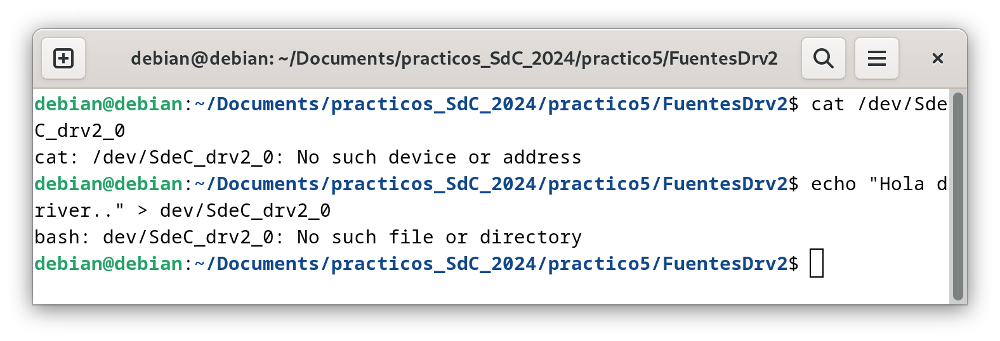

Luego, se intenta hacer un read/write de esos CDF, obteniéndose un error. Si se hace `ls /dev/ | grep SdeC` para poder comprobar qué se tiene:

```
SdeC_drv2_0
SdeC_drv2_1
SdeC_drv2_2
```

Finalmente, al hacer `rmmod`, se obtiene la siguiente salida de `dmesg`.

```
[    0.000000] Booting Linux on physical CPU 0x0000000000 [0x610f0000]
[    0.000000] Linux version 6.1.0-21-arm64 (debian-kernel@lists.debian.org) (gcc-12 (Debian 12.2.0-14) 12.2.0, GNU ld (GNU Binutils for Debian) 2.40) #1 SMP Debian 6.1.90-1 (2024-05-03)
[    0.000000] efi: EFI v2.70 by EDK II
[    0.000000] efi: ACPI 2.0=0x16fc90018 SMBIOS=0xfffff000 SMBIOS 3.0=0x16fcb4000 MOKvar=0x16fc40000 MEMRESERVE=0x16e572798 
[    0.000000] secureboot: Secure boot disabled
[    0.000000] ACPI: Early table checksum verification disabled
[    0.000000] ACPI: RSDP 0x000000016FC90018 000024 (v02 APPLE )
[    0.000000] ACPI: XSDT 0x000000016FC9FE98 000044 (v01 APPLE  Apple Vz 00000001      01000013)
[    0.000000] ACPI: FACP 0x000000016FC9FA98 000114 (v06 APPLE  Apple Vz 00000001 AAPL 20180427)
[    0.000000] ACPI: DSDT 0x000000016FC9F698 000394 (v02 APPLE  Apple Vz 00000001 AAPL 20180427)
[    0.000000] ACPI: GTDT 0x000000016FC9FC18 000068 (v03 APPLE  Apple Vz 00000001 AAPL 20180427)
[    0.000000] ACPI: APIC 0x000000016FC9E998 0001AC (v05 APPLE  Apple Vz 00000001 AAPL 20180427)
[    0.000000] ACPI: MCFG 0x000000016FC9FF98 00003C (v01 APPLE  Apple Vz 00000001 AAPL 20180427)
[    0.000000] NUMA: Failed to initialise from firmware
[    0.000000] NUMA: Faking a node at [mem 0x0000000070000000-0x000000016fffffff]
[    0.000000] NUMA: NODE_DATA [mem 0x16f713380-0x16f715fff]
[    0.000000] Zone ranges:
[    0.000000]   DMA      [mem 0x0000000070000000-0x00000000ffffffff]
[    0.000000]   DMA32    empty
[    0.000000]   Normal   [mem 0x0000000100000000-0x000000016fffffff]
[    0.000000] Movable zone start for each node
[    0.000000] Early memory node ranges
[    0.000000]   node   0: [mem 0x0000000070000000-0x00000000ffffdfff]
[    0.000000]   node   0: [mem 0x00000000ffffe000-0x00000000ffffffff]
[    0.000000]   node   0: [mem 0x0000000100000000-0x000000016e64ffff]
[    0.000000]   node   0: [mem 0x000000016e650000-0x000000016e79ffff]
[    0.000000]   node   0: [mem 0x000000016e7a0000-0x000000016fb9ffff]
[    0.000000]   node   0: [mem 0x000000016fba0000-0x000000016fc2ffff]
[    0.000000]   node   0: [mem 0x000000016fc30000-0x000000016fc3ffff]
[    0.000000]   node   0: [mem 0x000000016fc40000-0x000000016fc7ffff]
[    0.000000]   node   0: [mem 0x000000016fc80000-0x000000016fcb2fff]
[    0.000000]   node   0: [mem 0x000000016fcb3000-0x000000016fcb4fff]
[    0.000000]   node   0: [mem 0x000000016fcb5000-0x000000016fffffff]
[    0.000000] Initmem setup node 0 [mem 0x0000000070000000-0x000000016fffffff]
[    0.000000] cma: Reserved 64 MiB at 0x00000000fbe00000
[    0.000000] psci: probing for conduit method from ACPI.
[    0.000000] psci: PSCIv1.1 detected in firmware.
[    0.000000] psci: Using standard PSCI v0.2 function IDs
[    0.000000] psci: Trusted OS migration not required
[    0.000000] psci: SMC Calling Convention v1.0
[    0.000000] percpu: Embedded 31 pages/cpu s86632 r8192 d32152 u126976
[    0.000000] pcpu-alloc: s86632 r8192 d32152 u126976 alloc=31*4096
[    0.000000] pcpu-alloc: [0] 0 [0] 1 [0] 2 [0] 3 
[    0.000000] Detected PIPT I-cache on CPU0
[    0.000000] CPU features: detected: Address authentication (IMP DEF algorithm)
[    0.000000] CPU features: detected: GIC system register CPU interface
[    0.000000] CPU features: detected: Spectre-v4
[    0.000000] alternatives: applying boot alternatives
[    0.000000] Fallback order for Node 0: 0 
[    0.000000] Built 1 zonelists, mobility grouping on.  Total pages: 1032192
[    0.000000] Policy zone: Normal
[    0.000000] Kernel command line: BOOT_IMAGE=/boot/vmlinuz-6.1.0-21-arm64 root=UUID=8886428d-e9f6-4f33-883f-467ee75a767e ro quiet
[    0.000000] Unknown kernel command line parameters "BOOT_IMAGE=/boot/vmlinuz-6.1.0-21-arm64", will be passed to user space.
[    0.000000] Dentry cache hash table entries: 524288 (order: 10, 4194304 bytes, linear)
[    0.000000] Inode-cache hash table entries: 262144 (order: 9, 2097152 bytes, linear)
[    0.000000] mem auto-init: stack:all(zero), heap alloc:on, heap free:off
[    0.000000] software IO TLB: area num 4.
[    0.000000] software IO TLB: mapped [mem 0x00000000f7e00000-0x00000000fbe00000] (64MB)
[    0.000000] Memory: 2359288K/4194304K available (13056K kernel code, 2800K rwdata, 9452K rodata, 6464K init, 626K bss, 227036K reserved, 65536K cma-reserved)
[    0.000000] SLUB: HWalign=64, Order=0-3, MinObjects=0, CPUs=4, Nodes=1
[    0.000000] ftrace: allocating 43954 entries in 172 pages
[    0.000000] ftrace: allocated 172 pages with 4 groups
[    0.000000] trace event string verifier disabled
[    0.000000] rcu: Hierarchical RCU implementation.
[    0.000000] rcu: 	RCU restricting CPUs from NR_CPUS=256 to nr_cpu_ids=4.
[    0.000000] 	Rude variant of Tasks RCU enabled.
[    0.000000] 	Tracing variant of Tasks RCU enabled.
[    0.000000] rcu: RCU calculated value of scheduler-enlistment delay is 25 jiffies.
[    0.000000] rcu: Adjusting geometry for rcu_fanout_leaf=16, nr_cpu_ids=4
[    0.000000] NR_IRQS: 64, nr_irqs: 64, preallocated irqs: 0
[    0.000000] GICv3: 224 SPIs implemented
[    0.000000] GICv3: 0 Extended SPIs implemented
[    0.000000] Root IRQ handler: gic_handle_irq
[    0.000000] GICv3: GICv3 features: 16 PPIs, RSS
[    0.000000] GICv3: CPU0: found redistributor 0 region 0:0x0000000010010000
[    0.000000] GICv2m: range[mem 0x1fff0000-0x1fff0fff], SPI[128:255]
[    0.000000] rcu: srcu_init: Setting srcu_struct sizes based on contention.
[    0.000000] arch_timer: cp15 timer(s) running at 24.00MHz (virt).
[    0.000000] clocksource: arch_sys_counter: mask: 0xffffffffffffff max_cycles: 0x588fe9dc0, max_idle_ns: 440795202592 ns
[    0.000000] sched_clock: 56 bits at 24MHz, resolution 41ns, wraps every 4398046511097ns
[    0.000020] Console: colour dummy device 80x25
[    0.000025] printk: console [tty0] enabled
[    0.000040] ACPI: Core revision 20220331
[    0.000064] Calibrating delay loop (skipped), value calculated using timer frequency.. 48.00 BogoMIPS (lpj=96000)
[    0.000065] pid_max: default: 32768 minimum: 301
[    0.000098] LSM: Security Framework initializing
[    0.000104] landlock: Up and running.
[    0.000105] Yama: disabled by default; enable with sysctl kernel.yama.*
[    0.000125] AppArmor: AppArmor initialized
[    0.000126] TOMOYO Linux initialized
[    0.000129] LSM support for eBPF active
[    0.000168] Mount-cache hash table entries: 8192 (order: 4, 65536 bytes, linear)
[    0.000183] Mountpoint-cache hash table entries: 8192 (order: 4, 65536 bytes, linear)
[    0.000401] ACPI PPTT: No PPTT table found, CPU and cache topology may be inaccurate
[    0.000498] cblist_init_generic: Setting adjustable number of callback queues.
[    0.000498] cblist_init_generic: Setting shift to 2 and lim to 1.
[    0.000510] cblist_init_generic: Setting adjustable number of callback queues.
[    0.000511] cblist_init_generic: Setting shift to 2 and lim to 1.
[    0.000534] rcu: Hierarchical SRCU implementation.
[    0.000534] rcu: 	Max phase no-delay instances is 1000.
[    0.000699] Remapping and enabling EFI services.
[    0.000795] smp: Bringing up secondary CPUs ...
[    0.000973] Detected PIPT I-cache on CPU1
[    0.000986] GICv3: CPU1: found redistributor 1 region 0:0x0000000010030000
[    0.001040] CPU1: Booted secondary processor 0x0000000001 [0x610f0000]
[    0.001267] Detected PIPT I-cache on CPU2
[    0.001281] GICv3: CPU2: found redistributor 2 region 0:0x0000000010050000
[    0.001336] CPU2: Booted secondary processor 0x0000000002 [0x610f0000]
[    0.001535] Detected PIPT I-cache on CPU3
[    0.001550] GICv3: CPU3: found redistributor 3 region 0:0x0000000010070000
[    0.001603] CPU3: Booted secondary processor 0x0000000003 [0x610f0000]
[    0.001649] smp: Brought up 1 node, 4 CPUs
[    0.001651] SMP: Total of 4 processors activated.
[    0.001652] CPU features: detected: ARMv8.4 Translation Table Level
[    0.001652] CPU features: detected: Data cache clean to the PoU not required for I/D coherence
[    0.001653] CPU features: detected: Common not Private translations
[    0.001653] CPU features: detected: CRC32 instructions
[    0.001653] CPU features: detected: Data cache clean to Point of Deep Persistence
[    0.001654] CPU features: detected: Data cache clean to Point of Persistence
[    0.001654] CPU features: detected: E0PD
[    0.001654] CPU features: detected: Generic authentication (IMP DEF algorithm)
[    0.001655] CPU features: detected: RCpc load-acquire (LDAPR)
[    0.001655] CPU features: detected: LSE atomic instructions
[    0.001655] CPU features: detected: Privileged Access Never
[    0.001656] CPU features: detected: RAS Extension Support
[    0.001656] CPU features: detected: Speculation barrier (SB)
[    0.001656] CPU features: detected: TLB range maintenance instructions
[    0.001657] CPU features: detected: Speculative Store Bypassing Safe (SSBS)
[    0.001719] CPU: All CPU(s) started at EL1
[    0.001722] alternatives: applying system-wide alternatives
[    0.008259] node 0 deferred pages initialised in 4ms
[    0.009133] devtmpfs: initialized
[    0.009533] Registered cp15_barrier emulation handler
[    0.009534] setend instruction emulation is not supported on this system
[    0.009563] clocksource: jiffies: mask: 0xffffffff max_cycles: 0xffffffff, max_idle_ns: 7645041785100000 ns
[    0.009576] futex hash table entries: 1024 (order: 4, 65536 bytes, linear)
[    0.009676] pinctrl core: initialized pinctrl subsystem
[    0.009754] SMBIOS 3.3.0 present.
[    0.009756] DMI: Apple Inc. Apple Virtualization Generic Platform, BIOS 2022.100.22.0.0 02/09/2024
[    0.009906] NET: Registered PF_NETLINK/PF_ROUTE protocol family
[    0.010826] DMA: preallocated 512 KiB GFP_KERNEL pool for atomic allocations
[    0.010926] DMA: preallocated 512 KiB GFP_KERNEL|GFP_DMA pool for atomic allocations
[    0.010957] DMA: preallocated 512 KiB GFP_KERNEL|GFP_DMA32 pool for atomic allocations
[    0.010972] audit: initializing netlink subsys (disabled)
[    0.011098] audit: type=2000 audit(0.008:1): state=initialized audit_enabled=0 res=1
[    0.011172] thermal_sys: Registered thermal governor 'fair_share'
[    0.011173] thermal_sys: Registered thermal governor 'bang_bang'
[    0.011173] thermal_sys: Registered thermal governor 'step_wise'
[    0.011174] thermal_sys: Registered thermal governor 'user_space'
[    0.011174] thermal_sys: Registered thermal governor 'power_allocator'
[    0.011178] cpuidle: using governor ladder
[    0.011180] cpuidle: using governor menu
[    0.011199] hw-breakpoint: found 6 breakpoint and 4 watchpoint registers.
[    0.011293] ASID allocator initialised with 256 entries
[    0.011313] acpiphp: ACPI Hot Plug PCI Controller Driver version: 0.5
[    0.011360] Serial: AMBA PL011 UART driver
[    0.011414] KASLR enabled
[    0.012134] HugeTLB: registered 1.00 GiB page size, pre-allocated 0 pages
[    0.012135] HugeTLB: 0 KiB vmemmap can be freed for a 1.00 GiB page
[    0.012135] HugeTLB: registered 32.0 MiB page size, pre-allocated 0 pages
[    0.012136] HugeTLB: 0 KiB vmemmap can be freed for a 32.0 MiB page
[    0.012136] HugeTLB: registered 2.00 MiB page size, pre-allocated 0 pages
[    0.012137] HugeTLB: 0 KiB vmemmap can be freed for a 2.00 MiB page
[    0.012137] HugeTLB: registered 64.0 KiB page size, pre-allocated 0 pages
[    0.012137] HugeTLB: 0 KiB vmemmap can be freed for a 64.0 KiB page
[    0.012716] ACPI: Added _OSI(Module Device)
[    0.012716] ACPI: Added _OSI(Processor Device)
[    0.012717] ACPI: Added _OSI(3.0 _SCP Extensions)
[    0.012717] ACPI: Added _OSI(Processor Aggregator Device)
[    0.012784] ACPI: 1 ACPI AML tables successfully acquired and loaded
[    0.012875] ACPI: Interpreter enabled
[    0.012876] ACPI: Using GIC for interrupt routing
[    0.012879] ACPI: MCFG table detected, 1 entries
[    0.013075] ACPI: PCI Root Bridge [PCI0] (domain 0000 [bus 00-ff])
[    0.013078] acpi PNP0A08:00: _OSC: OS supports [ExtendedConfig ASPM ClockPM Segments MSI HPX-Type3]
[    0.013080] acpi PNP0A08:00: _OSC: OS requested [PCIeHotplug SHPCHotplug PME AER PCIeCapability LTR]
[    0.013081] acpi PNP0A08:00: _OSC: platform willing to grant [PCIeHotplug SHPCHotplug PME AER PCIeCapability LTR]
[    0.013082] acpi PNP0A08:00: _OSC: platform retains control of PCIe features (AE_NOT_FOUND)
[    0.013089] acpi PNP0A08:00: ECAM area [mem 0x40000000-0x4fffffff] reserved by PNP0C02:00
[    0.013093] acpi PNP0A08:00: ECAM at [mem 0x40000000-0x4fffffff] for [bus 00-ff]
[    0.013097] ACPI: Remapped I/O 0x000000006fff0000 to [io  0x0000-0xffff window]
[    0.013113] PCI host bridge to bus 0000:00
[    0.013114] pci_bus 0000:00: root bus resource [mem 0x50000000-0x6ffdffff window]
[    0.013115] pci_bus 0000:00: root bus resource [mem 0x180000000-0x1bfffffff window]
[    0.013115] pci_bus 0000:00: root bus resource [io  0x0000-0xffff window]
[    0.013116] pci_bus 0000:00: root bus resource [bus 00-ff]
[    0.013133] pci 0000:00:00.0: [106b:1a05] type 00 class 0x060000
[    0.013265] pci 0000:00:01.0: [1af4:1041] type 00 class 0x020000
[    0.013299] pci 0000:00:01.0: reg 0x10: [mem 0x180020000-0x180023fff 64bit]
[    0.013313] pci 0000:00:01.0: reg 0x18: [mem 0x5000a000-0x5000a03f]
[    0.013490] pci 0000:00:05.0: [1af4:1042] type 00 class 0x018000
[    0.013518] pci 0000:00:05.0: reg 0x10: [mem 0x18001c000-0x18001ffff 64bit]
[    0.013531] pci 0000:00:05.0: reg 0x18: [mem 0x50009000-0x5000903f]
[    0.013701] pci 0000:00:06.0: [1af4:105a] type 00 class 0x018000
[    0.013729] pci 0000:00:06.0: reg 0x10: [mem 0x180018000-0x18001bfff 64bit]
[    0.013742] pci 0000:00:06.0: reg 0x18: [mem 0x50008000-0x5000803f]
[    0.013914] pci 0000:00:07.0: [1af4:1050] type 00 class 0x038000
[    0.013943] pci 0000:00:07.0: reg 0x10: [mem 0x180014000-0x180017fff 64bit]
[    0.013956] pci 0000:00:07.0: reg 0x18: [mem 0x50007000-0x5000703f]
[    0.014131] pci 0000:00:08.0: [1af4:1059] type 00 class 0x040100
[    0.014158] pci 0000:00:08.0: reg 0x10: [mem 0x180010000-0x180013fff 64bit]
[    0.014181] pci 0000:00:08.0: reg 0x18: [mem 0x50004000-0x5000407f]
[    0.014392] pci 0000:00:09.0: [1af4:1059] type 00 class 0x040100
[    0.014418] pci 0000:00:09.0: reg 0x10: [mem 0x18000c000-0x18000ffff 64bit]
[    0.014431] pci 0000:00:09.0: reg 0x18: [mem 0x50003000-0x5000307f]
[    0.014614] pci 0000:00:0a.0: [1af4:1044] type 00 class 0x100000
[    0.014641] pci 0000:00:0a.0: reg 0x10: [mem 0x180008000-0x18000bfff 64bit]
[    0.014653] pci 0000:00:0a.0: reg 0x18: [mem 0x50006000-0x5000603f]
[    0.014830] pci 0000:00:0b.0: [1af4:1045] type 00 class 0x058000
[    0.014858] pci 0000:00:0b.0: reg 0x10: [mem 0x180004000-0x180007fff 64bit]
[    0.014871] pci 0000:00:0b.0: reg 0x18: [mem 0x50005000-0x5000503f]
[    0.015035] pci 0000:00:0c.0: [1af4:1043] type 00 class 0x078000
[    0.015062] pci 0000:00:0c.0: reg 0x10: [mem 0x180000000-0x180003fff 64bit]
[    0.015074] pci 0000:00:0c.0: reg 0x18: [mem 0x50002000-0x5000207f]
[    0.015228] pci 0000:00:0d.0: [106b:1a06] type 00 class 0x0c0330
[    0.015244] pci 0000:00:0d.0: reg 0x10: [mem 0x50001000-0x50001fff]
[    0.015251] pci 0000:00:0d.0: reg 0x14: [mem 0x50000000-0x500003ff]
[    0.015380] pci 0000:00:01.0: BAR 0: assigned [mem 0x180000000-0x180003fff 64bit]
[    0.015394] pci 0000:00:05.0: BAR 0: assigned [mem 0x180004000-0x180007fff 64bit]
[    0.015407] pci 0000:00:06.0: BAR 0: assigned [mem 0x180008000-0x18000bfff 64bit]
[    0.015420] pci 0000:00:07.0: BAR 0: assigned [mem 0x18000c000-0x18000ffff 64bit]
[    0.015432] pci 0000:00:08.0: BAR 0: assigned [mem 0x180010000-0x180013fff 64bit]
[    0.015445] pci 0000:00:09.0: BAR 0: assigned [mem 0x180014000-0x180017fff 64bit]
[    0.015458] pci 0000:00:0a.0: BAR 0: assigned [mem 0x180018000-0x18001bfff 64bit]
[    0.015471] pci 0000:00:0b.0: BAR 0: assigned [mem 0x18001c000-0x18001ffff 64bit]
[    0.015483] pci 0000:00:0c.0: BAR 0: assigned [mem 0x180020000-0x180023fff 64bit]
[    0.015496] pci 0000:00:0d.0: BAR 0: assigned [mem 0x50000000-0x50000fff]
[    0.015500] pci 0000:00:0d.0: BAR 1: assigned [mem 0x50001000-0x500013ff]
[    0.015503] pci 0000:00:08.0: BAR 2: assigned [mem 0x50001400-0x5000147f]
[    0.015508] pci 0000:00:09.0: BAR 2: assigned [mem 0x50001480-0x500014ff]
[    0.015512] pci 0000:00:0c.0: BAR 2: assigned [mem 0x50001500-0x5000157f]
[    0.015517] pci 0000:00:01.0: BAR 2: assigned [mem 0x50001580-0x500015bf]
[    0.015521] pci 0000:00:05.0: BAR 2: assigned [mem 0x500015c0-0x500015ff]
[    0.015526] pci 0000:00:06.0: BAR 2: assigned [mem 0x50001600-0x5000163f]
[    0.015530] pci 0000:00:07.0: BAR 2: assigned [mem 0x50001640-0x5000167f]
[    0.015535] pci 0000:00:0a.0: BAR 2: assigned [mem 0x50001680-0x500016bf]
[    0.015539] pci 0000:00:0b.0: BAR 2: assigned [mem 0x500016c0-0x500016ff]
[    0.015545] pci_bus 0000:00: resource 4 [mem 0x50000000-0x6ffdffff window]
[    0.015545] pci_bus 0000:00: resource 5 [mem 0x180000000-0x1bfffffff window]
[    0.015546] pci_bus 0000:00: resource 6 [io  0x0000-0xffff window]
[    0.015634] iommu: Default domain type: Translated 
[    0.015635] iommu: DMA domain TLB invalidation policy: strict mode 
[    0.015662] pps_core: LinuxPPS API ver. 1 registered
[    0.015663] pps_core: Software ver. 5.3.6 - Copyright 2005-2007 Rodolfo Giometti <giometti@linux.it>
[    0.015664] PTP clock support registered
[    0.015671] EDAC MC: Ver: 3.0.0
[    0.015832] Registered efivars operations
[    0.016093] NetLabel: Initializing
[    0.016093] NetLabel:  domain hash size = 128
[    0.016093] NetLabel:  protocols = UNLABELED CIPSOv4 CALIPSO
[    0.016098] NetLabel:  unlabeled traffic allowed by default
[    0.016161] vgaarb: loaded
[    0.016302] clocksource: Switched to clocksource arch_sys_counter
[    0.016401] VFS: Disk quotas dquot_6.6.0
[    0.016409] VFS: Dquot-cache hash table entries: 512 (order 0, 4096 bytes)
[    0.016518] AppArmor: AppArmor Filesystem Enabled
[    0.016524] pnp: PnP ACPI init
[    0.016543] system 00:00: [mem 0x40000000-0x4fffffff] could not be reserved
[    0.016547] pnp: PnP ACPI: found 1 devices
[    0.019550] NET: Registered PF_INET protocol family
[    0.019711] IP idents hash table entries: 65536 (order: 7, 524288 bytes, linear)
[    0.020265] tcp_listen_portaddr_hash hash table entries: 2048 (order: 3, 32768 bytes, linear)
[    0.020350] Table-perturb hash table entries: 65536 (order: 6, 262144 bytes, linear)
[    0.020419] TCP established hash table entries: 32768 (order: 6, 262144 bytes, linear)
[    0.020653] TCP bind hash table entries: 32768 (order: 8, 1048576 bytes, linear)
[    0.020688] TCP: Hash tables configured (established 32768 bind 32768)
[    0.020773] MPTCP token hash table entries: 4096 (order: 4, 98304 bytes, linear)
[    0.020797] UDP hash table entries: 2048 (order: 4, 65536 bytes, linear)
[    0.020818] UDP-Lite hash table entries: 2048 (order: 4, 65536 bytes, linear)
[    0.020855] NET: Registered PF_UNIX/PF_LOCAL protocol family
[    0.020868] NET: Registered PF_XDP protocol family
[    0.020900] pci 0000:00:0d.0: enabling device (0010 -> 0012)
[    0.020938] PCI: CLS 0 bytes, default 64
[    0.021061] Trying to unpack rootfs image as initramfs...
[    0.021087] kvm [1]: HYP mode not available
[    0.021950] Initialise system trusted keyrings
[    0.021961] Key type blacklist registered
[    0.022032] workingset: timestamp_bits=42 max_order=20 bucket_order=0
[    0.022648] zbud: loaded
[    0.022825] integrity: Platform Keyring initialized
[    0.022827] integrity: Machine keyring initialized
[    0.022827] Key type asymmetric registered
[    0.022828] Asymmetric key parser 'x509' registered
[    0.221503] Freeing initrd memory: 45352K
[    0.225584] alg: self-tests for CTR-KDF (hmac(sha256)) passed
[    0.225613] Block layer SCSI generic (bsg) driver version 0.4 loaded (major 247)
[    0.225668] io scheduler mq-deadline registered
[    0.226520] pl061_gpio ARMH0061:00: PL061 GPIO chip registered
[    0.226556] shpchp: Standard Hot Plug PCI Controller Driver version: 0.4
[    0.226601] input: Power Button as /devices/LNXSYSTM:00/PNP0C0C:00/input/input0
[    0.226609] ACPI: button: Power Button [PWRB]
[    0.226945] Serial: 8250/16550 driver, 4 ports, IRQ sharing enabled
[    0.227202] Serial: AMBA driver
[    0.227204] SuperH (H)SCI(F) driver initialized
[    0.227217] msm_serial: driver initialized
[    0.227391] mousedev: PS/2 mouse device common for all mice
[    0.227560] rtc-efi rtc-efi.0: registered as rtc0
[    0.227592] rtc-efi rtc-efi.0: setting system clock to 2024-06-03T03:38:10 UTC (1717385890)
[    0.227744] ledtrig-cpu: registered to indicate activity on CPUs
[    0.233982] NET: Registered PF_INET6 protocol family
[    0.236318] Segment Routing with IPv6
[    0.236324] In-situ OAM (IOAM) with IPv6
[    0.236333] mip6: Mobile IPv6
[    0.236335] NET: Registered PF_PACKET protocol family
[    0.236396] mpls_gso: MPLS GSO support
[    0.236510] registered taskstats version 1
[    0.236514] Loading compiled-in X.509 certificates
[    0.245776] Loaded X.509 cert 'Debian Secure Boot CA: 6ccece7e4c6c0d1f6149f3dd27dfcc5cbb419ea1'
[    0.245785] Loaded X.509 cert 'Debian Secure Boot Signer 2022 - linux: 14011249c2675ea8e5148542202005810584b25f'
[    0.245946] zswap: loaded using pool lzo/zbud
[    0.246079] Key type .fscrypt registered
[    0.246079] Key type fscrypt-provisioning registered
[    0.247943] Key type encrypted registered
[    0.247946] AppArmor: AppArmor sha1 policy hashing enabled
[    0.248069] ima: secureboot mode disabled
[    0.248072] ima: No TPM chip found, activating TPM-bypass!
[    0.248073] ima: Allocated hash algorithm: sha256
[    0.248078] ima: No architecture policies found
[    0.248091] evm: Initialising EVM extended attributes:
[    0.248092] evm: security.selinux
[    0.248092] evm: security.SMACK64 (disabled)
[    0.248092] evm: security.SMACK64EXEC (disabled)
[    0.248093] evm: security.SMACK64TRANSMUTE (disabled)
[    0.248093] evm: security.SMACK64MMAP (disabled)
[    0.248093] evm: security.apparmor
[    0.248094] evm: security.ima
[    0.248094] evm: security.capability
[    0.248094] evm: HMAC attrs: 0x1
[    0.298623] clk: Disabling unused clocks
[    0.299195] Freeing unused kernel memory: 6464K
[    0.303019] Checked W+X mappings: passed, no W+X pages found
[    0.303023] Run /init as init process
[    0.303024]   with arguments:
[    0.303024]     /init
[    0.303025]   with environment:
[    0.303025]     HOME=/
[    0.303025]     TERM=linux
[    0.303026]     BOOT_IMAGE=/boot/vmlinuz-6.1.0-21-arm64
[    0.375563] ACPI: bus type USB registered
[    0.375576] usbcore: registered new interface driver usbfs
[    0.375580] usbcore: registered new interface driver hub
[    0.375585] usbcore: registered new device driver usb
[    0.381710] xhci_hcd 0000:00:0d.0: xHCI Host Controller
[    0.381713] xhci_hcd 0000:00:0d.0: new USB bus registered, assigned bus number 1
[    0.381816] xhci_hcd 0000:00:0d.0: hcc params 0x02600001 hci version 0x110 quirks 0x0000000000000010
[    0.382093] xhci_hcd 0000:00:0d.0: xHCI Host Controller
[    0.382094] xhci_hcd 0000:00:0d.0: new USB bus registered, assigned bus number 2
[    0.382097] xhci_hcd 0000:00:0d.0: Host supports USB 3.1 Enhanced SuperSpeed
[    0.382119] usb usb1: New USB device found, idVendor=1d6b, idProduct=0002, bcdDevice= 6.01
[    0.382120] usb usb1: New USB device strings: Mfr=3, Product=2, SerialNumber=1
[    0.382121] usb usb1: Product: xHCI Host Controller
[    0.382122] usb usb1: Manufacturer: Linux 6.1.0-21-arm64 xhci-hcd
[    0.382122] usb usb1: SerialNumber: 0000:00:0d.0
[    0.382200] hub 1-0:1.0: USB hub found
[    0.382215] hub 1-0:1.0: 8 ports detected
[    0.382346] usb usb2: We don't know the algorithms for LPM for this host, disabling LPM.
[    0.382355] usb usb2: New USB device found, idVendor=1d6b, idProduct=0003, bcdDevice= 6.01
[    0.382356] usb usb2: New USB device strings: Mfr=3, Product=2, SerialNumber=1
[    0.382356] usb usb2: Product: xHCI Host Controller
[    0.382357] usb usb2: Manufacturer: Linux 6.1.0-21-arm64 xhci-hcd
[    0.382358] usb usb2: SerialNumber: 0000:00:0d.0
[    0.382423] hub 2-0:1.0: USB hub found
[    0.382437] hub 2-0:1.0: 8 ports detected
[    0.477456] virtio_blk virtio1: 1/0/0 default/read/poll queues
[    0.477925] virtio_blk virtio1: [vda] 134217728 512-byte logical blocks (68.7 GB/64.0 GiB)
[    0.479116]  vda: vda1 vda2 vda3
[    0.492623] ACPI: bus type drm_connector registered
[    0.502342] [drm] pci: virtio-gpu-pci detected at 0000:00:07.0
[    0.502378] [drm] features: -virgl -edid -resource_blob -host_visible
[    0.502379] [drm] features: -context_init
[    0.502747] [drm] number of scanouts: 1
[    0.502750] [drm] number of cap sets: 0
[    0.502963] [drm] Initialized virtio_gpu 0.1.0 0 for 0000:00:07.0 on minor 0
[    0.505588] virtio-pci 0000:00:07.0: [drm] drm_plane_enable_fb_damage_clips() not called
[    0.505593] Console: switching to colour frame buffer device 167x47
[    0.509008] virtio-pci 0000:00:07.0: [drm] fb0: virtio_gpudrmfb frame buffer device
[    0.512910] virtio_net virtio0 enp0s1: renamed from eth0
[    0.588756] PM: Image not found (code -22)
[    0.641071] usb 1-1: new full-speed USB device number 2 using xhci_hcd
[    0.650776] EXT4-fs (vda2): mounted filesystem with ordered data mode. Quota mode: none.
[    0.681736] Not activating Mandatory Access Control as /sbin/tomoyo-init does not exist.
[    0.732268] systemd[1]: Inserted module 'autofs4'
[    0.738618] random: crng init done
[    0.755350] systemd[1]: systemd 252.22-1~deb12u1 running in system mode (+PAM +AUDIT +SELINUX +APPARMOR +IMA +SMACK +SECCOMP +GCRYPT -GNUTLS +OPENSSL +ACL +BLKID +CURL +ELFUTILS +FIDO2 +IDN2 -IDN +IPTC +KMOD +LIBCRYPTSETUP +LIBFDISK +PCRE2 -PWQUALITY +P11KIT +QRENCODE +TPM2 +BZIP2 +LZ4 +XZ +ZLIB +ZSTD -BPF_FRAMEWORK -XKBCOMMON +UTMP +SYSVINIT default-hierarchy=unified)
[    0.755352] systemd[1]: Detected virtualization apple.
[    0.755354] systemd[1]: Detected architecture arm64.
[    0.756655] systemd[1]: Hostname set to <debian>.
[    0.790371] usb 1-1: New USB device found, idVendor=05ac, idProduct=8105, bcdDevice= 0.00
[    0.790374] usb 1-1: New USB device strings: Mfr=2, Product=3, SerialNumber=0
[    0.790375] usb 1-1: Product: Virtual USB Keyboard
[    0.790376] usb 1-1: Manufacturer: Apple Inc.
[    0.857820] systemd[1]: Queued start job for default target graphical.target.
[    0.881528] systemd[1]: Created slice system-getty.slice - Slice /system/getty.
[    0.881701] systemd[1]: Created slice system-modprobe.slice - Slice /system/modprobe.
[    0.881837] systemd[1]: Created slice system-systemd\x2dfsck.slice - Slice /system/systemd-fsck.
[    0.881925] systemd[1]: Created slice user.slice - User and Session Slice.
[    0.881961] systemd[1]: Started systemd-ask-password-wall.path - Forward Password Requests to Wall Directory Watch.
[    0.882055] systemd[1]: Set up automount proc-sys-fs-binfmt_misc.automount - Arbitrary Executable File Formats File System Automount Point.
[    0.882067] systemd[1]: Expecting device dev-disk-by\x2duuid-C685\x2d1D26.device - /dev/disk/by-uuid/C685-1D26...
[    0.882073] systemd[1]: Expecting device dev-disk-by\x2duuid-cba290a0\x2da937\x2d4ae6\x2d837b\x2d33b49c86020e.device - /dev/disk/by-uuid/cba290a0-a937-4ae6-837b-33b49c86020e...
[    0.882089] systemd[1]: Reached target integritysetup.target - Local Integrity Protected Volumes.
[    0.882107] systemd[1]: Reached target nss-user-lookup.target - User and Group Name Lookups.
[    0.882116] systemd[1]: Reached target remote-fs.target - Remote File Systems.
[    0.882124] systemd[1]: Reached target slices.target - Slice Units.
[    0.882144] systemd[1]: Reached target veritysetup.target - Local Verity Protected Volumes.
[    0.882206] systemd[1]: Listening on systemd-fsckd.socket - fsck to fsckd communication Socket.
[    0.882233] systemd[1]: Listening on systemd-initctl.socket - initctl Compatibility Named Pipe.
[    0.882424] systemd[1]: Listening on systemd-journald-audit.socket - Journal Audit Socket.
[    0.882498] systemd[1]: Listening on systemd-journald-dev-log.socket - Journal Socket (/dev/log).
[    0.882558] systemd[1]: Listening on systemd-journald.socket - Journal Socket.
[    0.882857] systemd[1]: Listening on systemd-udevd-control.socket - udev Control Socket.
[    0.882906] systemd[1]: Listening on systemd-udevd-kernel.socket - udev Kernel Socket.
[    0.883280] systemd[1]: Mounting dev-hugepages.mount - Huge Pages File System...
[    0.883630] systemd[1]: Mounting dev-mqueue.mount - POSIX Message Queue File System...
[    0.884015] systemd[1]: Mounting sys-kernel-debug.mount - Kernel Debug File System...
[    0.884409] systemd[1]: Mounting sys-kernel-tracing.mount - Kernel Trace File System...
[    0.885907] systemd[1]: Starting keyboard-setup.service - Set the console keyboard layout...
[    0.886360] systemd[1]: Starting kmod-static-nodes.service - Create List of Static Device Nodes...
[    0.886821] systemd[1]: Starting modprobe@configfs.service - Load Kernel Module configfs...
[    0.887402] systemd[1]: Starting modprobe@dm_mod.service - Load Kernel Module dm_mod...
[    0.887977] systemd[1]: Starting modprobe@drm.service - Load Kernel Module drm...
[    0.888434] systemd[1]: Starting modprobe@efi_pstore.service - Load Kernel Module efi_pstore...
[    0.888963] systemd[1]: Starting modprobe@fuse.service - Load Kernel Module fuse...
[    0.889437] systemd[1]: Starting modprobe@loop.service - Load Kernel Module loop...
[    0.889521] systemd[1]: systemd-fsck-root.service - File System Check on Root Device was skipped because of an unmet condition check (ConditionPathExists=!/run/initramfs/fsck-root).
[    0.890372] systemd[1]: Starting systemd-journald.service - Journal Service...
[    0.891818] systemd[1]: Starting systemd-modules-load.service - Load Kernel Modules...
[    0.892232] systemd[1]: Starting systemd-remount-fs.service - Remount Root and Kernel File Systems...
[    0.892770] systemd[1]: Starting systemd-udev-trigger.service - Coldplug All udev Devices...
[    0.892842] pstore: Using crash dump compression: deflate
[    0.893535] systemd[1]: Mounted dev-hugepages.mount - Huge Pages File System.
[    0.893729] systemd[1]: Mounted dev-mqueue.mount - POSIX Message Queue File System.
[    0.893830] systemd[1]: Mounted sys-kernel-debug.mount - Kernel Debug File System.
[    0.893929] systemd[1]: Mounted sys-kernel-tracing.mount - Kernel Trace File System.
[    0.897849] fuse: init (API version 7.37)
[    0.897930] device-mapper: core: CONFIG_IMA_DISABLE_HTABLE is disabled. Duplicate IMA measurements will not be recorded in the IMA log.
[    0.897944] device-mapper: uevent: version 1.0.3
[    0.898087] pstore: Registered efi as persistent store backend
[    0.898123] systemd[1]: Finished kmod-static-nodes.service - Create List of Static Device Nodes.
[    0.898380] systemd[1]: modprobe@configfs.service: Deactivated successfully.
[    0.898437] systemd[1]: Finished modprobe@configfs.service - Load Kernel Module configfs.
[    0.898539] systemd[1]: modprobe@drm.service: Deactivated successfully.
[    0.898593] systemd[1]: Finished modprobe@drm.service - Load Kernel Module drm.
[    0.898689] systemd[1]: modprobe@efi_pstore.service: Deactivated successfully.
[    0.898739] systemd[1]: Finished modprobe@efi_pstore.service - Load Kernel Module efi_pstore.
[    0.898836] systemd[1]: Finished systemd-modules-load.service - Load Kernel Modules.
[    0.899389] device-mapper: ioctl: 4.47.0-ioctl (2022-07-28) initialised: dm-devel@redhat.com
[    0.899409] systemd[1]: Mounting sys-kernel-config.mount - Kernel Configuration File System...
[    0.899916] systemd[1]: Starting systemd-sysctl.service - Apply Kernel Variables...
[    0.900096] systemd[1]: modprobe@dm_mod.service: Deactivated successfully.
[    0.900244] systemd[1]: Finished modprobe@dm_mod.service - Load Kernel Module dm_mod.
[    0.900410] systemd[1]: modprobe@fuse.service: Deactivated successfully.
[    0.900497] systemd[1]: Finished modprobe@fuse.service - Load Kernel Module fuse.
[    0.900944] systemd[1]: Mounting sys-fs-fuse-connections.mount - FUSE Control File System...
[    0.903076] systemd[1]: Mounted sys-kernel-config.mount - Kernel Configuration File System.
[    0.903203] systemd[1]: Mounted sys-fs-fuse-connections.mount - FUSE Control File System.
[    0.903362] loop: module loaded
[    0.903642] systemd[1]: modprobe@loop.service: Deactivated successfully.
[    0.903712] systemd[1]: Finished modprobe@loop.service - Load Kernel Module loop.
[    0.903798] systemd[1]: systemd-repart.service - Repartition Root Disk was skipped because no trigger condition checks were met.
[    0.906946] EXT4-fs (vda2): re-mounted. Quota mode: none.
[    0.907465] systemd[1]: Finished systemd-remount-fs.service - Remount Root and Kernel File Systems.
[    0.907602] systemd[1]: systemd-firstboot.service - First Boot Wizard was skipped because of an unmet condition check (ConditionFirstBoot=yes).
[    0.907630] systemd[1]: systemd-pstore.service - Platform Persistent Storage Archival was skipped because of an unmet condition check (ConditionDirectoryNotEmpty=/sys/fs/pstore).
[    0.908112] systemd[1]: Starting systemd-random-seed.service - Load/Save Random Seed...
[    0.908569] systemd[1]: Starting systemd-sysusers.service - Create System Users...
[    0.918551] systemd[1]: Started systemd-journald.service - Journal Service.
[    0.924323] usb 1-2: new full-speed USB device number 3 using xhci_hcd
[    0.926640] systemd-journald[238]: Received client request to flush runtime journal.
[    1.049803] Adding 999420k swap on /dev/vda3.  Priority:-2 extents:1 across:999420k FS
[    1.072503] usb 1-2: New USB device found, idVendor=05ac, idProduct=8106, bcdDevice= 0.00
[    1.072506] usb 1-2: New USB device strings: Mfr=2, Product=3, SerialNumber=0
[    1.072507] usb 1-2: Product: Virtual USB Digitizer
[    1.072508] usb 1-2: Manufacturer: Apple Inc.
[    1.089859] usbcore: registered new device driver apple-mfi-fastcharge
[    1.095075] hid: raw HID events driver (C) Jiri Kosina
[    1.097174] usbcore: registered new interface driver usbhid
[    1.097175] usbhid: USB HID core driver
[    1.099176] input: Apple Inc. Virtual USB Keyboard as /devices/pci0000:00/0000:00:0d.0/usb1/1-1/1-1:1.0/0003:05AC:8105.0001/input/input1
[    1.157360] hid-generic 0003:05AC:8105.0001: input,hidraw0: USB HID v1.10 Keyboard [Apple Inc. Virtual USB Keyboard] on usb-0000:00:0d.0-1/input0
[    1.157478] input: Apple Inc. Virtual USB Digitizer as /devices/pci0000:00/0000:00:0d.0/usb1/1-2/1-2:1.0/0003:05AC:8106.0002/input/input2
[    1.157673] hid-generic 0003:05AC:8106.0002: input,hidraw1: USB HID v1.10 Mouse [Apple Inc. Virtual USB Digitizer] on usb-0000:00:0d.0-2/input0
[    1.916952] virtio-fs: tag <share> not found
[    1.948058] audit: type=1400 audit(1717385892.216:2): apparmor="STATUS" operation="profile_load" profile="unconfined" name="lsb_release" pid=433 comm="apparmor_parser"
[    1.949297] audit: type=1400 audit(1717385892.220:3): apparmor="STATUS" operation="profile_load" profile="unconfined" name="nvidia_modprobe" pid=434 comm="apparmor_parser"
[    1.949300] audit: type=1400 audit(1717385892.220:4): apparmor="STATUS" operation="profile_load" profile="unconfined" name="nvidia_modprobe//kmod" pid=434 comm="apparmor_parser"
[    1.952740] audit: type=1400 audit(1717385892.224:5): apparmor="STATUS" operation="profile_load" profile="unconfined" name="/usr/bin/man" pid=440 comm="apparmor_parser"
[    1.952743] audit: type=1400 audit(1717385892.224:6): apparmor="STATUS" operation="profile_load" profile="unconfined" name="man_filter" pid=440 comm="apparmor_parser"
[    1.952744] audit: type=1400 audit(1717385892.224:7): apparmor="STATUS" operation="profile_load" profile="unconfined" name="man_groff" pid=440 comm="apparmor_parser"
[    1.953490] audit: type=1400 audit(1717385892.224:8): apparmor="STATUS" operation="profile_load" profile="unconfined" name="libreoffice-oosplash" pid=441 comm="apparmor_parser"
[    1.955072] audit: type=1400 audit(1717385892.224:9): apparmor="STATUS" operation="profile_load" profile="unconfined" name="libreoffice-senddoc" pid=442 comm="apparmor_parser"
[    1.955354] audit: type=1400 audit(1717385892.224:10): apparmor="STATUS" operation="profile_load" profile="unconfined" name="/usr/lib/NetworkManager/nm-dhcp-client.action" pid=435 comm="apparmor_parser"
[    2.136213] NET: Registered PF_QIPCRTR protocol family
[   13.127179] rfkill: input handler disabled
[   13.525144] input: spice vdagent tablet as /devices/virtual/input/input3
[   17.601753] rfkill: input handler enabled
[   18.289777] rfkill: input handler disabled
[   18.937478] input: spice vdagent tablet as /devices/virtual/input/input4
[  287.542890] drv1: loading out-of-tree module taints kernel.
[  287.542967] drv1: module verification failed: signature and/or required key missing - tainting kernel
[  287.543193] SdeC: drv1 Registrado exitosamente..!!
[  328.962101] SdeC: drv1 dice Adios mundo cruel..!!
[  548.441271] SdeC_drv2 Registrado exitosamente..!!
[  548.441276] <Major, Minor>: <235, 0>
[  585.889473] SdeC_drv2 dice Adios mundo cruel..!!
```

### Driver 3

```c
// Bibliografía a consultar:
// https://www.kernel.org/doc/htmldocs/kernel-api/index.html

// Las llamadas a operaciones comunes de archivos también se aplican para cualquier dispositivo.
// En definitiva un archivo es un archivo y para Linus casi todo es un archivo, desde la perspectiva del usuario.
// La diferencia radica en el espacio del kernel, donde el VFS decodifica el tipo de archivo 
// y transfiere las operaciones de archivo al canal apropiado, ya sea al módulo del sistema de 
// archivos en el caso de un archivo o directorio normal, o al "device driver" correspondiente 
// en el caso de un "device file". Nos interesa este último caso.

// Para que VFS pase operaciones del "device file" al "device driver", debe estar informado al respecto.
// Esto es registrar en el VFS las operaciones del "device file" vinculadas al "device driver".
// Esto implica dos pasos:
// PRIMERO: Declarar y completar una estructura "file_operations" con las operaciones de archivo deseadas
// (my_open, my_close, my_read, my_write, ...) e inicializar la estructura del "char device" (struct cdev c_dev)
// utilizando cdev_init().
// SEGUNDO: Entregar esta estructura al VFS usando la llamada cdev_add().
// Luego habrá que completar las operaciones (my_open, my_close, my_read, my_write, ...).

// ¿ Cómo voy a chequear el funcionamiento del device driver ?
// $echo "Hola driver..." > /dev/SdeC_drv3
// $dmesg
// $cat /dev/SdeC_drv3
// $dmesg

#include <linux/module.h>
#include <linux/version.h>
#include <linux/kernel.h>
#include <linux/types.h>
#include <linux/kdev_t.h>
#include <linux/fs.h>
#include <linux/device.h>
#include <linux/cdev.h>

static dev_t first; 		// Vble global para device number "first"
static struct cdev c_dev; 	// Global variable for the character device structure
static struct class *cl; 	// Global variable for the device class

static int my_open(struct inode *i, struct file *f)
{
    printk(KERN_INFO "Driver3_SdeC: open()\n");
    return 0;
}
static int my_close(struct inode *i, struct file *f)
{
    printk(KERN_INFO "Driver3_SdeC: close()\n");
    return 0;
}
static ssize_t my_read(struct file *f, char __user *buf, size_t len, loff_t *off)
{
    printk(KERN_INFO "Driver3_SdeC: read()\n");
    return 0;
}
static ssize_t my_write(struct file *f, const char __user *buf, size_t len, loff_t *off)
{
    /*printk(KERN_INFO "Driver3_SdeC: write()\n");
    return len;*/
    char kbuf[100];
    if (len > 99) {
        len = 99;
    }
    if (copy_from_user(kbuf,buf,len)) {
        return -EFAULT;
    }
    kbuf[len] = '\0'; // para que el buffer sea un string valido
    printk(KERN_INFO "Driver3_SdeC: write() - %s\n",kbuf);
    return len;
}

static struct file_operations pugs_fops =
{
    // Dentro de file_operations defino las funciones que voy a implementar..!!

    .owner = THIS_MODULE,
    .open = my_open,
    .release = my_close,
    .read = my_read,
    .write = my_write
};

static int __init drv3_init(void) /* Constructor */
{
    int ret;
    struct device *dev_ret;

    printk(KERN_INFO "SdeC_drv3 Registrado exitosamente..!!\n");
    
    // alloc_chrdev_region calcula (¿ obtiene ?) dinámicamente un MAJOR libre (se devuelve en 
    // first) y registra 1 número de device MINOR a partir de <el mayor libre, primer menor>, 
    // con el nombre SdeC_drv3. Si devuelve 0, está todo bien..!!

    if ((ret = alloc_chrdev_region(&first, 0, 1, "SdeC_drv3")) < 0)
    {
        return ret;
    }

    // En versiones del kernel 2.4 y anteriores, la creación automática de "device files" fue
    // la realizaba el mismo kernel, llamando a las API apropiadas de devfs. 
    // A medida que el kernel evolucionó, los desarrolladores del kernel se dieron cuenta de que
    // los "device files" son más una cuestión de espacio de usuario y, por lo tanto, como política, 
    // solo los usuarios deberían tratarlo, no el kernel. 
    // Con esta idea, ahora el kernel ofrece información sobre los dispositivos, organizado por clases
    // en la carpeta /sys/class. En particular para char device driver, está /sys/class/chardrv.
    // Luego, el espacio de usuario necesita interpretar y tomar una acción apropiada. 
    // En la mayoría de los desktop Linux, el demonio udev recoge esa información y, en consecuencia, 
    // crea los archivos del dispositivo.
    // Luego, con class_create se crea un puntero a un objeto de la clase device particular (chardrv).


    if (IS_ERR(cl = class_create(THIS_MODULE, "chardrv")))
    {
        unregister_chrdev_region(first, 1);
        return PTR_ERR(cl);
    }

    // Ese puntero "cl" será utilizado en la llamada a device_create, junto a los valores de
    // MAJOR y MINOR contenidos en "first" y el nombre que se le dará a esta nueva entrada.

    if (IS_ERR(dev_ret = device_create(cl, NULL, first, NULL, "SdeC_drv3")))
    {
        class_destroy(cl);
        unregister_chrdev_region(first, 1);
        return PTR_ERR(dev_ret);
    }

    // Lo que queda es inicializar cdev, recordando la estructura file_operations, preparándola para 
    // agregar al sistema con cdev_add.

    cdev_init(&c_dev, &pugs_fops);
    if ((ret = cdev_add(&c_dev, first, 1)) < 0)
    {
        device_destroy(cl, first);
        class_destroy(cl);
        unregister_chrdev_region(first, 1);
        return ret;
    }
    return 0;
}

static void __exit drv3_exit(void) /* Destructor */
{
    cdev_del(&c_dev);
    device_destroy(cl, first);
    class_destroy(cl);
    unregister_chrdev_region(first, 1);
    printk(KERN_INFO "SdeC_drv3 dice Adios mundo cruel..!!\n");
}

module_init(drv3_init);
module_exit(drv3_exit);

MODULE_LICENSE("GPL");
MODULE_AUTHOR("Cátedra Sistemas de Computación");
MODULE_DESCRIPTION("Nuestro tercer driver de SdeC");
```

Se busca poder a partir de `cat` y `echo` encontrar una respuesta a las acciones que se desencadenan en cada caso, intepretando los mensajes del log de eventos del kernel. Al instanciar el módulo, el kernel arroja el siguiente log.

```
[    0.000000] Booting Linux on physical CPU 0x0000000000 [0x610f0000]
[    0.000000] Linux version 6.1.0-21-arm64 (debian-kernel@lists.debian.org) (gcc-12 (Debian 12.2.0-14) 12.2.0, GNU ld (GNU Binutils for Debian) 2.40) #1 SMP Debian 6.1.90-1 (2024-05-03)
[    0.000000] efi: EFI v2.70 by EDK II
[    0.000000] efi: ACPI 2.0=0x16fc90018 SMBIOS=0xfffff000 SMBIOS 3.0=0x16fcb4000 MOKvar=0x16fc40000 MEMRESERVE=0x16e572798 
[    0.000000] secureboot: Secure boot disabled
[    0.000000] ACPI: Early table checksum verification disabled
[    0.000000] ACPI: RSDP 0x000000016FC90018 000024 (v02 APPLE )
[    0.000000] ACPI: XSDT 0x000000016FC9FE98 000044 (v01 APPLE  Apple Vz 00000001      01000013)
[    0.000000] ACPI: FACP 0x000000016FC9FA98 000114 (v06 APPLE  Apple Vz 00000001 AAPL 20180427)
[    0.000000] ACPI: DSDT 0x000000016FC9F698 000394 (v02 APPLE  Apple Vz 00000001 AAPL 20180427)
[    0.000000] ACPI: GTDT 0x000000016FC9FC18 000068 (v03 APPLE  Apple Vz 00000001 AAPL 20180427)
[    0.000000] ACPI: APIC 0x000000016FC9E998 0001AC (v05 APPLE  Apple Vz 00000001 AAPL 20180427)
[    0.000000] ACPI: MCFG 0x000000016FC9FF98 00003C (v01 APPLE  Apple Vz 00000001 AAPL 20180427)
[    0.000000] NUMA: Failed to initialise from firmware
[    0.000000] NUMA: Faking a node at [mem 0x0000000070000000-0x000000016fffffff]
[    0.000000] NUMA: NODE_DATA [mem 0x16f713380-0x16f715fff]
[    0.000000] Zone ranges:
[    0.000000]   DMA      [mem 0x0000000070000000-0x00000000ffffffff]
[    0.000000]   DMA32    empty
[    0.000000]   Normal   [mem 0x0000000100000000-0x000000016fffffff]
[    0.000000] Movable zone start for each node
[    0.000000] Early memory node ranges
[    0.000000]   node   0: [mem 0x0000000070000000-0x00000000ffffdfff]
[    0.000000]   node   0: [mem 0x00000000ffffe000-0x00000000ffffffff]
[    0.000000]   node   0: [mem 0x0000000100000000-0x000000016e64ffff]
[    0.000000]   node   0: [mem 0x000000016e650000-0x000000016e79ffff]
[    0.000000]   node   0: [mem 0x000000016e7a0000-0x000000016fb9ffff]
[    0.000000]   node   0: [mem 0x000000016fba0000-0x000000016fc2ffff]
[    0.000000]   node   0: [mem 0x000000016fc30000-0x000000016fc3ffff]
[    0.000000]   node   0: [mem 0x000000016fc40000-0x000000016fc7ffff]
[    0.000000]   node   0: [mem 0x000000016fc80000-0x000000016fcb2fff]
[    0.000000]   node   0: [mem 0x000000016fcb3000-0x000000016fcb4fff]
[    0.000000]   node   0: [mem 0x000000016fcb5000-0x000000016fffffff]
[    0.000000] Initmem setup node 0 [mem 0x0000000070000000-0x000000016fffffff]
[    0.000000] cma: Reserved 64 MiB at 0x00000000fbe00000
[    0.000000] psci: probing for conduit method from ACPI.
[    0.000000] psci: PSCIv1.1 detected in firmware.
[    0.000000] psci: Using standard PSCI v0.2 function IDs
[    0.000000] psci: Trusted OS migration not required
[    0.000000] psci: SMC Calling Convention v1.0
[    0.000000] percpu: Embedded 31 pages/cpu s86632 r8192 d32152 u126976
[    0.000000] pcpu-alloc: s86632 r8192 d32152 u126976 alloc=31*4096
[    0.000000] pcpu-alloc: [0] 0 [0] 1 [0] 2 [0] 3 
[    0.000000] Detected PIPT I-cache on CPU0
[    0.000000] CPU features: detected: Address authentication (IMP DEF algorithm)
[    0.000000] CPU features: detected: GIC system register CPU interface
[    0.000000] CPU features: detected: Spectre-v4
[    0.000000] alternatives: applying boot alternatives
[    0.000000] Fallback order for Node 0: 0 
[    0.000000] Built 1 zonelists, mobility grouping on.  Total pages: 1032192
[    0.000000] Policy zone: Normal
[    0.000000] Kernel command line: BOOT_IMAGE=/boot/vmlinuz-6.1.0-21-arm64 root=UUID=8886428d-e9f6-4f33-883f-467ee75a767e ro quiet
[    0.000000] Unknown kernel command line parameters "BOOT_IMAGE=/boot/vmlinuz-6.1.0-21-arm64", will be passed to user space.
[    0.000000] Dentry cache hash table entries: 524288 (order: 10, 4194304 bytes, linear)
[    0.000000] Inode-cache hash table entries: 262144 (order: 9, 2097152 bytes, linear)
[    0.000000] mem auto-init: stack:all(zero), heap alloc:on, heap free:off
[    0.000000] software IO TLB: area num 4.
[    0.000000] software IO TLB: mapped [mem 0x00000000f7e00000-0x00000000fbe00000] (64MB)
[    0.000000] Memory: 2359288K/4194304K available (13056K kernel code, 2800K rwdata, 9452K rodata, 6464K init, 626K bss, 227036K reserved, 65536K cma-reserved)
[    0.000000] SLUB: HWalign=64, Order=0-3, MinObjects=0, CPUs=4, Nodes=1
[    0.000000] ftrace: allocating 43954 entries in 172 pages
[    0.000000] ftrace: allocated 172 pages with 4 groups
[    0.000000] trace event string verifier disabled
[    0.000000] rcu: Hierarchical RCU implementation.
[    0.000000] rcu: 	RCU restricting CPUs from NR_CPUS=256 to nr_cpu_ids=4.
[    0.000000] 	Rude variant of Tasks RCU enabled.
[    0.000000] 	Tracing variant of Tasks RCU enabled.
[    0.000000] rcu: RCU calculated value of scheduler-enlistment delay is 25 jiffies.
[    0.000000] rcu: Adjusting geometry for rcu_fanout_leaf=16, nr_cpu_ids=4
[    0.000000] NR_IRQS: 64, nr_irqs: 64, preallocated irqs: 0
[    0.000000] GICv3: 224 SPIs implemented
[    0.000000] GICv3: 0 Extended SPIs implemented
[    0.000000] Root IRQ handler: gic_handle_irq
[    0.000000] GICv3: GICv3 features: 16 PPIs, RSS
[    0.000000] GICv3: CPU0: found redistributor 0 region 0:0x0000000010010000
[    0.000000] GICv2m: range[mem 0x1fff0000-0x1fff0fff], SPI[128:255]
[    0.000000] rcu: srcu_init: Setting srcu_struct sizes based on contention.
[    0.000000] arch_timer: cp15 timer(s) running at 24.00MHz (virt).
[    0.000000] clocksource: arch_sys_counter: mask: 0xffffffffffffff max_cycles: 0x588fe9dc0, max_idle_ns: 440795202592 ns
[    0.000000] sched_clock: 56 bits at 24MHz, resolution 41ns, wraps every 4398046511097ns
[    0.000020] Console: colour dummy device 80x25
[    0.000025] printk: console [tty0] enabled
[    0.000040] ACPI: Core revision 20220331
[    0.000064] Calibrating delay loop (skipped), value calculated using timer frequency.. 48.00 BogoMIPS (lpj=96000)
[    0.000065] pid_max: default: 32768 minimum: 301
[    0.000098] LSM: Security Framework initializing
[    0.000104] landlock: Up and running.
[    0.000105] Yama: disabled by default; enable with sysctl kernel.yama.*
[    0.000125] AppArmor: AppArmor initialized
[    0.000126] TOMOYO Linux initialized
[    0.000129] LSM support for eBPF active
[    0.000168] Mount-cache hash table entries: 8192 (order: 4, 65536 bytes, linear)
[    0.000183] Mountpoint-cache hash table entries: 8192 (order: 4, 65536 bytes, linear)
[    0.000401] ACPI PPTT: No PPTT table found, CPU and cache topology may be inaccurate
[    0.000498] cblist_init_generic: Setting adjustable number of callback queues.
[    0.000498] cblist_init_generic: Setting shift to 2 and lim to 1.
[    0.000510] cblist_init_generic: Setting adjustable number of callback queues.
[    0.000511] cblist_init_generic: Setting shift to 2 and lim to 1.
[    0.000534] rcu: Hierarchical SRCU implementation.
[    0.000534] rcu: 	Max phase no-delay instances is 1000.
[    0.000699] Remapping and enabling EFI services.
[    0.000795] smp: Bringing up secondary CPUs ...
[    0.000973] Detected PIPT I-cache on CPU1
[    0.000986] GICv3: CPU1: found redistributor 1 region 0:0x0000000010030000
[    0.001040] CPU1: Booted secondary processor 0x0000000001 [0x610f0000]
[    0.001267] Detected PIPT I-cache on CPU2
[    0.001281] GICv3: CPU2: found redistributor 2 region 0:0x0000000010050000
[    0.001336] CPU2: Booted secondary processor 0x0000000002 [0x610f0000]
[    0.001535] Detected PIPT I-cache on CPU3
[    0.001550] GICv3: CPU3: found redistributor 3 region 0:0x0000000010070000
[    0.001603] CPU3: Booted secondary processor 0x0000000003 [0x610f0000]
[    0.001649] smp: Brought up 1 node, 4 CPUs
[    0.001651] SMP: Total of 4 processors activated.
[    0.001652] CPU features: detected: ARMv8.4 Translation Table Level
[    0.001652] CPU features: detected: Data cache clean to the PoU not required for I/D coherence
[    0.001653] CPU features: detected: Common not Private translations
[    0.001653] CPU features: detected: CRC32 instructions
[    0.001653] CPU features: detected: Data cache clean to Point of Deep Persistence
[    0.001654] CPU features: detected: Data cache clean to Point of Persistence
[    0.001654] CPU features: detected: E0PD
[    0.001654] CPU features: detected: Generic authentication (IMP DEF algorithm)
[    0.001655] CPU features: detected: RCpc load-acquire (LDAPR)
[    0.001655] CPU features: detected: LSE atomic instructions
[    0.001655] CPU features: detected: Privileged Access Never
[    0.001656] CPU features: detected: RAS Extension Support
[    0.001656] CPU features: detected: Speculation barrier (SB)
[    0.001656] CPU features: detected: TLB range maintenance instructions
[    0.001657] CPU features: detected: Speculative Store Bypassing Safe (SSBS)
[    0.001719] CPU: All CPU(s) started at EL1
[    0.001722] alternatives: applying system-wide alternatives
[    0.008259] node 0 deferred pages initialised in 4ms
[    0.009133] devtmpfs: initialized
[    0.009533] Registered cp15_barrier emulation handler
[    0.009534] setend instruction emulation is not supported on this system
[    0.009563] clocksource: jiffies: mask: 0xffffffff max_cycles: 0xffffffff, max_idle_ns: 7645041785100000 ns
[    0.009576] futex hash table entries: 1024 (order: 4, 65536 bytes, linear)
[    0.009676] pinctrl core: initialized pinctrl subsystem
[    0.009754] SMBIOS 3.3.0 present.
[    0.009756] DMI: Apple Inc. Apple Virtualization Generic Platform, BIOS 2022.100.22.0.0 02/09/2024
[    0.009906] NET: Registered PF_NETLINK/PF_ROUTE protocol family
[    0.010826] DMA: preallocated 512 KiB GFP_KERNEL pool for atomic allocations
[    0.010926] DMA: preallocated 512 KiB GFP_KERNEL|GFP_DMA pool for atomic allocations
[    0.010957] DMA: preallocated 512 KiB GFP_KERNEL|GFP_DMA32 pool for atomic allocations
[    0.010972] audit: initializing netlink subsys (disabled)
[    0.011098] audit: type=2000 audit(0.008:1): state=initialized audit_enabled=0 res=1
[    0.011172] thermal_sys: Registered thermal governor 'fair_share'
[    0.011173] thermal_sys: Registered thermal governor 'bang_bang'
[    0.011173] thermal_sys: Registered thermal governor 'step_wise'
[    0.011174] thermal_sys: Registered thermal governor 'user_space'
[    0.011174] thermal_sys: Registered thermal governor 'power_allocator'
[    0.011178] cpuidle: using governor ladder
[    0.011180] cpuidle: using governor menu
[    0.011199] hw-breakpoint: found 6 breakpoint and 4 watchpoint registers.
[    0.011293] ASID allocator initialised with 256 entries
[    0.011313] acpiphp: ACPI Hot Plug PCI Controller Driver version: 0.5
[    0.011360] Serial: AMBA PL011 UART driver
[    0.011414] KASLR enabled
[    0.012134] HugeTLB: registered 1.00 GiB page size, pre-allocated 0 pages
[    0.012135] HugeTLB: 0 KiB vmemmap can be freed for a 1.00 GiB page
[    0.012135] HugeTLB: registered 32.0 MiB page size, pre-allocated 0 pages
[    0.012136] HugeTLB: 0 KiB vmemmap can be freed for a 32.0 MiB page
[    0.012136] HugeTLB: registered 2.00 MiB page size, pre-allocated 0 pages
[    0.012137] HugeTLB: 0 KiB vmemmap can be freed for a 2.00 MiB page
[    0.012137] HugeTLB: registered 64.0 KiB page size, pre-allocated 0 pages
[    0.012137] HugeTLB: 0 KiB vmemmap can be freed for a 64.0 KiB page
[    0.012716] ACPI: Added _OSI(Module Device)
[    0.012716] ACPI: Added _OSI(Processor Device)
[    0.012717] ACPI: Added _OSI(3.0 _SCP Extensions)
[    0.012717] ACPI: Added _OSI(Processor Aggregator Device)
[    0.012784] ACPI: 1 ACPI AML tables successfully acquired and loaded
[    0.012875] ACPI: Interpreter enabled
[    0.012876] ACPI: Using GIC for interrupt routing
[    0.012879] ACPI: MCFG table detected, 1 entries
[    0.013075] ACPI: PCI Root Bridge [PCI0] (domain 0000 [bus 00-ff])
[    0.013078] acpi PNP0A08:00: _OSC: OS supports [ExtendedConfig ASPM ClockPM Segments MSI HPX-Type3]
[    0.013080] acpi PNP0A08:00: _OSC: OS requested [PCIeHotplug SHPCHotplug PME AER PCIeCapability LTR]
[    0.013081] acpi PNP0A08:00: _OSC: platform willing to grant [PCIeHotplug SHPCHotplug PME AER PCIeCapability LTR]
[    0.013082] acpi PNP0A08:00: _OSC: platform retains control of PCIe features (AE_NOT_FOUND)
[    0.013089] acpi PNP0A08:00: ECAM area [mem 0x40000000-0x4fffffff] reserved by PNP0C02:00
[    0.013093] acpi PNP0A08:00: ECAM at [mem 0x40000000-0x4fffffff] for [bus 00-ff]
[    0.013097] ACPI: Remapped I/O 0x000000006fff0000 to [io  0x0000-0xffff window]
[    0.013113] PCI host bridge to bus 0000:00
[    0.013114] pci_bus 0000:00: root bus resource [mem 0x50000000-0x6ffdffff window]
[    0.013115] pci_bus 0000:00: root bus resource [mem 0x180000000-0x1bfffffff window]
[    0.013115] pci_bus 0000:00: root bus resource [io  0x0000-0xffff window]
[    0.013116] pci_bus 0000:00: root bus resource [bus 00-ff]
[    0.013133] pci 0000:00:00.0: [106b:1a05] type 00 class 0x060000
[    0.013265] pci 0000:00:01.0: [1af4:1041] type 00 class 0x020000
[    0.013299] pci 0000:00:01.0: reg 0x10: [mem 0x180020000-0x180023fff 64bit]
[    0.013313] pci 0000:00:01.0: reg 0x18: [mem 0x5000a000-0x5000a03f]
[    0.013490] pci 0000:00:05.0: [1af4:1042] type 00 class 0x018000
[    0.013518] pci 0000:00:05.0: reg 0x10: [mem 0x18001c000-0x18001ffff 64bit]
[    0.013531] pci 0000:00:05.0: reg 0x18: [mem 0x50009000-0x5000903f]
[    0.013701] pci 0000:00:06.0: [1af4:105a] type 00 class 0x018000
[    0.013729] pci 0000:00:06.0: reg 0x10: [mem 0x180018000-0x18001bfff 64bit]
[    0.013742] pci 0000:00:06.0: reg 0x18: [mem 0x50008000-0x5000803f]
[    0.013914] pci 0000:00:07.0: [1af4:1050] type 00 class 0x038000
[    0.013943] pci 0000:00:07.0: reg 0x10: [mem 0x180014000-0x180017fff 64bit]
[    0.013956] pci 0000:00:07.0: reg 0x18: [mem 0x50007000-0x5000703f]
[    0.014131] pci 0000:00:08.0: [1af4:1059] type 00 class 0x040100
[    0.014158] pci 0000:00:08.0: reg 0x10: [mem 0x180010000-0x180013fff 64bit]
[    0.014181] pci 0000:00:08.0: reg 0x18: [mem 0x50004000-0x5000407f]
[    0.014392] pci 0000:00:09.0: [1af4:1059] type 00 class 0x040100
[    0.014418] pci 0000:00:09.0: reg 0x10: [mem 0x18000c000-0x18000ffff 64bit]
[    0.014431] pci 0000:00:09.0: reg 0x18: [mem 0x50003000-0x5000307f]
[    0.014614] pci 0000:00:0a.0: [1af4:1044] type 00 class 0x100000
[    0.014641] pci 0000:00:0a.0: reg 0x10: [mem 0x180008000-0x18000bfff 64bit]
[    0.014653] pci 0000:00:0a.0: reg 0x18: [mem 0x50006000-0x5000603f]
[    0.014830] pci 0000:00:0b.0: [1af4:1045] type 00 class 0x058000
[    0.014858] pci 0000:00:0b.0: reg 0x10: [mem 0x180004000-0x180007fff 64bit]
[    0.014871] pci 0000:00:0b.0: reg 0x18: [mem 0x50005000-0x5000503f]
[    0.015035] pci 0000:00:0c.0: [1af4:1043] type 00 class 0x078000
[    0.015062] pci 0000:00:0c.0: reg 0x10: [mem 0x180000000-0x180003fff 64bit]
[    0.015074] pci 0000:00:0c.0: reg 0x18: [mem 0x50002000-0x5000207f]
[    0.015228] pci 0000:00:0d.0: [106b:1a06] type 00 class 0x0c0330
[    0.015244] pci 0000:00:0d.0: reg 0x10: [mem 0x50001000-0x50001fff]
[    0.015251] pci 0000:00:0d.0: reg 0x14: [mem 0x50000000-0x500003ff]
[    0.015380] pci 0000:00:01.0: BAR 0: assigned [mem 0x180000000-0x180003fff 64bit]
[    0.015394] pci 0000:00:05.0: BAR 0: assigned [mem 0x180004000-0x180007fff 64bit]
[    0.015407] pci 0000:00:06.0: BAR 0: assigned [mem 0x180008000-0x18000bfff 64bit]
[    0.015420] pci 0000:00:07.0: BAR 0: assigned [mem 0x18000c000-0x18000ffff 64bit]
[    0.015432] pci 0000:00:08.0: BAR 0: assigned [mem 0x180010000-0x180013fff 64bit]
[    0.015445] pci 0000:00:09.0: BAR 0: assigned [mem 0x180014000-0x180017fff 64bit]
[    0.015458] pci 0000:00:0a.0: BAR 0: assigned [mem 0x180018000-0x18001bfff 64bit]
[    0.015471] pci 0000:00:0b.0: BAR 0: assigned [mem 0x18001c000-0x18001ffff 64bit]
[    0.015483] pci 0000:00:0c.0: BAR 0: assigned [mem 0x180020000-0x180023fff 64bit]
[    0.015496] pci 0000:00:0d.0: BAR 0: assigned [mem 0x50000000-0x50000fff]
[    0.015500] pci 0000:00:0d.0: BAR 1: assigned [mem 0x50001000-0x500013ff]
[    0.015503] pci 0000:00:08.0: BAR 2: assigned [mem 0x50001400-0x5000147f]
[    0.015508] pci 0000:00:09.0: BAR 2: assigned [mem 0x50001480-0x500014ff]
[    0.015512] pci 0000:00:0c.0: BAR 2: assigned [mem 0x50001500-0x5000157f]
[    0.015517] pci 0000:00:01.0: BAR 2: assigned [mem 0x50001580-0x500015bf]
[    0.015521] pci 0000:00:05.0: BAR 2: assigned [mem 0x500015c0-0x500015ff]
[    0.015526] pci 0000:00:06.0: BAR 2: assigned [mem 0x50001600-0x5000163f]
[    0.015530] pci 0000:00:07.0: BAR 2: assigned [mem 0x50001640-0x5000167f]
[    0.015535] pci 0000:00:0a.0: BAR 2: assigned [mem 0x50001680-0x500016bf]
[    0.015539] pci 0000:00:0b.0: BAR 2: assigned [mem 0x500016c0-0x500016ff]
[    0.015545] pci_bus 0000:00: resource 4 [mem 0x50000000-0x6ffdffff window]
[    0.015545] pci_bus 0000:00: resource 5 [mem 0x180000000-0x1bfffffff window]
[    0.015546] pci_bus 0000:00: resource 6 [io  0x0000-0xffff window]
[    0.015634] iommu: Default domain type: Translated 
[    0.015635] iommu: DMA domain TLB invalidation policy: strict mode 
[    0.015662] pps_core: LinuxPPS API ver. 1 registered
[    0.015663] pps_core: Software ver. 5.3.6 - Copyright 2005-2007 Rodolfo Giometti <giometti@linux.it>
[    0.015664] PTP clock support registered
[    0.015671] EDAC MC: Ver: 3.0.0
[    0.015832] Registered efivars operations
[    0.016093] NetLabel: Initializing
[    0.016093] NetLabel:  domain hash size = 128
[    0.016093] NetLabel:  protocols = UNLABELED CIPSOv4 CALIPSO
[    0.016098] NetLabel:  unlabeled traffic allowed by default
[    0.016161] vgaarb: loaded
[    0.016302] clocksource: Switched to clocksource arch_sys_counter
[    0.016401] VFS: Disk quotas dquot_6.6.0
[    0.016409] VFS: Dquot-cache hash table entries: 512 (order 0, 4096 bytes)
[    0.016518] AppArmor: AppArmor Filesystem Enabled
[    0.016524] pnp: PnP ACPI init
[    0.016543] system 00:00: [mem 0x40000000-0x4fffffff] could not be reserved
[    0.016547] pnp: PnP ACPI: found 1 devices
[    0.019550] NET: Registered PF_INET protocol family
[    0.019711] IP idents hash table entries: 65536 (order: 7, 524288 bytes, linear)
[    0.020265] tcp_listen_portaddr_hash hash table entries: 2048 (order: 3, 32768 bytes, linear)
[    0.020350] Table-perturb hash table entries: 65536 (order: 6, 262144 bytes, linear)
[    0.020419] TCP established hash table entries: 32768 (order: 6, 262144 bytes, linear)
[    0.020653] TCP bind hash table entries: 32768 (order: 8, 1048576 bytes, linear)
[    0.020688] TCP: Hash tables configured (established 32768 bind 32768)
[    0.020773] MPTCP token hash table entries: 4096 (order: 4, 98304 bytes, linear)
[    0.020797] UDP hash table entries: 2048 (order: 4, 65536 bytes, linear)
[    0.020818] UDP-Lite hash table entries: 2048 (order: 4, 65536 bytes, linear)
[    0.020855] NET: Registered PF_UNIX/PF_LOCAL protocol family
[    0.020868] NET: Registered PF_XDP protocol family
[    0.020900] pci 0000:00:0d.0: enabling device (0010 -> 0012)
[    0.020938] PCI: CLS 0 bytes, default 64
[    0.021061] Trying to unpack rootfs image as initramfs...
[    0.021087] kvm [1]: HYP mode not available
[    0.021950] Initialise system trusted keyrings
[    0.021961] Key type blacklist registered
[    0.022032] workingset: timestamp_bits=42 max_order=20 bucket_order=0
[    0.022648] zbud: loaded
[    0.022825] integrity: Platform Keyring initialized
[    0.022827] integrity: Machine keyring initialized
[    0.022827] Key type asymmetric registered
[    0.022828] Asymmetric key parser 'x509' registered
[    0.221503] Freeing initrd memory: 45352K
[    0.225584] alg: self-tests for CTR-KDF (hmac(sha256)) passed
[    0.225613] Block layer SCSI generic (bsg) driver version 0.4 loaded (major 247)
[    0.225668] io scheduler mq-deadline registered
[    0.226520] pl061_gpio ARMH0061:00: PL061 GPIO chip registered
[    0.226556] shpchp: Standard Hot Plug PCI Controller Driver version: 0.4
[    0.226601] input: Power Button as /devices/LNXSYSTM:00/PNP0C0C:00/input/input0
[    0.226609] ACPI: button: Power Button [PWRB]
[    0.226945] Serial: 8250/16550 driver, 4 ports, IRQ sharing enabled
[    0.227202] Serial: AMBA driver
[    0.227204] SuperH (H)SCI(F) driver initialized
[    0.227217] msm_serial: driver initialized
[    0.227391] mousedev: PS/2 mouse device common for all mice
[    0.227560] rtc-efi rtc-efi.0: registered as rtc0
[    0.227592] rtc-efi rtc-efi.0: setting system clock to 2024-06-03T03:38:10 UTC (1717385890)
[    0.227744] ledtrig-cpu: registered to indicate activity on CPUs
[    0.233982] NET: Registered PF_INET6 protocol family
[    0.236318] Segment Routing with IPv6
[    0.236324] In-situ OAM (IOAM) with IPv6
[    0.236333] mip6: Mobile IPv6
[    0.236335] NET: Registered PF_PACKET protocol family
[    0.236396] mpls_gso: MPLS GSO support
[    0.236510] registered taskstats version 1
[    0.236514] Loading compiled-in X.509 certificates
[    0.245776] Loaded X.509 cert 'Debian Secure Boot CA: 6ccece7e4c6c0d1f6149f3dd27dfcc5cbb419ea1'
[    0.245785] Loaded X.509 cert 'Debian Secure Boot Signer 2022 - linux: 14011249c2675ea8e5148542202005810584b25f'
[    0.245946] zswap: loaded using pool lzo/zbud
[    0.246079] Key type .fscrypt registered
[    0.246079] Key type fscrypt-provisioning registered
[    0.247943] Key type encrypted registered
[    0.247946] AppArmor: AppArmor sha1 policy hashing enabled
[    0.248069] ima: secureboot mode disabled
[    0.248072] ima: No TPM chip found, activating TPM-bypass!
[    0.248073] ima: Allocated hash algorithm: sha256
[    0.248078] ima: No architecture policies found
[    0.248091] evm: Initialising EVM extended attributes:
[    0.248092] evm: security.selinux
[    0.248092] evm: security.SMACK64 (disabled)
[    0.248092] evm: security.SMACK64EXEC (disabled)
[    0.248093] evm: security.SMACK64TRANSMUTE (disabled)
[    0.248093] evm: security.SMACK64MMAP (disabled)
[    0.248093] evm: security.apparmor
[    0.248094] evm: security.ima
[    0.248094] evm: security.capability
[    0.248094] evm: HMAC attrs: 0x1
[    0.298623] clk: Disabling unused clocks
[    0.299195] Freeing unused kernel memory: 6464K
[    0.303019] Checked W+X mappings: passed, no W+X pages found
[    0.303023] Run /init as init process
[    0.303024]   with arguments:
[    0.303024]     /init
[    0.303025]   with environment:
[    0.303025]     HOME=/
[    0.303025]     TERM=linux
[    0.303026]     BOOT_IMAGE=/boot/vmlinuz-6.1.0-21-arm64
[    0.375563] ACPI: bus type USB registered
[    0.375576] usbcore: registered new interface driver usbfs
[    0.375580] usbcore: registered new interface driver hub
[    0.375585] usbcore: registered new device driver usb
[    0.381710] xhci_hcd 0000:00:0d.0: xHCI Host Controller
[    0.381713] xhci_hcd 0000:00:0d.0: new USB bus registered, assigned bus number 1
[    0.381816] xhci_hcd 0000:00:0d.0: hcc params 0x02600001 hci version 0x110 quirks 0x0000000000000010
[    0.382093] xhci_hcd 0000:00:0d.0: xHCI Host Controller
[    0.382094] xhci_hcd 0000:00:0d.0: new USB bus registered, assigned bus number 2
[    0.382097] xhci_hcd 0000:00:0d.0: Host supports USB 3.1 Enhanced SuperSpeed
[    0.382119] usb usb1: New USB device found, idVendor=1d6b, idProduct=0002, bcdDevice= 6.01
[    0.382120] usb usb1: New USB device strings: Mfr=3, Product=2, SerialNumber=1
[    0.382121] usb usb1: Product: xHCI Host Controller
[    0.382122] usb usb1: Manufacturer: Linux 6.1.0-21-arm64 xhci-hcd
[    0.382122] usb usb1: SerialNumber: 0000:00:0d.0
[    0.382200] hub 1-0:1.0: USB hub found
[    0.382215] hub 1-0:1.0: 8 ports detected
[    0.382346] usb usb2: We don't know the algorithms for LPM for this host, disabling LPM.
[    0.382355] usb usb2: New USB device found, idVendor=1d6b, idProduct=0003, bcdDevice= 6.01
[    0.382356] usb usb2: New USB device strings: Mfr=3, Product=2, SerialNumber=1
[    0.382356] usb usb2: Product: xHCI Host Controller
[    0.382357] usb usb2: Manufacturer: Linux 6.1.0-21-arm64 xhci-hcd
[    0.382358] usb usb2: SerialNumber: 0000:00:0d.0
[    0.382423] hub 2-0:1.0: USB hub found
[    0.382437] hub 2-0:1.0: 8 ports detected
[    0.477456] virtio_blk virtio1: 1/0/0 default/read/poll queues
[    0.477925] virtio_blk virtio1: [vda] 134217728 512-byte logical blocks (68.7 GB/64.0 GiB)
[    0.479116]  vda: vda1 vda2 vda3
[    0.492623] ACPI: bus type drm_connector registered
[    0.502342] [drm] pci: virtio-gpu-pci detected at 0000:00:07.0
[    0.502378] [drm] features: -virgl -edid -resource_blob -host_visible
[    0.502379] [drm] features: -context_init
[    0.502747] [drm] number of scanouts: 1
[    0.502750] [drm] number of cap sets: 0
[    0.502963] [drm] Initialized virtio_gpu 0.1.0 0 for 0000:00:07.0 on minor 0
[    0.505588] virtio-pci 0000:00:07.0: [drm] drm_plane_enable_fb_damage_clips() not called
[    0.505593] Console: switching to colour frame buffer device 167x47
[    0.509008] virtio-pci 0000:00:07.0: [drm] fb0: virtio_gpudrmfb frame buffer device
[    0.512910] virtio_net virtio0 enp0s1: renamed from eth0
[    0.588756] PM: Image not found (code -22)
[    0.641071] usb 1-1: new full-speed USB device number 2 using xhci_hcd
[    0.650776] EXT4-fs (vda2): mounted filesystem with ordered data mode. Quota mode: none.
[    0.681736] Not activating Mandatory Access Control as /sbin/tomoyo-init does not exist.
[    0.732268] systemd[1]: Inserted module 'autofs4'
[    0.738618] random: crng init done
[    0.755350] systemd[1]: systemd 252.22-1~deb12u1 running in system mode (+PAM +AUDIT +SELINUX +APPARMOR +IMA +SMACK +SECCOMP +GCRYPT -GNUTLS +OPENSSL +ACL +BLKID +CURL +ELFUTILS +FIDO2 +IDN2 -IDN +IPTC +KMOD +LIBCRYPTSETUP +LIBFDISK +PCRE2 -PWQUALITY +P11KIT +QRENCODE +TPM2 +BZIP2 +LZ4 +XZ +ZLIB +ZSTD -BPF_FRAMEWORK -XKBCOMMON +UTMP +SYSVINIT default-hierarchy=unified)
[    0.755352] systemd[1]: Detected virtualization apple.
[    0.755354] systemd[1]: Detected architecture arm64.
[    0.756655] systemd[1]: Hostname set to <debian>.
[    0.790371] usb 1-1: New USB device found, idVendor=05ac, idProduct=8105, bcdDevice= 0.00
[    0.790374] usb 1-1: New USB device strings: Mfr=2, Product=3, SerialNumber=0
[    0.790375] usb 1-1: Product: Virtual USB Keyboard
[    0.790376] usb 1-1: Manufacturer: Apple Inc.
[    0.857820] systemd[1]: Queued start job for default target graphical.target.
[    0.881528] systemd[1]: Created slice system-getty.slice - Slice /system/getty.
[    0.881701] systemd[1]: Created slice system-modprobe.slice - Slice /system/modprobe.
[    0.881837] systemd[1]: Created slice system-systemd\x2dfsck.slice - Slice /system/systemd-fsck.
[    0.881925] systemd[1]: Created slice user.slice - User and Session Slice.
[    0.881961] systemd[1]: Started systemd-ask-password-wall.path - Forward Password Requests to Wall Directory Watch.
[    0.882055] systemd[1]: Set up automount proc-sys-fs-binfmt_misc.automount - Arbitrary Executable File Formats File System Automount Point.
[    0.882067] systemd[1]: Expecting device dev-disk-by\x2duuid-C685\x2d1D26.device - /dev/disk/by-uuid/C685-1D26...
[    0.882073] systemd[1]: Expecting device dev-disk-by\x2duuid-cba290a0\x2da937\x2d4ae6\x2d837b\x2d33b49c86020e.device - /dev/disk/by-uuid/cba290a0-a937-4ae6-837b-33b49c86020e...
[    0.882089] systemd[1]: Reached target integritysetup.target - Local Integrity Protected Volumes.
[    0.882107] systemd[1]: Reached target nss-user-lookup.target - User and Group Name Lookups.
[    0.882116] systemd[1]: Reached target remote-fs.target - Remote File Systems.
[    0.882124] systemd[1]: Reached target slices.target - Slice Units.
[    0.882144] systemd[1]: Reached target veritysetup.target - Local Verity Protected Volumes.
[    0.882206] systemd[1]: Listening on systemd-fsckd.socket - fsck to fsckd communication Socket.
[    0.882233] systemd[1]: Listening on systemd-initctl.socket - initctl Compatibility Named Pipe.
[    0.882424] systemd[1]: Listening on systemd-journald-audit.socket - Journal Audit Socket.
[    0.882498] systemd[1]: Listening on systemd-journald-dev-log.socket - Journal Socket (/dev/log).
[    0.882558] systemd[1]: Listening on systemd-journald.socket - Journal Socket.
[    0.882857] systemd[1]: Listening on systemd-udevd-control.socket - udev Control Socket.
[    0.882906] systemd[1]: Listening on systemd-udevd-kernel.socket - udev Kernel Socket.
[    0.883280] systemd[1]: Mounting dev-hugepages.mount - Huge Pages File System...
[    0.883630] systemd[1]: Mounting dev-mqueue.mount - POSIX Message Queue File System...
[    0.884015] systemd[1]: Mounting sys-kernel-debug.mount - Kernel Debug File System...
[    0.884409] systemd[1]: Mounting sys-kernel-tracing.mount - Kernel Trace File System...
[    0.885907] systemd[1]: Starting keyboard-setup.service - Set the console keyboard layout...
[    0.886360] systemd[1]: Starting kmod-static-nodes.service - Create List of Static Device Nodes...
[    0.886821] systemd[1]: Starting modprobe@configfs.service - Load Kernel Module configfs...
[    0.887402] systemd[1]: Starting modprobe@dm_mod.service - Load Kernel Module dm_mod...
[    0.887977] systemd[1]: Starting modprobe@drm.service - Load Kernel Module drm...
[    0.888434] systemd[1]: Starting modprobe@efi_pstore.service - Load Kernel Module efi_pstore...
[    0.888963] systemd[1]: Starting modprobe@fuse.service - Load Kernel Module fuse...
[    0.889437] systemd[1]: Starting modprobe@loop.service - Load Kernel Module loop...
[    0.889521] systemd[1]: systemd-fsck-root.service - File System Check on Root Device was skipped because of an unmet condition check (ConditionPathExists=!/run/initramfs/fsck-root).
[    0.890372] systemd[1]: Starting systemd-journald.service - Journal Service...
[    0.891818] systemd[1]: Starting systemd-modules-load.service - Load Kernel Modules...
[    0.892232] systemd[1]: Starting systemd-remount-fs.service - Remount Root and Kernel File Systems...
[    0.892770] systemd[1]: Starting systemd-udev-trigger.service - Coldplug All udev Devices...
[    0.892842] pstore: Using crash dump compression: deflate
[    0.893535] systemd[1]: Mounted dev-hugepages.mount - Huge Pages File System.
[    0.893729] systemd[1]: Mounted dev-mqueue.mount - POSIX Message Queue File System.
[    0.893830] systemd[1]: Mounted sys-kernel-debug.mount - Kernel Debug File System.
[    0.893929] systemd[1]: Mounted sys-kernel-tracing.mount - Kernel Trace File System.
[    0.897849] fuse: init (API version 7.37)
[    0.897930] device-mapper: core: CONFIG_IMA_DISABLE_HTABLE is disabled. Duplicate IMA measurements will not be recorded in the IMA log.
[    0.897944] device-mapper: uevent: version 1.0.3
[    0.898087] pstore: Registered efi as persistent store backend
[    0.898123] systemd[1]: Finished kmod-static-nodes.service - Create List of Static Device Nodes.
[    0.898380] systemd[1]: modprobe@configfs.service: Deactivated successfully.
[    0.898437] systemd[1]: Finished modprobe@configfs.service - Load Kernel Module configfs.
[    0.898539] systemd[1]: modprobe@drm.service: Deactivated successfully.
[    0.898593] systemd[1]: Finished modprobe@drm.service - Load Kernel Module drm.
[    0.898689] systemd[1]: modprobe@efi_pstore.service: Deactivated successfully.
[    0.898739] systemd[1]: Finished modprobe@efi_pstore.service - Load Kernel Module efi_pstore.
[    0.898836] systemd[1]: Finished systemd-modules-load.service - Load Kernel Modules.
[    0.899389] device-mapper: ioctl: 4.47.0-ioctl (2022-07-28) initialised: dm-devel@redhat.com
[    0.899409] systemd[1]: Mounting sys-kernel-config.mount - Kernel Configuration File System...
[    0.899916] systemd[1]: Starting systemd-sysctl.service - Apply Kernel Variables...
[    0.900096] systemd[1]: modprobe@dm_mod.service: Deactivated successfully.
[    0.900244] systemd[1]: Finished modprobe@dm_mod.service - Load Kernel Module dm_mod.
[    0.900410] systemd[1]: modprobe@fuse.service: Deactivated successfully.
[    0.900497] systemd[1]: Finished modprobe@fuse.service - Load Kernel Module fuse.
[    0.900944] systemd[1]: Mounting sys-fs-fuse-connections.mount - FUSE Control File System...
[    0.903076] systemd[1]: Mounted sys-kernel-config.mount - Kernel Configuration File System.
[    0.903203] systemd[1]: Mounted sys-fs-fuse-connections.mount - FUSE Control File System.
[    0.903362] loop: module loaded
[    0.903642] systemd[1]: modprobe@loop.service: Deactivated successfully.
[    0.903712] systemd[1]: Finished modprobe@loop.service - Load Kernel Module loop.
[    0.903798] systemd[1]: systemd-repart.service - Repartition Root Disk was skipped because no trigger condition checks were met.
[    0.906946] EXT4-fs (vda2): re-mounted. Quota mode: none.
[    0.907465] systemd[1]: Finished systemd-remount-fs.service - Remount Root and Kernel File Systems.
[    0.907602] systemd[1]: systemd-firstboot.service - First Boot Wizard was skipped because of an unmet condition check (ConditionFirstBoot=yes).
[    0.907630] systemd[1]: systemd-pstore.service - Platform Persistent Storage Archival was skipped because of an unmet condition check (ConditionDirectoryNotEmpty=/sys/fs/pstore).
[    0.908112] systemd[1]: Starting systemd-random-seed.service - Load/Save Random Seed...
[    0.908569] systemd[1]: Starting systemd-sysusers.service - Create System Users...
[    0.918551] systemd[1]: Started systemd-journald.service - Journal Service.
[    0.924323] usb 1-2: new full-speed USB device number 3 using xhci_hcd
[    0.926640] systemd-journald[238]: Received client request to flush runtime journal.
[    1.049803] Adding 999420k swap on /dev/vda3.  Priority:-2 extents:1 across:999420k FS
[    1.072503] usb 1-2: New USB device found, idVendor=05ac, idProduct=8106, bcdDevice= 0.00
[    1.072506] usb 1-2: New USB device strings: Mfr=2, Product=3, SerialNumber=0
[    1.072507] usb 1-2: Product: Virtual USB Digitizer
[    1.072508] usb 1-2: Manufacturer: Apple Inc.
[    1.089859] usbcore: registered new device driver apple-mfi-fastcharge
[    1.095075] hid: raw HID events driver (C) Jiri Kosina
[    1.097174] usbcore: registered new interface driver usbhid
[    1.097175] usbhid: USB HID core driver
[    1.099176] input: Apple Inc. Virtual USB Keyboard as /devices/pci0000:00/0000:00:0d.0/usb1/1-1/1-1:1.0/0003:05AC:8105.0001/input/input1
[    1.157360] hid-generic 0003:05AC:8105.0001: input,hidraw0: USB HID v1.10 Keyboard [Apple Inc. Virtual USB Keyboard] on usb-0000:00:0d.0-1/input0
[    1.157478] input: Apple Inc. Virtual USB Digitizer as /devices/pci0000:00/0000:00:0d.0/usb1/1-2/1-2:1.0/0003:05AC:8106.0002/input/input2
[    1.157673] hid-generic 0003:05AC:8106.0002: input,hidraw1: USB HID v1.10 Mouse [Apple Inc. Virtual USB Digitizer] on usb-0000:00:0d.0-2/input0
[    1.916952] virtio-fs: tag <share> not found
[    1.948058] audit: type=1400 audit(1717385892.216:2): apparmor="STATUS" operation="profile_load" profile="unconfined" name="lsb_release" pid=433 comm="apparmor_parser"
[    1.949297] audit: type=1400 audit(1717385892.220:3): apparmor="STATUS" operation="profile_load" profile="unconfined" name="nvidia_modprobe" pid=434 comm="apparmor_parser"
[    1.949300] audit: type=1400 audit(1717385892.220:4): apparmor="STATUS" operation="profile_load" profile="unconfined" name="nvidia_modprobe//kmod" pid=434 comm="apparmor_parser"
[    1.952740] audit: type=1400 audit(1717385892.224:5): apparmor="STATUS" operation="profile_load" profile="unconfined" name="/usr/bin/man" pid=440 comm="apparmor_parser"
[    1.952743] audit: type=1400 audit(1717385892.224:6): apparmor="STATUS" operation="profile_load" profile="unconfined" name="man_filter" pid=440 comm="apparmor_parser"
[    1.952744] audit: type=1400 audit(1717385892.224:7): apparmor="STATUS" operation="profile_load" profile="unconfined" name="man_groff" pid=440 comm="apparmor_parser"
[    1.953490] audit: type=1400 audit(1717385892.224:8): apparmor="STATUS" operation="profile_load" profile="unconfined" name="libreoffice-oosplash" pid=441 comm="apparmor_parser"
[    1.955072] audit: type=1400 audit(1717385892.224:9): apparmor="STATUS" operation="profile_load" profile="unconfined" name="libreoffice-senddoc" pid=442 comm="apparmor_parser"
[    1.955354] audit: type=1400 audit(1717385892.224:10): apparmor="STATUS" operation="profile_load" profile="unconfined" name="/usr/lib/NetworkManager/nm-dhcp-client.action" pid=435 comm="apparmor_parser"
[    2.136213] NET: Registered PF_QIPCRTR protocol family
[   13.127179] rfkill: input handler disabled
[   13.525144] input: spice vdagent tablet as /devices/virtual/input/input3
[   17.601753] rfkill: input handler enabled
[   18.289777] rfkill: input handler disabled
[   18.937478] input: spice vdagent tablet as /devices/virtual/input/input4
[  287.542890] drv1: loading out-of-tree module taints kernel.
[  287.542967] drv1: module verification failed: signature and/or required key missing - tainting kernel
[  287.543193] SdeC: drv1 Registrado exitosamente..!!
[  328.962101] SdeC: drv1 dice Adios mundo cruel..!!
[  548.441271] SdeC_drv2 Registrado exitosamente..!!
[  548.441276] <Major, Minor>: <235, 0>
[  585.889473] SdeC_drv2 dice Adios mundo cruel..!!
[  675.123437] SdeC_drv2 Registrado exitosamente..!!
[  675.123443] <Major, Minor>: <235, 0>
[ 2050.069836] kauditd_printk_skb: 16 callbacks suppressed
[ 2050.069850] audit: type=1400 audit(1717417041.489:27): apparmor="DENIED" operation="capable" profile="/usr/sbin/cupsd" pid=3650 comm="cupsd" capability=12  capname="net_admin"
[ 3456.316196] input: spice vdagent tablet as /devices/virtual/input/input5
[ 3456.348121] rfkill: input handler enabled
[ 3457.129725] rfkill: input handler disabled
[ 3457.411066] input: spice vdagent tablet as /devices/virtual/input/input6
[ 3905.515970] rfkill: input handler enabled
[ 3905.524666] rfkill: input handler disabled
[ 3908.984471] input: spice vdagent tablet as /devices/virtual/input/input7
[ 4089.807799] rfkill: input handler enabled
[ 4090.601880] rfkill: input handler disabled
[ 4090.871910] input: spice vdagent tablet as /devices/virtual/input/input8
[10655.839752] input: spice vdagent tablet as /devices/virtual/input/input9
[10659.740774] rfkill: input handler enabled
[10659.752856] rfkill: input handler disabled
[10659.787886] input: spice vdagent tablet as /devices/virtual/input/input10
[10660.230951] input: spice vdagent tablet as /devices/virtual/input/input11
[10880.492827] SdeC_drv3 Registrado exitosamente..!!
```

Al ejecutar un `echo "Hola driver..." > /dev/SdeC_drv3`, se obtiene un permiso denegado. Al llamar a `ls -al`:

```
crw------- 1 root root 234, 0 Jun  3 13:56 /dev/SdeC_drv3
```

Ahora, si se hace `sudo cat /dev/SdeC_drv3`, la salida de `dmesg` (tail) es:

```
[    2.499910] NET: Registered PF_QIPCRTR protocol family
[   14.119832] rfkill: input handler disabled
[   29.823838] rfkill: input handler enabled
[   30.595933] rfkill: input handler disabled
[ 1290.385806] drv3: loading out-of-tree module taints kernel.
[ 1290.386280] drv3: module verification failed: signature and/or required key missing - tainting kernel
[ 1290.387535] SdeC_drv3 Registrado exitosamente..!!
[ 1296.160116] Driver3_SdeC: open()
[ 1296.160135] Driver3_SdeC: read()
[ 1296.160148] Driver3_SdeC: close()
```

Se reescribe la función `my_write()`, entonces, a partir de ahora, se compila, y se repite el procedimiento a grandes razgos. Al instanciar el driver, se tiene:

```
[    0.000000] Booting Linux on physical CPU 0x0000000000 [0x610f0000]
[    0.000000] Linux version 6.1.0-21-arm64 (debian-kernel@lists.debian.org) (gcc-12 (Debian 12.2.0-14) 12.2.0, GNU ld (GNU Binutils for Debian) 2.40) #1 SMP Debian 6.1.90-1 (2024-05-03)
[    0.000000] efi: EFI v2.70 by EDK II
[    0.000000] efi: ACPI 2.0=0x16fc90018 SMBIOS=0xfffff000 SMBIOS 3.0=0x16fcb4000 MOKvar=0x16fc40000 MEMRESERVE=0x16e572798 
[    0.000000] secureboot: Secure boot disabled
[    0.000000] ACPI: Early table checksum verification disabled
[    0.000000] ACPI: RSDP 0x000000016FC90018 000024 (v02 APPLE )
[    0.000000] ACPI: XSDT 0x000000016FC9FE98 000044 (v01 APPLE  Apple Vz 00000001      01000013)
[    0.000000] ACPI: FACP 0x000000016FC9FA98 000114 (v06 APPLE  Apple Vz 00000001 AAPL 20180427)
[    0.000000] ACPI: DSDT 0x000000016FC9F698 000394 (v02 APPLE  Apple Vz 00000001 AAPL 20180427)
[    0.000000] ACPI: GTDT 0x000000016FC9FC18 000068 (v03 APPLE  Apple Vz 00000001 AAPL 20180427)
[    0.000000] ACPI: APIC 0x000000016FC9E998 0001AC (v05 APPLE  Apple Vz 00000001 AAPL 20180427)
[    0.000000] ACPI: MCFG 0x000000016FC9FF98 00003C (v01 APPLE  Apple Vz 00000001 AAPL 20180427)
[    0.000000] NUMA: Failed to initialise from firmware
[    0.000000] NUMA: Faking a node at [mem 0x0000000070000000-0x000000016fffffff]
[    0.000000] NUMA: NODE_DATA [mem 0x16f713380-0x16f715fff]
[    0.000000] Zone ranges:
[    0.000000]   DMA      [mem 0x0000000070000000-0x00000000ffffffff]
[    0.000000]   DMA32    empty
[    0.000000]   Normal   [mem 0x0000000100000000-0x000000016fffffff]
[    0.000000] Movable zone start for each node
[    0.000000] Early memory node ranges
[    0.000000]   node   0: [mem 0x0000000070000000-0x00000000ffffdfff]
[    0.000000]   node   0: [mem 0x00000000ffffe000-0x00000000ffffffff]
[    0.000000]   node   0: [mem 0x0000000100000000-0x000000016e64ffff]
[    0.000000]   node   0: [mem 0x000000016e650000-0x000000016e79ffff]
[    0.000000]   node   0: [mem 0x000000016e7a0000-0x000000016fb9ffff]
[    0.000000]   node   0: [mem 0x000000016fba0000-0x000000016fc2ffff]
[    0.000000]   node   0: [mem 0x000000016fc30000-0x000000016fc3ffff]
[    0.000000]   node   0: [mem 0x000000016fc40000-0x000000016fc7ffff]
[    0.000000]   node   0: [mem 0x000000016fc80000-0x000000016fcb2fff]
[    0.000000]   node   0: [mem 0x000000016fcb3000-0x000000016fcb4fff]
[    0.000000]   node   0: [mem 0x000000016fcb5000-0x000000016fffffff]
[    0.000000] Initmem setup node 0 [mem 0x0000000070000000-0x000000016fffffff]
[    0.000000] cma: Reserved 64 MiB at 0x00000000fbe00000
[    0.000000] psci: probing for conduit method from ACPI.
[    0.000000] psci: PSCIv1.1 detected in firmware.
[    0.000000] psci: Using standard PSCI v0.2 function IDs
[    0.000000] psci: Trusted OS migration not required
[    0.000000] psci: SMC Calling Convention v1.0
[    0.000000] percpu: Embedded 31 pages/cpu s86632 r8192 d32152 u126976
[    0.000000] pcpu-alloc: s86632 r8192 d32152 u126976 alloc=31*4096
[    0.000000] pcpu-alloc: [0] 0 [0] 1 [0] 2 [0] 3 
[    0.000000] Detected PIPT I-cache on CPU0
[    0.000000] CPU features: detected: Address authentication (IMP DEF algorithm)
[    0.000000] CPU features: detected: GIC system register CPU interface
[    0.000000] CPU features: detected: Spectre-v4
[    0.000000] alternatives: applying boot alternatives
[    0.000000] Fallback order for Node 0: 0 
[    0.000000] Built 1 zonelists, mobility grouping on.  Total pages: 1032192
[    0.000000] Policy zone: Normal
[    0.000000] Kernel command line: BOOT_IMAGE=/boot/vmlinuz-6.1.0-21-arm64 root=UUID=8886428d-e9f6-4f33-883f-467ee75a767e ro quiet
[    0.000000] Unknown kernel command line parameters "BOOT_IMAGE=/boot/vmlinuz-6.1.0-21-arm64", will be passed to user space.
[    0.000000] Dentry cache hash table entries: 524288 (order: 10, 4194304 bytes, linear)
[    0.000000] Inode-cache hash table entries: 262144 (order: 9, 2097152 bytes, linear)
[    0.000000] mem auto-init: stack:all(zero), heap alloc:on, heap free:off
[    0.000000] software IO TLB: area num 4.
[    0.000000] software IO TLB: mapped [mem 0x00000000f7e00000-0x00000000fbe00000] (64MB)
[    0.000000] Memory: 2359288K/4194304K available (13056K kernel code, 2800K rwdata, 9452K rodata, 6464K init, 626K bss, 227036K reserved, 65536K cma-reserved)
[    0.000000] SLUB: HWalign=64, Order=0-3, MinObjects=0, CPUs=4, Nodes=1
[    0.000000] ftrace: allocating 43954 entries in 172 pages
[    0.000000] ftrace: allocated 172 pages with 4 groups
[    0.000000] trace event string verifier disabled
[    0.000000] rcu: Hierarchical RCU implementation.
[    0.000000] rcu: 	RCU restricting CPUs from NR_CPUS=256 to nr_cpu_ids=4.
[    0.000000] 	Rude variant of Tasks RCU enabled.
[    0.000000] 	Tracing variant of Tasks RCU enabled.
[    0.000000] rcu: RCU calculated value of scheduler-enlistment delay is 25 jiffies.
[    0.000000] rcu: Adjusting geometry for rcu_fanout_leaf=16, nr_cpu_ids=4
[    0.000000] NR_IRQS: 64, nr_irqs: 64, preallocated irqs: 0
[    0.000000] GICv3: 224 SPIs implemented
[    0.000000] GICv3: 0 Extended SPIs implemented
[    0.000000] Root IRQ handler: gic_handle_irq
[    0.000000] GICv3: GICv3 features: 16 PPIs, RSS
[    0.000000] GICv3: CPU0: found redistributor 0 region 0:0x0000000010010000
[    0.000000] GICv2m: range[mem 0x1fff0000-0x1fff0fff], SPI[128:255]
[    0.000000] rcu: srcu_init: Setting srcu_struct sizes based on contention.
[    0.000000] arch_timer: cp15 timer(s) running at 24.00MHz (virt).
[    0.000000] clocksource: arch_sys_counter: mask: 0xffffffffffffff max_cycles: 0x588fe9dc0, max_idle_ns: 440795202592 ns
[    0.000000] sched_clock: 56 bits at 24MHz, resolution 41ns, wraps every 4398046511097ns
[    0.000022] Console: colour dummy device 80x25
[    0.000027] printk: console [tty0] enabled
[    0.000050] ACPI: Core revision 20220331
[    0.000075] Calibrating delay loop (skipped), value calculated using timer frequency.. 48.00 BogoMIPS (lpj=96000)
[    0.000077] pid_max: default: 32768 minimum: 301
[    0.000112] LSM: Security Framework initializing
[    0.000119] landlock: Up and running.
[    0.000119] Yama: disabled by default; enable with sysctl kernel.yama.*
[    0.000143] AppArmor: AppArmor initialized
[    0.000144] TOMOYO Linux initialized
[    0.000150] LSM support for eBPF active
[    0.000184] Mount-cache hash table entries: 8192 (order: 4, 65536 bytes, linear)
[    0.000196] Mountpoint-cache hash table entries: 8192 (order: 4, 65536 bytes, linear)
[    0.000417] ACPI PPTT: No PPTT table found, CPU and cache topology may be inaccurate
[    0.000519] cblist_init_generic: Setting adjustable number of callback queues.
[    0.000520] cblist_init_generic: Setting shift to 2 and lim to 1.
[    0.000529] cblist_init_generic: Setting adjustable number of callback queues.
[    0.000529] cblist_init_generic: Setting shift to 2 and lim to 1.
[    0.000556] rcu: Hierarchical SRCU implementation.
[    0.000556] rcu: 	Max phase no-delay instances is 1000.
[    0.000720] Remapping and enabling EFI services.
[    0.000814] smp: Bringing up secondary CPUs ...
[    0.000995] Detected PIPT I-cache on CPU1
[    0.001008] GICv3: CPU1: found redistributor 1 region 0:0x0000000010030000
[    0.001062] CPU1: Booted secondary processor 0x0000000001 [0x610f0000]
[    0.001298] Detected PIPT I-cache on CPU2
[    0.001312] GICv3: CPU2: found redistributor 2 region 0:0x0000000010050000
[    0.001367] CPU2: Booted secondary processor 0x0000000002 [0x610f0000]
[    0.001563] Detected PIPT I-cache on CPU3
[    0.001579] GICv3: CPU3: found redistributor 3 region 0:0x0000000010070000
[    0.001632] CPU3: Booted secondary processor 0x0000000003 [0x610f0000]
[    0.001676] smp: Brought up 1 node, 4 CPUs
[    0.001677] SMP: Total of 4 processors activated.
[    0.001678] CPU features: detected: ARMv8.4 Translation Table Level
[    0.001678] CPU features: detected: Data cache clean to the PoU not required for I/D coherence
[    0.001679] CPU features: detected: Common not Private translations
[    0.001679] CPU features: detected: CRC32 instructions
[    0.001680] CPU features: detected: Data cache clean to Point of Deep Persistence
[    0.001680] CPU features: detected: Data cache clean to Point of Persistence
[    0.001680] CPU features: detected: E0PD
[    0.001681] CPU features: detected: Generic authentication (IMP DEF algorithm)
[    0.001681] CPU features: detected: RCpc load-acquire (LDAPR)
[    0.001681] CPU features: detected: LSE atomic instructions
[    0.001682] CPU features: detected: Privileged Access Never
[    0.001682] CPU features: detected: RAS Extension Support
[    0.001682] CPU features: detected: Speculation barrier (SB)
[    0.001683] CPU features: detected: TLB range maintenance instructions
[    0.001683] CPU features: detected: Speculative Store Bypassing Safe (SSBS)
[    0.001742] CPU: All CPU(s) started at EL1
[    0.001745] alternatives: applying system-wide alternatives
[    0.008134] node 0 deferred pages initialised in 4ms
[    0.009305] devtmpfs: initialized
[    0.009648] Registered cp15_barrier emulation handler
[    0.009649] setend instruction emulation is not supported on this system
[    0.009675] clocksource: jiffies: mask: 0xffffffff max_cycles: 0xffffffff, max_idle_ns: 7645041785100000 ns
[    0.009692] futex hash table entries: 1024 (order: 4, 65536 bytes, linear)
[    0.009790] pinctrl core: initialized pinctrl subsystem
[    0.009874] SMBIOS 3.3.0 present.
[    0.009876] DMI: Apple Inc. Apple Virtualization Generic Platform, BIOS 2022.100.22.0.0 02/09/2024
[    0.010028] NET: Registered PF_NETLINK/PF_ROUTE protocol family
[    0.010677] DMA: preallocated 512 KiB GFP_KERNEL pool for atomic allocations
[    0.010699] DMA: preallocated 512 KiB GFP_KERNEL|GFP_DMA pool for atomic allocations
[    0.010733] DMA: preallocated 512 KiB GFP_KERNEL|GFP_DMA32 pool for atomic allocations
[    0.010738] audit: initializing netlink subsys (disabled)
[    0.010803] audit: type=2000 audit(0.008:1): state=initialized audit_enabled=0 res=1
[    0.010877] thermal_sys: Registered thermal governor 'fair_share'
[    0.010878] thermal_sys: Registered thermal governor 'bang_bang'
[    0.010878] thermal_sys: Registered thermal governor 'step_wise'
[    0.010878] thermal_sys: Registered thermal governor 'user_space'
[    0.010879] thermal_sys: Registered thermal governor 'power_allocator'
[    0.010883] cpuidle: using governor ladder
[    0.010884] cpuidle: using governor menu
[    0.010901] hw-breakpoint: found 6 breakpoint and 4 watchpoint registers.
[    0.010977] ASID allocator initialised with 256 entries
[    0.010999] acpiphp: ACPI Hot Plug PCI Controller Driver version: 0.5
[    0.011055] Serial: AMBA PL011 UART driver
[    0.011108] KASLR enabled
[    0.011827] HugeTLB: registered 1.00 GiB page size, pre-allocated 0 pages
[    0.011828] HugeTLB: 0 KiB vmemmap can be freed for a 1.00 GiB page
[    0.011829] HugeTLB: registered 32.0 MiB page size, pre-allocated 0 pages
[    0.011829] HugeTLB: 0 KiB vmemmap can be freed for a 32.0 MiB page
[    0.011830] HugeTLB: registered 2.00 MiB page size, pre-allocated 0 pages
[    0.011830] HugeTLB: 0 KiB vmemmap can be freed for a 2.00 MiB page
[    0.011830] HugeTLB: registered 64.0 KiB page size, pre-allocated 0 pages
[    0.011831] HugeTLB: 0 KiB vmemmap can be freed for a 64.0 KiB page
[    0.012459] ACPI: Added _OSI(Module Device)
[    0.012460] ACPI: Added _OSI(Processor Device)
[    0.012460] ACPI: Added _OSI(3.0 _SCP Extensions)
[    0.012460] ACPI: Added _OSI(Processor Aggregator Device)
[    0.012534] ACPI: 1 ACPI AML tables successfully acquired and loaded
[    0.012622] ACPI: Interpreter enabled
[    0.012623] ACPI: Using GIC for interrupt routing
[    0.012626] ACPI: MCFG table detected, 1 entries
[    0.012831] ACPI: PCI Root Bridge [PCI0] (domain 0000 [bus 00-ff])
[    0.012834] acpi PNP0A08:00: _OSC: OS supports [ExtendedConfig ASPM ClockPM Segments MSI HPX-Type3]
[    0.012837] acpi PNP0A08:00: _OSC: OS requested [PCIeHotplug SHPCHotplug PME AER PCIeCapability LTR]
[    0.012838] acpi PNP0A08:00: _OSC: platform willing to grant [PCIeHotplug SHPCHotplug PME AER PCIeCapability LTR]
[    0.012838] acpi PNP0A08:00: _OSC: platform retains control of PCIe features (AE_NOT_FOUND)
[    0.012845] acpi PNP0A08:00: ECAM area [mem 0x40000000-0x4fffffff] reserved by PNP0C02:00
[    0.012850] acpi PNP0A08:00: ECAM at [mem 0x40000000-0x4fffffff] for [bus 00-ff]
[    0.012854] ACPI: Remapped I/O 0x000000006fff0000 to [io  0x0000-0xffff window]
[    0.012870] PCI host bridge to bus 0000:00
[    0.012871] pci_bus 0000:00: root bus resource [mem 0x50000000-0x6ffdffff window]
[    0.012872] pci_bus 0000:00: root bus resource [mem 0x180000000-0x1bfffffff window]
[    0.012872] pci_bus 0000:00: root bus resource [io  0x0000-0xffff window]
[    0.012873] pci_bus 0000:00: root bus resource [bus 00-ff]
[    0.012893] pci 0000:00:00.0: [106b:1a05] type 00 class 0x060000
[    0.013024] pci 0000:00:01.0: [1af4:1041] type 00 class 0x020000
[    0.013061] pci 0000:00:01.0: reg 0x10: [mem 0x180020000-0x180023fff 64bit]
[    0.013075] pci 0000:00:01.0: reg 0x18: [mem 0x5000a000-0x5000a03f]
[    0.013255] pci 0000:00:05.0: [1af4:1042] type 00 class 0x018000
[    0.013283] pci 0000:00:05.0: reg 0x10: [mem 0x18001c000-0x18001ffff 64bit]
[    0.013296] pci 0000:00:05.0: reg 0x18: [mem 0x50009000-0x5000903f]
[    0.013470] pci 0000:00:06.0: [1af4:105a] type 00 class 0x018000
[    0.013498] pci 0000:00:06.0: reg 0x10: [mem 0x180018000-0x18001bfff 64bit]
[    0.013511] pci 0000:00:06.0: reg 0x18: [mem 0x50008000-0x5000803f]
[    0.013679] pci 0000:00:07.0: [1af4:1050] type 00 class 0x038000
[    0.013706] pci 0000:00:07.0: reg 0x10: [mem 0x180014000-0x180017fff 64bit]
[    0.013718] pci 0000:00:07.0: reg 0x18: [mem 0x50007000-0x5000703f]
[    0.013886] pci 0000:00:08.0: [1af4:1059] type 00 class 0x040100
[    0.013913] pci 0000:00:08.0: reg 0x10: [mem 0x180010000-0x180013fff 64bit]
[    0.013926] pci 0000:00:08.0: reg 0x18: [mem 0x50004000-0x5000407f]
[    0.014101] pci 0000:00:09.0: [1af4:1059] type 00 class 0x040100
[    0.014127] pci 0000:00:09.0: reg 0x10: [mem 0x18000c000-0x18000ffff 64bit]
[    0.014140] pci 0000:00:09.0: reg 0x18: [mem 0x50003000-0x5000307f]
[    0.014320] pci 0000:00:0a.0: [1af4:1044] type 00 class 0x100000
[    0.014348] pci 0000:00:0a.0: reg 0x10: [mem 0x180008000-0x18000bfff 64bit]
[    0.014360] pci 0000:00:0a.0: reg 0x18: [mem 0x50006000-0x5000603f]
[    0.014520] pci 0000:00:0b.0: [1af4:1045] type 00 class 0x058000
[    0.014548] pci 0000:00:0b.0: reg 0x10: [mem 0x180004000-0x180007fff 64bit]
[    0.014561] pci 0000:00:0b.0: reg 0x18: [mem 0x50005000-0x5000503f]
[    0.014724] pci 0000:00:0c.0: [1af4:1043] type 00 class 0x078000
[    0.014751] pci 0000:00:0c.0: reg 0x10: [mem 0x180000000-0x180003fff 64bit]
[    0.014764] pci 0000:00:0c.0: reg 0x18: [mem 0x50002000-0x5000207f]
[    0.014917] pci 0000:00:0d.0: [106b:1a06] type 00 class 0x0c0330
[    0.014933] pci 0000:00:0d.0: reg 0x10: [mem 0x50001000-0x50001fff]
[    0.014941] pci 0000:00:0d.0: reg 0x14: [mem 0x50000000-0x500003ff]
[    0.015072] pci 0000:00:01.0: BAR 0: assigned [mem 0x180000000-0x180003fff 64bit]
[    0.015086] pci 0000:00:05.0: BAR 0: assigned [mem 0x180004000-0x180007fff 64bit]
[    0.015099] pci 0000:00:06.0: BAR 0: assigned [mem 0x180008000-0x18000bfff 64bit]
[    0.015112] pci 0000:00:07.0: BAR 0: assigned [mem 0x18000c000-0x18000ffff 64bit]
[    0.015125] pci 0000:00:08.0: BAR 0: assigned [mem 0x180010000-0x180013fff 64bit]
[    0.015138] pci 0000:00:09.0: BAR 0: assigned [mem 0x180014000-0x180017fff 64bit]
[    0.015150] pci 0000:00:0a.0: BAR 0: assigned [mem 0x180018000-0x18001bfff 64bit]
[    0.015163] pci 0000:00:0b.0: BAR 0: assigned [mem 0x18001c000-0x18001ffff 64bit]
[    0.015176] pci 0000:00:0c.0: BAR 0: assigned [mem 0x180020000-0x180023fff 64bit]
[    0.015189] pci 0000:00:0d.0: BAR 0: assigned [mem 0x50000000-0x50000fff]
[    0.015192] pci 0000:00:0d.0: BAR 1: assigned [mem 0x50001000-0x500013ff]
[    0.015196] pci 0000:00:08.0: BAR 2: assigned [mem 0x50001400-0x5000147f]
[    0.015207] pci 0000:00:09.0: BAR 2: assigned [mem 0x50001480-0x500014ff]
[    0.015212] pci 0000:00:0c.0: BAR 2: assigned [mem 0x50001500-0x5000157f]
[    0.015216] pci 0000:00:01.0: BAR 2: assigned [mem 0x50001580-0x500015bf]
[    0.015221] pci 0000:00:05.0: BAR 2: assigned [mem 0x500015c0-0x500015ff]
[    0.015225] pci 0000:00:06.0: BAR 2: assigned [mem 0x50001600-0x5000163f]
[    0.015230] pci 0000:00:07.0: BAR 2: assigned [mem 0x50001640-0x5000167f]
[    0.015234] pci 0000:00:0a.0: BAR 2: assigned [mem 0x50001680-0x500016bf]
[    0.015239] pci 0000:00:0b.0: BAR 2: assigned [mem 0x500016c0-0x500016ff]
[    0.015244] pci_bus 0000:00: resource 4 [mem 0x50000000-0x6ffdffff window]
[    0.015245] pci_bus 0000:00: resource 5 [mem 0x180000000-0x1bfffffff window]
[    0.015246] pci_bus 0000:00: resource 6 [io  0x0000-0xffff window]
[    0.015335] iommu: Default domain type: Translated 
[    0.015336] iommu: DMA domain TLB invalidation policy: strict mode 
[    0.015365] pps_core: LinuxPPS API ver. 1 registered
[    0.015366] pps_core: Software ver. 5.3.6 - Copyright 2005-2007 Rodolfo Giometti <giometti@linux.it>
[    0.015367] PTP clock support registered
[    0.015374] EDAC MC: Ver: 3.0.0
[    0.015527] Registered efivars operations
[    0.015779] NetLabel: Initializing
[    0.015779] NetLabel:  domain hash size = 128
[    0.015779] NetLabel:  protocols = UNLABELED CIPSOv4 CALIPSO
[    0.015790] NetLabel:  unlabeled traffic allowed by default
[    0.015851] vgaarb: loaded
[    0.016826] clocksource: Switched to clocksource arch_sys_counter
[    0.016918] VFS: Disk quotas dquot_6.6.0
[    0.016925] VFS: Dquot-cache hash table entries: 512 (order 0, 4096 bytes)
[    0.017010] AppArmor: AppArmor Filesystem Enabled
[    0.017015] pnp: PnP ACPI init
[    0.017034] system 00:00: [mem 0x40000000-0x4fffffff] could not be reserved
[    0.017038] pnp: PnP ACPI: found 1 devices
[    0.018629] NET: Registered PF_INET protocol family
[    0.018751] IP idents hash table entries: 65536 (order: 7, 524288 bytes, linear)
[    0.019283] tcp_listen_portaddr_hash hash table entries: 2048 (order: 3, 32768 bytes, linear)
[    0.019371] Table-perturb hash table entries: 65536 (order: 6, 262144 bytes, linear)
[    0.019431] TCP established hash table entries: 32768 (order: 6, 262144 bytes, linear)
[    0.019644] TCP bind hash table entries: 32768 (order: 8, 1048576 bytes, linear)
[    0.019678] TCP: Hash tables configured (established 32768 bind 32768)
[    0.019760] MPTCP token hash table entries: 4096 (order: 4, 98304 bytes, linear)
[    0.019782] UDP hash table entries: 2048 (order: 4, 65536 bytes, linear)
[    0.019798] UDP-Lite hash table entries: 2048 (order: 4, 65536 bytes, linear)
[    0.019828] NET: Registered PF_UNIX/PF_LOCAL protocol family
[    0.019832] NET: Registered PF_XDP protocol family
[    0.019862] pci 0000:00:0d.0: enabling device (0010 -> 0012)
[    0.019898] PCI: CLS 0 bytes, default 64
[    0.020042] Trying to unpack rootfs image as initramfs...
[    0.022420] kvm [1]: HYP mode not available
[    0.022615] Initialise system trusted keyrings
[    0.022623] Key type blacklist registered
[    0.022690] workingset: timestamp_bits=42 max_order=20 bucket_order=0
[    0.023254] zbud: loaded
[    0.023439] integrity: Platform Keyring initialized
[    0.023441] integrity: Machine keyring initialized
[    0.023442] Key type asymmetric registered
[    0.023443] Asymmetric key parser 'x509' registered
[    0.219664] Freeing initrd memory: 45352K
[    0.223919] alg: self-tests for CTR-KDF (hmac(sha256)) passed
[    0.223970] Block layer SCSI generic (bsg) driver version 0.4 loaded (major 247)
[    0.224025] io scheduler mq-deadline registered
[    0.225040] pl061_gpio ARMH0061:00: PL061 GPIO chip registered
[    0.225108] shpchp: Standard Hot Plug PCI Controller Driver version: 0.4
[    0.225186] input: Power Button as /devices/LNXSYSTM:00/PNP0C0C:00/input/input0
[    0.225198] ACPI: button: Power Button [PWRB]
[    0.225550] Serial: 8250/16550 driver, 4 ports, IRQ sharing enabled
[    0.225794] Serial: AMBA driver
[    0.225796] SuperH (H)SCI(F) driver initialized
[    0.225810] msm_serial: driver initialized
[    0.225982] mousedev: PS/2 mouse device common for all mice
[    0.226149] rtc-efi rtc-efi.0: registered as rtc0
[    0.226180] rtc-efi rtc-efi.0: setting system clock to 2024-06-17T23:54:10 UTC (1718668450)
[    0.226326] ledtrig-cpu: registered to indicate activity on CPUs
[    0.232581] NET: Registered PF_INET6 protocol family
[    0.235135] Segment Routing with IPv6
[    0.235143] In-situ OAM (IOAM) with IPv6
[    0.235154] mip6: Mobile IPv6
[    0.235156] NET: Registered PF_PACKET protocol family
[    0.235207] mpls_gso: MPLS GSO support
[    0.235340] registered taskstats version 1
[    0.235344] Loading compiled-in X.509 certificates
[    0.244653] Loaded X.509 cert 'Debian Secure Boot CA: 6ccece7e4c6c0d1f6149f3dd27dfcc5cbb419ea1'
[    0.244661] Loaded X.509 cert 'Debian Secure Boot Signer 2022 - linux: 14011249c2675ea8e5148542202005810584b25f'
[    0.244833] zswap: loaded using pool lzo/zbud
[    0.245033] Key type .fscrypt registered
[    0.245034] Key type fscrypt-provisioning registered
[    0.247115] Key type encrypted registered
[    0.247117] AppArmor: AppArmor sha1 policy hashing enabled
[    0.247244] ima: secureboot mode disabled
[    0.247247] ima: No TPM chip found, activating TPM-bypass!
[    0.247248] ima: Allocated hash algorithm: sha256
[    0.247254] ima: No architecture policies found
[    0.247260] evm: Initialising EVM extended attributes:
[    0.247260] evm: security.selinux
[    0.247260] evm: security.SMACK64 (disabled)
[    0.247261] evm: security.SMACK64EXEC (disabled)
[    0.247261] evm: security.SMACK64TRANSMUTE (disabled)
[    0.247261] evm: security.SMACK64MMAP (disabled)
[    0.247262] evm: security.apparmor
[    0.247262] evm: security.ima
[    0.247262] evm: security.capability
[    0.247263] evm: HMAC attrs: 0x1
[    0.299205] clk: Disabling unused clocks
[    0.299771] Freeing unused kernel memory: 6464K
[    0.303474] Checked W+X mappings: passed, no W+X pages found
[    0.303478] Run /init as init process
[    0.303479]   with arguments:
[    0.303480]     /init
[    0.303480]   with environment:
[    0.303480]     HOME=/
[    0.303481]     TERM=linux
[    0.303481]     BOOT_IMAGE=/boot/vmlinuz-6.1.0-21-arm64
[    0.375249] ACPI: bus type USB registered
[    0.375261] usbcore: registered new interface driver usbfs
[    0.375264] usbcore: registered new interface driver hub
[    0.375284] usbcore: registered new device driver usb
[    0.381760] xhci_hcd 0000:00:0d.0: xHCI Host Controller
[    0.381764] xhci_hcd 0000:00:0d.0: new USB bus registered, assigned bus number 1
[    0.381864] xhci_hcd 0000:00:0d.0: hcc params 0x02600001 hci version 0x110 quirks 0x0000000000000010
[    0.382145] xhci_hcd 0000:00:0d.0: xHCI Host Controller
[    0.382146] xhci_hcd 0000:00:0d.0: new USB bus registered, assigned bus number 2
[    0.382149] xhci_hcd 0000:00:0d.0: Host supports USB 3.1 Enhanced SuperSpeed
[    0.382178] usb usb1: New USB device found, idVendor=1d6b, idProduct=0002, bcdDevice= 6.01
[    0.382179] usb usb1: New USB device strings: Mfr=3, Product=2, SerialNumber=1
[    0.382180] usb usb1: Product: xHCI Host Controller
[    0.382180] usb usb1: Manufacturer: Linux 6.1.0-21-arm64 xhci-hcd
[    0.382181] usb usb1: SerialNumber: 0000:00:0d.0
[    0.382268] hub 1-0:1.0: USB hub found
[    0.382283] hub 1-0:1.0: 8 ports detected
[    0.382420] usb usb2: We don't know the algorithms for LPM for this host, disabling LPM.
[    0.382428] usb usb2: New USB device found, idVendor=1d6b, idProduct=0003, bcdDevice= 6.01
[    0.382429] usb usb2: New USB device strings: Mfr=3, Product=2, SerialNumber=1
[    0.382430] usb usb2: Product: xHCI Host Controller
[    0.382430] usb usb2: Manufacturer: Linux 6.1.0-21-arm64 xhci-hcd
[    0.382431] usb usb2: SerialNumber: 0000:00:0d.0
[    0.382526] hub 2-0:1.0: USB hub found
[    0.382541] hub 2-0:1.0: 8 ports detected
[    0.489765] virtio_blk virtio1: 1/0/0 default/read/poll queues
[    0.490168] virtio_blk virtio1: [vda] 134217728 512-byte logical blocks (68.7 GB/64.0 GiB)
[    0.491092]  vda: vda1 vda2 vda3
[    0.502230] ACPI: bus type drm_connector registered
[    0.511152] [drm] pci: virtio-gpu-pci detected at 0000:00:07.0
[    0.511184] [drm] features: -virgl -edid -resource_blob -host_visible
[    0.511185] [drm] features: -context_init
[    0.511513] [drm] number of scanouts: 1
[    0.511516] [drm] number of cap sets: 0
[    0.511788] [drm] Initialized virtio_gpu 0.1.0 0 for 0000:00:07.0 on minor 0
[    0.513362] virtio-pci 0000:00:07.0: [drm] drm_plane_enable_fb_damage_clips() not called
[    0.513368] Console: switching to colour frame buffer device 226x63
[    0.515068] virtio-pci 0000:00:07.0: [drm] fb0: virtio_gpudrmfb frame buffer device
[    0.529876] virtio_net virtio0 enp0s1: renamed from eth0
[    0.601139] PM: Image not found (code -22)
[    0.645242] usb 1-1: new full-speed USB device number 2 using xhci_hcd
[    0.801979] usb 1-1: New USB device found, idVendor=05ac, idProduct=8105, bcdDevice= 0.00
[    0.801983] usb 1-1: New USB device strings: Mfr=2, Product=3, SerialNumber=0
[    0.801983] usb 1-1: Product: Virtual USB Keyboard
[    0.801984] usb 1-1: Manufacturer: Apple Inc.
[    0.805946] hid: raw HID events driver (C) Jiri Kosina
[    0.807582] usbcore: registered new interface driver usbhid
[    0.807583] usbhid: USB HID core driver
[    0.808583] input: Apple Inc. Virtual USB Keyboard as /devices/pci0000:00/0000:00:0d.0/usb1/1-1/1-1:1.0/0003:05AC:8105.0001/input/input1
[    0.865502] hid-generic 0003:05AC:8105.0001: input,hidraw0: USB HID v1.10 Keyboard [Apple Inc. Virtual USB Keyboard] on usb-0000:00:0d.0-1/input0
[    0.892173] EXT4-fs (vda2): mounted filesystem with ordered data mode. Quota mode: none.
[    0.921235] Not activating Mandatory Access Control as /sbin/tomoyo-init does not exist.
[    0.929622] usb 1-2: new full-speed USB device number 3 using xhci_hcd
[    0.970784] systemd[1]: Inserted module 'autofs4'
[    0.977144] random: crng init done
[    0.995359] systemd[1]: systemd 252.22-1~deb12u1 running in system mode (+PAM +AUDIT +SELINUX +APPARMOR +IMA +SMACK +SECCOMP +GCRYPT -GNUTLS +OPENSSL +ACL +BLKID +CURL +ELFUTILS +FIDO2 +IDN2 -IDN +IPTC +KMOD +LIBCRYPTSETUP +LIBFDISK +PCRE2 -PWQUALITY +P11KIT +QRENCODE +TPM2 +BZIP2 +LZ4 +XZ +ZLIB +ZSTD -BPF_FRAMEWORK -XKBCOMMON +UTMP +SYSVINIT default-hierarchy=unified)
[    0.995362] systemd[1]: Detected virtualization apple.
[    0.995364] systemd[1]: Detected architecture arm64.
[    0.996676] systemd[1]: Hostname set to <debian>.
[    1.077444] usb 1-2: New USB device found, idVendor=05ac, idProduct=8106, bcdDevice= 0.00
[    1.077448] usb 1-2: New USB device strings: Mfr=2, Product=3, SerialNumber=0
[    1.077449] usb 1-2: Product: Virtual USB Digitizer
[    1.077450] usb 1-2: Manufacturer: Apple Inc.
[    1.077849] input: Apple Inc. Virtual USB Digitizer as /devices/pci0000:00/0000:00:0d.0/usb1/1-2/1-2:1.0/0003:05AC:8106.0002/input/input2
[    1.077906] hid-generic 0003:05AC:8106.0002: input,hidraw1: USB HID v1.10 Mouse [Apple Inc. Virtual USB Digitizer] on usb-0000:00:0d.0-2/input0
[    1.095864] systemd[1]: Queued start job for default target graphical.target.
[    1.110093] systemd[1]: Created slice system-getty.slice - Slice /system/getty.
[    1.110244] systemd[1]: Created slice system-modprobe.slice - Slice /system/modprobe.
[    1.110368] systemd[1]: Created slice system-systemd\x2dfsck.slice - Slice /system/systemd-fsck.
[    1.110453] systemd[1]: Created slice user.slice - User and Session Slice.
[    1.110485] systemd[1]: Started systemd-ask-password-wall.path - Forward Password Requests to Wall Directory Watch.
[    1.110572] systemd[1]: Set up automount proc-sys-fs-binfmt_misc.automount - Arbitrary Executable File Formats File System Automount Point.
[    1.110583] systemd[1]: Expecting device dev-disk-by\x2duuid-C685\x2d1D26.device - /dev/disk/by-uuid/C685-1D26...
[    1.110588] systemd[1]: Expecting device dev-disk-by\x2duuid-cba290a0\x2da937\x2d4ae6\x2d837b\x2d33b49c86020e.device - /dev/disk/by-uuid/cba290a0-a937-4ae6-837b-33b49c86020e...
[    1.110607] systemd[1]: Reached target integritysetup.target - Local Integrity Protected Volumes.
[    1.110621] systemd[1]: Reached target nss-user-lookup.target - User and Group Name Lookups.
[    1.110629] systemd[1]: Reached target remote-fs.target - Remote File Systems.
[    1.110635] systemd[1]: Reached target slices.target - Slice Units.
[    1.110656] systemd[1]: Reached target veritysetup.target - Local Verity Protected Volumes.
[    1.110711] systemd[1]: Listening on systemd-fsckd.socket - fsck to fsckd communication Socket.
[    1.110737] systemd[1]: Listening on systemd-initctl.socket - initctl Compatibility Named Pipe.
[    1.110916] systemd[1]: Listening on systemd-journald-audit.socket - Journal Audit Socket.
[    1.110972] systemd[1]: Listening on systemd-journald-dev-log.socket - Journal Socket (/dev/log).
[    1.111025] systemd[1]: Listening on systemd-journald.socket - Journal Socket.
[    1.111356] systemd[1]: Listening on systemd-udevd-control.socket - udev Control Socket.
[    1.111400] systemd[1]: Listening on systemd-udevd-kernel.socket - udev Kernel Socket.
[    1.111812] systemd[1]: Mounting dev-hugepages.mount - Huge Pages File System...
[    1.112209] systemd[1]: Mounting dev-mqueue.mount - POSIX Message Queue File System...
[    1.112575] systemd[1]: Mounting sys-kernel-debug.mount - Kernel Debug File System...
[    1.112925] systemd[1]: Mounting sys-kernel-tracing.mount - Kernel Trace File System...
[    1.114050] systemd[1]: Starting keyboard-setup.service - Set the console keyboard layout...
[    1.114510] systemd[1]: Starting kmod-static-nodes.service - Create List of Static Device Nodes...
[    1.114942] systemd[1]: Starting modprobe@configfs.service - Load Kernel Module configfs...
[    1.115454] systemd[1]: Starting modprobe@dm_mod.service - Load Kernel Module dm_mod...
[    1.116007] systemd[1]: Starting modprobe@drm.service - Load Kernel Module drm...
[    1.116585] systemd[1]: Starting modprobe@efi_pstore.service - Load Kernel Module efi_pstore...
[    1.117194] systemd[1]: Starting modprobe@fuse.service - Load Kernel Module fuse...
[    1.117671] systemd[1]: Starting modprobe@loop.service - Load Kernel Module loop...
[    1.117795] systemd[1]: systemd-fsck-root.service - File System Check on Root Device was skipped because of an unmet condition check (ConditionPathExists=!/run/initramfs/fsck-root).
[    1.118645] systemd[1]: Starting systemd-journald.service - Journal Service...
[    1.121060] pstore: Using crash dump compression: deflate
[    1.121141] systemd[1]: Starting systemd-modules-load.service - Load Kernel Modules...
[    1.124146] fuse: init (API version 7.37)
[    1.124526] loop: module loaded
[    1.125002] systemd[1]: Starting systemd-remount-fs.service - Remount Root and Kernel File Systems...
[    1.125488] systemd[1]: Starting systemd-udev-trigger.service - Coldplug All udev Devices...
[    1.125669] device-mapper: core: CONFIG_IMA_DISABLE_HTABLE is disabled. Duplicate IMA measurements will not be recorded in the IMA log.
[    1.125682] device-mapper: uevent: version 1.0.3
[    1.125727] device-mapper: ioctl: 4.47.0-ioctl (2022-07-28) initialised: dm-devel@redhat.com
[    1.126250] systemd[1]: Mounted dev-hugepages.mount - Huge Pages File System.
[    1.126395] systemd[1]: Mounted dev-mqueue.mount - POSIX Message Queue File System.
[    1.126487] systemd[1]: Mounted sys-kernel-debug.mount - Kernel Debug File System.
[    1.126572] systemd[1]: Mounted sys-kernel-tracing.mount - Kernel Trace File System.
[    1.126744] systemd[1]: Finished kmod-static-nodes.service - Create List of Static Device Nodes.
[    1.127106] pstore: Registered efi as persistent store backend
[    1.127157] systemd[1]: modprobe@configfs.service: Deactivated successfully.
[    1.127213] systemd[1]: Finished modprobe@configfs.service - Load Kernel Module configfs.
[    1.127334] systemd[1]: modprobe@dm_mod.service: Deactivated successfully.
[    1.127398] systemd[1]: Finished modprobe@dm_mod.service - Load Kernel Module dm_mod.
[    1.127505] systemd[1]: modprobe@drm.service: Deactivated successfully.
[    1.127562] systemd[1]: Finished modprobe@drm.service - Load Kernel Module drm.
[    1.127663] systemd[1]: modprobe@efi_pstore.service: Deactivated successfully.
[    1.127719] systemd[1]: Finished modprobe@efi_pstore.service - Load Kernel Module efi_pstore.
[    1.127825] systemd[1]: modprobe@fuse.service: Deactivated successfully.
[    1.127874] systemd[1]: Finished modprobe@fuse.service - Load Kernel Module fuse.
[    1.127969] systemd[1]: modprobe@loop.service: Deactivated successfully.
[    1.128025] systemd[1]: Finished modprobe@loop.service - Load Kernel Module loop.
[    1.128119] systemd[1]: Finished systemd-modules-load.service - Load Kernel Modules.
[    1.128639] systemd[1]: Mounting sys-fs-fuse-connections.mount - FUSE Control File System...
[    1.129030] systemd[1]: Mounting sys-kernel-config.mount - Kernel Configuration File System...
[    1.129082] systemd[1]: systemd-repart.service - Repartition Root Disk was skipped because no trigger condition checks were met.
[    1.129514] systemd[1]: Starting systemd-sysctl.service - Apply Kernel Variables...
[    1.129926] systemd[1]: Mounted sys-fs-fuse-connections.mount - FUSE Control File System.
[    1.131463] systemd[1]: Mounted sys-kernel-config.mount - Kernel Configuration File System.
[    1.135313] EXT4-fs (vda2): re-mounted. Quota mode: none.
[    1.135718] systemd[1]: Finished systemd-remount-fs.service - Remount Root and Kernel File Systems.
[    1.135855] systemd[1]: systemd-firstboot.service - First Boot Wizard was skipped because of an unmet condition check (ConditionFirstBoot=yes).
[    1.135877] systemd[1]: systemd-pstore.service - Platform Persistent Storage Archival was skipped because of an unmet condition check (ConditionDirectoryNotEmpty=/sys/fs/pstore).
[    1.136319] systemd[1]: Starting systemd-random-seed.service - Load/Save Random Seed...
[    1.136723] systemd[1]: Starting systemd-sysusers.service - Create System Users...
[    1.138356] systemd[1]: Started systemd-journald.service - Journal Service.
[    1.145945] systemd-journald[242]: Received client request to flush runtime journal.
[    1.165249] systemd-journald[242]: File /var/log/journal/8ced600630ed453ebd5df8f5b8294915/system.journal corrupted or uncleanly shut down, renaming and replacing.
[    1.281063] usbcore: registered new device driver apple-mfi-fastcharge
[    1.291382] Adding 999420k swap on /dev/vda3.  Priority:-2 extents:1 across:999420k FS
[    2.156966] virtio-fs: tag <share> not found
[    2.196450] audit: type=1400 audit(1718668452.464:2): apparmor="STATUS" operation="profile_load" profile="unconfined" name="lsb_release" pid=430 comm="apparmor_parser"
[    2.197676] audit: type=1400 audit(1718668452.468:3): apparmor="STATUS" operation="profile_load" profile="unconfined" name="nvidia_modprobe" pid=431 comm="apparmor_parser"
[    2.197679] audit: type=1400 audit(1718668452.468:4): apparmor="STATUS" operation="profile_load" profile="unconfined" name="nvidia_modprobe//kmod" pid=431 comm="apparmor_parser"
[    2.201489] audit: type=1400 audit(1718668452.472:5): apparmor="STATUS" operation="profile_load" profile="unconfined" name="/usr/bin/man" pid=434 comm="apparmor_parser"
[    2.201497] audit: type=1400 audit(1718668452.472:6): apparmor="STATUS" operation="profile_load" profile="unconfined" name="man_filter" pid=434 comm="apparmor_parser"
[    2.201500] audit: type=1400 audit(1718668452.472:7): apparmor="STATUS" operation="profile_load" profile="unconfined" name="man_groff" pid=434 comm="apparmor_parser"
[    2.201754] audit: type=1400 audit(1718668452.472:8): apparmor="STATUS" operation="profile_load" profile="unconfined" name="libreoffice-oosplash" pid=435 comm="apparmor_parser"
[    2.203104] audit: type=1400 audit(1718668452.472:9): apparmor="STATUS" operation="profile_load" profile="unconfined" name="/usr/lib/NetworkManager/nm-dhcp-client.action" pid=432 comm="apparmor_parser"
[    2.203108] audit: type=1400 audit(1718668452.472:10): apparmor="STATUS" operation="profile_load" profile="unconfined" name="/usr/lib/NetworkManager/nm-dhcp-helper" pid=432 comm="apparmor_parser"
[    2.499910] NET: Registered PF_QIPCRTR protocol family
[   14.119832] rfkill: input handler disabled
[   29.823838] rfkill: input handler enabled
[   30.595933] rfkill: input handler disabled
[ 1290.385806] drv3: loading out-of-tree module taints kernel.
[ 1290.386280] drv3: module verification failed: signature and/or required key missing - tainting kernel
[ 1290.387535] SdeC_drv3 Registrado exitosamente..!!
[ 1296.160116] Driver3_SdeC: open()
[ 1296.160135] Driver3_SdeC: read()
[ 1296.160148] Driver3_SdeC: close()
[ 1463.165035] Driver3_SdeC: open()
[ 1463.165154] Driver3_SdeC: write()
[ 1463.165185] Driver3_SdeC: close()
[ 1851.660588] SdeC_drv3 dice Adios mundo cruel..!!
[ 1859.296018] SdeC_drv3 Registrado exitosamente..!!
```

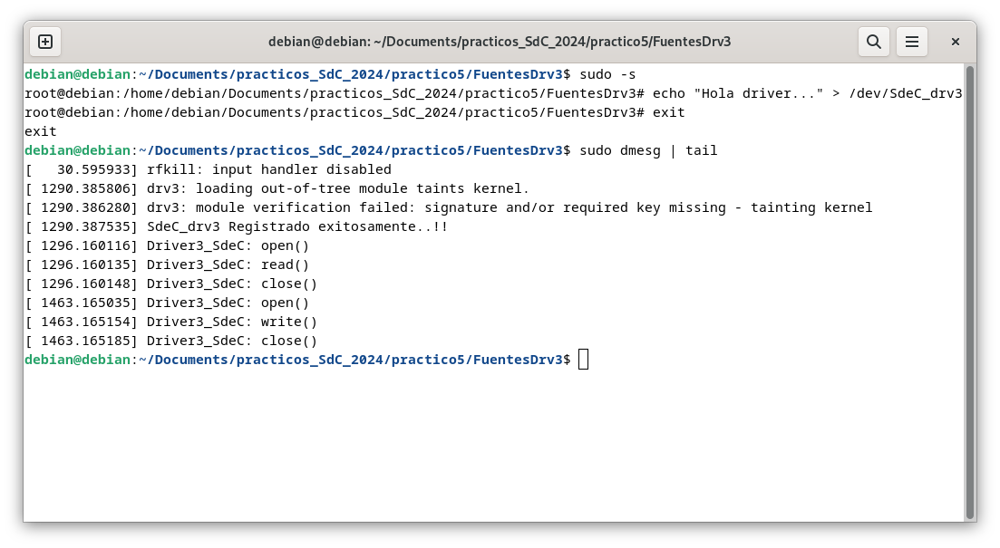

Si se llama a `cat`, nuevamente se obtiene un permiso denegado

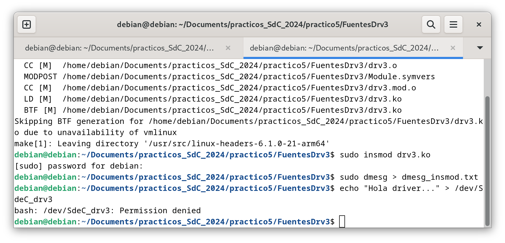

Ahora, se prueba de otra forma, con comando `sudo -s`.

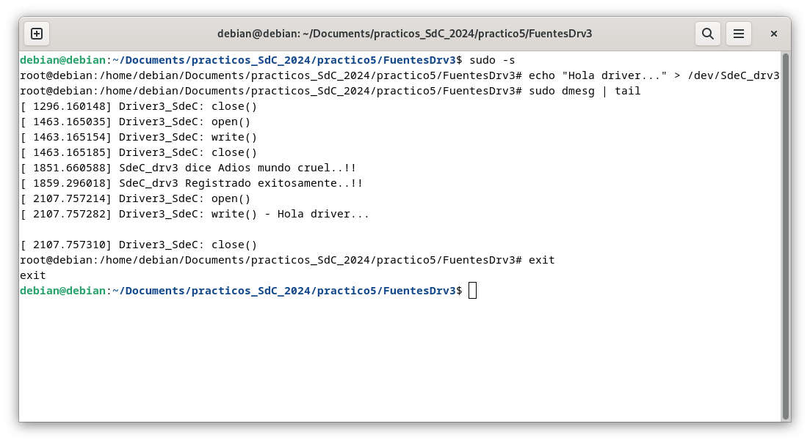

Finalmente, al remover el módulo, la salida del `dmesg` es:

```
[    0.000000] Booting Linux on physical CPU 0x0000000000 [0x610f0000]
[    0.000000] Linux version 6.1.0-21-arm64 (debian-kernel@lists.debian.org) (gcc-12 (Debian 12.2.0-14) 12.2.0, GNU ld (GNU Binutils for Debian) 2.40) #1 SMP Debian 6.1.90-1 (2024-05-03)
[    0.000000] efi: EFI v2.70 by EDK II
[    0.000000] efi: ACPI 2.0=0x16fc90018 SMBIOS=0xfffff000 SMBIOS 3.0=0x16fcb4000 MOKvar=0x16fc40000 MEMRESERVE=0x16e572798 
[    0.000000] secureboot: Secure boot disabled
[    0.000000] ACPI: Early table checksum verification disabled
[    0.000000] ACPI: RSDP 0x000000016FC90018 000024 (v02 APPLE )
[    0.000000] ACPI: XSDT 0x000000016FC9FE98 000044 (v01 APPLE  Apple Vz 00000001      01000013)
[    0.000000] ACPI: FACP 0x000000016FC9FA98 000114 (v06 APPLE  Apple Vz 00000001 AAPL 20180427)
[    0.000000] ACPI: DSDT 0x000000016FC9F698 000394 (v02 APPLE  Apple Vz 00000001 AAPL 20180427)
[    0.000000] ACPI: GTDT 0x000000016FC9FC18 000068 (v03 APPLE  Apple Vz 00000001 AAPL 20180427)
[    0.000000] ACPI: APIC 0x000000016FC9E998 0001AC (v05 APPLE  Apple Vz 00000001 AAPL 20180427)
[    0.000000] ACPI: MCFG 0x000000016FC9FF98 00003C (v01 APPLE  Apple Vz 00000001 AAPL 20180427)
[    0.000000] NUMA: Failed to initialise from firmware
[    0.000000] NUMA: Faking a node at [mem 0x0000000070000000-0x000000016fffffff]
[    0.000000] NUMA: NODE_DATA [mem 0x16f713380-0x16f715fff]
[    0.000000] Zone ranges:
[    0.000000]   DMA      [mem 0x0000000070000000-0x00000000ffffffff]
[    0.000000]   DMA32    empty
[    0.000000]   Normal   [mem 0x0000000100000000-0x000000016fffffff]
[    0.000000] Movable zone start for each node
[    0.000000] Early memory node ranges
[    0.000000]   node   0: [mem 0x0000000070000000-0x00000000ffffdfff]
[    0.000000]   node   0: [mem 0x00000000ffffe000-0x00000000ffffffff]
[    0.000000]   node   0: [mem 0x0000000100000000-0x000000016e64ffff]
[    0.000000]   node   0: [mem 0x000000016e650000-0x000000016e79ffff]
[    0.000000]   node   0: [mem 0x000000016e7a0000-0x000000016fb9ffff]
[    0.000000]   node   0: [mem 0x000000016fba0000-0x000000016fc2ffff]
[    0.000000]   node   0: [mem 0x000000016fc30000-0x000000016fc3ffff]
[    0.000000]   node   0: [mem 0x000000016fc40000-0x000000016fc7ffff]
[    0.000000]   node   0: [mem 0x000000016fc80000-0x000000016fcb2fff]
[    0.000000]   node   0: [mem 0x000000016fcb3000-0x000000016fcb4fff]
[    0.000000]   node   0: [mem 0x000000016fcb5000-0x000000016fffffff]
[    0.000000] Initmem setup node 0 [mem 0x0000000070000000-0x000000016fffffff]
[    0.000000] cma: Reserved 64 MiB at 0x00000000fbe00000
[    0.000000] psci: probing for conduit method from ACPI.
[    0.000000] psci: PSCIv1.1 detected in firmware.
[    0.000000] psci: Using standard PSCI v0.2 function IDs
[    0.000000] psci: Trusted OS migration not required
[    0.000000] psci: SMC Calling Convention v1.0
[    0.000000] percpu: Embedded 31 pages/cpu s86632 r8192 d32152 u126976
[    0.000000] pcpu-alloc: s86632 r8192 d32152 u126976 alloc=31*4096
[    0.000000] pcpu-alloc: [0] 0 [0] 1 [0] 2 [0] 3 
[    0.000000] Detected PIPT I-cache on CPU0
[    0.000000] CPU features: detected: Address authentication (IMP DEF algorithm)
[    0.000000] CPU features: detected: GIC system register CPU interface
[    0.000000] CPU features: detected: Spectre-v4
[    0.000000] alternatives: applying boot alternatives
[    0.000000] Fallback order for Node 0: 0 
[    0.000000] Built 1 zonelists, mobility grouping on.  Total pages: 1032192
[    0.000000] Policy zone: Normal
[    0.000000] Kernel command line: BOOT_IMAGE=/boot/vmlinuz-6.1.0-21-arm64 root=UUID=8886428d-e9f6-4f33-883f-467ee75a767e ro quiet
[    0.000000] Unknown kernel command line parameters "BOOT_IMAGE=/boot/vmlinuz-6.1.0-21-arm64", will be passed to user space.
[    0.000000] Dentry cache hash table entries: 524288 (order: 10, 4194304 bytes, linear)
[    0.000000] Inode-cache hash table entries: 262144 (order: 9, 2097152 bytes, linear)
[    0.000000] mem auto-init: stack:all(zero), heap alloc:on, heap free:off
[    0.000000] software IO TLB: area num 4.
[    0.000000] software IO TLB: mapped [mem 0x00000000f7e00000-0x00000000fbe00000] (64MB)
[    0.000000] Memory: 2359288K/4194304K available (13056K kernel code, 2800K rwdata, 9452K rodata, 6464K init, 626K bss, 227036K reserved, 65536K cma-reserved)
[    0.000000] SLUB: HWalign=64, Order=0-3, MinObjects=0, CPUs=4, Nodes=1
[    0.000000] ftrace: allocating 43954 entries in 172 pages
[    0.000000] ftrace: allocated 172 pages with 4 groups
[    0.000000] trace event string verifier disabled
[    0.000000] rcu: Hierarchical RCU implementation.
[    0.000000] rcu: 	RCU restricting CPUs from NR_CPUS=256 to nr_cpu_ids=4.
[    0.000000] 	Rude variant of Tasks RCU enabled.
[    0.000000] 	Tracing variant of Tasks RCU enabled.
[    0.000000] rcu: RCU calculated value of scheduler-enlistment delay is 25 jiffies.
[    0.000000] rcu: Adjusting geometry for rcu_fanout_leaf=16, nr_cpu_ids=4
[    0.000000] NR_IRQS: 64, nr_irqs: 64, preallocated irqs: 0
[    0.000000] GICv3: 224 SPIs implemented
[    0.000000] GICv3: 0 Extended SPIs implemented
[    0.000000] Root IRQ handler: gic_handle_irq
[    0.000000] GICv3: GICv3 features: 16 PPIs, RSS
[    0.000000] GICv3: CPU0: found redistributor 0 region 0:0x0000000010010000
[    0.000000] GICv2m: range[mem 0x1fff0000-0x1fff0fff], SPI[128:255]
[    0.000000] rcu: srcu_init: Setting srcu_struct sizes based on contention.
[    0.000000] arch_timer: cp15 timer(s) running at 24.00MHz (virt).
[    0.000000] clocksource: arch_sys_counter: mask: 0xffffffffffffff max_cycles: 0x588fe9dc0, max_idle_ns: 440795202592 ns
[    0.000000] sched_clock: 56 bits at 24MHz, resolution 41ns, wraps every 4398046511097ns
[    0.000022] Console: colour dummy device 80x25
[    0.000027] printk: console [tty0] enabled
[    0.000050] ACPI: Core revision 20220331
[    0.000075] Calibrating delay loop (skipped), value calculated using timer frequency.. 48.00 BogoMIPS (lpj=96000)
[    0.000077] pid_max: default: 32768 minimum: 301
[    0.000112] LSM: Security Framework initializing
[    0.000119] landlock: Up and running.
[    0.000119] Yama: disabled by default; enable with sysctl kernel.yama.*
[    0.000143] AppArmor: AppArmor initialized
[    0.000144] TOMOYO Linux initialized
[    0.000150] LSM support for eBPF active
[    0.000184] Mount-cache hash table entries: 8192 (order: 4, 65536 bytes, linear)
[    0.000196] Mountpoint-cache hash table entries: 8192 (order: 4, 65536 bytes, linear)
[    0.000417] ACPI PPTT: No PPTT table found, CPU and cache topology may be inaccurate
[    0.000519] cblist_init_generic: Setting adjustable number of callback queues.
[    0.000520] cblist_init_generic: Setting shift to 2 and lim to 1.
[    0.000529] cblist_init_generic: Setting adjustable number of callback queues.
[    0.000529] cblist_init_generic: Setting shift to 2 and lim to 1.
[    0.000556] rcu: Hierarchical SRCU implementation.
[    0.000556] rcu: 	Max phase no-delay instances is 1000.
[    0.000720] Remapping and enabling EFI services.
[    0.000814] smp: Bringing up secondary CPUs ...
[    0.000995] Detected PIPT I-cache on CPU1
[    0.001008] GICv3: CPU1: found redistributor 1 region 0:0x0000000010030000
[    0.001062] CPU1: Booted secondary processor 0x0000000001 [0x610f0000]
[    0.001298] Detected PIPT I-cache on CPU2
[    0.001312] GICv3: CPU2: found redistributor 2 region 0:0x0000000010050000
[    0.001367] CPU2: Booted secondary processor 0x0000000002 [0x610f0000]
[    0.001563] Detected PIPT I-cache on CPU3
[    0.001579] GICv3: CPU3: found redistributor 3 region 0:0x0000000010070000
[    0.001632] CPU3: Booted secondary processor 0x0000000003 [0x610f0000]
[    0.001676] smp: Brought up 1 node, 4 CPUs
[    0.001677] SMP: Total of 4 processors activated.
[    0.001678] CPU features: detected: ARMv8.4 Translation Table Level
[    0.001678] CPU features: detected: Data cache clean to the PoU not required for I/D coherence
[    0.001679] CPU features: detected: Common not Private translations
[    0.001679] CPU features: detected: CRC32 instructions
[    0.001680] CPU features: detected: Data cache clean to Point of Deep Persistence
[    0.001680] CPU features: detected: Data cache clean to Point of Persistence
[    0.001680] CPU features: detected: E0PD
[    0.001681] CPU features: detected: Generic authentication (IMP DEF algorithm)
[    0.001681] CPU features: detected: RCpc load-acquire (LDAPR)
[    0.001681] CPU features: detected: LSE atomic instructions
[    0.001682] CPU features: detected: Privileged Access Never
[    0.001682] CPU features: detected: RAS Extension Support
[    0.001682] CPU features: detected: Speculation barrier (SB)
[    0.001683] CPU features: detected: TLB range maintenance instructions
[    0.001683] CPU features: detected: Speculative Store Bypassing Safe (SSBS)
[    0.001742] CPU: All CPU(s) started at EL1
[    0.001745] alternatives: applying system-wide alternatives
[    0.008134] node 0 deferred pages initialised in 4ms
[    0.009305] devtmpfs: initialized
[    0.009648] Registered cp15_barrier emulation handler
[    0.009649] setend instruction emulation is not supported on this system
[    0.009675] clocksource: jiffies: mask: 0xffffffff max_cycles: 0xffffffff, max_idle_ns: 7645041785100000 ns
[    0.009692] futex hash table entries: 1024 (order: 4, 65536 bytes, linear)
[    0.009790] pinctrl core: initialized pinctrl subsystem
[    0.009874] SMBIOS 3.3.0 present.
[    0.009876] DMI: Apple Inc. Apple Virtualization Generic Platform, BIOS 2022.100.22.0.0 02/09/2024
[    0.010028] NET: Registered PF_NETLINK/PF_ROUTE protocol family
[    0.010677] DMA: preallocated 512 KiB GFP_KERNEL pool for atomic allocations
[    0.010699] DMA: preallocated 512 KiB GFP_KERNEL|GFP_DMA pool for atomic allocations
[    0.010733] DMA: preallocated 512 KiB GFP_KERNEL|GFP_DMA32 pool for atomic allocations
[    0.010738] audit: initializing netlink subsys (disabled)
[    0.010803] audit: type=2000 audit(0.008:1): state=initialized audit_enabled=0 res=1
[    0.010877] thermal_sys: Registered thermal governor 'fair_share'
[    0.010878] thermal_sys: Registered thermal governor 'bang_bang'
[    0.010878] thermal_sys: Registered thermal governor 'step_wise'
[    0.010878] thermal_sys: Registered thermal governor 'user_space'
[    0.010879] thermal_sys: Registered thermal governor 'power_allocator'
[    0.010883] cpuidle: using governor ladder
[    0.010884] cpuidle: using governor menu
[    0.010901] hw-breakpoint: found 6 breakpoint and 4 watchpoint registers.
[    0.010977] ASID allocator initialised with 256 entries
[    0.010999] acpiphp: ACPI Hot Plug PCI Controller Driver version: 0.5
[    0.011055] Serial: AMBA PL011 UART driver
[    0.011108] KASLR enabled
[    0.011827] HugeTLB: registered 1.00 GiB page size, pre-allocated 0 pages
[    0.011828] HugeTLB: 0 KiB vmemmap can be freed for a 1.00 GiB page
[    0.011829] HugeTLB: registered 32.0 MiB page size, pre-allocated 0 pages
[    0.011829] HugeTLB: 0 KiB vmemmap can be freed for a 32.0 MiB page
[    0.011830] HugeTLB: registered 2.00 MiB page size, pre-allocated 0 pages
[    0.011830] HugeTLB: 0 KiB vmemmap can be freed for a 2.00 MiB page
[    0.011830] HugeTLB: registered 64.0 KiB page size, pre-allocated 0 pages
[    0.011831] HugeTLB: 0 KiB vmemmap can be freed for a 64.0 KiB page
[    0.012459] ACPI: Added _OSI(Module Device)
[    0.012460] ACPI: Added _OSI(Processor Device)
[    0.012460] ACPI: Added _OSI(3.0 _SCP Extensions)
[    0.012460] ACPI: Added _OSI(Processor Aggregator Device)
[    0.012534] ACPI: 1 ACPI AML tables successfully acquired and loaded
[    0.012622] ACPI: Interpreter enabled
[    0.012623] ACPI: Using GIC for interrupt routing
[    0.012626] ACPI: MCFG table detected, 1 entries
[    0.012831] ACPI: PCI Root Bridge [PCI0] (domain 0000 [bus 00-ff])
[    0.012834] acpi PNP0A08:00: _OSC: OS supports [ExtendedConfig ASPM ClockPM Segments MSI HPX-Type3]
[    0.012837] acpi PNP0A08:00: _OSC: OS requested [PCIeHotplug SHPCHotplug PME AER PCIeCapability LTR]
[    0.012838] acpi PNP0A08:00: _OSC: platform willing to grant [PCIeHotplug SHPCHotplug PME AER PCIeCapability LTR]
[    0.012838] acpi PNP0A08:00: _OSC: platform retains control of PCIe features (AE_NOT_FOUND)
[    0.012845] acpi PNP0A08:00: ECAM area [mem 0x40000000-0x4fffffff] reserved by PNP0C02:00
[    0.012850] acpi PNP0A08:00: ECAM at [mem 0x40000000-0x4fffffff] for [bus 00-ff]
[    0.012854] ACPI: Remapped I/O 0x000000006fff0000 to [io  0x0000-0xffff window]
[    0.012870] PCI host bridge to bus 0000:00
[    0.012871] pci_bus 0000:00: root bus resource [mem 0x50000000-0x6ffdffff window]
[    0.012872] pci_bus 0000:00: root bus resource [mem 0x180000000-0x1bfffffff window]
[    0.012872] pci_bus 0000:00: root bus resource [io  0x0000-0xffff window]
[    0.012873] pci_bus 0000:00: root bus resource [bus 00-ff]
[    0.012893] pci 0000:00:00.0: [106b:1a05] type 00 class 0x060000
[    0.013024] pci 0000:00:01.0: [1af4:1041] type 00 class 0x020000
[    0.013061] pci 0000:00:01.0: reg 0x10: [mem 0x180020000-0x180023fff 64bit]
[    0.013075] pci 0000:00:01.0: reg 0x18: [mem 0x5000a000-0x5000a03f]
[    0.013255] pci 0000:00:05.0: [1af4:1042] type 00 class 0x018000
[    0.013283] pci 0000:00:05.0: reg 0x10: [mem 0x18001c000-0x18001ffff 64bit]
[    0.013296] pci 0000:00:05.0: reg 0x18: [mem 0x50009000-0x5000903f]
[    0.013470] pci 0000:00:06.0: [1af4:105a] type 00 class 0x018000
[    0.013498] pci 0000:00:06.0: reg 0x10: [mem 0x180018000-0x18001bfff 64bit]
[    0.013511] pci 0000:00:06.0: reg 0x18: [mem 0x50008000-0x5000803f]
[    0.013679] pci 0000:00:07.0: [1af4:1050] type 00 class 0x038000
[    0.013706] pci 0000:00:07.0: reg 0x10: [mem 0x180014000-0x180017fff 64bit]
[    0.013718] pci 0000:00:07.0: reg 0x18: [mem 0x50007000-0x5000703f]
[    0.013886] pci 0000:00:08.0: [1af4:1059] type 00 class 0x040100
[    0.013913] pci 0000:00:08.0: reg 0x10: [mem 0x180010000-0x180013fff 64bit]
[    0.013926] pci 0000:00:08.0: reg 0x18: [mem 0x50004000-0x5000407f]
[    0.014101] pci 0000:00:09.0: [1af4:1059] type 00 class 0x040100
[    0.014127] pci 0000:00:09.0: reg 0x10: [mem 0x18000c000-0x18000ffff 64bit]
[    0.014140] pci 0000:00:09.0: reg 0x18: [mem 0x50003000-0x5000307f]
[    0.014320] pci 0000:00:0a.0: [1af4:1044] type 00 class 0x100000
[    0.014348] pci 0000:00:0a.0: reg 0x10: [mem 0x180008000-0x18000bfff 64bit]
[    0.014360] pci 0000:00:0a.0: reg 0x18: [mem 0x50006000-0x5000603f]
[    0.014520] pci 0000:00:0b.0: [1af4:1045] type 00 class 0x058000
[    0.014548] pci 0000:00:0b.0: reg 0x10: [mem 0x180004000-0x180007fff 64bit]
[    0.014561] pci 0000:00:0b.0: reg 0x18: [mem 0x50005000-0x5000503f]
[    0.014724] pci 0000:00:0c.0: [1af4:1043] type 00 class 0x078000
[    0.014751] pci 0000:00:0c.0: reg 0x10: [mem 0x180000000-0x180003fff 64bit]
[    0.014764] pci 0000:00:0c.0: reg 0x18: [mem 0x50002000-0x5000207f]
[    0.014917] pci 0000:00:0d.0: [106b:1a06] type 00 class 0x0c0330
[    0.014933] pci 0000:00:0d.0: reg 0x10: [mem 0x50001000-0x50001fff]
[    0.014941] pci 0000:00:0d.0: reg 0x14: [mem 0x50000000-0x500003ff]
[    0.015072] pci 0000:00:01.0: BAR 0: assigned [mem 0x180000000-0x180003fff 64bit]
[    0.015086] pci 0000:00:05.0: BAR 0: assigned [mem 0x180004000-0x180007fff 64bit]
[    0.015099] pci 0000:00:06.0: BAR 0: assigned [mem 0x180008000-0x18000bfff 64bit]
[    0.015112] pci 0000:00:07.0: BAR 0: assigned [mem 0x18000c000-0x18000ffff 64bit]
[    0.015125] pci 0000:00:08.0: BAR 0: assigned [mem 0x180010000-0x180013fff 64bit]
[    0.015138] pci 0000:00:09.0: BAR 0: assigned [mem 0x180014000-0x180017fff 64bit]
[    0.015150] pci 0000:00:0a.0: BAR 0: assigned [mem 0x180018000-0x18001bfff 64bit]
[    0.015163] pci 0000:00:0b.0: BAR 0: assigned [mem 0x18001c000-0x18001ffff 64bit]
[    0.015176] pci 0000:00:0c.0: BAR 0: assigned [mem 0x180020000-0x180023fff 64bit]
[    0.015189] pci 0000:00:0d.0: BAR 0: assigned [mem 0x50000000-0x50000fff]
[    0.015192] pci 0000:00:0d.0: BAR 1: assigned [mem 0x50001000-0x500013ff]
[    0.015196] pci 0000:00:08.0: BAR 2: assigned [mem 0x50001400-0x5000147f]
[    0.015207] pci 0000:00:09.0: BAR 2: assigned [mem 0x50001480-0x500014ff]
[    0.015212] pci 0000:00:0c.0: BAR 2: assigned [mem 0x50001500-0x5000157f]
[    0.015216] pci 0000:00:01.0: BAR 2: assigned [mem 0x50001580-0x500015bf]
[    0.015221] pci 0000:00:05.0: BAR 2: assigned [mem 0x500015c0-0x500015ff]
[    0.015225] pci 0000:00:06.0: BAR 2: assigned [mem 0x50001600-0x5000163f]
[    0.015230] pci 0000:00:07.0: BAR 2: assigned [mem 0x50001640-0x5000167f]
[    0.015234] pci 0000:00:0a.0: BAR 2: assigned [mem 0x50001680-0x500016bf]
[    0.015239] pci 0000:00:0b.0: BAR 2: assigned [mem 0x500016c0-0x500016ff]
[    0.015244] pci_bus 0000:00: resource 4 [mem 0x50000000-0x6ffdffff window]
[    0.015245] pci_bus 0000:00: resource 5 [mem 0x180000000-0x1bfffffff window]
[    0.015246] pci_bus 0000:00: resource 6 [io  0x0000-0xffff window]
[    0.015335] iommu: Default domain type: Translated 
[    0.015336] iommu: DMA domain TLB invalidation policy: strict mode 
[    0.015365] pps_core: LinuxPPS API ver. 1 registered
[    0.015366] pps_core: Software ver. 5.3.6 - Copyright 2005-2007 Rodolfo Giometti <giometti@linux.it>
[    0.015367] PTP clock support registered
[    0.015374] EDAC MC: Ver: 3.0.0
[    0.015527] Registered efivars operations
[    0.015779] NetLabel: Initializing
[    0.015779] NetLabel:  domain hash size = 128
[    0.015779] NetLabel:  protocols = UNLABELED CIPSOv4 CALIPSO
[    0.015790] NetLabel:  unlabeled traffic allowed by default
[    0.015851] vgaarb: loaded
[    0.016826] clocksource: Switched to clocksource arch_sys_counter
[    0.016918] VFS: Disk quotas dquot_6.6.0
[    0.016925] VFS: Dquot-cache hash table entries: 512 (order 0, 4096 bytes)
[    0.017010] AppArmor: AppArmor Filesystem Enabled
[    0.017015] pnp: PnP ACPI init
[    0.017034] system 00:00: [mem 0x40000000-0x4fffffff] could not be reserved
[    0.017038] pnp: PnP ACPI: found 1 devices
[    0.018629] NET: Registered PF_INET protocol family
[    0.018751] IP idents hash table entries: 65536 (order: 7, 524288 bytes, linear)
[    0.019283] tcp_listen_portaddr_hash hash table entries: 2048 (order: 3, 32768 bytes, linear)
[    0.019371] Table-perturb hash table entries: 65536 (order: 6, 262144 bytes, linear)
[    0.019431] TCP established hash table entries: 32768 (order: 6, 262144 bytes, linear)
[    0.019644] TCP bind hash table entries: 32768 (order: 8, 1048576 bytes, linear)
[    0.019678] TCP: Hash tables configured (established 32768 bind 32768)
[    0.019760] MPTCP token hash table entries: 4096 (order: 4, 98304 bytes, linear)
[    0.019782] UDP hash table entries: 2048 (order: 4, 65536 bytes, linear)
[    0.019798] UDP-Lite hash table entries: 2048 (order: 4, 65536 bytes, linear)
[    0.019828] NET: Registered PF_UNIX/PF_LOCAL protocol family
[    0.019832] NET: Registered PF_XDP protocol family
[    0.019862] pci 0000:00:0d.0: enabling device (0010 -> 0012)
[    0.019898] PCI: CLS 0 bytes, default 64
[    0.020042] Trying to unpack rootfs image as initramfs...
[    0.022420] kvm [1]: HYP mode not available
[    0.022615] Initialise system trusted keyrings
[    0.022623] Key type blacklist registered
[    0.022690] workingset: timestamp_bits=42 max_order=20 bucket_order=0
[    0.023254] zbud: loaded
[    0.023439] integrity: Platform Keyring initialized
[    0.023441] integrity: Machine keyring initialized
[    0.023442] Key type asymmetric registered
[    0.023443] Asymmetric key parser 'x509' registered
[    0.219664] Freeing initrd memory: 45352K
[    0.223919] alg: self-tests for CTR-KDF (hmac(sha256)) passed
[    0.223970] Block layer SCSI generic (bsg) driver version 0.4 loaded (major 247)
[    0.224025] io scheduler mq-deadline registered
[    0.225040] pl061_gpio ARMH0061:00: PL061 GPIO chip registered
[    0.225108] shpchp: Standard Hot Plug PCI Controller Driver version: 0.4
[    0.225186] input: Power Button as /devices/LNXSYSTM:00/PNP0C0C:00/input/input0
[    0.225198] ACPI: button: Power Button [PWRB]
[    0.225550] Serial: 8250/16550 driver, 4 ports, IRQ sharing enabled
[    0.225794] Serial: AMBA driver
[    0.225796] SuperH (H)SCI(F) driver initialized
[    0.225810] msm_serial: driver initialized
[    0.225982] mousedev: PS/2 mouse device common for all mice
[    0.226149] rtc-efi rtc-efi.0: registered as rtc0
[    0.226180] rtc-efi rtc-efi.0: setting system clock to 2024-06-17T23:54:10 UTC (1718668450)
[    0.226326] ledtrig-cpu: registered to indicate activity on CPUs
[    0.232581] NET: Registered PF_INET6 protocol family
[    0.235135] Segment Routing with IPv6
[    0.235143] In-situ OAM (IOAM) with IPv6
[    0.235154] mip6: Mobile IPv6
[    0.235156] NET: Registered PF_PACKET protocol family
[    0.235207] mpls_gso: MPLS GSO support
[    0.235340] registered taskstats version 1
[    0.235344] Loading compiled-in X.509 certificates
[    0.244653] Loaded X.509 cert 'Debian Secure Boot CA: 6ccece7e4c6c0d1f6149f3dd27dfcc5cbb419ea1'
[    0.244661] Loaded X.509 cert 'Debian Secure Boot Signer 2022 - linux: 14011249c2675ea8e5148542202005810584b25f'
[    0.244833] zswap: loaded using pool lzo/zbud
[    0.245033] Key type .fscrypt registered
[    0.245034] Key type fscrypt-provisioning registered
[    0.247115] Key type encrypted registered
[    0.247117] AppArmor: AppArmor sha1 policy hashing enabled
[    0.247244] ima: secureboot mode disabled
[    0.247247] ima: No TPM chip found, activating TPM-bypass!
[    0.247248] ima: Allocated hash algorithm: sha256
[    0.247254] ima: No architecture policies found
[    0.247260] evm: Initialising EVM extended attributes:
[    0.247260] evm: security.selinux
[    0.247260] evm: security.SMACK64 (disabled)
[    0.247261] evm: security.SMACK64EXEC (disabled)
[    0.247261] evm: security.SMACK64TRANSMUTE (disabled)
[    0.247261] evm: security.SMACK64MMAP (disabled)
[    0.247262] evm: security.apparmor
[    0.247262] evm: security.ima
[    0.247262] evm: security.capability
[    0.247263] evm: HMAC attrs: 0x1
[    0.299205] clk: Disabling unused clocks
[    0.299771] Freeing unused kernel memory: 6464K
[    0.303474] Checked W+X mappings: passed, no W+X pages found
[    0.303478] Run /init as init process
[    0.303479]   with arguments:
[    0.303480]     /init
[    0.303480]   with environment:
[    0.303480]     HOME=/
[    0.303481]     TERM=linux
[    0.303481]     BOOT_IMAGE=/boot/vmlinuz-6.1.0-21-arm64
[    0.375249] ACPI: bus type USB registered
[    0.375261] usbcore: registered new interface driver usbfs
[    0.375264] usbcore: registered new interface driver hub
[    0.375284] usbcore: registered new device driver usb
[    0.381760] xhci_hcd 0000:00:0d.0: xHCI Host Controller
[    0.381764] xhci_hcd 0000:00:0d.0: new USB bus registered, assigned bus number 1
[    0.381864] xhci_hcd 0000:00:0d.0: hcc params 0x02600001 hci version 0x110 quirks 0x0000000000000010
[    0.382145] xhci_hcd 0000:00:0d.0: xHCI Host Controller
[    0.382146] xhci_hcd 0000:00:0d.0: new USB bus registered, assigned bus number 2
[    0.382149] xhci_hcd 0000:00:0d.0: Host supports USB 3.1 Enhanced SuperSpeed
[    0.382178] usb usb1: New USB device found, idVendor=1d6b, idProduct=0002, bcdDevice= 6.01
[    0.382179] usb usb1: New USB device strings: Mfr=3, Product=2, SerialNumber=1
[    0.382180] usb usb1: Product: xHCI Host Controller
[    0.382180] usb usb1: Manufacturer: Linux 6.1.0-21-arm64 xhci-hcd
[    0.382181] usb usb1: SerialNumber: 0000:00:0d.0
[    0.382268] hub 1-0:1.0: USB hub found
[    0.382283] hub 1-0:1.0: 8 ports detected
[    0.382420] usb usb2: We don't know the algorithms for LPM for this host, disabling LPM.
[    0.382428] usb usb2: New USB device found, idVendor=1d6b, idProduct=0003, bcdDevice= 6.01
[    0.382429] usb usb2: New USB device strings: Mfr=3, Product=2, SerialNumber=1
[    0.382430] usb usb2: Product: xHCI Host Controller
[    0.382430] usb usb2: Manufacturer: Linux 6.1.0-21-arm64 xhci-hcd
[    0.382431] usb usb2: SerialNumber: 0000:00:0d.0
[    0.382526] hub 2-0:1.0: USB hub found
[    0.382541] hub 2-0:1.0: 8 ports detected
[    0.489765] virtio_blk virtio1: 1/0/0 default/read/poll queues
[    0.490168] virtio_blk virtio1: [vda] 134217728 512-byte logical blocks (68.7 GB/64.0 GiB)
[    0.491092]  vda: vda1 vda2 vda3
[    0.502230] ACPI: bus type drm_connector registered
[    0.511152] [drm] pci: virtio-gpu-pci detected at 0000:00:07.0
[    0.511184] [drm] features: -virgl -edid -resource_blob -host_visible
[    0.511185] [drm] features: -context_init
[    0.511513] [drm] number of scanouts: 1
[    0.511516] [drm] number of cap sets: 0
[    0.511788] [drm] Initialized virtio_gpu 0.1.0 0 for 0000:00:07.0 on minor 0
[    0.513362] virtio-pci 0000:00:07.0: [drm] drm_plane_enable_fb_damage_clips() not called
[    0.513368] Console: switching to colour frame buffer device 226x63
[    0.515068] virtio-pci 0000:00:07.0: [drm] fb0: virtio_gpudrmfb frame buffer device
[    0.529876] virtio_net virtio0 enp0s1: renamed from eth0
[    0.601139] PM: Image not found (code -22)
[    0.645242] usb 1-1: new full-speed USB device number 2 using xhci_hcd
[    0.801979] usb 1-1: New USB device found, idVendor=05ac, idProduct=8105, bcdDevice= 0.00
[    0.801983] usb 1-1: New USB device strings: Mfr=2, Product=3, SerialNumber=0
[    0.801983] usb 1-1: Product: Virtual USB Keyboard
[    0.801984] usb 1-1: Manufacturer: Apple Inc.
[    0.805946] hid: raw HID events driver (C) Jiri Kosina
[    0.807582] usbcore: registered new interface driver usbhid
[    0.807583] usbhid: USB HID core driver
[    0.808583] input: Apple Inc. Virtual USB Keyboard as /devices/pci0000:00/0000:00:0d.0/usb1/1-1/1-1:1.0/0003:05AC:8105.0001/input/input1
[    0.865502] hid-generic 0003:05AC:8105.0001: input,hidraw0: USB HID v1.10 Keyboard [Apple Inc. Virtual USB Keyboard] on usb-0000:00:0d.0-1/input0
[    0.892173] EXT4-fs (vda2): mounted filesystem with ordered data mode. Quota mode: none.
[    0.921235] Not activating Mandatory Access Control as /sbin/tomoyo-init does not exist.
[    0.929622] usb 1-2: new full-speed USB device number 3 using xhci_hcd
[    0.970784] systemd[1]: Inserted module 'autofs4'
[    0.977144] random: crng init done
[    0.995359] systemd[1]: systemd 252.22-1~deb12u1 running in system mode (+PAM +AUDIT +SELINUX +APPARMOR +IMA +SMACK +SECCOMP +GCRYPT -GNUTLS +OPENSSL +ACL +BLKID +CURL +ELFUTILS +FIDO2 +IDN2 -IDN +IPTC +KMOD +LIBCRYPTSETUP +LIBFDISK +PCRE2 -PWQUALITY +P11KIT +QRENCODE +TPM2 +BZIP2 +LZ4 +XZ +ZLIB +ZSTD -BPF_FRAMEWORK -XKBCOMMON +UTMP +SYSVINIT default-hierarchy=unified)
[    0.995362] systemd[1]: Detected virtualization apple.
[    0.995364] systemd[1]: Detected architecture arm64.
[    0.996676] systemd[1]: Hostname set to <debian>.
[    1.077444] usb 1-2: New USB device found, idVendor=05ac, idProduct=8106, bcdDevice= 0.00
[    1.077448] usb 1-2: New USB device strings: Mfr=2, Product=3, SerialNumber=0
[    1.077449] usb 1-2: Product: Virtual USB Digitizer
[    1.077450] usb 1-2: Manufacturer: Apple Inc.
[    1.077849] input: Apple Inc. Virtual USB Digitizer as /devices/pci0000:00/0000:00:0d.0/usb1/1-2/1-2:1.0/0003:05AC:8106.0002/input/input2
[    1.077906] hid-generic 0003:05AC:8106.0002: input,hidraw1: USB HID v1.10 Mouse [Apple Inc. Virtual USB Digitizer] on usb-0000:00:0d.0-2/input0
[    1.095864] systemd[1]: Queued start job for default target graphical.target.
[    1.110093] systemd[1]: Created slice system-getty.slice - Slice /system/getty.
[    1.110244] systemd[1]: Created slice system-modprobe.slice - Slice /system/modprobe.
[    1.110368] systemd[1]: Created slice system-systemd\x2dfsck.slice - Slice /system/systemd-fsck.
[    1.110453] systemd[1]: Created slice user.slice - User and Session Slice.
[    1.110485] systemd[1]: Started systemd-ask-password-wall.path - Forward Password Requests to Wall Directory Watch.
[    1.110572] systemd[1]: Set up automount proc-sys-fs-binfmt_misc.automount - Arbitrary Executable File Formats File System Automount Point.
[    1.110583] systemd[1]: Expecting device dev-disk-by\x2duuid-C685\x2d1D26.device - /dev/disk/by-uuid/C685-1D26...
[    1.110588] systemd[1]: Expecting device dev-disk-by\x2duuid-cba290a0\x2da937\x2d4ae6\x2d837b\x2d33b49c86020e.device - /dev/disk/by-uuid/cba290a0-a937-4ae6-837b-33b49c86020e...
[    1.110607] systemd[1]: Reached target integritysetup.target - Local Integrity Protected Volumes.
[    1.110621] systemd[1]: Reached target nss-user-lookup.target - User and Group Name Lookups.
[    1.110629] systemd[1]: Reached target remote-fs.target - Remote File Systems.
[    1.110635] systemd[1]: Reached target slices.target - Slice Units.
[    1.110656] systemd[1]: Reached target veritysetup.target - Local Verity Protected Volumes.
[    1.110711] systemd[1]: Listening on systemd-fsckd.socket - fsck to fsckd communication Socket.
[    1.110737] systemd[1]: Listening on systemd-initctl.socket - initctl Compatibility Named Pipe.
[    1.110916] systemd[1]: Listening on systemd-journald-audit.socket - Journal Audit Socket.
[    1.110972] systemd[1]: Listening on systemd-journald-dev-log.socket - Journal Socket (/dev/log).
[    1.111025] systemd[1]: Listening on systemd-journald.socket - Journal Socket.
[    1.111356] systemd[1]: Listening on systemd-udevd-control.socket - udev Control Socket.
[    1.111400] systemd[1]: Listening on systemd-udevd-kernel.socket - udev Kernel Socket.
[    1.111812] systemd[1]: Mounting dev-hugepages.mount - Huge Pages File System...
[    1.112209] systemd[1]: Mounting dev-mqueue.mount - POSIX Message Queue File System...
[    1.112575] systemd[1]: Mounting sys-kernel-debug.mount - Kernel Debug File System...
[    1.112925] systemd[1]: Mounting sys-kernel-tracing.mount - Kernel Trace File System...
[    1.114050] systemd[1]: Starting keyboard-setup.service - Set the console keyboard layout...
[    1.114510] systemd[1]: Starting kmod-static-nodes.service - Create List of Static Device Nodes...
[    1.114942] systemd[1]: Starting modprobe@configfs.service - Load Kernel Module configfs...
[    1.115454] systemd[1]: Starting modprobe@dm_mod.service - Load Kernel Module dm_mod...
[    1.116007] systemd[1]: Starting modprobe@drm.service - Load Kernel Module drm...
[    1.116585] systemd[1]: Starting modprobe@efi_pstore.service - Load Kernel Module efi_pstore...
[    1.117194] systemd[1]: Starting modprobe@fuse.service - Load Kernel Module fuse...
[    1.117671] systemd[1]: Starting modprobe@loop.service - Load Kernel Module loop...
[    1.117795] systemd[1]: systemd-fsck-root.service - File System Check on Root Device was skipped because of an unmet condition check (ConditionPathExists=!/run/initramfs/fsck-root).
[    1.118645] systemd[1]: Starting systemd-journald.service - Journal Service...
[    1.121060] pstore: Using crash dump compression: deflate
[    1.121141] systemd[1]: Starting systemd-modules-load.service - Load Kernel Modules...
[    1.124146] fuse: init (API version 7.37)
[    1.124526] loop: module loaded
[    1.125002] systemd[1]: Starting systemd-remount-fs.service - Remount Root and Kernel File Systems...
[    1.125488] systemd[1]: Starting systemd-udev-trigger.service - Coldplug All udev Devices...
[    1.125669] device-mapper: core: CONFIG_IMA_DISABLE_HTABLE is disabled. Duplicate IMA measurements will not be recorded in the IMA log.
[    1.125682] device-mapper: uevent: version 1.0.3
[    1.125727] device-mapper: ioctl: 4.47.0-ioctl (2022-07-28) initialised: dm-devel@redhat.com
[    1.126250] systemd[1]: Mounted dev-hugepages.mount - Huge Pages File System.
[    1.126395] systemd[1]: Mounted dev-mqueue.mount - POSIX Message Queue File System.
[    1.126487] systemd[1]: Mounted sys-kernel-debug.mount - Kernel Debug File System.
[    1.126572] systemd[1]: Mounted sys-kernel-tracing.mount - Kernel Trace File System.
[    1.126744] systemd[1]: Finished kmod-static-nodes.service - Create List of Static Device Nodes.
[    1.127106] pstore: Registered efi as persistent store backend
[    1.127157] systemd[1]: modprobe@configfs.service: Deactivated successfully.
[    1.127213] systemd[1]: Finished modprobe@configfs.service - Load Kernel Module configfs.
[    1.127334] systemd[1]: modprobe@dm_mod.service: Deactivated successfully.
[    1.127398] systemd[1]: Finished modprobe@dm_mod.service - Load Kernel Module dm_mod.
[    1.127505] systemd[1]: modprobe@drm.service: Deactivated successfully.
[    1.127562] systemd[1]: Finished modprobe@drm.service - Load Kernel Module drm.
[    1.127663] systemd[1]: modprobe@efi_pstore.service: Deactivated successfully.
[    1.127719] systemd[1]: Finished modprobe@efi_pstore.service - Load Kernel Module efi_pstore.
[    1.127825] systemd[1]: modprobe@fuse.service: Deactivated successfully.
[    1.127874] systemd[1]: Finished modprobe@fuse.service - Load Kernel Module fuse.
[    1.127969] systemd[1]: modprobe@loop.service: Deactivated successfully.
[    1.128025] systemd[1]: Finished modprobe@loop.service - Load Kernel Module loop.
[    1.128119] systemd[1]: Finished systemd-modules-load.service - Load Kernel Modules.
[    1.128639] systemd[1]: Mounting sys-fs-fuse-connections.mount - FUSE Control File System...
[    1.129030] systemd[1]: Mounting sys-kernel-config.mount - Kernel Configuration File System...
[    1.129082] systemd[1]: systemd-repart.service - Repartition Root Disk was skipped because no trigger condition checks were met.
[    1.129514] systemd[1]: Starting systemd-sysctl.service - Apply Kernel Variables...
[    1.129926] systemd[1]: Mounted sys-fs-fuse-connections.mount - FUSE Control File System.
[    1.131463] systemd[1]: Mounted sys-kernel-config.mount - Kernel Configuration File System.
[    1.135313] EXT4-fs (vda2): re-mounted. Quota mode: none.
[    1.135718] systemd[1]: Finished systemd-remount-fs.service - Remount Root and Kernel File Systems.
[    1.135855] systemd[1]: systemd-firstboot.service - First Boot Wizard was skipped because of an unmet condition check (ConditionFirstBoot=yes).
[    1.135877] systemd[1]: systemd-pstore.service - Platform Persistent Storage Archival was skipped because of an unmet condition check (ConditionDirectoryNotEmpty=/sys/fs/pstore).
[    1.136319] systemd[1]: Starting systemd-random-seed.service - Load/Save Random Seed...
[    1.136723] systemd[1]: Starting systemd-sysusers.service - Create System Users...
[    1.138356] systemd[1]: Started systemd-journald.service - Journal Service.
[    1.145945] systemd-journald[242]: Received client request to flush runtime journal.
[    1.165249] systemd-journald[242]: File /var/log/journal/8ced600630ed453ebd5df8f5b8294915/system.journal corrupted or uncleanly shut down, renaming and replacing.
[    1.281063] usbcore: registered new device driver apple-mfi-fastcharge
[    1.291382] Adding 999420k swap on /dev/vda3.  Priority:-2 extents:1 across:999420k FS
[    2.156966] virtio-fs: tag <share> not found
[    2.196450] audit: type=1400 audit(1718668452.464:2): apparmor="STATUS" operation="profile_load" profile="unconfined" name="lsb_release" pid=430 comm="apparmor_parser"
[    2.197676] audit: type=1400 audit(1718668452.468:3): apparmor="STATUS" operation="profile_load" profile="unconfined" name="nvidia_modprobe" pid=431 comm="apparmor_parser"
[    2.197679] audit: type=1400 audit(1718668452.468:4): apparmor="STATUS" operation="profile_load" profile="unconfined" name="nvidia_modprobe//kmod" pid=431 comm="apparmor_parser"
[    2.201489] audit: type=1400 audit(1718668452.472:5): apparmor="STATUS" operation="profile_load" profile="unconfined" name="/usr/bin/man" pid=434 comm="apparmor_parser"
[    2.201497] audit: type=1400 audit(1718668452.472:6): apparmor="STATUS" operation="profile_load" profile="unconfined" name="man_filter" pid=434 comm="apparmor_parser"
[    2.201500] audit: type=1400 audit(1718668452.472:7): apparmor="STATUS" operation="profile_load" profile="unconfined" name="man_groff" pid=434 comm="apparmor_parser"
[    2.201754] audit: type=1400 audit(1718668452.472:8): apparmor="STATUS" operation="profile_load" profile="unconfined" name="libreoffice-oosplash" pid=435 comm="apparmor_parser"
[    2.203104] audit: type=1400 audit(1718668452.472:9): apparmor="STATUS" operation="profile_load" profile="unconfined" name="/usr/lib/NetworkManager/nm-dhcp-client.action" pid=432 comm="apparmor_parser"
[    2.203108] audit: type=1400 audit(1718668452.472:10): apparmor="STATUS" operation="profile_load" profile="unconfined" name="/usr/lib/NetworkManager/nm-dhcp-helper" pid=432 comm="apparmor_parser"
[    2.499910] NET: Registered PF_QIPCRTR protocol family
[   14.119832] rfkill: input handler disabled
[   29.823838] rfkill: input handler enabled
[   30.595933] rfkill: input handler disabled
[ 1290.385806] drv3: loading out-of-tree module taints kernel.
[ 1290.386280] drv3: module verification failed: signature and/or required key missing - tainting kernel
[ 1290.387535] SdeC_drv3 Registrado exitosamente..!!
[ 1296.160116] Driver3_SdeC: open()
[ 1296.160135] Driver3_SdeC: read()
[ 1296.160148] Driver3_SdeC: close()
[ 1463.165035] Driver3_SdeC: open()
[ 1463.165154] Driver3_SdeC: write()
[ 1463.165185] Driver3_SdeC: close()
[ 1851.660588] SdeC_drv3 dice Adios mundo cruel..!!
[ 1859.296018] SdeC_drv3 Registrado exitosamente..!!
[ 2107.757214] Driver3_SdeC: open()
[ 2107.757282] Driver3_SdeC: write() - Hola driver...

[ 2107.757310] Driver3_SdeC: close()
[ 2192.666912] SdeC_drv3 dice Adios mundo cruel..!!
```

### Driver 4

```c
// Parto de drv3 para realizar las modificaciones a rea y write para ver qué hace
// estoy yendo en la dirección de clipboard.c ..!!

#include <linux/module.h>
#include <linux/version.h>
#include <linux/kernel.h>
#include <linux/types.h>
#include <linux/kdev_t.h>
#include <linux/fs.h>
#include <linux/device.h>
#include <linux/cdev.h>
#include <linux/uaccess.h>

static dev_t first; 		// Global variable for the first device number
static struct cdev c_dev; 	// Global variable for the character device structure
static struct class *cl; 	// Global variable for the device class

static char c;

static int my_open(struct inode *i, struct file *f)
{
    printk(KERN_INFO "SdeC_drv4: open()\n");
    return 0;
}
static int my_close(struct inode *i, struct file *f)
{
    printk(KERN_INFO "SdeC_drv4: close()\n");
    return 0;
}

// ssize_t resulta ser una palabra con signo.
// Por lo tanto, puede ocurrir que devuelva un número negativo. Esto sería un error. 
// Pero un valor de retorno no negativo tiene un significado adicional. 
// Para my_read sería el número de bytes leídos

// Cuando hago un $ cat /dev/SdeC_drv3, se convoca a my_read.!!
// my_read lee "len" bytes, los guarda en "buf" y devuelve la cantidad leida, que puede
// ser menor, pero nunca mayor que len.

// En SdeC_drv3, devuelve cero. Dado que es un archivo, esto significa no hay mas datos ó EOF.
// Lo que tendría que ocurrir es que el device escriba sobre buf para que el usuario pueda 
// obtener una lectura no nula.

static ssize_t my_read(struct file *f, char __user *buf, size_t len, loff_t *off)
{
    printk(KERN_INFO "SdeC_drv4: read()\n");

    if (*off == 0)
    {
        if ( copy_to_user(buf, &c, 1) != 0)
            return -EFAULT;
        else
        {
            (*off)++;
            return 1;
        }
    }
    else
        return 0;

}

// my_write escribe "len" bytes en "buf" y devuelve la cantidad escrita, que debe ser igual "len".
// Cuando hago un $ echo "bla bla bla..." > /dev/SdeC_drv3, se convoca a my_write.!!

static ssize_t my_write(struct file *f, const char __user *buf, size_t len, loff_t *off)
{
    printk(KERN_INFO "SdeC_drv4: write()\n");

    if ( copy_from_user(&c, buf + len - 1, 1) != 0 )
        return -EFAULT;
    else
        return len;
}

static struct file_operations pugs_fops =
{
    .owner = THIS_MODULE,
    .open = my_open,
    .release = my_close,
    .read = my_read,
    .write = my_write
};

static int __init drv4_init(void) /* Constructor */
{
    int ret;
    struct device *dev_ret;

    printk(KERN_INFO "SdeC_drv4: Registrado exitosamente..!!\n");

    if ((ret = alloc_chrdev_region(&first, 0, 1, "SdeC_drv4")) < 0)
    {
        return ret;
    }

    if (IS_ERR(cl = class_create(THIS_MODULE, "SdeC_drive")))
    {
        unregister_chrdev_region(first, 1);
        return PTR_ERR(cl);
    }

    if (IS_ERR(dev_ret = device_create(cl, NULL, first, NULL, "SdeC_drv4")))
    {
        class_destroy(cl);
        unregister_chrdev_region(first, 1);
        return PTR_ERR(dev_ret);
    }

    cdev_init(&c_dev, &pugs_fops);
    if ((ret = cdev_add(&c_dev, first, 1)) < 0)
    {
        device_destroy(cl, first);
        class_destroy(cl);
        unregister_chrdev_region(first, 1);
        return ret;
    }
    return 0;
}

static void __exit drv4_exit(void) /* Destructor */
{
    cdev_del(&c_dev);
    device_destroy(cl, first);
    class_destroy(cl);
    unregister_chrdev_region(first, 1);
    printk(KERN_INFO "SdeC_drv4: dice Adios mundo cruel..!!\n");
}

module_init(drv4_init);
module_exit(drv4_exit);

MODULE_LICENSE("GPL");
MODULE_AUTHOR("Cátedra Sistemas de Computación");
MODULE_DESCRIPTION("Nuestro cuarto driver de SdeC");
```

Se sigue un procedimiento similar a lo utilizado anteriormente, pero, ahora puede verse que el comando `echo` si tiene efecto, logrando imprimir una `H`. Se puede apreciar este comportamiento en la imagen siguiente:

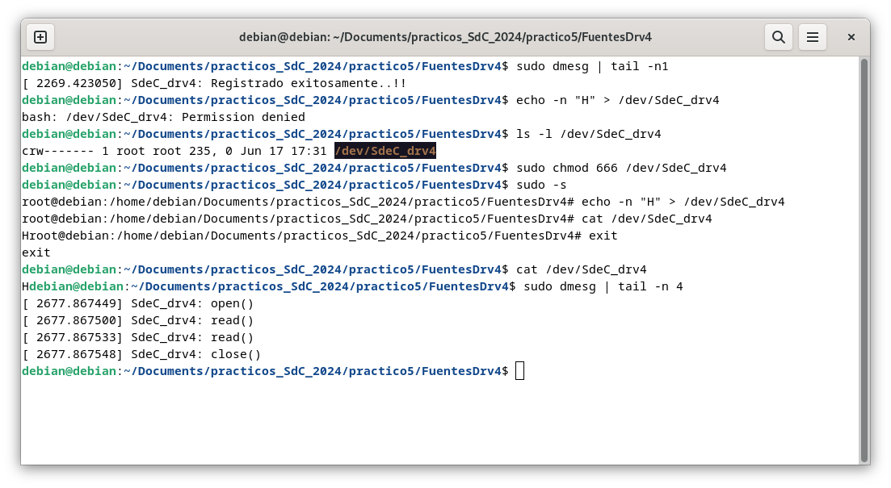


### Clipboard

```c
#include <linux/module.h>
#include <linux/kernel.h>
#include <linux/proc_fs.h>
#include <linux/string.h>
#include <linux/vmalloc.h>
#include <linux/uaccess.h>

MODULE_LICENSE("GPL");
MODULE_DESCRIPTION("Clipboard Kernel Module - FDI-UCM");
MODULE_AUTHOR("Juan Carlos Saez");

#define BUFFER_LENGTH       PAGE_SIZE

static struct proc_dir_entry *proc_entry;
static char *clipboard;                     // Space for the "clipboard"

static ssize_t clipboard_write(struct file *filp, const char __user *buf, size_t len, loff_t *off) {
  int available_space = BUFFER_LENGTH-1;
  
  if ((*off) > 0) /* The application can write in this entry just once !! */
    return 0;
  
  if (len > available_space) {
    printk(KERN_INFO "clipboard: not enough space!!\n");
    return -ENOSPC;
  }
  
  /* Transfiere data desde el espacio de usuario al espacio de kernel */
  /* echo un mensaje > /proc/clipboard                                */

  if (copy_from_user( &clipboard[0], buf, len ))  
    return -EFAULT;

  clipboard[len] = '\0';  /* Add the `\0' */  
  *off+=len;              /* Update the file pointer */
  
  return len;
}

static ssize_t clipboard_read(struct file *filp, char __user *buf, size_t len, loff_t *off) {
  
  int nr_bytes;
  
  if ((*off) > 0) /* Tell the application that there is nothing left to read */
      return 0;
    
  nr_bytes=strlen(clipboard);
    
  if (len<nr_bytes)
    return -ENOSPC;
  
    /* Transfiere data desde el espacio de kernel al espacio de usuario */ 
    /* cat /proc/clipboard                                              */

  if (copy_to_user(buf, clipboard, nr_bytes))
    return -EINVAL;
    
  (*off)+=len;  /* Update the file pointer */

  return nr_bytes; 
}

static const struct proc_ops proc_entry_fops = {
    .proc_read = clipboard_read,
    .proc_write = clipboard_write,    
};


int init_clipboard_module( void )
{
  int ret = 0;
  clipboard = (char *)vmalloc( BUFFER_LENGTH );

  if (!clipboard) {
    ret = -ENOMEM;
  } else {

    memset( clipboard, 0, BUFFER_LENGTH );
    proc_entry = proc_create( "clipboard", 0666, NULL, &proc_entry_fops);
    if (proc_entry == NULL) {
      ret = -ENOMEM;
      vfree(clipboard);
      printk(KERN_INFO "Clipboard: No puede crear entrada en /proc..!!\n");
    } else {
      printk(KERN_INFO "Clipboard: Modulo cargado..!!\n");
    }
  }
  return ret;
}


void exit_clipboard_module( void )
{
  remove_proc_entry("clipboard", NULL);
  vfree(clipboard);
  printk(KERN_INFO "Clipboard: Modulo descargado..!!\n");
}


module_init( init_clipboard_module );
module_exit( exit_clipboard_module );
```

Se sigue un procedimiento bastante similar al que se viene trabajando hasta el momento. La salida del `dmesg` luego del `insmod` es la siguiente.

```
[    0.000000] Booting Linux on physical CPU 0x0000000000 [0x610f0000]
[    0.000000] Linux version 6.1.0-21-arm64 (debian-kernel@lists.debian.org) (gcc-12 (Debian 12.2.0-14) 12.2.0, GNU ld (GNU Binutils for Debian) 2.40) #1 SMP Debian 6.1.90-1 (2024-05-03)
[    0.000000] efi: EFI v2.70 by EDK II
[    0.000000] efi: ACPI 2.0=0x16fc90018 SMBIOS=0xfffff000 SMBIOS 3.0=0x16fcb4000 MOKvar=0x16fc40000 MEMRESERVE=0x16e572798 
[    0.000000] secureboot: Secure boot disabled
[    0.000000] ACPI: Early table checksum verification disabled
[    0.000000] ACPI: RSDP 0x000000016FC90018 000024 (v02 APPLE )
[    0.000000] ACPI: XSDT 0x000000016FC9FE98 000044 (v01 APPLE  Apple Vz 00000001      01000013)
[    0.000000] ACPI: FACP 0x000000016FC9FA98 000114 (v06 APPLE  Apple Vz 00000001 AAPL 20180427)
[    0.000000] ACPI: DSDT 0x000000016FC9F698 000394 (v02 APPLE  Apple Vz 00000001 AAPL 20180427)
[    0.000000] ACPI: GTDT 0x000000016FC9FC18 000068 (v03 APPLE  Apple Vz 00000001 AAPL 20180427)
[    0.000000] ACPI: APIC 0x000000016FC9E998 0001AC (v05 APPLE  Apple Vz 00000001 AAPL 20180427)
[    0.000000] ACPI: MCFG 0x000000016FC9FF98 00003C (v01 APPLE  Apple Vz 00000001 AAPL 20180427)
[    0.000000] NUMA: Failed to initialise from firmware
[    0.000000] NUMA: Faking a node at [mem 0x0000000070000000-0x000000016fffffff]
[    0.000000] NUMA: NODE_DATA [mem 0x16f713380-0x16f715fff]
[    0.000000] Zone ranges:
[    0.000000]   DMA      [mem 0x0000000070000000-0x00000000ffffffff]
[    0.000000]   DMA32    empty
[    0.000000]   Normal   [mem 0x0000000100000000-0x000000016fffffff]
[    0.000000] Movable zone start for each node
[    0.000000] Early memory node ranges
[    0.000000]   node   0: [mem 0x0000000070000000-0x00000000ffffdfff]
[    0.000000]   node   0: [mem 0x00000000ffffe000-0x00000000ffffffff]
[    0.000000]   node   0: [mem 0x0000000100000000-0x000000016e64ffff]
[    0.000000]   node   0: [mem 0x000000016e650000-0x000000016e79ffff]
[    0.000000]   node   0: [mem 0x000000016e7a0000-0x000000016fb9ffff]
[    0.000000]   node   0: [mem 0x000000016fba0000-0x000000016fc2ffff]
[    0.000000]   node   0: [mem 0x000000016fc30000-0x000000016fc3ffff]
[    0.000000]   node   0: [mem 0x000000016fc40000-0x000000016fc7ffff]
[    0.000000]   node   0: [mem 0x000000016fc80000-0x000000016fcb2fff]
[    0.000000]   node   0: [mem 0x000000016fcb3000-0x000000016fcb4fff]
[    0.000000]   node   0: [mem 0x000000016fcb5000-0x000000016fffffff]
[    0.000000] Initmem setup node 0 [mem 0x0000000070000000-0x000000016fffffff]
[    0.000000] cma: Reserved 64 MiB at 0x00000000fbe00000
[    0.000000] psci: probing for conduit method from ACPI.
[    0.000000] psci: PSCIv1.1 detected in firmware.
[    0.000000] psci: Using standard PSCI v0.2 function IDs
[    0.000000] psci: Trusted OS migration not required
[    0.000000] psci: SMC Calling Convention v1.0
[    0.000000] percpu: Embedded 31 pages/cpu s86632 r8192 d32152 u126976
[    0.000000] pcpu-alloc: s86632 r8192 d32152 u126976 alloc=31*4096
[    0.000000] pcpu-alloc: [0] 0 [0] 1 [0] 2 [0] 3 
[    0.000000] Detected PIPT I-cache on CPU0
[    0.000000] CPU features: detected: Address authentication (IMP DEF algorithm)
[    0.000000] CPU features: detected: GIC system register CPU interface
[    0.000000] CPU features: detected: Spectre-v4
[    0.000000] alternatives: applying boot alternatives
[    0.000000] Fallback order for Node 0: 0 
[    0.000000] Built 1 zonelists, mobility grouping on.  Total pages: 1032192
[    0.000000] Policy zone: Normal
[    0.000000] Kernel command line: BOOT_IMAGE=/boot/vmlinuz-6.1.0-21-arm64 root=UUID=8886428d-e9f6-4f33-883f-467ee75a767e ro quiet
[    0.000000] Unknown kernel command line parameters "BOOT_IMAGE=/boot/vmlinuz-6.1.0-21-arm64", will be passed to user space.
[    0.000000] Dentry cache hash table entries: 524288 (order: 10, 4194304 bytes, linear)
[    0.000000] Inode-cache hash table entries: 262144 (order: 9, 2097152 bytes, linear)
[    0.000000] mem auto-init: stack:all(zero), heap alloc:on, heap free:off
[    0.000000] software IO TLB: area num 4.
[    0.000000] software IO TLB: mapped [mem 0x00000000f7e00000-0x00000000fbe00000] (64MB)
[    0.000000] Memory: 2359288K/4194304K available (13056K kernel code, 2800K rwdata, 9452K rodata, 6464K init, 626K bss, 227036K reserved, 65536K cma-reserved)
[    0.000000] SLUB: HWalign=64, Order=0-3, MinObjects=0, CPUs=4, Nodes=1
[    0.000000] ftrace: allocating 43954 entries in 172 pages
[    0.000000] ftrace: allocated 172 pages with 4 groups
[    0.000000] trace event string verifier disabled
[    0.000000] rcu: Hierarchical RCU implementation.
[    0.000000] rcu: 	RCU restricting CPUs from NR_CPUS=256 to nr_cpu_ids=4.
[    0.000000] 	Rude variant of Tasks RCU enabled.
[    0.000000] 	Tracing variant of Tasks RCU enabled.
[    0.000000] rcu: RCU calculated value of scheduler-enlistment delay is 25 jiffies.
[    0.000000] rcu: Adjusting geometry for rcu_fanout_leaf=16, nr_cpu_ids=4
[    0.000000] NR_IRQS: 64, nr_irqs: 64, preallocated irqs: 0
[    0.000000] GICv3: 224 SPIs implemented
[    0.000000] GICv3: 0 Extended SPIs implemented
[    0.000000] Root IRQ handler: gic_handle_irq
[    0.000000] GICv3: GICv3 features: 16 PPIs, RSS
[    0.000000] GICv3: CPU0: found redistributor 0 region 0:0x0000000010010000
[    0.000000] GICv2m: range[mem 0x1fff0000-0x1fff0fff], SPI[128:255]
[    0.000000] rcu: srcu_init: Setting srcu_struct sizes based on contention.
[    0.000000] arch_timer: cp15 timer(s) running at 24.00MHz (virt).
[    0.000000] clocksource: arch_sys_counter: mask: 0xffffffffffffff max_cycles: 0x588fe9dc0, max_idle_ns: 440795202592 ns
[    0.000000] sched_clock: 56 bits at 24MHz, resolution 41ns, wraps every 4398046511097ns
[    0.000022] Console: colour dummy device 80x25
[    0.000027] printk: console [tty0] enabled
[    0.000050] ACPI: Core revision 20220331
[    0.000075] Calibrating delay loop (skipped), value calculated using timer frequency.. 48.00 BogoMIPS (lpj=96000)
[    0.000077] pid_max: default: 32768 minimum: 301
[    0.000112] LSM: Security Framework initializing
[    0.000119] landlock: Up and running.
[    0.000119] Yama: disabled by default; enable with sysctl kernel.yama.*
[    0.000143] AppArmor: AppArmor initialized
[    0.000144] TOMOYO Linux initialized
[    0.000150] LSM support for eBPF active
[    0.000184] Mount-cache hash table entries: 8192 (order: 4, 65536 bytes, linear)
[    0.000196] Mountpoint-cache hash table entries: 8192 (order: 4, 65536 bytes, linear)
[    0.000417] ACPI PPTT: No PPTT table found, CPU and cache topology may be inaccurate
[    0.000519] cblist_init_generic: Setting adjustable number of callback queues.
[    0.000520] cblist_init_generic: Setting shift to 2 and lim to 1.
[    0.000529] cblist_init_generic: Setting adjustable number of callback queues.
[    0.000529] cblist_init_generic: Setting shift to 2 and lim to 1.
[    0.000556] rcu: Hierarchical SRCU implementation.
[    0.000556] rcu: 	Max phase no-delay instances is 1000.
[    0.000720] Remapping and enabling EFI services.
[    0.000814] smp: Bringing up secondary CPUs ...
[    0.000995] Detected PIPT I-cache on CPU1
[    0.001008] GICv3: CPU1: found redistributor 1 region 0:0x0000000010030000
[    0.001062] CPU1: Booted secondary processor 0x0000000001 [0x610f0000]
[    0.001298] Detected PIPT I-cache on CPU2
[    0.001312] GICv3: CPU2: found redistributor 2 region 0:0x0000000010050000
[    0.001367] CPU2: Booted secondary processor 0x0000000002 [0x610f0000]
[    0.001563] Detected PIPT I-cache on CPU3
[    0.001579] GICv3: CPU3: found redistributor 3 region 0:0x0000000010070000
[    0.001632] CPU3: Booted secondary processor 0x0000000003 [0x610f0000]
[    0.001676] smp: Brought up 1 node, 4 CPUs
[    0.001677] SMP: Total of 4 processors activated.
[    0.001678] CPU features: detected: ARMv8.4 Translation Table Level
[    0.001678] CPU features: detected: Data cache clean to the PoU not required for I/D coherence
[    0.001679] CPU features: detected: Common not Private translations
[    0.001679] CPU features: detected: CRC32 instructions
[    0.001680] CPU features: detected: Data cache clean to Point of Deep Persistence
[    0.001680] CPU features: detected: Data cache clean to Point of Persistence
[    0.001680] CPU features: detected: E0PD
[    0.001681] CPU features: detected: Generic authentication (IMP DEF algorithm)
[    0.001681] CPU features: detected: RCpc load-acquire (LDAPR)
[    0.001681] CPU features: detected: LSE atomic instructions
[    0.001682] CPU features: detected: Privileged Access Never
[    0.001682] CPU features: detected: RAS Extension Support
[    0.001682] CPU features: detected: Speculation barrier (SB)
[    0.001683] CPU features: detected: TLB range maintenance instructions
[    0.001683] CPU features: detected: Speculative Store Bypassing Safe (SSBS)
[    0.001742] CPU: All CPU(s) started at EL1
[    0.001745] alternatives: applying system-wide alternatives
[    0.008134] node 0 deferred pages initialised in 4ms
[    0.009305] devtmpfs: initialized
[    0.009648] Registered cp15_barrier emulation handler
[    0.009649] setend instruction emulation is not supported on this system
[    0.009675] clocksource: jiffies: mask: 0xffffffff max_cycles: 0xffffffff, max_idle_ns: 7645041785100000 ns
[    0.009692] futex hash table entries: 1024 (order: 4, 65536 bytes, linear)
[    0.009790] pinctrl core: initialized pinctrl subsystem
[    0.009874] SMBIOS 3.3.0 present.
[    0.009876] DMI: Apple Inc. Apple Virtualization Generic Platform, BIOS 2022.100.22.0.0 02/09/2024
[    0.010028] NET: Registered PF_NETLINK/PF_ROUTE protocol family
[    0.010677] DMA: preallocated 512 KiB GFP_KERNEL pool for atomic allocations
[    0.010699] DMA: preallocated 512 KiB GFP_KERNEL|GFP_DMA pool for atomic allocations
[    0.010733] DMA: preallocated 512 KiB GFP_KERNEL|GFP_DMA32 pool for atomic allocations
[    0.010738] audit: initializing netlink subsys (disabled)
[    0.010803] audit: type=2000 audit(0.008:1): state=initialized audit_enabled=0 res=1
[    0.010877] thermal_sys: Registered thermal governor 'fair_share'
[    0.010878] thermal_sys: Registered thermal governor 'bang_bang'
[    0.010878] thermal_sys: Registered thermal governor 'step_wise'
[    0.010878] thermal_sys: Registered thermal governor 'user_space'
[    0.010879] thermal_sys: Registered thermal governor 'power_allocator'
[    0.010883] cpuidle: using governor ladder
[    0.010884] cpuidle: using governor menu
[    0.010901] hw-breakpoint: found 6 breakpoint and 4 watchpoint registers.
[    0.010977] ASID allocator initialised with 256 entries
[    0.010999] acpiphp: ACPI Hot Plug PCI Controller Driver version: 0.5
[    0.011055] Serial: AMBA PL011 UART driver
[    0.011108] KASLR enabled
[    0.011827] HugeTLB: registered 1.00 GiB page size, pre-allocated 0 pages
[    0.011828] HugeTLB: 0 KiB vmemmap can be freed for a 1.00 GiB page
[    0.011829] HugeTLB: registered 32.0 MiB page size, pre-allocated 0 pages
[    0.011829] HugeTLB: 0 KiB vmemmap can be freed for a 32.0 MiB page
[    0.011830] HugeTLB: registered 2.00 MiB page size, pre-allocated 0 pages
[    0.011830] HugeTLB: 0 KiB vmemmap can be freed for a 2.00 MiB page
[    0.011830] HugeTLB: registered 64.0 KiB page size, pre-allocated 0 pages
[    0.011831] HugeTLB: 0 KiB vmemmap can be freed for a 64.0 KiB page
[    0.012459] ACPI: Added _OSI(Module Device)
[    0.012460] ACPI: Added _OSI(Processor Device)
[    0.012460] ACPI: Added _OSI(3.0 _SCP Extensions)
[    0.012460] ACPI: Added _OSI(Processor Aggregator Device)
[    0.012534] ACPI: 1 ACPI AML tables successfully acquired and loaded
[    0.012622] ACPI: Interpreter enabled
[    0.012623] ACPI: Using GIC for interrupt routing
[    0.012626] ACPI: MCFG table detected, 1 entries
[    0.012831] ACPI: PCI Root Bridge [PCI0] (domain 0000 [bus 00-ff])
[    0.012834] acpi PNP0A08:00: _OSC: OS supports [ExtendedConfig ASPM ClockPM Segments MSI HPX-Type3]
[    0.012837] acpi PNP0A08:00: _OSC: OS requested [PCIeHotplug SHPCHotplug PME AER PCIeCapability LTR]
[    0.012838] acpi PNP0A08:00: _OSC: platform willing to grant [PCIeHotplug SHPCHotplug PME AER PCIeCapability LTR]
[    0.012838] acpi PNP0A08:00: _OSC: platform retains control of PCIe features (AE_NOT_FOUND)
[    0.012845] acpi PNP0A08:00: ECAM area [mem 0x40000000-0x4fffffff] reserved by PNP0C02:00
[    0.012850] acpi PNP0A08:00: ECAM at [mem 0x40000000-0x4fffffff] for [bus 00-ff]
[    0.012854] ACPI: Remapped I/O 0x000000006fff0000 to [io  0x0000-0xffff window]
[    0.012870] PCI host bridge to bus 0000:00
[    0.012871] pci_bus 0000:00: root bus resource [mem 0x50000000-0x6ffdffff window]
[    0.012872] pci_bus 0000:00: root bus resource [mem 0x180000000-0x1bfffffff window]
[    0.012872] pci_bus 0000:00: root bus resource [io  0x0000-0xffff window]
[    0.012873] pci_bus 0000:00: root bus resource [bus 00-ff]
[    0.012893] pci 0000:00:00.0: [106b:1a05] type 00 class 0x060000
[    0.013024] pci 0000:00:01.0: [1af4:1041] type 00 class 0x020000
[    0.013061] pci 0000:00:01.0: reg 0x10: [mem 0x180020000-0x180023fff 64bit]
[    0.013075] pci 0000:00:01.0: reg 0x18: [mem 0x5000a000-0x5000a03f]
[    0.013255] pci 0000:00:05.0: [1af4:1042] type 00 class 0x018000
[    0.013283] pci 0000:00:05.0: reg 0x10: [mem 0x18001c000-0x18001ffff 64bit]
[    0.013296] pci 0000:00:05.0: reg 0x18: [mem 0x50009000-0x5000903f]
[    0.013470] pci 0000:00:06.0: [1af4:105a] type 00 class 0x018000
[    0.013498] pci 0000:00:06.0: reg 0x10: [mem 0x180018000-0x18001bfff 64bit]
[    0.013511] pci 0000:00:06.0: reg 0x18: [mem 0x50008000-0x5000803f]
[    0.013679] pci 0000:00:07.0: [1af4:1050] type 00 class 0x038000
[    0.013706] pci 0000:00:07.0: reg 0x10: [mem 0x180014000-0x180017fff 64bit]
[    0.013718] pci 0000:00:07.0: reg 0x18: [mem 0x50007000-0x5000703f]
[    0.013886] pci 0000:00:08.0: [1af4:1059] type 00 class 0x040100
[    0.013913] pci 0000:00:08.0: reg 0x10: [mem 0x180010000-0x180013fff 64bit]
[    0.013926] pci 0000:00:08.0: reg 0x18: [mem 0x50004000-0x5000407f]
[    0.014101] pci 0000:00:09.0: [1af4:1059] type 00 class 0x040100
[    0.014127] pci 0000:00:09.0: reg 0x10: [mem 0x18000c000-0x18000ffff 64bit]
[    0.014140] pci 0000:00:09.0: reg 0x18: [mem 0x50003000-0x5000307f]
[    0.014320] pci 0000:00:0a.0: [1af4:1044] type 00 class 0x100000
[    0.014348] pci 0000:00:0a.0: reg 0x10: [mem 0x180008000-0x18000bfff 64bit]
[    0.014360] pci 0000:00:0a.0: reg 0x18: [mem 0x50006000-0x5000603f]
[    0.014520] pci 0000:00:0b.0: [1af4:1045] type 00 class 0x058000
[    0.014548] pci 0000:00:0b.0: reg 0x10: [mem 0x180004000-0x180007fff 64bit]
[    0.014561] pci 0000:00:0b.0: reg 0x18: [mem 0x50005000-0x5000503f]
[    0.014724] pci 0000:00:0c.0: [1af4:1043] type 00 class 0x078000
[    0.014751] pci 0000:00:0c.0: reg 0x10: [mem 0x180000000-0x180003fff 64bit]
[    0.014764] pci 0000:00:0c.0: reg 0x18: [mem 0x50002000-0x5000207f]
[    0.014917] pci 0000:00:0d.0: [106b:1a06] type 00 class 0x0c0330
[    0.014933] pci 0000:00:0d.0: reg 0x10: [mem 0x50001000-0x50001fff]
[    0.014941] pci 0000:00:0d.0: reg 0x14: [mem 0x50000000-0x500003ff]
[    0.015072] pci 0000:00:01.0: BAR 0: assigned [mem 0x180000000-0x180003fff 64bit]
[    0.015086] pci 0000:00:05.0: BAR 0: assigned [mem 0x180004000-0x180007fff 64bit]
[    0.015099] pci 0000:00:06.0: BAR 0: assigned [mem 0x180008000-0x18000bfff 64bit]
[    0.015112] pci 0000:00:07.0: BAR 0: assigned [mem 0x18000c000-0x18000ffff 64bit]
[    0.015125] pci 0000:00:08.0: BAR 0: assigned [mem 0x180010000-0x180013fff 64bit]
[    0.015138] pci 0000:00:09.0: BAR 0: assigned [mem 0x180014000-0x180017fff 64bit]
[    0.015150] pci 0000:00:0a.0: BAR 0: assigned [mem 0x180018000-0x18001bfff 64bit]
[    0.015163] pci 0000:00:0b.0: BAR 0: assigned [mem 0x18001c000-0x18001ffff 64bit]
[    0.015176] pci 0000:00:0c.0: BAR 0: assigned [mem 0x180020000-0x180023fff 64bit]
[    0.015189] pci 0000:00:0d.0: BAR 0: assigned [mem 0x50000000-0x50000fff]
[    0.015192] pci 0000:00:0d.0: BAR 1: assigned [mem 0x50001000-0x500013ff]
[    0.015196] pci 0000:00:08.0: BAR 2: assigned [mem 0x50001400-0x5000147f]
[    0.015207] pci 0000:00:09.0: BAR 2: assigned [mem 0x50001480-0x500014ff]
[    0.015212] pci 0000:00:0c.0: BAR 2: assigned [mem 0x50001500-0x5000157f]
[    0.015216] pci 0000:00:01.0: BAR 2: assigned [mem 0x50001580-0x500015bf]
[    0.015221] pci 0000:00:05.0: BAR 2: assigned [mem 0x500015c0-0x500015ff]
[    0.015225] pci 0000:00:06.0: BAR 2: assigned [mem 0x50001600-0x5000163f]
[    0.015230] pci 0000:00:07.0: BAR 2: assigned [mem 0x50001640-0x5000167f]
[    0.015234] pci 0000:00:0a.0: BAR 2: assigned [mem 0x50001680-0x500016bf]
[    0.015239] pci 0000:00:0b.0: BAR 2: assigned [mem 0x500016c0-0x500016ff]
[    0.015244] pci_bus 0000:00: resource 4 [mem 0x50000000-0x6ffdffff window]
[    0.015245] pci_bus 0000:00: resource 5 [mem 0x180000000-0x1bfffffff window]
[    0.015246] pci_bus 0000:00: resource 6 [io  0x0000-0xffff window]
[    0.015335] iommu: Default domain type: Translated 
[    0.015336] iommu: DMA domain TLB invalidation policy: strict mode 
[    0.015365] pps_core: LinuxPPS API ver. 1 registered
[    0.015366] pps_core: Software ver. 5.3.6 - Copyright 2005-2007 Rodolfo Giometti <giometti@linux.it>
[    0.015367] PTP clock support registered
[    0.015374] EDAC MC: Ver: 3.0.0
[    0.015527] Registered efivars operations
[    0.015779] NetLabel: Initializing
[    0.015779] NetLabel:  domain hash size = 128
[    0.015779] NetLabel:  protocols = UNLABELED CIPSOv4 CALIPSO
[    0.015790] NetLabel:  unlabeled traffic allowed by default
[    0.015851] vgaarb: loaded
[    0.016826] clocksource: Switched to clocksource arch_sys_counter
[    0.016918] VFS: Disk quotas dquot_6.6.0
[    0.016925] VFS: Dquot-cache hash table entries: 512 (order 0, 4096 bytes)
[    0.017010] AppArmor: AppArmor Filesystem Enabled
[    0.017015] pnp: PnP ACPI init
[    0.017034] system 00:00: [mem 0x40000000-0x4fffffff] could not be reserved
[    0.017038] pnp: PnP ACPI: found 1 devices
[    0.018629] NET: Registered PF_INET protocol family
[    0.018751] IP idents hash table entries: 65536 (order: 7, 524288 bytes, linear)
[    0.019283] tcp_listen_portaddr_hash hash table entries: 2048 (order: 3, 32768 bytes, linear)
[    0.019371] Table-perturb hash table entries: 65536 (order: 6, 262144 bytes, linear)
[    0.019431] TCP established hash table entries: 32768 (order: 6, 262144 bytes, linear)
[    0.019644] TCP bind hash table entries: 32768 (order: 8, 1048576 bytes, linear)
[    0.019678] TCP: Hash tables configured (established 32768 bind 32768)
[    0.019760] MPTCP token hash table entries: 4096 (order: 4, 98304 bytes, linear)
[    0.019782] UDP hash table entries: 2048 (order: 4, 65536 bytes, linear)
[    0.019798] UDP-Lite hash table entries: 2048 (order: 4, 65536 bytes, linear)
[    0.019828] NET: Registered PF_UNIX/PF_LOCAL protocol family
[    0.019832] NET: Registered PF_XDP protocol family
[    0.019862] pci 0000:00:0d.0: enabling device (0010 -> 0012)
[    0.019898] PCI: CLS 0 bytes, default 64
[    0.020042] Trying to unpack rootfs image as initramfs...
[    0.022420] kvm [1]: HYP mode not available
[    0.022615] Initialise system trusted keyrings
[    0.022623] Key type blacklist registered
[    0.022690] workingset: timestamp_bits=42 max_order=20 bucket_order=0
[    0.023254] zbud: loaded
[    0.023439] integrity: Platform Keyring initialized
[    0.023441] integrity: Machine keyring initialized
[    0.023442] Key type asymmetric registered
[    0.023443] Asymmetric key parser 'x509' registered
[    0.219664] Freeing initrd memory: 45352K
[    0.223919] alg: self-tests for CTR-KDF (hmac(sha256)) passed
[    0.223970] Block layer SCSI generic (bsg) driver version 0.4 loaded (major 247)
[    0.224025] io scheduler mq-deadline registered
[    0.225040] pl061_gpio ARMH0061:00: PL061 GPIO chip registered
[    0.225108] shpchp: Standard Hot Plug PCI Controller Driver version: 0.4
[    0.225186] input: Power Button as /devices/LNXSYSTM:00/PNP0C0C:00/input/input0
[    0.225198] ACPI: button: Power Button [PWRB]
[    0.225550] Serial: 8250/16550 driver, 4 ports, IRQ sharing enabled
[    0.225794] Serial: AMBA driver
[    0.225796] SuperH (H)SCI(F) driver initialized
[    0.225810] msm_serial: driver initialized
[    0.225982] mousedev: PS/2 mouse device common for all mice
[    0.226149] rtc-efi rtc-efi.0: registered as rtc0
[    0.226180] rtc-efi rtc-efi.0: setting system clock to 2024-06-17T23:54:10 UTC (1718668450)
[    0.226326] ledtrig-cpu: registered to indicate activity on CPUs
[    0.232581] NET: Registered PF_INET6 protocol family
[    0.235135] Segment Routing with IPv6
[    0.235143] In-situ OAM (IOAM) with IPv6
[    0.235154] mip6: Mobile IPv6
[    0.235156] NET: Registered PF_PACKET protocol family
[    0.235207] mpls_gso: MPLS GSO support
[    0.235340] registered taskstats version 1
[    0.235344] Loading compiled-in X.509 certificates
[    0.244653] Loaded X.509 cert 'Debian Secure Boot CA: 6ccece7e4c6c0d1f6149f3dd27dfcc5cbb419ea1'
[    0.244661] Loaded X.509 cert 'Debian Secure Boot Signer 2022 - linux: 14011249c2675ea8e5148542202005810584b25f'
[    0.244833] zswap: loaded using pool lzo/zbud
[    0.245033] Key type .fscrypt registered
[    0.245034] Key type fscrypt-provisioning registered
[    0.247115] Key type encrypted registered
[    0.247117] AppArmor: AppArmor sha1 policy hashing enabled
[    0.247244] ima: secureboot mode disabled
[    0.247247] ima: No TPM chip found, activating TPM-bypass!
[    0.247248] ima: Allocated hash algorithm: sha256
[    0.247254] ima: No architecture policies found
[    0.247260] evm: Initialising EVM extended attributes:
[    0.247260] evm: security.selinux
[    0.247260] evm: security.SMACK64 (disabled)
[    0.247261] evm: security.SMACK64EXEC (disabled)
[    0.247261] evm: security.SMACK64TRANSMUTE (disabled)
[    0.247261] evm: security.SMACK64MMAP (disabled)
[    0.247262] evm: security.apparmor
[    0.247262] evm: security.ima
[    0.247262] evm: security.capability
[    0.247263] evm: HMAC attrs: 0x1
[    0.299205] clk: Disabling unused clocks
[    0.299771] Freeing unused kernel memory: 6464K
[    0.303474] Checked W+X mappings: passed, no W+X pages found
[    0.303478] Run /init as init process
[    0.303479]   with arguments:
[    0.303480]     /init
[    0.303480]   with environment:
[    0.303480]     HOME=/
[    0.303481]     TERM=linux
[    0.303481]     BOOT_IMAGE=/boot/vmlinuz-6.1.0-21-arm64
[    0.375249] ACPI: bus type USB registered
[    0.375261] usbcore: registered new interface driver usbfs
[    0.375264] usbcore: registered new interface driver hub
[    0.375284] usbcore: registered new device driver usb
[    0.381760] xhci_hcd 0000:00:0d.0: xHCI Host Controller
[    0.381764] xhci_hcd 0000:00:0d.0: new USB bus registered, assigned bus number 1
[    0.381864] xhci_hcd 0000:00:0d.0: hcc params 0x02600001 hci version 0x110 quirks 0x0000000000000010
[    0.382145] xhci_hcd 0000:00:0d.0: xHCI Host Controller
[    0.382146] xhci_hcd 0000:00:0d.0: new USB bus registered, assigned bus number 2
[    0.382149] xhci_hcd 0000:00:0d.0: Host supports USB 3.1 Enhanced SuperSpeed
[    0.382178] usb usb1: New USB device found, idVendor=1d6b, idProduct=0002, bcdDevice= 6.01
[    0.382179] usb usb1: New USB device strings: Mfr=3, Product=2, SerialNumber=1
[    0.382180] usb usb1: Product: xHCI Host Controller
[    0.382180] usb usb1: Manufacturer: Linux 6.1.0-21-arm64 xhci-hcd
[    0.382181] usb usb1: SerialNumber: 0000:00:0d.0
[    0.382268] hub 1-0:1.0: USB hub found
[    0.382283] hub 1-0:1.0: 8 ports detected
[    0.382420] usb usb2: We don't know the algorithms for LPM for this host, disabling LPM.
[    0.382428] usb usb2: New USB device found, idVendor=1d6b, idProduct=0003, bcdDevice= 6.01
[    0.382429] usb usb2: New USB device strings: Mfr=3, Product=2, SerialNumber=1
[    0.382430] usb usb2: Product: xHCI Host Controller
[    0.382430] usb usb2: Manufacturer: Linux 6.1.0-21-arm64 xhci-hcd
[    0.382431] usb usb2: SerialNumber: 0000:00:0d.0
[    0.382526] hub 2-0:1.0: USB hub found
[    0.382541] hub 2-0:1.0: 8 ports detected
[    0.489765] virtio_blk virtio1: 1/0/0 default/read/poll queues
[    0.490168] virtio_blk virtio1: [vda] 134217728 512-byte logical blocks (68.7 GB/64.0 GiB)
[    0.491092]  vda: vda1 vda2 vda3
[    0.502230] ACPI: bus type drm_connector registered
[    0.511152] [drm] pci: virtio-gpu-pci detected at 0000:00:07.0
[    0.511184] [drm] features: -virgl -edid -resource_blob -host_visible
[    0.511185] [drm] features: -context_init
[    0.511513] [drm] number of scanouts: 1
[    0.511516] [drm] number of cap sets: 0
[    0.511788] [drm] Initialized virtio_gpu 0.1.0 0 for 0000:00:07.0 on minor 0
[    0.513362] virtio-pci 0000:00:07.0: [drm] drm_plane_enable_fb_damage_clips() not called
[    0.513368] Console: switching to colour frame buffer device 226x63
[    0.515068] virtio-pci 0000:00:07.0: [drm] fb0: virtio_gpudrmfb frame buffer device
[    0.529876] virtio_net virtio0 enp0s1: renamed from eth0
[    0.601139] PM: Image not found (code -22)
[    0.645242] usb 1-1: new full-speed USB device number 2 using xhci_hcd
[    0.801979] usb 1-1: New USB device found, idVendor=05ac, idProduct=8105, bcdDevice= 0.00
[    0.801983] usb 1-1: New USB device strings: Mfr=2, Product=3, SerialNumber=0
[    0.801983] usb 1-1: Product: Virtual USB Keyboard
[    0.801984] usb 1-1: Manufacturer: Apple Inc.
[    0.805946] hid: raw HID events driver (C) Jiri Kosina
[    0.807582] usbcore: registered new interface driver usbhid
[    0.807583] usbhid: USB HID core driver
[    0.808583] input: Apple Inc. Virtual USB Keyboard as /devices/pci0000:00/0000:00:0d.0/usb1/1-1/1-1:1.0/0003:05AC:8105.0001/input/input1
[    0.865502] hid-generic 0003:05AC:8105.0001: input,hidraw0: USB HID v1.10 Keyboard [Apple Inc. Virtual USB Keyboard] on usb-0000:00:0d.0-1/input0
[    0.892173] EXT4-fs (vda2): mounted filesystem with ordered data mode. Quota mode: none.
[    0.921235] Not activating Mandatory Access Control as /sbin/tomoyo-init does not exist.
[    0.929622] usb 1-2: new full-speed USB device number 3 using xhci_hcd
[    0.970784] systemd[1]: Inserted module 'autofs4'
[    0.977144] random: crng init done
[    0.995359] systemd[1]: systemd 252.22-1~deb12u1 running in system mode (+PAM +AUDIT +SELINUX +APPARMOR +IMA +SMACK +SECCOMP +GCRYPT -GNUTLS +OPENSSL +ACL +BLKID +CURL +ELFUTILS +FIDO2 +IDN2 -IDN +IPTC +KMOD +LIBCRYPTSETUP +LIBFDISK +PCRE2 -PWQUALITY +P11KIT +QRENCODE +TPM2 +BZIP2 +LZ4 +XZ +ZLIB +ZSTD -BPF_FRAMEWORK -XKBCOMMON +UTMP +SYSVINIT default-hierarchy=unified)
[    0.995362] systemd[1]: Detected virtualization apple.
[    0.995364] systemd[1]: Detected architecture arm64.
[    0.996676] systemd[1]: Hostname set to <debian>.
[    1.077444] usb 1-2: New USB device found, idVendor=05ac, idProduct=8106, bcdDevice= 0.00
[    1.077448] usb 1-2: New USB device strings: Mfr=2, Product=3, SerialNumber=0
[    1.077449] usb 1-2: Product: Virtual USB Digitizer
[    1.077450] usb 1-2: Manufacturer: Apple Inc.
[    1.077849] input: Apple Inc. Virtual USB Digitizer as /devices/pci0000:00/0000:00:0d.0/usb1/1-2/1-2:1.0/0003:05AC:8106.0002/input/input2
[    1.077906] hid-generic 0003:05AC:8106.0002: input,hidraw1: USB HID v1.10 Mouse [Apple Inc. Virtual USB Digitizer] on usb-0000:00:0d.0-2/input0
[    1.095864] systemd[1]: Queued start job for default target graphical.target.
[    1.110093] systemd[1]: Created slice system-getty.slice - Slice /system/getty.
[    1.110244] systemd[1]: Created slice system-modprobe.slice - Slice /system/modprobe.
[    1.110368] systemd[1]: Created slice system-systemd\x2dfsck.slice - Slice /system/systemd-fsck.
[    1.110453] systemd[1]: Created slice user.slice - User and Session Slice.
[    1.110485] systemd[1]: Started systemd-ask-password-wall.path - Forward Password Requests to Wall Directory Watch.
[    1.110572] systemd[1]: Set up automount proc-sys-fs-binfmt_misc.automount - Arbitrary Executable File Formats File System Automount Point.
[    1.110583] systemd[1]: Expecting device dev-disk-by\x2duuid-C685\x2d1D26.device - /dev/disk/by-uuid/C685-1D26...
[    1.110588] systemd[1]: Expecting device dev-disk-by\x2duuid-cba290a0\x2da937\x2d4ae6\x2d837b\x2d33b49c86020e.device - /dev/disk/by-uuid/cba290a0-a937-4ae6-837b-33b49c86020e...
[    1.110607] systemd[1]: Reached target integritysetup.target - Local Integrity Protected Volumes.
[    1.110621] systemd[1]: Reached target nss-user-lookup.target - User and Group Name Lookups.
[    1.110629] systemd[1]: Reached target remote-fs.target - Remote File Systems.
[    1.110635] systemd[1]: Reached target slices.target - Slice Units.
[    1.110656] systemd[1]: Reached target veritysetup.target - Local Verity Protected Volumes.
[    1.110711] systemd[1]: Listening on systemd-fsckd.socket - fsck to fsckd communication Socket.
[    1.110737] systemd[1]: Listening on systemd-initctl.socket - initctl Compatibility Named Pipe.
[    1.110916] systemd[1]: Listening on systemd-journald-audit.socket - Journal Audit Socket.
[    1.110972] systemd[1]: Listening on systemd-journald-dev-log.socket - Journal Socket (/dev/log).
[    1.111025] systemd[1]: Listening on systemd-journald.socket - Journal Socket.
[    1.111356] systemd[1]: Listening on systemd-udevd-control.socket - udev Control Socket.
[    1.111400] systemd[1]: Listening on systemd-udevd-kernel.socket - udev Kernel Socket.
[    1.111812] systemd[1]: Mounting dev-hugepages.mount - Huge Pages File System...
[    1.112209] systemd[1]: Mounting dev-mqueue.mount - POSIX Message Queue File System...
[    1.112575] systemd[1]: Mounting sys-kernel-debug.mount - Kernel Debug File System...
[    1.112925] systemd[1]: Mounting sys-kernel-tracing.mount - Kernel Trace File System...
[    1.114050] systemd[1]: Starting keyboard-setup.service - Set the console keyboard layout...
[    1.114510] systemd[1]: Starting kmod-static-nodes.service - Create List of Static Device Nodes...
[    1.114942] systemd[1]: Starting modprobe@configfs.service - Load Kernel Module configfs...
[    1.115454] systemd[1]: Starting modprobe@dm_mod.service - Load Kernel Module dm_mod...
[    1.116007] systemd[1]: Starting modprobe@drm.service - Load Kernel Module drm...
[    1.116585] systemd[1]: Starting modprobe@efi_pstore.service - Load Kernel Module efi_pstore...
[    1.117194] systemd[1]: Starting modprobe@fuse.service - Load Kernel Module fuse...
[    1.117671] systemd[1]: Starting modprobe@loop.service - Load Kernel Module loop...
[    1.117795] systemd[1]: systemd-fsck-root.service - File System Check on Root Device was skipped because of an unmet condition check (ConditionPathExists=!/run/initramfs/fsck-root).
[    1.118645] systemd[1]: Starting systemd-journald.service - Journal Service...
[    1.121060] pstore: Using crash dump compression: deflate
[    1.121141] systemd[1]: Starting systemd-modules-load.service - Load Kernel Modules...
[    1.124146] fuse: init (API version 7.37)
[    1.124526] loop: module loaded
[    1.125002] systemd[1]: Starting systemd-remount-fs.service - Remount Root and Kernel File Systems...
[    1.125488] systemd[1]: Starting systemd-udev-trigger.service - Coldplug All udev Devices...
[    1.125669] device-mapper: core: CONFIG_IMA_DISABLE_HTABLE is disabled. Duplicate IMA measurements will not be recorded in the IMA log.
[    1.125682] device-mapper: uevent: version 1.0.3
[    1.125727] device-mapper: ioctl: 4.47.0-ioctl (2022-07-28) initialised: dm-devel@redhat.com
[    1.126250] systemd[1]: Mounted dev-hugepages.mount - Huge Pages File System.
[    1.126395] systemd[1]: Mounted dev-mqueue.mount - POSIX Message Queue File System.
[    1.126487] systemd[1]: Mounted sys-kernel-debug.mount - Kernel Debug File System.
[    1.126572] systemd[1]: Mounted sys-kernel-tracing.mount - Kernel Trace File System.
[    1.126744] systemd[1]: Finished kmod-static-nodes.service - Create List of Static Device Nodes.
[    1.127106] pstore: Registered efi as persistent store backend
[    1.127157] systemd[1]: modprobe@configfs.service: Deactivated successfully.
[    1.127213] systemd[1]: Finished modprobe@configfs.service - Load Kernel Module configfs.
[    1.127334] systemd[1]: modprobe@dm_mod.service: Deactivated successfully.
[    1.127398] systemd[1]: Finished modprobe@dm_mod.service - Load Kernel Module dm_mod.
[    1.127505] systemd[1]: modprobe@drm.service: Deactivated successfully.
[    1.127562] systemd[1]: Finished modprobe@drm.service - Load Kernel Module drm.
[    1.127663] systemd[1]: modprobe@efi_pstore.service: Deactivated successfully.
[    1.127719] systemd[1]: Finished modprobe@efi_pstore.service - Load Kernel Module efi_pstore.
[    1.127825] systemd[1]: modprobe@fuse.service: Deactivated successfully.
[    1.127874] systemd[1]: Finished modprobe@fuse.service - Load Kernel Module fuse.
[    1.127969] systemd[1]: modprobe@loop.service: Deactivated successfully.
[    1.128025] systemd[1]: Finished modprobe@loop.service - Load Kernel Module loop.
[    1.128119] systemd[1]: Finished systemd-modules-load.service - Load Kernel Modules.
[    1.128639] systemd[1]: Mounting sys-fs-fuse-connections.mount - FUSE Control File System...
[    1.129030] systemd[1]: Mounting sys-kernel-config.mount - Kernel Configuration File System...
[    1.129082] systemd[1]: systemd-repart.service - Repartition Root Disk was skipped because no trigger condition checks were met.
[    1.129514] systemd[1]: Starting systemd-sysctl.service - Apply Kernel Variables...
[    1.129926] systemd[1]: Mounted sys-fs-fuse-connections.mount - FUSE Control File System.
[    1.131463] systemd[1]: Mounted sys-kernel-config.mount - Kernel Configuration File System.
[    1.135313] EXT4-fs (vda2): re-mounted. Quota mode: none.
[    1.135718] systemd[1]: Finished systemd-remount-fs.service - Remount Root and Kernel File Systems.
[    1.135855] systemd[1]: systemd-firstboot.service - First Boot Wizard was skipped because of an unmet condition check (ConditionFirstBoot=yes).
[    1.135877] systemd[1]: systemd-pstore.service - Platform Persistent Storage Archival was skipped because of an unmet condition check (ConditionDirectoryNotEmpty=/sys/fs/pstore).
[    1.136319] systemd[1]: Starting systemd-random-seed.service - Load/Save Random Seed...
[    1.136723] systemd[1]: Starting systemd-sysusers.service - Create System Users...
[    1.138356] systemd[1]: Started systemd-journald.service - Journal Service.
[    1.145945] systemd-journald[242]: Received client request to flush runtime journal.
[    1.165249] systemd-journald[242]: File /var/log/journal/8ced600630ed453ebd5df8f5b8294915/system.journal corrupted or uncleanly shut down, renaming and replacing.
[    1.281063] usbcore: registered new device driver apple-mfi-fastcharge
[    1.291382] Adding 999420k swap on /dev/vda3.  Priority:-2 extents:1 across:999420k FS
[    2.156966] virtio-fs: tag <share> not found
[    2.196450] audit: type=1400 audit(1718668452.464:2): apparmor="STATUS" operation="profile_load" profile="unconfined" name="lsb_release" pid=430 comm="apparmor_parser"
[    2.197676] audit: type=1400 audit(1718668452.468:3): apparmor="STATUS" operation="profile_load" profile="unconfined" name="nvidia_modprobe" pid=431 comm="apparmor_parser"
[    2.197679] audit: type=1400 audit(1718668452.468:4): apparmor="STATUS" operation="profile_load" profile="unconfined" name="nvidia_modprobe//kmod" pid=431 comm="apparmor_parser"
[    2.201489] audit: type=1400 audit(1718668452.472:5): apparmor="STATUS" operation="profile_load" profile="unconfined" name="/usr/bin/man" pid=434 comm="apparmor_parser"
[    2.201497] audit: type=1400 audit(1718668452.472:6): apparmor="STATUS" operation="profile_load" profile="unconfined" name="man_filter" pid=434 comm="apparmor_parser"
[    2.201500] audit: type=1400 audit(1718668452.472:7): apparmor="STATUS" operation="profile_load" profile="unconfined" name="man_groff" pid=434 comm="apparmor_parser"
[    2.201754] audit: type=1400 audit(1718668452.472:8): apparmor="STATUS" operation="profile_load" profile="unconfined" name="libreoffice-oosplash" pid=435 comm="apparmor_parser"
[    2.203104] audit: type=1400 audit(1718668452.472:9): apparmor="STATUS" operation="profile_load" profile="unconfined" name="/usr/lib/NetworkManager/nm-dhcp-client.action" pid=432 comm="apparmor_parser"
[    2.203108] audit: type=1400 audit(1718668452.472:10): apparmor="STATUS" operation="profile_load" profile="unconfined" name="/usr/lib/NetworkManager/nm-dhcp-helper" pid=432 comm="apparmor_parser"
[    2.499910] NET: Registered PF_QIPCRTR protocol family
[   14.119832] rfkill: input handler disabled
[   29.823838] rfkill: input handler enabled
[   30.595933] rfkill: input handler disabled
[ 1290.385806] drv3: loading out-of-tree module taints kernel.
[ 1290.386280] drv3: module verification failed: signature and/or required key missing - tainting kernel
[ 1290.387535] SdeC_drv3 Registrado exitosamente..!!
[ 1296.160116] Driver3_SdeC: open()
[ 1296.160135] Driver3_SdeC: read()
[ 1296.160148] Driver3_SdeC: close()
[ 1463.165035] Driver3_SdeC: open()
[ 1463.165154] Driver3_SdeC: write()
[ 1463.165185] Driver3_SdeC: close()
[ 1851.660588] SdeC_drv3 dice Adios mundo cruel..!!
[ 1859.296018] SdeC_drv3 Registrado exitosamente..!!
[ 2107.757214] Driver3_SdeC: open()
[ 2107.757282] Driver3_SdeC: write() - Hola driver...

[ 2107.757310] Driver3_SdeC: close()
[ 2192.666912] SdeC_drv3 dice Adios mundo cruel..!!
[ 2269.423050] SdeC_drv4: Registrado exitosamente..!!
[ 2645.214105] SdeC_drv4: open()
[ 2645.214218] SdeC_drv4: write()
[ 2645.214250] SdeC_drv4: close()
[ 2654.594922] SdeC_drv4: open()
[ 2654.594984] SdeC_drv4: read()
[ 2654.595013] SdeC_drv4: read()
[ 2654.595028] SdeC_drv4: close()
[ 2677.867449] SdeC_drv4: open()
[ 2677.867500] SdeC_drv4: read()
[ 2677.867533] SdeC_drv4: read()
[ 2677.867548] SdeC_drv4: close()
[ 3416.406642] rfkill: input handler enabled
[ 3418.286493] rfkill: input handler disabled
[ 3535.145120] Clipboard: Modulo cargado..!!
```

Ahora, al ejecutar los comandos solicitados, se obtiene al siguiente salida en la terminal:

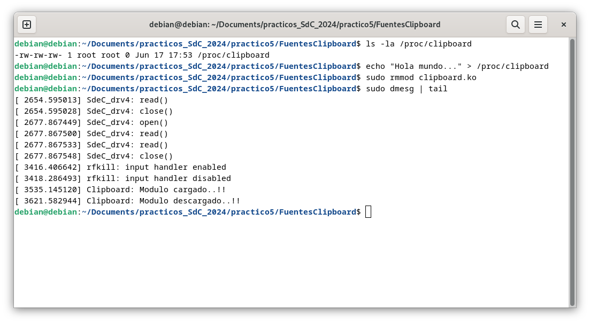

Puede verse que este módulo no es un CDD, sin embargo, crea una entrada en `/proc`.

### Driver de GPIO para Raspberry Pi

Se solicitó construir un CDD que permita sensar dos señales externas con un período de 1 segundo. También se pide una aplicación a nivel de usuraio que lea una de las dos señales y la grafique en función del tiempo.

Se utilizó una Raspberry Pi 4, en su versión de 2GB de memoria para esta sección del trabajo práctico. Luego, es importante mencionar que se trabajó con la API de GPIO de Linux en Raspberry OS (`#include <linux/gpio.h>`), en donde se destacan algunas funciones:

- `bool gpio_is_valid(int gpio_number);`
- `int gpio_request(unsigned gpio, const char *label)`
- `int gpio_request_one(unsigned gpio, unsigned long flags, const char *label);`
- `gpio_request_array(struct gpio *array, size_t num);`
- `int gpio_export(unsigned int gpio, bool direction_may_change);`
- `void gpio_unexport(unsigned int gpio)`
- `int  gpio_direction_input(unsigned gpio)`
- `int  gpio_direction_output(unsigned gpio, int value)`
- `gpio_set_value(unsigned int gpio, int value);`
- `int  gpio_get_value(unsigned gpio);`
- `void gpio_free(unsigned int gpio);`

El driver escrito es el siguiente:

```c
#include <linux/module.h>
#include <linux/kernel.h>
#include <linux/types.h>
#include <linux/fs.h>
#include <linux/device.h>
#include <linux/cdev.h>
#include <linux/gpio.h>
#include <linux/uaccess.h>

#define sensor_1 22
#define sensor_2 27

static dev_t first;
static struct cdev c_dev;
static struct class *cl;

static int sensor_select = 0;

static int my_open(struct inode *i, struct file *f)
{
    printk(KERN_INFO "Driver: open()\n");
    return 0;
}

static int my_close(struct inode *i, struct file *f)
{
    printk(KERN_INFO "Driver: close()\n");
    return 0;
}

static ssize_t my_read(struct file *f, char __user *buf, size_t len, loff_t *off)
{
    char sensor_value;
    int bytes_read = 0;

    if (*off > 0)
        return 0;

    printk(KERN_INFO "sensor_select: %d", sensor_select);

    if (sensor_select == 0)
    {
        sensor_value = '0' + gpio_get_value(sensor1);
    }
    else if (sensor_select == 1)
    {
        sensor_value = '0' + gpio_get_value(sensor_2);
    }
    else
    {
        return 0;
    }

    if (put_user(sensor_value, buf) != 0)
        return -EFAULT;

    *off += 1;
    bytes_read = 1;

    return bytes_read;
}

static ssize_t my_write(struct file *f, const char __user *buf, size_t len, loff_t *off)
{
    char pin_selection;
    int bytes_written = 0;

    if (len != 1)
        return -EINVAL;

    if (copy_from_user(&pin_selection, buf, 1) != 0)
        return -EFAULT;

    if (pin_selection == '22')
    {
        sensor_select = 0;
        printk(KERN_INFO "sensor_select: %d", sensor_select);
    }
    else if (pin_selection == '27')
    {
        sensor_select = 1;
        printk(KERN_INFO "sensor_select: %d", sensor_select);
    }
    else
    {
        return -EINVAL;
    }

    bytes_written = 1;

    return bytes_written;
}

static struct file_operations pugs_fops =
    {
        .owner = THIS_MODULE,
        .open = my_open,
        .release = my_close,
        .read = my_read,
        .write = my_write,
};

static int __init ofcd_init(void)
{

    printk(KERN_INFO "Initializing ofcd module\n");

    if (alloc_chrdev_region(&first, 0, 1, "driver_rasp") < 0)
    {
        return -1;
    }

    if ((cl = class_create(THIS_MODULE, "chardrv")) == NULL)
    {
        unregister_chrdev_region(first, 1);
        return -1;
    }

    if (device_create(cl, NULL, first, NULL, "input_device") == NULL)
    {
        class_destroy(cl);
        unregister_chrdev_region(first, 1);
        return -1;
    }

    cdev_init(&c_dev, &pugs_fops);

    if (cdev_add(&c_dev, first, 1) == -1)
    {
        device_destroy(cl, first);
        class_destroy(cl);
        unregister_chrdev_region(first, 1);
        return -1;
    }

    if (gpio_request(sensor_1, "sensor1") < 0)
    {
        printk(KERN_ALERT "Error requesting GPIO pin for sensor 1\n");
        return -1;
    }

    if (gpio_request(sensor_2, "sensor2") < 0)
    {
        printk(KERN_ALERT "Error requesting GPIO pin for sensor 2\n");
        return -1;
    }

    gpio_direction_input(sensor_1);
    gpio_direction_input(sensor_2);
    return 0;
}

static void __exit ofcd_exit(void)
{
    cdev_del(&c_dev);
    device_destroy(cl, first);
    class_destroy(cl);
    unregister_chrdev_region(first, 1);

    gpio_free(sensor1);
    gpio_free(sensor_2);

    printk(KERN_INFO "Exiting ofcd module\n");
}

module_init(ofcd_init);
module_exit(ofcd_exit);

MODULE_LICENSE("GPL");
MODULE_AUTHOR("Facundo Dalla Fontana, Nicolas Gallardo, Federico Villar");
MODULE_DESCRIPTION("Driver para Raspberry Pi, 2 pines como entradas");
```


Este driver para Raspberry Pi interactúa con dos pines GPIO configurados como entradas. Permite abrir y cerrar el dispositivo, leer el estado de los sensores conectados a los pines GPIO y seleccionar qué sensor leer mediante operaciones de escritura. A continuación se detalla el funcionamiento de cada parte del código.

1. Definiciones y Variables Globales
- Definición de pines GPIO (`sensor_1`, `sensor_2`).
- Variables globales para el número de dispositivo (`first`), la estructura del dispositivo de caracteres (`c_dev`), la clase del dispositivo (`cl`) y la selección del sensor (`sensor_select`).

2. `my_open`
- Imprime un mensaje en el registro del kernel al abrir el dispositivo.

3. `my_close`
- Imprime un mensaje en el registro del kernel al cerrar el dispositivo.

4. `my_read`
- Lee el estado del sensor seleccionado y lo envía al espacio de usuario.
- Utiliza `gpio_get_value` para obtener el valor del GPIO.
- Copia el valor del sensor al búfer del usuario.

5. `my_write`
- Permite seleccionar el sensor a leer escribiendo el número del pin en el dispositivo.
- Actualiza la variable `sensor_select` según el valor escrito por el usuario.


6. `ofcd_init`
- Inicializa el módulo, asigna un número de dispositivo y crea una clase y un dispositivo de caracteres.
- Solicita los pines GPIO y los configura como entradas.

7. `ofcd_exit`
- Limpia los recursos al descargar el módulo, eliminando el dispositivo de caracteres, liberando los pines GPIO y destruyendo la clase.

8. Macros del Módulo
- `module_init(ofcd_init)`: Define la función de inicialización del módulo.
- `module_exit(ofcd_exit)`: Define la función de limpieza del módulo.
- `MODULE_LICENSE("GPL")`: Especifica la licencia del módulo.
- `MODULE_AUTHOR("Facundo Dalla Fontana, Nicolas Gallardo, Federico Villar")`: Define los autores del módulo.
- `MODULE_DESCRIPTION("Driver para Raspberry Pi, 2 pines como entradas")`: Proporciona una breve descripción del módulo.

#### Gráficos

Para poder graficar, se crea el siguiente script de Python:

```python
import matplotlib.pyplot as plt
import matplotlib.animation as animation
from matplotlib.widgets import Button
import time

# Path del dispositivo de entrada
device = "dev/input_device"


# Función para escribir en el dispositivo de entrada
def write_character_device(data):
    with open(device, "w") as device_file:
        device_file.write(data)


# Pin por defecto seleccionado
default_device = "22"
current_pin = default_device
write_character_device(default_device)

# Variables globales para almacenar los valores leídos
values_pin22 = []
values_pin27 = []

# Pin actual seleccionado para la visualización
current_pin = 22


# Función de actualización para la animación
def update(frame):
    with open(device, "r") as device_file:
        read_data = device_file.read()
        value = int(read_data)
        global current_pin, ax
        if current_pin == "22":
            values_pin22.append(value)
            if len(values_pin22) > 10:
                values_pin22.pop(0)
            ax.clear()
            ax.plot(values_pin22)
        else:
            values_pin27.append(value)
            if len(values_pin27) > 50:
                values_pin27.pop(0)
            ax.clear()
            ax.plot(values_pin27)
        ax.set_title(f"Entrada Pin {current_pin}")
        ax.set_xlabel("Tiempo (s)")


# Función para cambiar el pin activo
def change_pin(event):
    global current_pin
    current_pin = "22" if current_pin == "27" else "27"  # se selecciona el pin a leer
    write_character_device(current_pin)
    values_pin22.clear()
    values_pin27.clear()


# Figura de matplotlib
fig, ax = plt.subplots()
plt.subplots_adjust(bottom=0.2)

# Boton para cambiar de grafico
ax_button = plt.axes([0.81, 0.05, 0.1, 0.075])
btn = Button(ax_button, "Cambiar Pin")
btn.on_clicked(change_pin)

# Animacion de matplotlib
ani = animation.FuncAnimation(fig, update, interval=1000)  # intervalo de 1 segundo

plt.show()
```

En donde se tiene:

1. Importaciones:
   - Importa `matplotlib.pyplot`, `matplotlib.animation`, `matplotlib.widgets.Button`, y `time`.

2. Definiciones y Variables Globales:
   - Define el path del dispositivo de entrada (`device`).
   - Variables globales para almacenar los valores leídos (`values_pin22`, `values_pin27`).
   - Variable para el pin actual seleccionado para la visualización (`current_pin`).

3. Función `write_character_device(data)`:
   - Escribe datos en el dispositivo de entrada.

4. Función `update(frame)`:
   - Función de actualización para la animación.
   - Lee el valor del dispositivo de entrada y actualiza la lista de valores del pin correspondiente.
   - Actualiza el gráfico con los nuevos valores.

5. Función `change_pin(event)`:
   - Función para cambiar el pin activo.
   - Cambia entre los pines 22 y 27.
   - Escribe el nuevo pin en el dispositivo de entrada.
   - Limpia las listas de valores leídos para los pines.

6. Crea una figura y un eje para la visualización con `fig, ax = plt.subplots()`.

7. Crea un área para el botón en la interfaz gráfica con `ax_button = plt.axes([0.81, 0.05, 0.1, 0.075])`.

8. Crea un botón que permite cambiar el pin activo con `btn = Button(ax_button, "Cambiar Pin")` y asocia la función `change_pin` al evento de clic del botón.

9. Crea una animación que actualiza el gráfico cada segundo utilizando la función `update` con `ani = animation.FuncAnimation(fig, update, interval=1000)`.

10. Muestra la interfaz gráfica con `plt.show()`.


#### Makefile

Finalmente, el `Makefile` para este driver es:

```sh
obj-m += driver_rasp.o
KDIR := /lib/modules/$(shell uname -r)/build
PWD := $(shell pwd)

default:
	$(MAKE) -C $(KDIR) M=$(PWD) modules

clean:
	$(MAKE) -C $(KDIR) M=$(PWD) clean
```

#### Circuito e implementación

Las señales medidas en el driver, físicamente representan un detector de presencia infrarrojo y un sensor de efecto hall digital. En la figura a continuación se puede apreciar el esquemático de lo implementado.

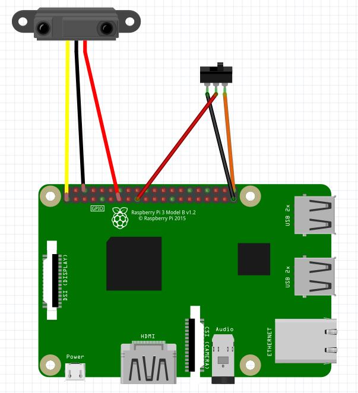

Puede verse en la imagen un toggle switch, en el caso real se utilizó el sensor de efecto hall, simplemente no se encontró la librería del componente en el software Fritzing.

Ahora, físicamente, se realizaron las siguientes conexiones.

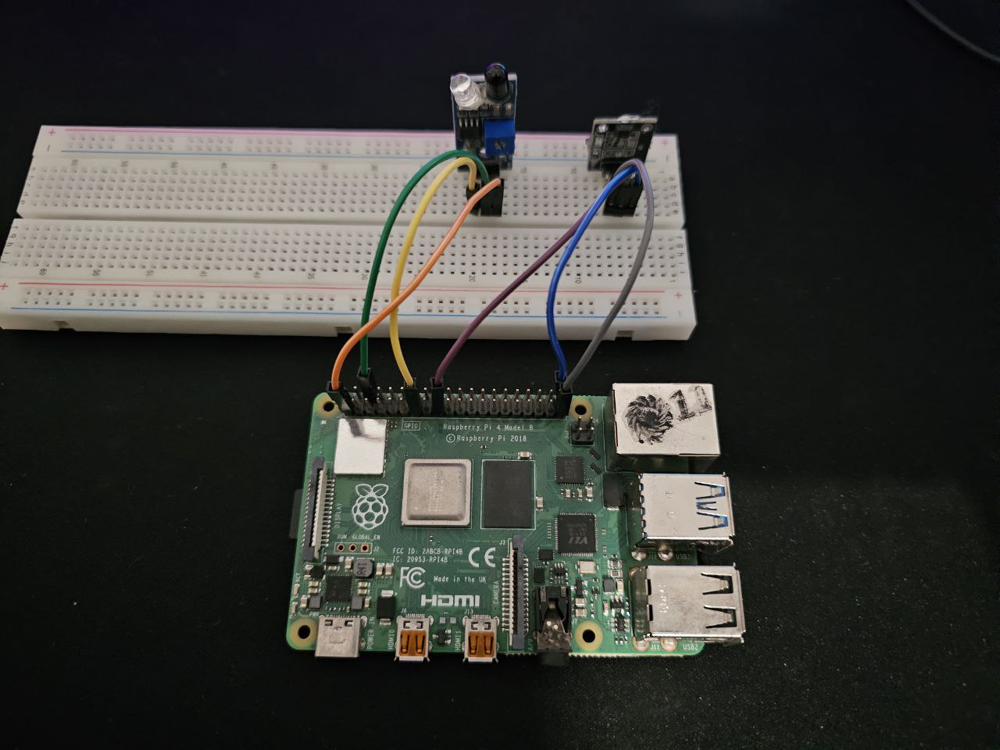

Y, finalmente, el resultado del uso del script es el siguiente, en donde pueden verse las señales separadas, con un botón en la interfaz de `matplotlib` que permitió el cambio entre gráficos.

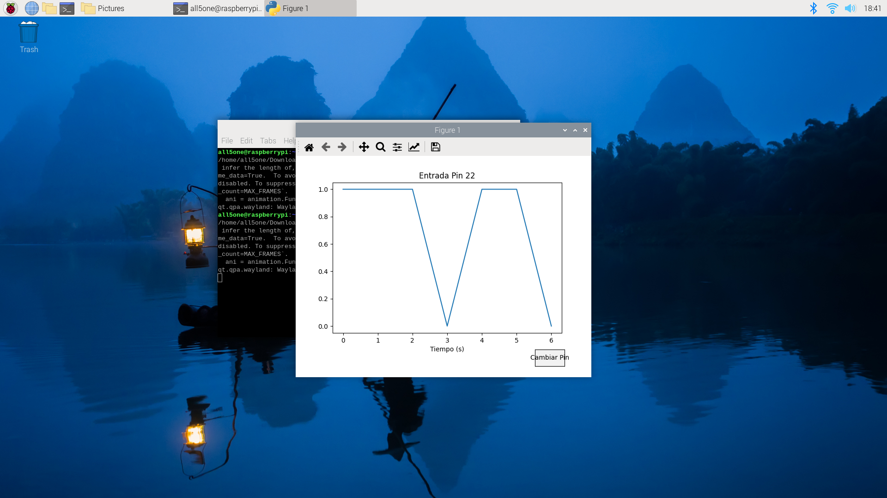

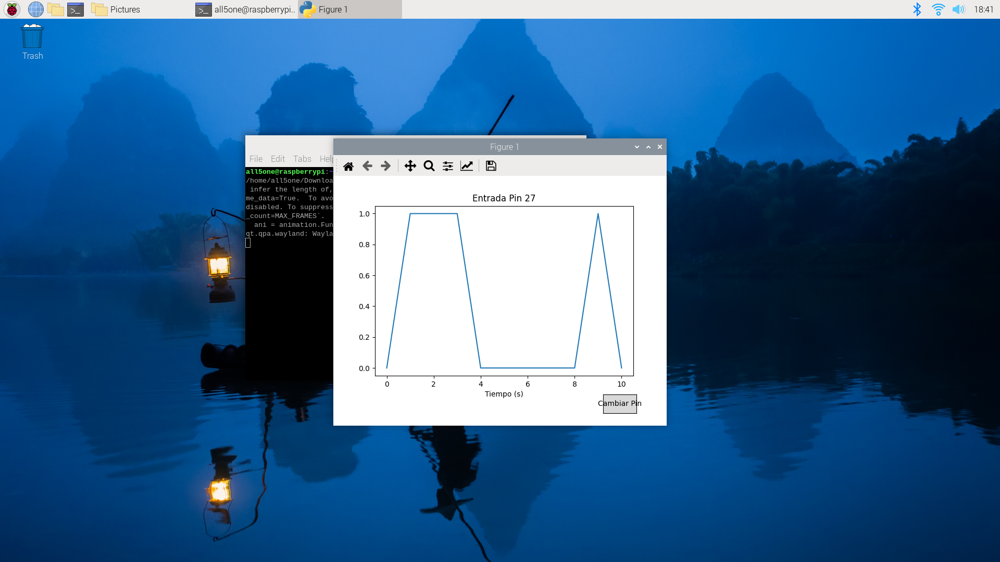

Finalmente, a modo de cierre, se quiere citar a la [siguiente página de internet](https://embetronicx.com/tutorials/linux/device-drivers/linux-device-driver-part-1-introduction/), que tiene mucha información sobre el desarrollo de drivers y módulos de kernel para linux. Además, posee una serie de muchos tutoriales que contiene información referente al desarrollo de drivers para GPIO de la Raspberry Pi. En el grupo fue la utilizada como referencia para el código propuesto.
